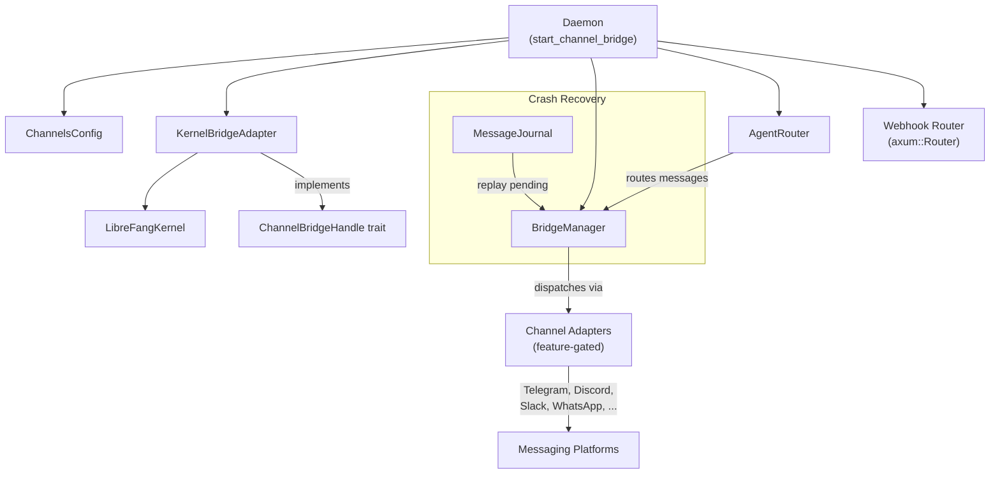

# REST API Server

# Channel Bridge (`channel_bridge.rs`)

## Purpose

The channel bridge connects the LibreFang kernel to messaging platform adapters (Telegram, Discord, Slack, WhatsApp, and 40+ others). It translates kernel operations into channel-facing responses, filters internal artifacts from user-visible output, manages adapter lifecycles, and provides crash recovery for in-flight messages.

## Architecture Overview



## Key Components

### `KernelBridgeAdapter`

Wraps `Arc<LibreFangKernel>` and implements the `ChannelBridgeHandle` trait, which the bridge manager uses to interact with the kernel. It tracks its own start time for uptime reporting.

**Core responsibilities exposed through the trait:**

| Method | Description |
|---|---|
| `send_message` | Synchronous agent turn; returns empty string when agent replies `NO_REPLY` or `[[silent]]` |
| `send_message_with_sender` | Includes `SenderContext` (platform ID, display name, group flag) for sender-aware routing |
| `send_message_with_blocks` | Handles multi-modal content blocks (text + images); extracts text for memory/logging |
| `send_message_streaming` / `send_message_streaming_with_sender` | Returns `mpsc::Receiver<String>` for chunked delivery to channels |
| `send_message_ephemeral` | Messages excluded from session history |
| `find_agent_by_name` / `list_agents` | Agent discovery for routing |
| `spawn_agent_by_name` | Loads `agent.toml` from `~/.librefang/workspaces/agents/{name}/` and spawns a new agent |
| `reset_session` / `reboot_session` / `compact_session` | Session lifecycle management |
| `set_model` / `stop_run` / `session_usage` | Runtime controls |
| `classify_reply_intent` | LLM-based classifier for group chat noise filtering |
| `channel_overrides` | Per-channel configuration including trigger pattern injection from agent routing aliases |
| `authorize_channel_user` | RBAC gate for chat/spawn/kill/install actions |

### Streaming Text Bridge (`start_stream_text_bridge`)

Converts `mpsc::Receiver<StreamEvent>` from the kernel into `mpsc::Receiver<String>` suitable for channel delivery.

**Tool call filtering:** Some LLM providers emit tool invocations as plain text rather than proper `tool_use` blocks. The bridge suppresses these artifacts through two mechanisms:

1. **`saw_tool_use` flag** — when `ToolUseStart` is received, subsequent text deltas are discarded until the next `ContentComplete`
2. **`looks_like_tool_call()` heuristic** — at `ContentComplete`, buffered text is scanned for JSON tool calls, tag-based patterns (`<function=...>`, `[TOOL_CALL]`), markdown-wrapped calls, and backtick-wrapped calls

**Error handling:** The spawned supervisor task awaits the kernel `JoinHandle` and maps errors:
- Timeouts with partial output: appends an incomplete marker
- Group chats: all errors suppressed (no technical details leaked)
- DMs: rate-limit messages preserved with original reset info; other errors sanitized via `sanitize_channel_error()`

### Error Sanitization (`sanitize_channel_error`)

Maps raw LLM driver errors to user-friendly messages to prevent stack traces, status codes, and internal details from reaching end users on WhatsApp, Telegram, etc.

| Error Pattern | User Message |
|---|---|
| `timed out`, `inactivity` | "The task timed out due to inactivity. Try breaking it into smaller steps." |
| `rate limit`, `429`, `quota`, `resource exhausted` | "I've hit my usage limit and need to rest." |
| `auth`, `not logged in`, `401` | "I'm having trouble with my credentials. Please let the admin know." |
| `exited with code`, `llm driver` | "Sorry, something went wrong on my end." |
| Everything else | "Something went wrong: please try again. (ref: {truncated})" |

### Channel Adapter Initialization

Each channel adapter is feature-gated (e.g., `channel-telegram`, `channel-discord`). The `start_channel_bridge_with_config` function:

1. Scans `ChannelsConfig` for populated channel entries
2. Emits warnings for configured channels whose feature flag is disabled
3. Reads bot tokens from environment variables via `read_token()`
4. Constructs adapters with per-adapter options (backoff, poll intervals, account IDs)
5. Collects all adapters into a `Vec<(Arc<dyn ChannelAdapter>, Option<String>, Option<String>)>` — adapter, default agent name, account ID

**Multi-account support:** Channels like Telegram, Discord, and Slack support multiple configurations (array entries), each with its own `account_id` for independent bot instances.

**Sidecar channels:** External channel processes defined in `sidecar_channels` config are registered as `SidecarAdapter` instances alongside native adapters.

### Agent Routing

After adapters are collected, the function resolves default agents:

1. For each adapter with a `default_agent`, attempts `find_agent_by_name`, falling back to `spawn_agent_by_name`
2. Registers the first successfully resolved agent as the system-wide default
3. Loads agent bindings from the kernel and registers them in the `AgentRouter`
4. Loads broadcast configuration
5. Each channel key is qualified by account ID when present (`ChannelType:account_id`)

### Crash Recovery

If a message journal can be opened in the data directory, the bridge manager replays in-flight messages from the previous session:

- Messages marked `Processing` are prefixed with a warning that they may have been partially handled
- Messages never started are prefixed as new work
- Delivery retries with backoff (5s, 10s, 15s) to allow adapters time to initialize
- The journal compaction timer runs continuously in the background

### Approval System with TOTP

The `resolve_approval_text` method handles pending approval requests:

- Matches by ID prefix for convenience
- When a tool requires TOTP (per `tool_requires_totp()`), validates either a 6-digit TOTP code or a recovery code
- Supports TOTP lockout tracking per sender to prevent brute force
- Grace period handling when no code is provided but TOTP is required

### Trigger and Schedule Management

The bridge exposes text-based interfaces for automation:

**Triggers** (`create_trigger_text`, `delete_trigger_text`, `list_triggers_text`):
- Patterns: `lifecycle`, `spawned:<name>`, `terminated`, `system`, `system:<keyword>`, `memory`, `memory:<key>`, `match:<text>`, `all`
- Parsed via `parse_trigger_pattern`

**Schedules** (`manage_schedule_text`):
- Actions: `add` (5-field cron expression), `del`, `run`
- Supports `AgentTurn`, `SystemEvent`, and `Workflow` action types

**Workflows** (`run_workflow_text`):
- Resolves workflow by name
- Executes via `workflow_engine().execute_run()` with agent resolution for each step

### Channel Overrides and Alias Injection

`channel_overrides` looks up per-channel configuration and injects agent routing aliases into `group_trigger_patterns`. This allows aliases defined in agent manifests (`metadata.routing.aliases` / `weak_aliases`) to trigger the bot in group chats without explicit `@mentions`.

ASCII aliases use `\b` word boundaries; CJK and non-ASCII aliases use plain substring matching since Rust's regex `\b` is ASCII-only.

### Delivery Tracking

`record_delivery` logs send/fail receipts and persists the last successful channel to structured memory (`delivery.last_channel`) for cron jobs using `CronDelivery::LastChannel`. Thread IDs are preserved for forum/topic contexts.

## Entry Points

```rust
// Called by the daemon with full kernel config
pub async fn start_channel_bridge(
    kernel: Arc<LibreFangKernel>,
) -> (Option<BridgeManager>, axum::Router)

// Called during hot-reload with explicit config
pub async fn start_channel_bridge_with_config(
    kernel: Arc<LibreFangKernel>,
    config: &ChannelsConfig,
) -> (Option<BridgeManager>, Vec<String>, axum::Router)
```

Both return:
- `Option<BridgeManager>` — `None` if no channels are configured
- `Vec<String>` — names of started channels (hot-reload variant only)
- `axum::Router` — webhook routes for HTTP-based channels (Feishu, Teams, DingTalk, etc.), to be mounted under `/channels` on the main API server

## Feature Flags

Each channel adapter is conditionally compiled. The full set:

| Feature | Channel |
|---|---|
| `channel-telegram` | Telegram |
| `channel-discord` | Discord |
| `channel-slack` | Slack |
| `channel-whatsapp` | WhatsApp (Cloud API or Web/QR gateway) |
| `channel-signal` | Signal |
| `channel-matrix` | Matrix |
| `channel-email` | Email (IMAP/SMTP) |
| `channel-teams` | Microsoft Teams |
| `channel-mattermost` | Mattermost |
| `channel-irc` | IRC |
| `channel-google-chat` | Google Chat |
| `channel-twitch` | Twitch |
| `channel-rocketchat` | Rocket.Chat |
| `channel-zulip` | Zulip |
| `channel-xmpp` | XMPP |
| `channel-line` | LINE |
| `channel-viber` | Viber |
| `channel-messenger` | Facebook Messenger |
| `channel-reddit` | Reddit |
| `channel-mastodon` | Mastodon |
| `channel-bluesky` | Bluesky |
| `channel-feishu` | Feishu/Lark (WebSocket or Webhook, CN/Intl) |
| `channel-revolt` | Revolt |
| `channel-wechat` | WeChat (iLink, requires dashboard QR login) |
| `channel-wecom` | WeCom (WebSocket or Callback) |
| `channel-nextcloud` | Nextcloud Talk |
| `channel-guilded` | Guilded |
| `channel-keybase` | Keybase |
| `channel-threema` | Threema |
| `channel-nostr` | Nostr |
| `channel-webex` | Webex |
| `channel-pumble` | Pumble |
| `channel-flock` | Flock |
| `channel-twist` | Twist |
| `channel-mumble` | Mumble |
| `channel-dingtalk` | DingTalk (Stream or Webhook) |
| `channel-qq` | QQ |
| `channel-discourse` | Discourse |
| `channel-gitter` | Gitter |
| `channel-ntfy` | ntfy |
| `channel-gotify` | Gotify |
| `channel-webhook` | Generic Webhook |
| `channel-voice` | Voice (WebSocket + STT/TTS) |
| `channel-linkedin` | LinkedIn |

## Adding a New Channel Adapter

1. Create the adapter in `librefang-channels` implementing the `ChannelAdapter` trait
2. Add a `channel-<name>` feature flag to `Cargo.toml`
3. Add the feature-gated import and initialization block in `start_channel_bridge_with_config`
4. Add the `check_channel!` macro call for feature-disabled warnings
5. Add the channel type string to `channel_overrides` for per-channel configuration lookup