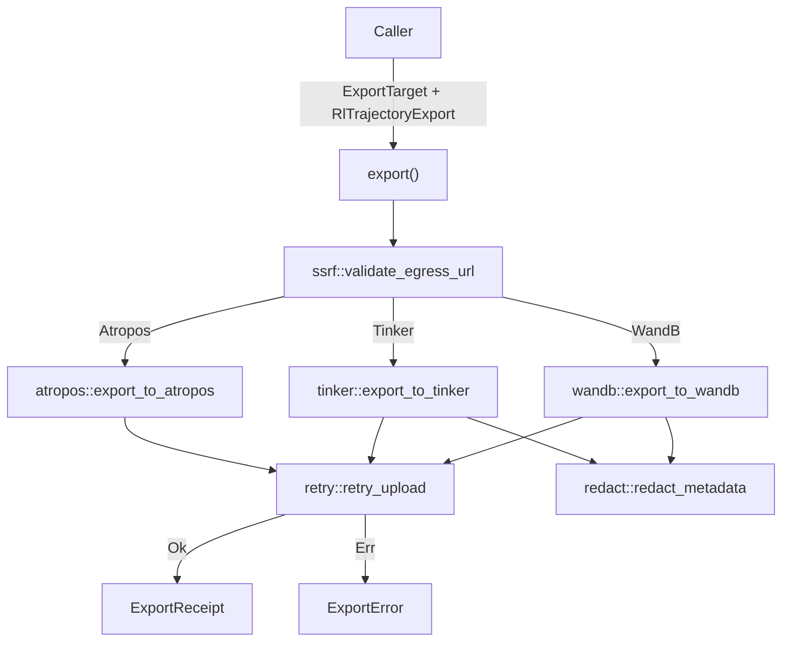

# RL Data Export

# RL Data Export (`librefang-rl-export`)

Long-horizon RL rollout trajectory exporter. Takes a finished agent rollout and delivers the trajectory bytes to an upstream RL-tracking service — W&B, Tinker, or Atropos — without inspecting or transcoding the payload.

## Architecture

Every exporter follows the same two-step pattern:

1. **Register** — create a run/session/environment on the upstream and recover a server-assigned ID.
2. **Upload** — post the opaque `trajectory_bytes` under that ID.

The public entry point `export()` dispatches on `ExportTarget`, runs the SSRF egress check, resolves any env-var secrets, and calls into the target-specific private module. All HTTP uses the workspace shared client from `librefang_http::proxied_client()`.

## Public API

### `export(target: ExportTarget, payload: RlTrajectoryExport) -> Result<ExportReceipt, ExportError>`

The only public function. Fully async; caller must provide a Tokio runtime.

Returns `ExportReceipt` containing the upstream's browser-loadable run URL, bytes uploaded, and timestamp. See `ExportError` variants for failure taxonomy.

### Types

**`ExportTarget`** — `#[non_exhaustive]` enum selecting the upstream:

| Variant | Auth | Egress mode | Two-step pair |
|---|---|---|---|
| `WandB` | API key via env var, HTTP Basic (`api:<key>`) | Public only | `POST /api/runs` → `POST /files/{entity}/{project}/{run_id}` |
| `Tinker` | `X-API-Key` header via env var | Public only | `POST /api/v1/create_session` → `POST /api/v1/telemetry` |
| `Atropos` | None (local microservice) | Loopback/RFC-1918 only | `POST /register-env` → `POST /scored_data` |

Secret-bearing variants use the `api_key_env` indirection — the field holds the **name** of the environment variable, not the secret itself. The exporter reads the env var at upload time and fails closed with `InvalidConfig` if unset or empty. This keeps secrets out of `config.toml` and process dumps.

**`RlTrajectoryExport`** — the payload to ship:

- `run_id: String` — caller-side identifier; used as a hint when the upstream accepts one.
- `trajectory_bytes: Vec<u8>` — opaque bytes forwarded verbatim. Wire format is owned by the producer (RFC #3330 locks it later; this crate does not depend on that RFC).
- `toolset_metadata: Option<serde_json::Value>` — structured metadata scrubbed before egress.
- `started_at` / `finished_at: DateTime<Utc>` — rollout window timestamps.

**`ExportReceipt`** — confirmed upload:

- `target_run_url: String` — browser-loadable URL returned by the upstream.
- `bytes_uploaded: u64` — mirrors `trajectory_bytes.len()`.
- `uploaded_at: DateTime<Utc>` — local wall-clock time of completion.

## Error Taxonomy (`ExportError`)

`#[non_exhaustive]` enum with a flat, string-payload-heavy design. Callers generally render the upstream's message to the operator; distinct variants exist only where call sites need to branch on the cause.

| Variant | Trigger | Retryable |
|---|---|---|
| `NetworkError(String)` | DNS, TCP/TLS, read timeout | Yes |
| `AuthError` | HTTP 401/403 | No |
| `UpstreamRejected { status, body }` | Non-auth 4xx/5xx (body truncated to 4 KiB) | Only 429 and 5xx |
| `MalformedResponse(String)` | 2xx body didn't match expected shape | No |
| `InvalidConfig(String)` | Empty project, unset env var, SSRF block — caught before any I/O | No |
| `TrainerNotReady { status_label }` | Atropos trainer hasn't booted (sentinel 200 with no `env_id`) | Yes (poll with backoff) |

Helper functions in `error.rs`:

- `classify_status(status, body)` — maps 401/403 → `AuthError`, everything else → `UpstreamRejected`.
- `classify_response_decode_error(err, context)` — splits `reqwest::Error` from `Response::json()` into `MalformedResponse` (decode failure) vs `NetworkError` (transport drop mid-body).
- `read_body_truncated(resp)` — reads the error response body, lossy-UTF8 decodes, truncates to 4 KiB.

## Per-Target Details

### W&B (`wandb.rs`)

- **Register**: `POST {base}/api/runs` with project, entity, run_id hint, started_at, finished_at, and scrubbed metadata. Returns `run_id` and `url`.
- **Upload**: `POST {base}/files/{entity}/{project}/{run_id}` with `Content-Type: application/octet-stream`. Path segments are percent-encoded — entity, project, and run_id are caller-controlled and may contain `/`, spaces, or other reserved characters.
- **Auth**: HTTP Basic with literal user `api` and the API key as password, per W&B REST docs.
- **Defaults**: base URL `https://api.wandb.ai`. Entity is **required** — no fallback; the prior `"default"` guess silently landed runs under wrong-named buckets.

### Tinker (`tinker.rs`)

- **Register**: `POST {base}/api/v1/create_session` with sorted tags, optional user_metadata, sdk_version, and project_id. Returns `session_id`.
- **Upload**: `POST {base}/api/v1/telemetry` with a single `GenericEvent` whose `event_data` carries the trajectory bytes as standard base64 (`trajectory_bytes_b64`), byte length, run ID, and timestamps.
- **Auth**: `X-API-Key` header. Tinker's SDK requires the `tml-` prefix; this crate forwards the key verbatim and lets the upstream enforce it.
- **Defaults**: base URL `https://tinker.thinkingmachines.dev/services/tinker-prod`.
- **Note**: Tinker has no dedicated opaque-trajectory endpoint today. The `create_session + telemetry` pair is the closest stable match against the current SDK source. If Tinker ships a dedicated trajectory endpoint later, this module should switch.

### Atropos (`atropos.rs`)

- **Register**: `POST {base}/register-env` with `RegisterEnvRequest` (max_token_length, desired_name, weight, group_size). Returns `env_id` and `wandb_name`.
- **Upload**: `POST {base}/scored_data` with the raw `trajectory_bytes` as `application/json`. The bytes **must already be valid `ScoredData` JSON** (`tokens`, `masks`, `scores`, …). Invalid payloads get a 422 from Atropos, surfaced as `UpstreamRejected`.
- **Auth**: None. Atropos is a local FastAPI trainer-environment bus, not a cloud service.
- **Trainer-not-ready**: If the trainer hasn't called `/register` yet, Atropos returns 200 with `{"status": "wait for trainer to start"}` and no `env_id`. The exporter surfaces this as `TrainerNotReady` — callers should poll with backoff.
- **Tuning**: `AtroposTuning` (internal struct) lets operators override `max_token_length`, `group_size`, and `weight` via `ExportTarget::Atropos` fields. Defaults are conservative: 32,768 tokens, group size 1, weight 1.0.

## Supporting Modules

### Retry (`retry.rs`)

`retry_upload(label, op)` — retries transient errors with exponential backoff: 3 attempts at 200ms base (200ms, 400ms delays). Diverges intentionally from the workspace's LLM retry loop (4 attempts at 1000ms) — trajectories are post-rollout, sub-second retry keeps failure latency low.

Transient classification:
- `NetworkError` — yes
- `UpstreamRejected` with status 429 or 5xx — yes
- Everything else (`AuthError`, `MalformedResponse`, `InvalidConfig`, `TrainerNotReady`, non-429 4xx) — no

### SSRF Guard (`ssrf.rs`)

`validate_egress_url(url, mode)` — two egress modes:

- **`Public`** (W&B, Tinker): rejects loopback, RFC-1918, link-local, known internal hostnames (`localhost`, `metadata.google.internal`), non-HTTP schemes, and userinfo in URLs.
- **`LoopbackOrPrivate`** (Atropos): accepts only loopback (`127.0.0.0/8`, `::1`) and RFC-1918 (`10/8`, `172.16/12`, `192.168/16`). Rejects public destinations, link-local/IMDS (`169.254.169.254`), and known metadata hostnames. No implicit default URL — operators must set `base_url` explicitly.

Also handles IPv4-mapped IPv6 and NAT64 addresses to prevent bypass via alternate address representations. No DNS resolution — the check is purely on the URL string so it's deterministic and offline.

### Credential Redaction (`redact.rs`)

`redact_metadata(value)` — walks a `serde_json::Value` and rewrites credential-shaped string values (keys are left intact). Three regex patterns applied in order:

1. **JWT** — `eyJ…` three-segment base64url tokens → `<REDACTED:JWT>`
2. **API keys** — `sk_…`, `api_key=…`, `token: …` → `<REDACTED:CREDENTIAL>`
3. **Long base64** — ≥40 char blobs → `<REDACTED:BLOB>`

Patterns mirror `librefang_kernel::trajectory::RedactionPolicy` and are kept in sync via a snapshot test (`regex_set_matches_kernel_snapshot`) that compares the local `const` patterns against `tests/fixtures/kernel_redaction_patterns.txt`. The patterns are duplicated rather than imported to avoid pulling `librefang-kernel`'s ~50 transitive crates into this leaf egress crate.

Redaction fires in the W&B and Tinker paths before any network I/O. Atropos doesn't carry `toolset_metadata` on the wire.

## Integration Points

- **HTTP client**: `librefang_http::proxied_client()` — workspace shared reqwest client with proxy, TLS fallback roots, and `User-Agent: librefang/<version>`. No bespoke `reqwest::Client` instances.
- **Secret resolution**: `resolve_env_secret(env_var, field_label)` reads `std::env::var` at upload time. Empty env-var name is rejected before probing.
- **SSRF gate location**: Validation runs in the public `export()` dispatch *before* calling into target modules. The internal `*_with_base` functions skip SSRF checks so in-crate wiremock tests can point at loopback mock servers.

## Adding a New Export Target

1. Add a variant to `ExportTarget` (the enum is `#[non_exhaustive]` so this is non-breaking for downstream match arms, but this crate's `export()` dispatch must be updated).
2. Create a private module implementing the two-step register-then-upload flow. Follow the existing pattern: validate config early (before I/O), use `retry_upload` for both calls, scrub metadata if the upstream receives it, return `ExportReceipt`.
3. Add the SSRF egress mode to the dispatch in `export()`. Choose `Public` for cloud services, `LoopbackOrPrivate` for local microservices.
4. Add `ExportError` variants only if callers need to branch on the new condition — otherwise use existing variants with descriptive messages.
5. Write wiremock tests matching the existing per-target test structure.