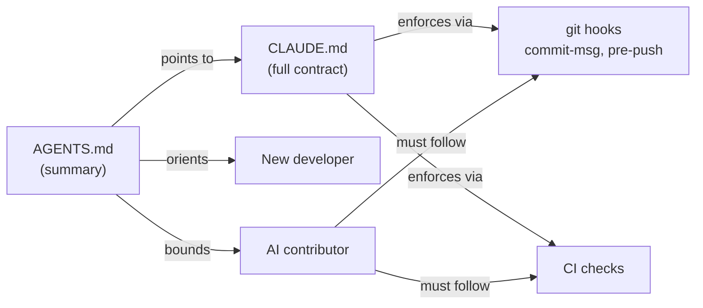

# Root — AGENTS.md

# AGENTS.md — Project Operating Manual

## Purpose

`AGENTS.md` is the single-page entry point for anyone — human or AI — working in the LibreFang repository. It is written in **telegraph style**: short sentences, one idea per line, scannable in a single pass. It is *not* a tutorial; it is the authoritative quick-reference for the stack, layout, build commands, architecture seams, conventions, and the collaboration boundaries that govern AI-assisted contributions.

It pairs with `CLAUDE.md`, which holds the full agent contract (worktree rules, git hooks, CI wait policy, close-comment contracts). `AGENTS.md` is the summary; `CLAUDE.md` is the law.

## What It Covers

The file is organized into nine top-level sections, each self-contained:

| Section | Answers |
|---|---|
| **Stack** | What language, runtime, web framework, database, config location? |
| **Layout** | What does each of the 15 crates do? |
| **Build** | Which `cargo` invocations are allowed / forbidden? |
| **Architecture** | What are the key traits, bridges, and patterns? |
| **API routes** | Where do route handlers live? |
| **Conventions** | Error handling, serialization, naming, async, tests, commits. |
| **AI Agent Collaboration** | What may an automated contributor do, and what is off-limits? |
| **Gotchas** | What sharp edges have bitten people before? |

## How It Fits In



`AGENTS.md` is read first; `CLAUDE.md` is consulted when a boundary needs detail. The git hooks and CI enforce what the docs describe — they are not advisory.

## Stack At A Glance

- **Rust 2021 edition**, MSRV **1.94.1**.
- **tokio** for async runtime.
- **axum 0.8** for HTTP and WebSocket.
- **SQLite** via bundled **rusqlite** (no external DB process).
- **TOML** config at `~/.librefang/config.toml`.
- Default API endpoint `http://127.0.0.1:4545`.

## Workspace Layout

The workspace contains **15 crates** under `crates/` plus `xtask/`. The layout table in `AGENTS.md` is the canonical map; a few load-bearing relationships:

- **`librefang-types`** — shared types and traits; everything depends on it, it depends on nothing.
- **`librefang-kernel`** — the orchestration core: agent registry, scheduling, event bus, metering.
- **`librefang-runtime`** — the agent loop, LLM drivers, tools, MCP client, context engine, and A2A.
- **`librefang-api`** — HTTP/WebSocket server and the React dashboard.

The two crates most likely to trip up a new contributor are `librefang-kernel` and `librefang-runtime`, because they have a circular dependency that is broken by the `KernelHandle` trait (see below).

## Build Rules (Enforced)

Three commands are sanctioned; deviation will be rejected in review.

```bash
cargo check --workspace --lib                          # compile-check only
cargo test -p <crate>                                  # scoped; workspace-wide tests are forbidden
cargo clippy --workspace --all-targets -- -D warnings  # zero warnings tolerated
```

The **workspace-wide `cargo test`** form is explicitly forbidden because of `target/` contention. Always scope tests to a single crate with `-p`. Full builds run in CI — locally, use `cargo check --workspace --lib`.

## Architecture Seams

### `KernelHandle` trait

Defined in `librefang-runtime`. The **kernel implements it**; **runtime and API consume it**. This is the indirection that lets the kernel and runtime crates reference each other's behavior without a circular crate dependency. Any new capability the runtime needs from the kernel must surface through this trait.

### `AppState` bridge

Lives in `librefang-api/src/server.rs`. It wires the kernel into route handlers and carries shared state (e.g., `Option<Arc<PeerRegistry>>`). **Adding a route requires two edits**: register it in the `server.rs` router *and* implement it under `librefang-api/src/routes/`.

### `session_mode`

Two values govern how automated invocations treat conversation history:

- `"persistent"` (default) — reuses the agent's existing session.
- `"new"` — starts fresh on every automated invocation (cron, triggers, `agent_send`).

Override is per-trigger via the trigger registration API. **Hands honor `session_mode`** because they share `AgentManifest` and the execution pipeline.

### `KernelConfig` field pattern

Adding any field to `KernelConfig` requires **all four** of:

1. The struct field itself.
2. `#[serde(default)]` on it.
3. A matching entry in the `Default` impl.
4. `Serialize` / `Deserialize` derives on the struct.

The build will fail if the `Default` impl is missing the new entry — this is called out in Gotchas because it is a frequent CI break.

### Agent manifests and the dashboard

- Agent manifests live at `agents/<name>/agent.toml`.
- The dashboard is a **React + TypeScript SPA built with Vite**, located at `crates/librefang-api/dashboard/`. Pages in `dashboard/src/pages/`, components in `dashboard/src/components/`.

## API Route Surface

Route handlers are organized by domain module under `crates/librefang-api/src/routes/`. The 16 domain modules are:

`agents`, `budget`, `channels`, `config`, `goals`, `inbox`, `media`, `memory`, `network`, `plugins`, `prompts`, `providers`, `skills`, `system`, `workflows`.

Each is a self-contained module; new endpoints land in the relevant module and are wired through `server.rs`.

## Conventions

These are the rules the codebase is expected to follow. Reviewers check them.

- **Errors**: `thiserror` in libraries; `anyhow` in application code.
- **Serialization**: `serde` + `serde_json` + `toml`.
- **Naming**: `snake_case` for functions and variables; `PascalCase` for types.
- **Async**: `async fn` on tokio. `async-trait` **only** when a trait method must be async.
- **Tests**: `#[cfg(test)]` modules next to the source they test. Cross-crate helpers live in `librefang-testing` (mock kernel, mock LLM, route test utilities).
- **Commits**: Conventional Commits — `feat:`, `fix:`, `docs:`, `refactor:`, `chore:`, `ci:`, `perf:`, `test:`.

## AI Agent Collaboration Boundaries

Because LibreFang has heavy AI-assisted participation, the boundaries section exists to **keep human reviewers in control** and **prevent noisy or destructive behavior**. The list is the single-page summary; `CLAUDE.md` holds the full enforcement detail.

The rules cluster into four themes:

1. **Don't touch other people's work uninvited.** Don't modify a reviewed/approved PR; don't close a PR or issue you didn't open (recommend closure in a comment instead); don't force-push to someone else's branch.
2. **Don't bypass verification.** No `--no-verify`, no `--no-gpg-sign`, no skipping hooks. No AI attribution in commits or PR bodies — the `commit-msg` hook rejects it.
3. **Stay scoped and quiet.** One PR ↔ one issue. At most 2 follow-up comments on a thread without human input. Don't poll CI for more than ~5 minutes — push, report the run URL, stop.
4. **When blocked, stop and report.** Don't auto-open follow-up issues, don't silently switch plans, don't add reviewers or flip `ready-for-review` unprompted.

**Conflict resolution rule**: a human maintainer's most recent intent always wins over an earlier AI-authored change. Never silently drop a maintainer's edit to shrink a diff.

## Gotchas

These are the concrete traps documented for contributors. They are easy to miss and each has bitten someone.

- **`librefang-cli` is off-limits** without explicit instruction — it is under active development.
- **`PeerRegistry` typing is asymmetric**: `Option<PeerRegistry>` on the kernel, `Option<Arc<PeerRegistry>>` on `AppState`. Don't assume one shape.
- **`KernelConfig` `Default` impl is mandatory** for every new field — the build fails otherwise.
- **`AgentLoopResult` exposes `.response`**, not `.response_text`.
- **CLI daemon command is `start`**, not `daemon`.

## How To Use This Document

- **As a new contributor**: read top to bottom once. Keep the Layout and Build tables bookmarked. Consult Gotchas before each PR.
- **As an AI contributor**: the Collaboration Boundaries are non-negotiable. When uncertain whether an action is permitted, default to *stop and ask*. The `CLAUDE.md` link from this file is the source of truth for edge cases.
- **As a reviewer**: the Conventions and Build sections are your checklist. CI enforces clippy (`-D warnings`) and the `commit-msg` hook enforces conventional commits and no-AI-attribution; anything that slips past CI should still be caught against these rules.