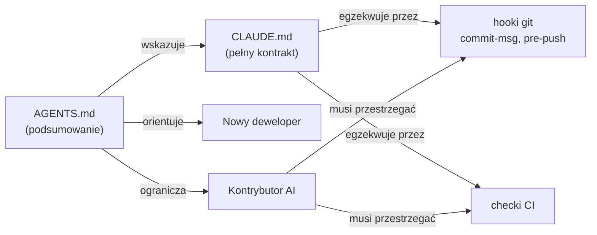

# Root — AGENTS.md

# AGENTS.md — Podręcznik operacyjny projektu

## Cel

`AGENTS.md` to jednostronicowy punkt wejścia dla każdego — człowieka lub AI — pracującego w repozytorium LibreFang. Napisany jest w **stylu telegraficznym**: krótkie zdania, jedna myśl na linię, możliwy do przeskanowania w jednym przejściu. Nie jest to *tutorial*; jest to autorytatywne źródło referencyjne dotyczące stosu, układu, komend budowania, szwów architektonicznych, konwencji oraz granic współpracy rządzących kontrybucjami wspieranymi przez AI.

Stanowi parę z `CLAUDE.md`, który zawiera pełny kontrakt agenta (reguły worktree, hooki git, politykę oczekiwania na CI, kontrakty komentarzy zamykających). `AGENTS.md` to podsumowanie; `CLAUDE.md` to prawo.

## Co obejmuje

Plik jest zorganizowany w dziewięć sekcji najwyższego poziomu, z których każda jest samowystarczalna:

| Sekcja | Odpowiada na pytanie |
|---|---|
| **Stack** | Język, runtime, framework webowy, baza danych, lokalizacja konfiguracji? |
| **Układ** | Co robi każdy z 15 crate'ów? |
| **Budowanie** | Które wywołania `cargo` są dozwolone / zabronione? |
| **Architektura** | Jakie są kluczowe traity, pomosty i wzorce? |
| **Trasy API** | Gdzie znajdują się handlery tras? |
| **Konwencje** | Obsługa błędów, serializacja, nazewnictwo, async, testy, commity. |
| **Współpraca agenta AI** | Co może zrobić zautomatyzowany kontrybutor, a co jest poza granicami? |
| **Pułapki** | Na jakie ostre krawędzie ludzie już się nadziali? |

## Jak to się składa



`AGENTS.md` czyta się jako pierwszy; `CLAUDE.md` konsultuje się, gdy potrzebny jest szczegół dotyczący granicy. Hooki git i CI egzekwują to, co opisano w dokumentacji — nie są one doradcze.

## Stack w pigułce

- **Rust edycja 2021**, MSRV **1.94.1**.
- **tokio** jako runtime async.
- **axum 0.8** dla HTTP i WebSocket.
- **SQLite** przez dołączony **rusqlite** (bez zewnętrznego procesu bazy danych).
- Konfiguracja **TOML** w `~/.librefang/config.toml`.
- Domyślny punkt końcowy API `http://127.0.0.1:4545`.

## Układ workspace'u

Workspace zawiera **15 crate'ów** w katalogu `crates/` oraz `xtask/`. Tabela układu w `AGENTS.md` to kanoniczna mapa; kilka nośnych relacji:

- **`librefang-types`** — współdzielone typy i traity; wszystko od niego zależy, on nie zależy od niczego.
- **`librefang-kernel`** — rdzeń orkiestracji: rejestr agentów, planowanie, event bus, metering.
- **`librefang-runtime`** — pętla agenta, sterowniki LLM, narzędzia, klient MCP, silnik kontekstu i A2A.
- **`librefang-api`** — serwer HTTP/WebSocket oraz dashboard React.

Dwa craty, które najprawdopodobniej spowodują problemy nowemu kontrybutorowi, to `librefang-kernel` i `librefang-runtime`, ponieważ mają zależność cykliczną, która jest przerwana przez trait `KernelHandle` (patrz poniżej).

## Reguły budowania (egzekwowane)

Sanctionowane są trzy komendy; odchylenia zostaną odrzucone w code review.

```bash
cargo check --workspace --lib                          # tylko sprawdzenie kompilacji
cargo test -p <crate>                                  # ograniczone; testy całego workspace'u są zabronione
cargo clippy --workspace --all-targets -- -D warnings  # zero ostrzeżeń, zero tolerancji
```

Forma **całoworkspace'owego `cargo test`** jest jawnie zabroniona z powodu rywalizacji o `target/`. Zawsze ograniczaj testy do pojedynczego crate'a za pomocą `-p`. Pełne buildy uruchamiają się w CI — lokalnie używaj `cargo check --workspace --lib`.

## Szwyny architektoniczne

### Trait `KernelHandle`

Zdefiniowany w `librefang-runtime`. **Kernel go implementuje**; **runtime i API go konsumują**. To jest pośrednictwo, które pozwala crate'om kernel i runtime odwoływać się do zachowań nawzajem bez cyklicznej zależności crate'ów. Każda nowa funkcjonalność, której runtime potrzebuje od kernela, musi wyłonić się przez ten trait.

### Pomost `AppState`

Znajduje się w `librefang-api/src/server.rs`. Podłącza kernel do handlerów tras i niesie współdzielony stan (np. `Option<Arc<PeerRegistry>>`). **Dodanie trasy wymaga dwóch edycji**: zarejestruj ją w routerze `server.rs` *oraz* zaimplementuj ją w `librefang-api/src/routes/`.

### `session_mode`

Dwie wartości określają, jak zautomatyzowane wywołania traktują historię konwersacji:

- `"persistent"` (domyślny) — ponownie używa istniejącej sesji agenta.
- `"new"` — zaczyna od nowa przy każdym zautomatyzowanym wywołaniu (cron, triggery, `agent_send`).

Nadpisanie jest per-trigger przez API rejestracji triggerów. **Hands honorują `session_mode`**, ponieważ współdzielą `AgentManifest` i potok wykonawczy.

### Wzorzec pola `KernelConfig`

Dodanie jakiegokolwiek pola do `KernelConfig` wymaga **wszystkich czterech**:

1. Samego pola w strukturze.
2. `#[serde(default)]` na nim.
3. Odpowiadającego wpisu w impl `Default`.
4. Pochodnych `Serialize` / `Deserialize` na strukturze.

Build nie powiedzie się, jeśli impl `Default` nie zawiera nowego wpisu — jest to wywołane w Pułapkach, ponieważ jest częstym powodem złamania CI.

### Manifesty agentów i dashboard

- Manifesty agentów znajdują się w `agents/<name>/agent.toml`.
- Dashboard to **SPA w React + TypeScript zbudowane w Vite**, zlokalizowane w `crates/librefang-api/dashboard/`. Strony w `dashboard/src/pages/`, komponenty w `dashboard/src/components/`.

## Powierzchnia tras API

Handlery tras są zorganizowane w moduły domenowe w `crates/librefang-api/src/routes/`. 16 modułów domenowych to:

`agents`, `budget`, `channels`, `config`, `goals`, `inbox`, `media`, `memory`, `network`, `plugins`, `prompts`, `providers`, `skills`, `system`, `workflows`.

Każdy jest samowystarczalnym modułem; nowe endpointy trafiają do odpowiedniego modułu i są podłączane przez `server.rs`.

## Konwencje

To są zasady, których codebase ma przestrzegać. Recenzenci je sprawdzają.

- **Błędy**: `thiserror` w bibliotekach; `anyhow` w kodzie aplikacyjnym.
- **Serializacja**: `serde` + `serde_json` + `toml`.
- **Nazewnictwo**: `snake_case` dla funkcji i zmiennych; `PascalCase` dla typów.
- **Async**: `async fn` na tokio. `async-trait` **tylko** gdy metoda traitu musi być async.
- **Testy**: moduły `#[cfg(test)]` obok testowanego kodu źródłowego. Helpery cross-crate'owe znajdują się w `librefang-testing` (mock kernel, mock LLM, utilitki testowe tras).
- **Commity**: Conventional Commits — `feat:`, `fix:`, `docs:`, `refactor:`, `chore:`, `ci:`, `perf:`, `test:`.

## Granice współpracy agenta AI

Ponieważ LibreFang ma mocny udział kontrybucji wspieranych przez AI, sekcja granic istnieje, aby **utrzymać ludzkich recenzentów nad kontrolą** i **zapobiegać głośnemu lub destrukcyjnemu zachowaniu**. Lista jest jednostronicowym podsumowaniem; `CLAUDE.md` zawiera pełne szczegóły egzekwowania.

Reguły grupują się w cztery tematy:

1. **Nie dotykaj cudzej pracy bez zaproszenia.** Nie modyfikuj zrecenzowanego/zatwierdzonego PR; nie zamykaj PR ani issue, którego nie otworzyłeś (zamiast tego zarekomenduj zamknięcie w komentarzu); nie rób force-pusha na cudzą gałąź.
2. **Nie omijaj weryfikacji.** Bez `--no-verify`, bez `--no-gpg-sign`, bez pomijania hooków. Bez atrybucji AI w commitach lub treści PR — hook `commit-msg` to odrzuca.
3. **Zachowaj zakres i ciszę.** Jeden PR ↔ jedno issue. Najwyżej 2 komentarze następcze w wątku bez udziału człowieka. Nie odpytuj CI przez więcej niż ~5 minut — wypchnij, podaj URL runu, przestań.
4. **Gdy jesteś zablokowany, zatrzymaj się i zgłoś.** Nie otwieraj automatycznie issue następczych, nie przełączaj planów po cichu, nie dodawaj recenzentów ani nie zmieniaj `ready-for-review` bez wcześniejszego zapytania.

**Reguła rozwiązywania konfliktów**: najnowsza intencja ludzkiego maintainera zawsze wygrywa z wcześniejszą zmianą autorską AI. Nigdy nie pomijaj po cichu edycji maintainera, by zmniejszyć diff.

## Pułapki

To są konkretne pułapki udokumentowane dla kontrybutorów. Łatwo je przeoczyć, a każda już kogoś ugryzła.

- **`librefang-cli` jest poza zasięgiem** bez wyraźnej instrukcji — jest w aktywnym rozwoju.
- **Typowanie `PeerRegistry` jest asymetryczne**: `Option<PeerRegistry>` w kernelu, `Option<Arc<PeerRegistry>>` w `AppState`. Nie zakładaj jednego kształtu.
- **Impl `Default` `KernelConfig` jest obowiązkowy** dla każdego nowego pola — w przeciwnym razie build nie powiedzie się.
- **`AgentLoopResult` eksponuje `.response`**, nie `.response_text`.
- **Komenda daemona CLI to `start`**, nie `daemon`.

## Jak korzystać z tego dokumentu

- **Jako nowy kontrybutor**: przeczytaj raz od góry do dołu. Trzymaj w zakładkach tabele Układu i Budowania. Konsultuj Pułapki przed każdym PR.
- **Jako kontrybutor AI**: Granice Współpracy są niepodlegające negocjacjom. Gdy nie jesteś pewien, czy akcja jest dozwolona, domyślnie *zatrzymaj się i zapytaj*. Link do `CLAUDE.md` z tego pliku jest źródłem prawdy dla przypadków brzegowych.
- **Jako recenzent**: sekcje Konwencje i Budowania to Twoja checklista. CI egzekwuje clippy (`-D warnings`) a hook `commit-msg` egzekwuje conventional commits i brak atrybucji AI; wszystko, co umknie CI, powinno zostać złapane względem tych reguł.
