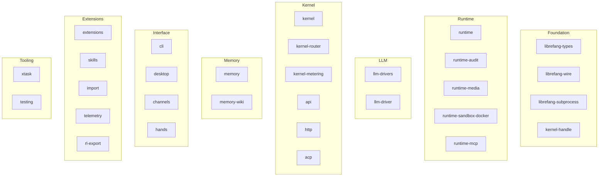

# Katalog główny — Cargo.toml

# Katalog główny — `Cargo.toml` (manifest obszaru roboczego)

## Przeznaczenie

Główny `Cargo.toml` to **manifest obszaru roboczego Cargo** dla całego monorepo `librefang`. Nie kompiluje samodzielnie żadnego kodu. Zamiast tego:

1. Deklaruje wszystkie kraty pierwszej strony jako **składowe** obszaru roboczego.
2. Przypina każdą zależność strony trzeciej **jednorazowo**, dzięki czemu składowe kraty odwołują się do wersji po nazwie (`dep.workspace = true`) zamiast ponownie je deklarować.
3. Ustawia metadane pakietu dla całego obszaru roboczego (wersja, wydanie, MSRV, licencja).
4. Konfiguruje **profile kompilacji** (`dev`, `release`, `release-local`) z nietrywialnymi ustawieniami dostosowanymi do tego projektu.
5. Definiuje **politykę lintowania** na poziomie obszaru roboczego, do której dołączają składowe kraty.

Każda zmiana przypięcia wersji, flagi profilu lub reguły lintowania to decyzja przekrojowa wpływająca na każdą kratę w obszarze roboczym.

---

## Tożsamość pakietu

| Pole | Wartość |
|---|---|
| Wersja | `2026.7.31` (datowana kalendarzowo) |
| Wydanie | `2021` |
| Rust MSRV | `1.94.1` |
| Licencja | `MIT` |
| Resolver | `2` (unifikacja funkcji wyłączona) |

Wszystkie składowe kraty dziedziczą te wartości, chyba że nadpiszą je lokalnie.

---

## Składowe obszaru roboczego

Obszar roboczy zawiera **30 krat** oraz `xtask`, zorganizowanych w warstwy funkcyjne:



### Konwencja nazewnictwa

Każda krata używa przedrostka `librefang-` z wyjątkiem `xtask`, który jest narzędziem automatyzacji kompilacji/zadań wywoływanym przez `cargo xtask`.

### Podsumowanie warstw

| Warstwa | Kraty | Odpowiedzialność |
|---|---|---|
| **Foundation** | `types`, `wire`, `subprocess`, `kernel-handle` | Współdzielone typy, protokoły sieciowe, uruchamianie procesów, abstrakcje uchwytów jądra |
| **Runtime** | `runtime`, `runtime-audit`, `runtime-media`, `runtime-sandbox-docker`, `runtime-mcp` | Środowisko wykonawcze: audytowanie, obsługa mediów, piaskownica Docker, transport MCP |
| **LLM** | `llm-drivers`, `llm-driver` | Integracja z dostawcami LLM |
| **Kernel** | `kernel`, `kernel-router`, `kernel-metering`, `api`, `http`, `acp` | Orkiestracja rdzenia, trasowanie żądań, pomiar zużycia, serwer HTTP, Agent Client Protocol (integracja Zed) |
| **Memory** | `memory`, `memory-wiki` | Magazyn trwały i baza wiedzy |
| **Interface** | `cli`, `desktop`, `channels`, `hands` | Punkty wejścia dla użytkownika: terminal, aplikacja desktopowa, kanały komunikacji, obsługa wprowadzania |
| **Extensions** | `extensions`, `skills`, `import`, `telemetry`, `rl-export` | System wtyczek, definicje umiejętności, import danych, telemetria, eksport uczenia ze wzmocnieniem |
| **Tooling** | `xtask`, `testing` | Automatyzacja kompilacji i współdzielone narzędzia testowe |

---

## Strategia zależności

Wszystkie zależności zewnętrzne są deklarowane w `[workspace.dependencies]`. Składowe kraty korzystają z nich poprzez:

```toml
# W Cargo.toml składowej kraty
[dependencies]
tokio.workspace = true
serde = { workspace = true }
```

Zapewnia to **jednoźródłowe przypinanie wersji** — żadne dwie kraty nie mogą przypadkowo zależeć od różnych głównych wersji tej samej kraty.

### Znaczace decyzje dotyczące zależności

Komentarze w manifeście dokumentują kilka nieoczywistych wyborów, które są krytyczne do utrzymania:

#### Stos OpenTelemetry (wyrównany do 0.32)

Cały stos OTel musi pozostać wyrównany wersjami. `tracing-opentelemetry 0.33` zależy od `opentelemetry 0.32`, więc wszystkie kraty OTel są przypięte do `0.32`:

| Krata | Wersja | Uzasadnienie |
|---|---|---|
| `opentelemetry` | `0.32` | Rdzeniowe API |
| `opentelemetry_sdk` | `0.32` (z `rt-tokio`) | SDK ze środowiskiem wykonawczym Tokio |
| `opentelemetry-otlp` | `0.32` (`default-features = false`) | Tylko gRPC/tonic — **wyłączenie domyślnych funkcji jest krytyczne**, aby uniknąć podciągnięcia `reqwest 0.12` obok `reqwest 0.13` z obszaru roboczego, co spowodowałoby duplikację całego stosu HTTP/TLS |
| `tracing-opentelemetry` | `0.33` | Krata mostkująca |
| `opentelemetry-http` | `0.32` | Wstrzykiwanie nagłówków W3C trace-context dla wychodzących żądań LLM — podciągnięte jawnie, ponieważ `otlp` ma wyłączone domyślne funkcje |

**Ostrzeżenie:** Zwiększenie wersji którejkolwiek z krat OTel bez zwiększenia pozostałych spowoduje ponowne wprowadzenie dwóch kopii `opentelemetry::trace::Tracer` do grafu zależności, co złamie `SdkTracer: Tracer` w `telemetry.rs`.

#### Agent Client Protocol (dokładnie przypięty)

```toml
agent-client-protocol = { version = "=2.0.0", features = ["unstable"] }
```

Przypięty z `=`, ponieważ funkcja `unstable` jest jawnie oznaczona jako **łamiąca kompatybilność** przez projekt nadrzędny (Zed). Zwiększenie wersji z operatorem karetka mogłoby zmienić oczekiwania formatu sieciowego między wydaniami minor. Zwiększenie tego przypięcia wymaga jawnej, zrecenzowanej zmiany.

#### Migracja `serde_yaml`

```toml
serde_yaml = { package = "serde_yaml_ng", version = "0.10" }
```

Oryginalna kratka `serde_yaml` jest zarchiwizowana (RUSTSEC-2024-0320). Utrzymywany fork `serde_yaml_ng` jest aliasowany do nazwy `serde_yaml`, aby istniejące miejsca wywołań `use serde_yaml::...` pozostały niezmienione.

#### Dostawca kryptograficzny `jsonwebtoken`

```toml
jsonwebtoken = { version = "11", features = ["aws_lc_rs"] }
```

Wersja 10+ odlicza operacje podpisu do procesowego `CryptoProvider` i **panikuje podczas dekodowania**, jeśli żaden nie jest włączony. Funkcja `aws_lc_rs` odpowiada dostawcy rustls, który `librefang-cli` instaluje podczas uruchamiania. Bez tego walidacja tokenów OIDC panikuje na produkcji.

#### Konfiguracja `reqwest`

```toml
reqwest = { version = "0.13", default-features = false, features = [
    "json", "stream", "multipart", "rustls", "gzip", "deflate", "brotli",
    "form", "query", "socks"
] }
```

Domyślne funkcje są wyłączone, aby uniknąć podciągnięcia `native-tls` / OpenSSL. TLS jest obsługiwane wyłącznie przez `rustls`.

#### `psl` (Public Suffix List)

```toml
psl = "2"
```

Wybrano zamiast `publicsuffix`, ponieważ kompiluje dane PSL w czasie kompilacji — bez pobierania w czasie wykonania. Używane przez MCP auth do weryfikacji, czy punkt końcowy tokena współdzieli domenę rejestrowalną z deklarowanym wystawcą.

### Pełne zestawienie zależności

| Kategoria | Kraty |
|---|---|
| **Środowisko wykonawcze async** | `tokio` (full), `tokio-stream`, `tokio-util` (compat), `futures`, `async-trait` |
| **Serializacja** | `serde` (derive), `serde_json`, `serde_yaml` (fork ng), `toml`, `rmp-serde`, `json5` |
| **Obsługa błędów** | `thiserror`, `anyhow` |
| **Współbieżność** | `dashmap`, `crossbeam`, `arc-swap` |
| **Tracing/Telemetria** | `tracing`, `tracing-subscriber` (env-filter, registry), pełny stos OTel (powyżej), `metrics`, `metrics-exporter-prometheus` |
| **Baza danych** | `rusqlite` (bundled, serde_json), `r2d2`, `r2d2_sqlite` |
| **Serwer HTTP** | `axum` (ws), `tower`, `tower-http` (cors, trace, compression, limit) |
| **Klient HTTP** | `reqwest` (rustls), `ureq` (sync) |
| **WebSocket** | `tokio-tungstenite` (rustls-tls-native-roots) |
| **TLS/Kryptografia** | `rustls`, `webpki-roots`, `rustls-native-certs`, `sha2`, `hmac`, `ed25519-dalek`, `x25519-dalek`, `hkdf`, `rsa`, `aes-gcm`, `argon2`, `zeroize`, `subtle` |
| **Uwierzytelnianie** | `webauthn-rs`, `totp-rs`, `jsonwebtoken`, `keyring` (natywne backendy) |
| **CLI** | `clap` (derive), `clap_complete`, `ratatui`, `colored`, `portable-pty` |
| **MCP/ACP** | `rmcp`, `agent-client-protocol` |
| **Piaskownica** | `wasmtime` |
| **Szablony** | `tera` (sandboxed, domyślne funkcje wyłączone) |
| **Czas** | `chrono` (serde), `chrono-tz` |
| **Identyfikatory** | `uuid` (v4, v5, serde) |
| **Limitowanie częstotliwości** | `governor` |
| **Archiwa** | `zip` (tylko deflate), `tar`, `flate2` |
| **i18n** | `fluent`, `unic-langid` |
| **Regex** | `regex`, `regex-lite` |
| **Różne narzędzia** | `base64`, `bitflags`, `bytes`, `smallvec`, `walkdir`, `dirs`, `which`, `socket2`, `url`, `urlencoding`, `hex`, `psl` |
| **Testy/benchmarke** | `tempfile`, `criterion` (html_reports) |

---

## Profile kompilacji

### `[profile.dev]`

| Ustawienie | Wartość | Uzasadnienie |
|---|---|---|
| `split-debuginfo` | `"unpacked"` | Szybsze konsolidowanie przyrostowe na macOS |
| `debug` | `"line-tables-only"` | Zmniejsza binaria testowe o ~60%, aby odciążyć pamięć CI. Paniki/backtrace zachowują `plik:linia`; utracona jest tylko inspekcja zmiennych w debuggerze. |

### `[profile.release]`

| Ustawienie | Wartość | Uzasadnienie |
|---|---|---|
| `lto` | `"fat"` | Optymalizacja całego programu |
| `codegen-units` | `1` | Maksymalna możliwość optymalizacji |
| `strip` | `"symbols"` | Binaria bez symboli do dystrybucji |
| `debug` | `"line-tables-only"` | Nazwy funkcji + `plik:linia` do diagnostyki awarii bez DWARF inspekcji zmiennych |
| `split-debuginfo` | `"packed"` | Informacje debug emitowane do osobnego pliku `.dSYM`/`.dwp`, przesyłane jako oddzielny artefakt wydania |
| `opt-level` | `"s"` | Optymalizacja rozmiaru — wąskim gardłem demona jest I/O sieciowe, a nie CPU. Obcina 5–15% binarium względem `opt-level=3` |

**Ustawienie `split-debuginfo = "packed"` jest kluczowe.** Zgłoszenie #6659 śledziło przepełnienie stosu `tokio-rt-worker` (nieograniczona rekursja), którego raport o awarii pokazywał tylko sześciowątkowy cykl w 52-klatkowym oknie — nien diagnozowalny, ponieważ żaden dystrybuowany build nie zawierał symboli. Dzięki spakowanym informacjom debug, przepływ pracy wydania przesyła symbole jako osobny artefakt, umożliwiając symbolizację raportów o awarii przez `atos`/`addr2line` bez powiększania dystrybuowanego binarium.

### `[profile.release-local]`

Dziedziczy `release`, ale łagodzi optymalizację dla szybszych lokalnych kompilacji:

```toml
inherits = "release"
lto = "thin"          # szybsze niż "fat"
codegen-units = 4     # zrównoleglone
```

Użyj tego profilu do lokalnego testowania wydajności lub gdy potrzebujesz binarium w trybie wydania bez pełnego kosztu LTO:

```sh
cargo build --profile release-local
```

---

## Polityka lintowania

```toml
[workspace.lints.rust]
warnings = "deny"
```

Zastępuje to poprzednie `RUSTFLAGS=-D warnings` na poziomie CI (zgłoszenie #3554), które wyciekało do kompilacji zależności i zrywało CI z powodu regresji lintów przechodnich. Zakres lintów obszaru roboczego ma zastosowanie **tylko** do krat pierwszej strony, które jawnie się dołączają:

```toml
# W Cargo.toml składowej kraty
[lints]
workspace = true
```

Zależności strony trzeciej pozostają nietknięte.

---

## Jak wnosić zmiany

### Dodawanie nowej kraty

1. Utwórz kratę w `crates/librefang-<nazwa>/`.
2. Dodaj `"crates/librefang-<nazwa>"` do tablicy `members`.
3. Użyj `[lints] workspace = true`, aby dziedziczyć politykę odrzucania ostrzeżeń.
4. Korzystaj z zależności przez odwołania `.workspace = true` — **nie** przypinaj wersji lokalnie.

### Zwiększanie wersji zależności

- Większość podwyższeń wersji jest rutynowa. Następujące zależności mają jednak **twarde ograniczenia wyrównania wersji** i muszą być podwyższane grupowo:
  - **Stos OpenTelemetry**: `opentelemetry`, `opentelemetry_sdk`, `opentelemetry-otlp`, `tracing-opentelemetry`, `opentelemetry-http`
  - **`agent-client-protocol`**: dokładnie przypięty, wymaga jawnej recenzji
  - **`rmcp`**: MCP SDK, weryfikuj kompatybilność transportu
- Podczas dodawania komentarza wyjaśniającego *dlaczego* przypięcie jest nietypowe, podążaj za istniejącym wzorcem: odwołaj się do numeru zgłoszenia/PR i wyjaśnij tryb awarii w przypadku naruszenia ograniczenia.

### Zmiana profili kompilacji

Każda zmiana w `[profile.release]` powinna być uzasadniona względem wymogu informacji debug z #6659 oraz ograniczeń pamięci CI z #1805/#1807. Dokumentuj kompromisy w komentarzach manifestu.
