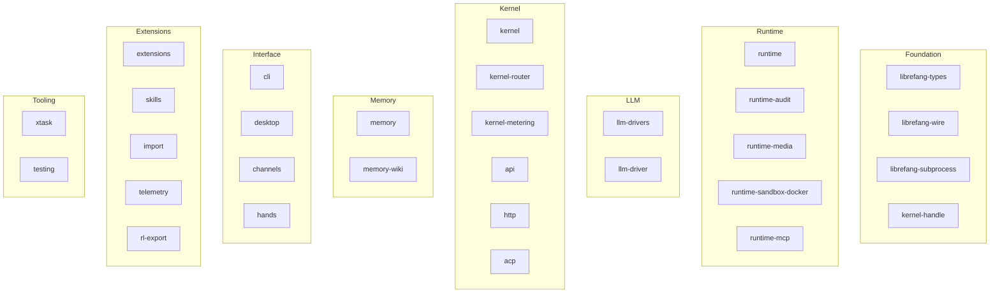

# Root — Cargo.toml

# Root — `Cargo.toml` (Workspace Manifest)

## Purpose

The root `Cargo.toml` is the **Cargo workspace manifest** for the entire `librefang` monorepo. It does not compile any code itself. Instead it:

1. Declares all first-party crates as workspace **members**.
2. Pins every third-party dependency **once**, so member crates reference versions by name (`dep.workspace = true`) rather than re-declaring them.
3. Sets workspace-wide package metadata (version, edition, MSRV, license).
4. Configures build **profiles** (`dev`, `release`, `release-local`) with non-default settings tuned for this project.
5. Defines a workspace-level **lint policy** that member crates opt into.

Any change to a version pin, profile flag, or lint rule here is a cross-cutting decision that affects every crate in the workspace.

---

## Package Identity

| Field | Value |
|---|---|
| Version | `2026.7.31` (calendar-dated) |
| Edition | `2021` |
| Rust MSRV | `1.94.1` |
| License | `MIT` |
| Resolver | `2` (feature unification off) |

All member crates inherit these values unless they override locally.

---

## Workspace Members

The workspace contains **30 crates** plus `xtask`, organized into functional layers:



### Naming Convention

Every crate uses the `librefang-` prefix except `xtask`, which is a build/task automation tool invoked via `cargo xtask`.

### Layer Summary

| Layer | Crates | Responsibility |
|---|---|---|
| **Foundation** | `types`, `wire`, `subprocess`, `kernel-handle` | Shared types, wire protocols, process spawning, kernel handle abstractions |
| **Runtime** | `runtime`, `runtime-audit`, `runtime-media`, `runtime-sandbox-docker`, `runtime-mcp` | Execution environment: auditing, media handling, Docker sandboxing, MCP transport |
| **LLM** | `llm-drivers`, `llm-driver` | LLM provider integration |
| **Kernel** | `kernel`, `kernel-router`, `kernel-metering`, `api`, `http`, `acp` | Core orchestration, request routing, usage metering, HTTP server, Agent Client Protocol (Zed integration) |
| **Memory** | `memory`, `memory-wiki` | Persistent storage and knowledge base |
| **Interface** | `cli`, `desktop`, `channels`, `hands` | User-facing entry points: terminal, desktop app, communication channels, input handling |
| **Extensions** | `extensions`, `skills`, `import`, `telemetry`, `rl-export` | Plugin system, skill definitions, data import, observability, reinforcement-learning export |
| **Tooling** | `xtask`, `testing` | Build automation and shared test utilities |

---

## Dependency Strategy

All external dependencies are declared in `[workspace.dependencies]`. Member crates consume them via:

```toml
# In a member crate's Cargo.toml
[dependencies]
tokio.workspace = true
serde = { workspace = true }
```

This ensures **single-source version pinning** — no two crates can accidentally depend on different major versions of the same crate.

### Notable Dependency Decisions

The manifest comments document several non-obvious choices that are critical to maintain:

#### OpenTelemetry Stack (aligned on 0.32)

The entire OTel stack must stay version-aligned. `tracing-opentelemetry 0.33` depends on `opentelemetry 0.32`, so all OTel crates are pinned to `0.32`:

| Crate | Version | Rationale |
|---|---|---|
| `opentelemetry` | `0.32` | Core API |
| `opentelemetry_sdk` | `0.32` (with `rt-tokio`) | SDK with Tokio runtime |
| `opentelemetry-otlp` | `0.32` (`default-features = false`) | gRPC/tonic only — **disabling defaults is critical** to avoid pulling `reqwest 0.12` alongside the workspace `reqwest 0.13`, which would duplicate the entire HTTP/TLS stack |
| `tracing-opentelemetry` | `0.33` | Bridge crate |
| `opentelemetry-http` | `0.32` | W3C trace-context header injection for outbound LLM requests — pulled explicitly because `otlp` has defaults disabled |

**Warning:** Bumping any single OTel crate without bumping the rest will reintroduce two copies of `opentelemetry::trace::Tracer` in the dependency graph, breaking `SdkTracer: Tracer` in `telemetry.rs`.

#### Agent Client Protocol (exact-pinned)

```toml
agent-client-protocol = { version = "=2.0.0", features = ["unstable"] }
```

Pinned with `=` because the `unstable` feature is explicitly marked **breaking** by upstream (Zed). A caret bump could change wire-format expectations between minor releases. Bumping this pin requires an explicit, reviewed change.

#### `serde_yaml` Migration

```toml
serde_yaml = { package = "serde_yaml_ng", version = "0.10" }
```

The original `serde_yaml` is archived (RUSTSEC-2024-0320). The maintained fork `serde_yaml_ng` is aliased to the `serde_yaml` name so existing `use serde_yaml::...` call sites remain unchanged.

#### `jsonwebtoken` Crypto Provider

```toml
jsonwebtoken = { version = "11", features = ["aws_lc_rs"] }
```

Version 10+ defers signature operations to a process-level `CryptoProvider` and **panics at decode time** if none is enabled. The `aws_lc_rs` feature matches the rustls provider that `librefang-cli` installs at startup. Without this, OIDC token validation panics in production.

#### `reqwest` Configuration

```toml
reqwest = { version = "0.13", default-features = false, features = [
    "json", "stream", "multipart", "rustls", "gzip", "deflate", "brotli",
    "form", "query", "socks"
] }
```

Defaults are disabled to avoid pulling in `native-tls` / OpenSSL. TLS is handled via `rustls` exclusively.

#### `psl` (Public Suffix List)

```toml
psl = "2"
```

Chosen over `publicsuffix` because it bakes the PSL data in at compile time — no runtime fetch. Used by MCP auth to validate that a token endpoint shares a registrable domain with the declared issuer.

### Full Dependency Reference

| Category | Crates |
|---|---|
| **Async runtime** | `tokio` (full), `tokio-stream`, `tokio-util` (compat), `futures`, `async-trait` |
| **Serialization** | `serde` (derive), `serde_json`, `serde_yaml` (ng fork), `toml`, `rmp-serde`, `json5` |
| **Error handling** | `thiserror`, `anyhow` |
| **Concurrency** | `dashmap`, `crossbeam`, `arc-swap` |
| **Tracing/Telemetry** | `tracing`, `tracing-subscriber` (env-filter, registry), full OTel stack (above), `metrics`, `metrics-exporter-prometheus` |
| **Database** | `rusqlite` (bundled, serde_json), `r2d2`, `r2d2_sqlite` |
| **HTTP server** | `axum` (ws), `tower`, `tower-http` (cors, trace, compression, limit) |
| **HTTP client** | `reqwest` (rustls), `ureq` (sync) |
| **WebSocket** | `tokio-tungstenite` (rustls-tls-native-roots) |
| **TLS/Crypto** | `rustls`, `webpki-roots`, `rustls-native-certs`, `sha2`, `hmac`, `ed25519-dalek`, `x25519-dalek`, `hkdf`, `rsa`, `aes-gcm`, `argon2`, `zeroize`, `subtle` |
| **Auth** | `webauthn-rs`, `totp-rs`, `jsonwebtoken`, `keyring` (native backends) |
| **CLI** | `clap` (derive), `clap_complete`, `ratatui`, `colored`, `portable-pty` |
| **MCP/ACP** | `rmcp`, `agent-client-protocol` |
| **Sandbox** | `wasmtime` |
| **Templating** | `tera` (sandboxed, default-features off) |
| **Time** | `chrono` (serde), `chrono-tz` |
| **IDs** | `uuid` (v4, v5, serde) |
| **Rate limiting** | `governor` |
| **Archives** | `zip` (deflate only), `tar`, `flate2` |
| **i18n** | `fluent`, `unic-langid` |
| **Regex** | `regex`, `regex-lite` |
| **Misc utilities** | `base64`, `bitflags`, `bytes`, `smallvec`, `walkdir`, `dirs`, `which`, `socket2`, `url`, `urlencoding`, `hex`, `psl` |
| **Testing/bench** | `tempfile`, `criterion` (html_reports) |

---

## Build Profiles

### `[profile.dev]`

| Setting | Value | Rationale |
|---|---|---|
| `split-debuginfo` | `"unpacked"` | Faster incremental linking on macOS |
| `debug` | `"line-tables-only"` | Shrinks test binaries ~60% to relieve CI memory pressure. Panics/backtraces retain `file:line`; only debugger variable inspection is lost. |

### `[profile.release]`

| Setting | Value | Rationale |
|---|---|---|
| `lto` | `"fat"` | Whole-program optimization |
| `codegen-units` | `1` | Maximum optimization opportunity |
| `strip` | `"symbols"` | Stripped executable for distribution |
| `debug` | `"line-tables-only"` | Function names + `file:line` for crash diagnosis without variable-inspection DWARF |
| `split-debuginfo` | `"packed"` | Debug info emitted to a separate `.dSYM`/`.dwp` file, uploaded as a separate release artifact |
| `opt-level` | `"s"` | Size-optimized — daemon bottleneck is network I/O, not CPU. Trims 5–15% binary vs `opt-level=3` |

**The `split-debuginfo = "packed"` setting is load-bearing.** Issue #6659 tracked a `tokio-rt-worker` stack overflow (unbounded recursion) whose crash report showed only a six-function cycle in a 52-frame window — undiagnosable because no shipped build carried symbols. With packed debug info, the release workflow uploads symbols as a separate artifact, enabling `atos`/`addr2line` symbolication of crash reports without bloating the distributed binary.

### `[profile.release-local]`

Inherits `release` but relaxes optimization for faster local builds:

```toml
inherits = "release"
lto = "thin"          # faster than "fat"
codegen-units = 4     # parallelized
```

Use this profile for local performance testing or when you need a release-mode binary without the full LTO cost:

```sh
cargo build --profile release-local
```

---

## Lint Policy

```toml
[workspace.lints.rust]
warnings = "deny"
```

This replaces the previous CI-level `RUSTFLAGS=-D warnings` (issue #3554), which leaked into dependency compilation and broke CI on transitive lint regressions. The workspace lint scope applies **only** to first-party crates that explicitly opt in:

```toml
# In a member crate's Cargo.toml
[lints]
workspace = true
```

Third-party dependencies are unaffected.

---

## How to Contribute Changes

### Adding a new crate

1. Create the crate under `crates/librefang-<name>/`.
2. Add `"crates/librefang-<name>"` to the `members` array.
3. Use `[lints] workspace = true` to inherit the deny-warnings policy.
4. Consume dependencies via `.workspace = true` references — do **not** pin versions locally.

### Bumping a dependency

- Most bumps are routine. However, these dependencies have **hard version-alignment constraints** and must be bumped as a group:
  - **OpenTelemetry stack**: `opentelemetry`, `opentelemetry_sdk`, `opentelemetry-otlp`, `tracing-opentelemetry`, `opentelemetry-http`
  - **`agent-client-protocol`**: exact-pinned, requires explicit review
  - **`rmcp`**: MCP SDK, verify transport compatibility
- When adding a comment explaining *why* a pin is unusual, follow the existing pattern: reference the issue/PR number and explain the failure mode if the constraint is violated.

### Changing build profiles

Any change to `[profile.release]` should be justified against the #6659 debug-info requirement and the CI memory constraints from #1805/#1807. Document trade-offs in the manifest comments.