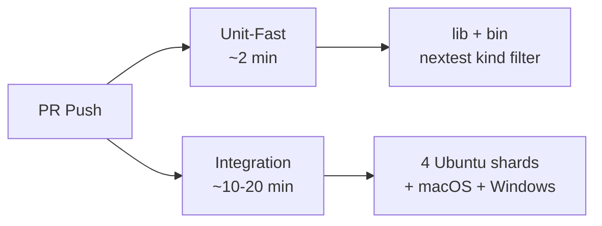

# Root — CLAUDE.md

# CLAUDE.md — Root Agent Instructions

## Purpose

`CLAUDE.md` is the top-level instruction file that governs how AI agents — primarily Claude Code — interact with the LibreFang repository. It is not application code; it is an operational charter that encodes safety hooks, build constraints, testing obligations, architectural invariants, and collaboration etiquette. Every agent session is expected to read and follow it before touching files.

The file is consumed both by the agent runtime (Claude Code loads it automatically) and by human contributors who need to understand the same guardrails. Its authority is enforced at three layers: Claude Code PreToolUse hooks, version-controlled git hooks in `scripts/hooks/`, and CI checks.

---

## Pre-Edit Safety Gate: Worktree Verification

The single most important rule in the file: **no edits in the main worktree.** Before any file-modifying task, the agent must run:

```bash
test -d "$(git rev-parse --show-toplevel)/.git" && echo main || echo linked
```

The distinction is mechanical: the main worktree stores `.git` as a directory; linked worktrees store it as a text file pointing into the main worktree's `.git/worktrees/` tree. The test differentiates these shapes reliably, unlike `git rev-parse --git-dir` (whose output varies with cwd) or path-matching against `pwd` (which differs per developer clone).

If the check returns `main`, the agent must create a linked worktree before proceeding:

```bash
git worktree add /tmp/librefang-<feature> -b <feature-branch> origin/main
```

A defense-in-depth hook (`.claude/hooks/forbid-main-worktree.sh`) blocks edits to the main tree if this gate is forgotten.

---

## Hook Architecture

Two hook layers provide overlapping enforcement. Understanding both is necessary when debugging why a command was blocked.

### Claude Code PreToolUse Hooks (`.claude/hooks/`)

| Hook | Trigger | Purpose |
|---|---|---|
| `forbid-main-worktree.sh` | PreToolUse (Edit/Write) | Blocks all edits and mutating git commands targeting the main worktree. |
| `guard-bash-safety.sh` | PreToolUse (Bash) | Blocks force-push to main, `--no-verify`/`--no-gpg-sign` flags, staging sensitive files, broad `git add -A`/`.`, AI attribution in commit messages, dangerous `rm -rf` targets, and daemon launches (`librefang start`) that contend on port 4545. |
| `session-start-worktree-check.sh` | SessionStart | Emits a banner indicating main vs. linked worktree and whether `core.hooksPath` is configured. |

### Git Hooks (`scripts/hooks/`)

These run inside git itself, regardless of which tool invoked the operation:

- **`pre-commit`**: Runs `cargo fmt --check` on staged Rust files, guards against duplicate `[Unreleased]` in CHANGELOG, validates `(@user)` attribution on `changelog.d/` fragments, and runs `gitleaks protect --staged` (soft-warns if gitleaks is not installed). Target: under 2 seconds.
- **`pre-push`**: Refuses direct pushes to `main`/`master`. Exits in under 100ms. Heavy verification (clippy, openapi drift) is intentionally deferred to CI. Maintainer override: `LIBREFANG_PREPUSH_SKIP=1`.
- **`commit-msg`**: Rejects commit messages with Claude/Anthropic attribution (catches heredocs and `-F file` that the PreToolUse hook cannot see). Also rejects commits whose author identity resolves to Claude/Anthropic via `git var GIT_AUTHOR_IDENT`.

Activation requires a one-time setup per clone:

```bash
just setup   # or: cargo xtask setup
```

This sets `git config core.hooksPath scripts/hooks`.

---

## Build and Verification Constraints

### Local Commands

The file enforces a strict separation between what an agent may run locally and what CI handles:

- **Forbidden**: `cargo build`, `cargo run`, and unscoped `cargo test` (contends with the user's sessions on the shared `target/` directory).
- **Allowed**: `cargo check --workspace --lib`, `cargo clippy --workspace --all-targets -- -D warnings`, and scoped `cargo test -p <crate>`.

### CI Test Lanes

CI splits tests into two jobs so unit failures surface quickly without waiting on slower integration suites:



- **Unit-fast** filters with `cargo nextest run --workspace -E 'kind(lib) | kind(bin)'` rather than `--lib --bins`, because the latter errors on binary-only crates like `librefang-cli`.
- **Integration** runs sharded across 4 Ubuntu runners via `--partition hash:N/4`, plus single macOS and Windows jobs.

Local equivalents:

```bash
# Fast lane
cargo nextest run --workspace -E 'kind(lib) | kind(bin)' --no-fail-fast

# Full integration
cargo nextest run --workspace --no-fail-fast
```

### Docker-Based Verification

When no native toolchain is available, the sanctioned dev image (`Dockerfile.rust-dev`) provides isolation. Key rules for this path:

- Use a **per-worktree target volume** (`librefang-target-<worktree-name>`), not a shared one — different branches corrupt each other's incremental cache.
- The cargo download cache (`librefang-cargo`) is safe to share.
- Prefix link-producing commands with `mold -run` (the image ships the mold linker); `cargo check` has no link step.
- Scope is still mandatory (`-p <crate>`), and the container is Linux-only — it cannot reproduce Windows/macOS failures.

---

## Integration Testing Requirements

Any change to a route or wiring must include a `#[tokio::test]` against `TestServer`. The pattern:

1. Spawn a real axum router via `start_test_server()`.
2. Hit the endpoint with `reqwest`.
3. Assert status code and response shape; for write endpoints, follow up with a read to verify the side effect.

Tests live in `crates/librefang-api/tests/` — the directory listing is the canonical enumeration. Reviewers gate PRs on the presence of integration tests for new or modified endpoints.

Live LLM verification (real daemon, real provider keys) is human-only. The agent prepares commands and payloads; the user executes and pastes output back.

---

## Architectural Invariants

The file documents several invariants that are easy to violate accidentally. These are not suggestions — they are load-bearing design decisions with regression tests.

### Deterministic Prompt Ordering

Anything that reaches an LLM prompt — tool definitions, MCP summaries, skill/hand registries, capability lists, env passthrough lists — must be deterministically ordered before stringifying. Non-deterministic ordering (e.g., `HashMap` iteration) silently invalidates provider prompt caches across processes. Prefer `BTreeMap`/`BTreeSet` for these types.

### Session Mode Resolution

`session_mode` in `AgentManifest` controls whether invocations reuse a persistent session (`"persistent"`, default) or create a fresh one (`"new"`). Resolution order: per-trigger/per-job override > agent manifest default. Channel messages and forks ignore this setting (they derive session IDs deterministically from the channel or fork context).

For cron jobs specifically, the `cron_fire_session_override` helper resolves the effective mode: `Persistent` shares a single `(agent, "cron")` session across all fires; `New` gives each fire an isolated `SessionId::for_cron_run(agent, "<job_id>:<rfc3339>")`.

### Config Location Discipline

Per-agent overrides for `proactive_memory`, `skill_workshop`, and `compaction` live in `agent.toml` (or `HAND.toml`), **not** `config.toml`. `KernelConfig` has no `agents` field, so blocks like `[agents.my-agent.proactive_memory]` in `config.toml` parse but are silently ignored. The kernel emits a targeted `WARN` at boot for misplaced overrides via `detect_misplaced_per_agent_overrides`.

### Route Registration

There is no `routes.rs`. Route handlers live in `crates/librefang-api/src/routes/` as per-domain modules, each exporting a `router()`. `server.rs::api_v1_routes()` composes them with `.merge()`. Auth is applied globally via middleware — unauthenticated endpoints must be added to the `is_public` allowlist in `middleware.rs`, not reordered in `server.rs`.

### Trigger Dispatch Concurrency

Three layered caps apply to the trigger dispatcher only: a global `Lane::Trigger` semaphore, a per-agent semaphore, and a per-session mutex (only when `session_mode = "new"`). The resolver clamps `persistent + cap > 1` to 1 with a `WARN` because concurrent writes to a single session's history are undefined. Per-agent caps are **not** hot-reloaded — changing `max_concurrent_invocations` requires killing the agent and letting it respawn.

---

## Git Conventions

### Commits

Conventional commit prefixes (`feat:`, `fix:`, `docs:`, `refactor:`, `chore:`, `ci:`, `perf:`, `test:`). No AI/Claude/Anthropic attribution anywhere — enforced by both the PreToolUse Bash hook and the `commit-msg` git hook.

### Changelog Fragments

Changelog entries are **new files under `changelog.d/`**, not edits to `CHANGELOG.md`. The single `## [Unreleased]` section creates merge conflicts with every open PR. Each fragment:

- Lives in a section directory (`added/`, `fixed/`, `changed/`, `security/`, `documentation/`).
- Is named after the PR/issue number: `changelog.d/fixed/6623-wire-max-content-chars.md`.
- Contains the bullet body without the leading `- `, one sentence per line.
- Ends with `(#PR) (@your-github-login)`.
- Ends up in the GitHub release body verbatim.

Fragments are folded into `CHANGELOG.md` by `cargo xtask collect-fragments`.

### Worktree Continuation

Continuing half-done work in an existing worktree means **commit → push → open or update PR**. Anything left in the worktree (including a regenerated `Cargo.lock`) counts as real work and should be committed, not checked out.

When re-creating a worktree for an existing remote branch, always `git fetch` and compare against `origin/<branch>` before editing — the remote tip may have moved due to collaborator pushes, auto-update crons, or openapi-drift auto-codegen commits.

---

## Prose Formatting Rule

No column-width limit for prose anywhere in the repo. Line breaks occur only at sentence boundaries (after `.`, `?`, `!`). This applies to:

- Markdown documentation (`docs/`, READMEs, `AGENTS.md`, `CLAUDE.md`)
- CHANGELOG bullets
- PR titles, bodies, comments
- Source code doc-comments (`//!`, `///`, JSDoc)
- Commit message bodies (subject lines still follow git's ~72-char display convention)

Pre-existing files written under the old column-wrap convention are not retroactively rewrapped.

---

## Collaboration Boundaries

The file codifies strict rules for AI agent interaction with the open-source project:

- **Don't close PRs/issues opened by others** unless explicitly instructed. Post a comment recommending closure with evidence instead.
- **Force-push only to your own branches, only before review.** Once a reviewer loads the diff, use fixup commits.
- **Fix what you found — don't punt.** Review nits, mismatched status codes, stale comments, and type inconsistencies encountered while working on a PR are in-scope by definition. The bar to defer: would fixing it require touching a different crate or domain?
- **CI polling budget: ~5 minutes total**, in 60-270 second chunks (within Anthropic's prompt cache TTL). After that, push and stop.
- **At most two follow-up comments** on any thread without human input.
- **Latest maintainer intent wins** during conflict resolution. Preserve both sides' intent; surface genuine disagreements in the PR body.

---

## Common Gotchas Reference

A condensed reference of the failure modes documented in the file:

| Gotcha | Impact |
|---|---|
| Windows: `librefang.exe` locked by running daemon | Use `cargo check --lib` or kill daemon first |
| `PeerRegistry` type mismatch (`Option<PeerRegistry>` vs `Option<Arc<PeerRegistry>>`) | Wrap with `.as_ref().map(\|r\| Arc::new(r.clone()))` |
| New `KernelConfig` fields missing from `Default` impl | Build fails |
| `AgentLoopResult.response` vs `.response_text` | Field is `.response` |
| Daemon start command is `start`, not `daemon` | Wrong command does nothing |
| `Option<Arc<dyn Trait>>` on serde-deriving structs | Must `#[serde(skip)]` and implement traits manually |
| `ErrorTranslator` is `!Send` | Any `.await` must happen after `drop(t)` or axum handler fails |
| `LIBREFANG_VAULT_KEY` must be 32 bytes base64 | 32 ASCII chars ≠ 32 bytes; use `openssl rand -base64 32` |
| `CLAUDE_CODE_HOME` is LibreFang-private | The Anthropic CLI itself does not read this env var |
| Parallel agents adding `Option::None` defaults | Silently compiles but disables features; test at injection site |

---

## How This File Relates to the Codebase

`CLAUDE.md` is the entry point in a hierarchy of instruction files:

- **`AGENTS.md`** (referenced for "AI Agent Collaboration") contains the broader collaboration philosophy.
- **`crates/librefang-api/dashboard/AGENTS.md`** contains dashboard-specific rules (data layer, query keys, mutation invalidation).
- **`changelog.d/README.md`** documents the fragment format with a worked example.
- **`docs/architecture/`** holds deeper design docs referenced from here (message-history-trimming, trigger-dispatch-concurrency, skill-workshop).
- **`docs/operations/config-reload.md`** is the canonical hot-reload classification table derived from `build_reload_plan`.

When a rule in `CLAUDE.md` references a specific function or test (e.g., `KernelConfig::detect_misplaced_per_agent_overrides`, `kernel::tests::mcp_summary_is_byte_identical_across_input_orders`), that reference is the source of truth — the file's prose is a navigational summary, not a substitute for the code.