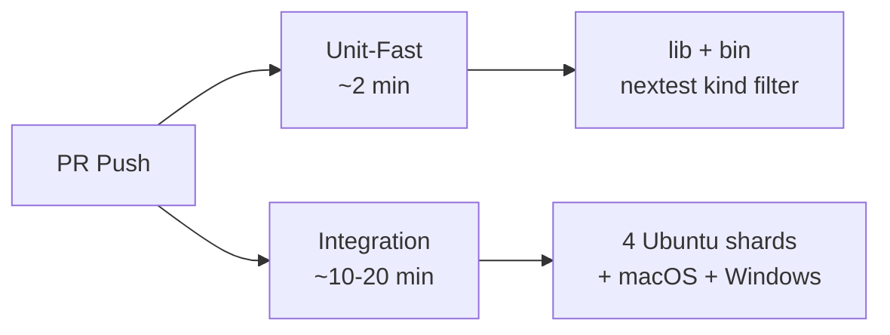

# Root — CLAUDE.md

# CLAUDE.md — Instrukcje dla agenta głównego

## Cel

`CLAUDE.md` to najwyższy poziomowy plik instrukcji określający sposób interakcji agentów AI — przede wszystkim Claude Code — z repozytorium LibreFang. Nie jest to kod aplikacji; to operacyjna karta zasad, która koduje haki bezpieczeństwa, ograniczenia kompilacji, obowiązki testowe, niezmienniki architektoniczne i zasady współpracy. Każda sesja agenta ma za zadanie przeczytać i stosować się do niej przed dotykaniem plików.

Plik jest wykorzystywany zarówno przez środowisko uruchomieniowe agenta (Claude Code ładuje go automatycznie), jak i przez ludzkich współtwórców, którzy muszą rozumieć te same ograniczenia. Jego autorytet jest egzekwowany na trzech warstwach: hakach Claude Code PreToolUse, hooksach git pod kontrolą wersji w `scripts/hooks/` oraz kontrolach CI.

---

## Bramka bezpieczeństwa przed edycją: Weryfikacja worktree

Najważniejsza zasada w pliku: **żadnych edycji w głównym worktree.** Przed każdym zadaniem modyfikującym pliki, agent musi uruchomić:

```bash
test -d "$(git rev-parse --show-toplevel)/.git" && echo main || echo linked
```

Rozróżnienie jest mechaniczne: główny worktree przechowuje `.git` jako katalog; połączone worktrees przechowują je jako plik tekstowy wskazujący na drzewo `.git/worktrees/` głównego worktree. Test niezawodnie różnicuje te kształty, w przeciwieństwie do `git rev-parse --git-dir` (którego wynik zależy od cwd) lub dopasowywania ścieżek do `pwd` (które różni się w zależności od klonu programisty).

Jeśli sprawdzenie zwraca `main`, agent musi utworzyć połączone worktree przed kontynuowaniem:

```bash
git worktree add /tmp/librefang-<feature> -b <feature-branch> origin/main
```

Hak obrony w głąb (`.claude/hooks/forbid-main-worktree.sh`) blokuje edycje w głównym drzewie, jeśli ta bramka zostanie pominięta.

---

## Architektura haków

Dwie warstwy haków zapewniają nakładające się mechanizmy egzekwowania. Zrozumienie obu jest konieczne podczas diagnozowania, dlaczego polecenie zostało zablokowane.

### Hak Claude Code PreToolUse (`.claude/hooks/`)

| Haki | Wyzwalacz | Cel |
|---|---|---|
| `forbid-main-worktree.sh` | PreToolUse (Edit/Write) | Blokuje wszystkie edycje i mutujące polecenia git celujące w główny worktree. |
| `guard-bash-safety.sh` | PreToolUse (Bash) | Blokuje force-push do main, flagi `--no-verify`/`--no-gpg-sign`, indeksowanie wrażliwych plików, szerokie `git add -A`/`.`, atrybucję AI w wiadomościach commit, niebezpieczne cele `rm -rf` i uruchamianie daemonów (`librefang start`) konkurujących na porcie 4545. |
| `session-start-worktree-check.sh` | SessionStart | Wyświetla baner wskazujący główny vs połączony worktree oraz czy `core.hooksPath` jest skonfigurowany. |

### Git Hooks (`scripts/hooks/`)

Te uruchamiają się wewnątrz gita, niezależnie od tego, które narzędzie wywołało operację:

- **`pre-commit`**: Uruchamia `cargo fmt --check` na indeksowanych plikach Rust, chroni przed duplikatem `[Unreleased]` w CHANGELOG, weryfikuje atrybucję `(@user)` we fragmentach `changelog.d/` i uruchamia `gitleaks protect --staged` (miękko ostrzega, jeśli gitleaks nie jest zainstalowany). Cel: poniżej 2 sekund.
- **`pre-push`**: Odrzuca bezpośrednie pushy do `main`/`master`. Kończy się w poniżej 100ms. Ciężka weryfikacja (clippy, dryf openapi) jest celowo odroczona do CI. Nadpisanie maintainera: `LIBREFANG_PREPUSH_SKIP=1`.
- **`commit-msg`**: Odrzuca wiadomości commit z atrybucją Claude/Anthropic (wyłapuje heredocs i `-F file`, których hak PreToolUse nie widzi). Odrzuca również commity, których tożsamość autora rozwiązuje się do Claude/Anthropic przez `git var GIT_AUTHOR_IDENT`.

Aktywacja wymaga jednorazowej konfiguracji na klonie:

```bash
just setup   # lub: cargo xtask setup
```

To ustawia `git config core.hooksPath scripts/hooks`.

---

## Ograniczenia kompilacji i weryfikacji

### Lokalne komendy

Plik egzekwuje ścisłe rozdzielenie między tym, co agent może uruchomić lokalnie, a tym, co CI obsługuje:

- **Zabronione**: `cargo build`, `cargo run` i nieograniczony `cargo test` (konkuruje z sesjami użytkownika na współdzielonym katalogu `target/`).
- **Dozwolone**: `cargo check --workspace --lib`, `cargo clippy --workspace --all-targets -- -D warnings` oraz ograniczony `cargo test -p <crate>`.

### Tor testowy CI

CI dzieli testy na dwa zadania, aby błędy jednostkowe pojawiały się szybko bez czekania na wolniejsze suite integracyjne:



- **Unit-fast** filtruje z `cargo nextest run --workspace -E 'kind(lib) | kind(bin)'` zamiast `--lib --bins`, ponieważ ten drugi błędnie działa na binarnych crate'ach takich jak `librefang-cli`.
- **Integration** uruchamia się partycjonowane na 4 runnerach Ubuntu przez `--partition hash:N/4`, plus pojedyncze zadania macOS i Windows.

Lokalne odpowiedniki:

```bash
# Szybki tor
cargo nextest run --workspace -E 'kind(lib) | kind(bin)' --no-fail-fast

# Pełna integracja
cargo nextest run --workspace --no-fail-fast
```

### Weryfikacja oparta na Dockerze

Gdy brak natywnego toolchain'a, sankcjonowany obraz dev (`Dockerfile.rust-dev`) zapewnia izolację. Kluczowe zasady dla tej ścieżki:

- Używaj **wolumenu target per worktree** (`librefang-target-<worktree-name>`), a nie współdzielonego — różne gałęzie psują sobie nawzajem incremental cache.
- Cache pobierania cargo (`librefang-cargo`) jest bezpieczny do współdzielenia.
- Prefiksuj komendy generujące linki z `mold -run` (obraz zawiera linker mold); `cargo check` nie ma etapu linkowania.
- Zakres jest nadal obowiązkowy (`-p <crate>`), a kontener jest tylko dla Linuksa — nie może odtworzyć błędów Windows/macOS.

---

## Wymagania testów integracyjnych

Każda zmiana trasy lub okablowania musi zawierać `#[tokio::test]` przeciwko `TestServer`. Wzorzec:

1. Uruchom prawdziwy router axum przez `start_test_server()`.
2. Uderz w endpoint za pomocą `reqwest`.
3. Zweryfikuj kod statusu i kształt odpowiedzi; dla endpointów zapisu, wykonaj odczyt, aby zweryfikować skutek uboczny.

Testy znajdują się w `crates/librefang-api/tests/` — lista katalogów jest kanonicznym wyliczeniem. Recenzenci warunkują PR na obecności testów integracyjnych dla nowych lub modyfikowanych endpointów.

Weryfikacja z live LLM (prawdziwy daemon, prawdziwe klucze dostawcy) jest wyłącznie dla ludzi. Agent przygotowuje komendy i ładunki; użytkownik wykonuje i wkleja wynik z powrotem.

---

## Niezmienniki architektoniczne

Plik dokumentuje kilka niezmienników, które łatwo jest przypadkowo naruszyć. To nie są sugestie — to nośne decyzje projektowe z testami regresji.

### Deterministyczne porządkowanie promptów

Wszystko, co trafia do prompta LLM — definicje narzędzi, podsumowania MCP, rejestry skilli/hands, listy możliwości, listy przekazywania env — musi być deterministycznie uporządkowane przed serializacją do stringa. Niedeterministyczne porządkowanie (np. iteracja `HashMap`) cicho unieważnia cache promptów dostawcy między procesami. Preferuj `BTreeMap`/`BTreeSet` dla tych typów.

### Rozwiązywanie trybu sesji

`session_mode` w `AgentManifest` kontroluje, czy wywołania ponownie wykorzystują trwałą sesję (`"persistent"`, domyślnie), czy tworzą nową (`"new"`). Kolejność rozwiązywania: nadpisanie per-trigger/per-job > domyślny manifest agenta. Wiadomości kanałowe i forki ignorują to ustawienie (pochodzą IDs sesji deterministycznie z kontekstu kanału lub forka).

Dla zadań cron specjalnie, helper `cron_fire_session_override` rozwiązuje tryb efektywny: `Persistent` współdzieli jedną sesję `(agent, "cron")` między wszystkimi odpaleniami; `New` daje każdemu odpaleniu odizolowany `SessionId::for_cron_run(agent, "<job_id>:<rfc3339>")`.

### Dyscyplina lokalizacji konfiguracji

Nadpisania per-agent dla `proactive_memory`, `skill_workshop` i `compaction` znajdują się w `agent.toml` (lub `HAND.toml`), **nie** w `config.toml`. `KernelConfig` nie ma pola `agents`, więc bloki takie jak `[agents.my-agent.proactive_memory]` w `config.toml` są parsowane, ale cicho ignorowane. Kernel emituje celowane `WARN` przy starcie dla źle umieszczonych nadpisań przez `detect_misplaced_per_agent_overrides`.

### Rejestracja tras

Nie ma `routes.rs`. Handlery tras znajdują się w `crates/librefang-api/src/routes/` jako moduły per-domena, każdy eksportujący `router()`. `server.rs::api_v1_routes()` komponuje je za pomocą `.merge()`. Autoryzacja jest aplikowana globalnie przez middleware — nieautoryzowane endpointy muszą być dodane do allowlisty `is_public` w `middleware.rs`, a nie reorganizowane w `server.rs`.

### Współbieżność dispatchera wyzwalaczy

Trzy warstwowe limity stosują się tylko do dispatchera wyzwalaczy: globalny semafor `Lane::Trigger`, semafor per-agent i muteks per-sesja (tylko gdy `session_mode = "new"`). Resolver ogranicza `persistent + cap > 1` do 1 z `WARN`, ponieważ współbieżne zapisy do historii pojedynczej sesji są niezdefiniowane. Limity per-agent **nie** są hot-reloadowane — zmiana `max_concurrent_invocations` wymaga zabicia agenta i pozwolenia mu na ponowne uruchomienie.

---

## Konwencje git

### Commity

Prefiksy conventional commits (`feat:`, `fix:`, `docs:`, `refactor:`, `chore:`, `ci:`, `perf:`, `test:`). Żadnej atrybucji AI/Claude/Anthropic w jakimkolwiek miejscu — egzekwowane zarówno przez hak PreToolUse Bash, jak i hook git `commit-msg`.

### Fragmenty changeloga

Wpisy changeloga to **nowe pliki w `changelog.d/`**, a nie edycje `CHANGELOG.md`. Pojedyncza sekcja `## [Unreleased]` tworzy konflikty scalania z każdym otwartym PR. Każdy fragment:

- Znajduje się w katalogu sekcji (`added/`, `fixed/`, `changed/`, `security/`, `documentation/`).
- Jest nazwany od numeru PR/issue: `changelog.d/fixed/6623-wire-max-content-chars.md`.
- Zawiera treść punktu bez wiodącego `- `, jedno zdanie na linię.
- Kończy się `(#PR) (@twój-github-login)`.
- Trafia do treści release na GitHubie dosłownie.

Fragmenty są składane do `CHANGELOG.md` przez `cargo xtask collect-fragments`.

### Kontynuacja worktree

Kontynuowanie niedokończonej pracy w istniejącym worktree oznacza **commit → push → otwórz lub zaktualizuj PR**. Wszystko pozostawione w worktree (w tym zregenerowany `Cargo.lock`) liczy się jako faktyczna praca i powinno zostać commitnięte, nie checkoutnięte.

Podczas ponownego tworzenia worktree dla istniejącej gałęzi zdalnej, zawsze wykonaj `git fetch` i porównaj z `origin/<branch>` przed edycją — zdalne tip może się przesunąć z powodu pushy współtwórców, auto-update crons lub commitów auto-codegen dryfu openapi.

---

## Reguła formatowania prozy

Brak limitu szerokości kolumn dla prozy w jakimkolwiek miejscu repozytorium. Podziały linii występują tylko na granicach zdań (po `.`, `?`, `!`). Dotyczy to:

- Dokumentacji markdown (`docs/`, README, `AGENTS.md`, `CLAUDE.md`)
- Punktów changeloga
- Tytułów, treści i komentarzy PR
- Doc-commentów w kodzie źródłowym (`//!`, `///`, JSDoc)
- Treści wiadomości commit (linie tytułowe nadal podążają za konwencją wyświetlania ~72 znaków gita)

Istniejące pliki napisane pod starą konwencją zawijania kolumn nie są retroaktywnie reformatowane.

---

## Granice współpracy

Plik koduje ścisłe zasady interakcji agentów AI z projektem open-source:

- **Nie zamykaj PR/issue otwartych przez innych**, chyba że wyraźnie poproszono. Zamiast tego dodaj komentarz rekomendujący zamknięcie z dowodami.
- **Force-push tylko na własne gałęzie i tylko przed recenzją.** Gdy recenzent załaduje diff, używaj commitów fixup.
- **Napraw, co znalazłeś — nie odkładaj.** Drobnostki recenzji, niedopasowane kody statusów, przestarzałe komentarze i niezgodności typów napotkane podczas pracy nad PR są z definicji w zakresie. Próg odroczenia: czy naprawienie wymagałoby dotknięcia innego crate'a lub domeny?
- **Budżet odpytywania CI: ~5 minut łącznie**, w porcjach 60-270 sekund (w ramach prompt cache TTL Anthropic). Po tym, push i stop.
- **Co najwyżej dwa komentarze następcze** w jakimkolwiek wątku bez ludzkiego wejścia.
- **Najnowsza intencja maintainera wygrywa** podczas rozwiązywania konfliktów. Zachowaj intencję obu stron; ujawnij prawdziwe nieporozumienia w treści PR.

---

## Odniesienie typowych pułapek

Skondensowane odniesienie trybów awarii udokumentowanych w pliku:

| Pułapka | Skutek |
|---|---|
| Windows: `librefang.exe` zablokowany przez uruchomiony daemon | Użyj `cargo check --lib` lub najpierw zabij daemon |
| Niedopasowanie typu `PeerRegistry` (`Option<PeerRegistry>` vs `Option<Arc<PeerRegistry>>`) | Owij z `.as_ref().map(\|r\| Arc::new(r.clone()))` |
| Brak nowych pól `KernelConfig` w impl `Default` | Kompilacja kończy się niepowodzeniem |
| `AgentLoopResult.response` vs `.response_text` | Pole to `.response` |
| Komenda startu daemon to `start`, nie `daemon` | Zła komenda nic nie robi |
| `Option<Arc<dyn Trait>>` na strukturach serde-deriving | Musi `#[serde(skip)]` i ręczna implementacja traitów |
| `ErrorTranslator` jest `!Send` | Każde `.await` musi wystąpić po `drop(t)` lub handler axum zawiedzie |
| `LIBREFANG_VAULT_KEY` musi być 32 bajty base64 | 32 znaki ASCII ≠ 32 bajty; użyj `openssl rand -base64 32` |
| `CLAUDE_CODE_HOME` jest prywatne dla LibreFang | CLI Anthropic sam nie czyta tej zmiennej env |
| Równolegli agenci dodający domyślne `Option::None` | Cicho się kompiluje, ale wyłącza funkcje; testuj w miejscu wstrzyknięcia |

---

## Jak ten plik odnosi się do bazy kodu

`CLAUDE.md` jest punktem wejścia w hierarchii plików instrukcji:

- **`AGENTS.md`** (wskazany dla "Współpracy agentów AI") zawiera szerszą filozofię współpracy.
- **`crates/librefang-api/dashboard/AGENTS.md`** zawiera zasady specyficzne dla dashboardu (warstwa danych, klucze zapytań, unieważnienie mutacji).
- **`changelog.d/README.md`** dokumentuje format fragmentu z przykładem roboczym.
- **`docs/architecture/`** przechowuje głębsze dokumenty projektowe, na które tu się powołujemy (trimming historii wiadomości, współbieżność dispatchera wyzwalaczy, warsztat skilli).
- **`docs/operations/config-reload.md`** to kanoniczna tabela klasyfikacji hot-reload pochodząca z `build_reload_plan`.

Gdy zasada w `CLAUDE.md` odwołuje się do konkretnej funkcji lub testu (np. `KernelConfig::detect_misplaced_per_agent_overrides`, `kernel::tests::mcp_summary_is_byte_identical_across_input_orders`), to odwołanie jest źródłem prawdy — proza pliku jest nawigacyjnym podsumowaniem, a nie zastępstwem dla kodu.
