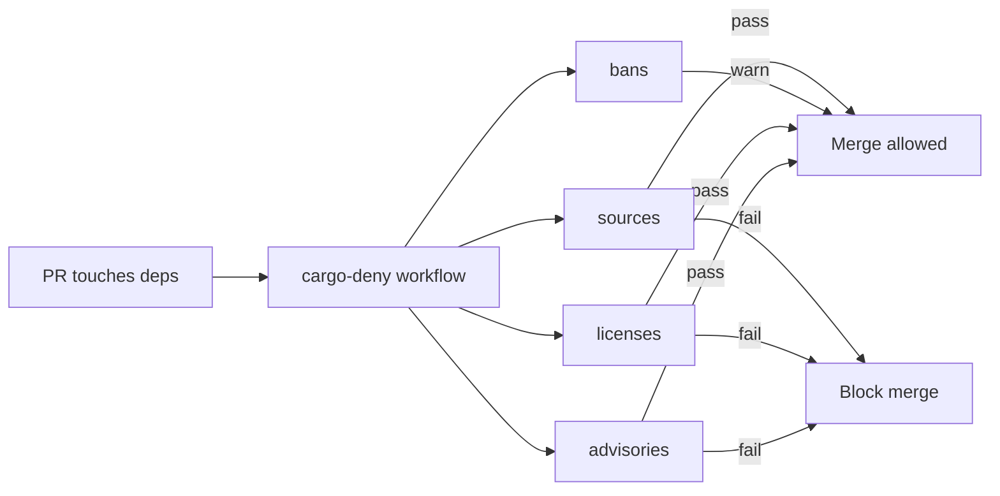

# Root — deny.toml

# `deny.toml` — Supply-Chain Audit Configuration

## Purpose

`deny.toml` configures [`cargo-deny`](https://github.com/EmbarkStudios/cargo-deny) to enforce supply-chain policy across the LibreFang workspace. It gates four categories of risk:

| Check | What it catches |
|-------|----------------|
| **advisories** | Known vulnerabilities, yanked crates (RustSec database) |
| **licenses** | Licenses outside the explicit allow-list |
| **bans** | Duplicate crate versions, wildcard requirements |
| **sources** | Crates sourced from registries or git repos other than crates.io |

The file is the single source of truth for dependency policy. Every `ignore`, `skip`, and license exception should trace back to a documented justification — see CONTRIBUTING.md (§ Dependency policy).

## Running the Checks

### Locally

```sh
cargo deny check advisories
cargo deny check bans licenses sources
```

### In CI

The GitHub Actions workflow at `.github/workflows/cargo-deny.yml` runs the same checks on every pull request and on pushes to `main` that touch `Cargo.toml`, `Cargo.lock`, `deny.toml`, or the workflow file itself.



## Graph & Target Resolution

The `[graph]` section lists the four platform triples the project ships to: Linux x86_64, macOS x86_64 and aarch64, and Windows x86_64. Cargo-deny resolves the full dependency graph for each target so that platform-specific crates (e.g. GTK bindings on Linux) are included in the audit rather than silently skipped.

`[output] feature-depth = 1` makes feature unification visible in diagnostic output, which helps diagnose duplicate-version warnings.

## Advisories

The RustSec advisory database is fetched from the canonical repository into `$CARGO_HOME/advisory-dbs`. Yanked crates are denied outright (`yanked = "deny"`).

The `ignore` list suppresses advisories that are currently unfixable. Each entry includes:

- **`id`** — the RustSec advisory identifier
- **`reason`** — a human-readable explanation linking the upstream advisory and noting why it cannot be resolved yet

Ignoring an advisory is scoped by ID, not by crate+version, so a fresh occurrence of the same advisory in a different dependency path will still fail the audit. The current ignores fall into three groups:

### gtk-rs GTK3 unmaintained family

RUSTSEC-2024-0411 through RUSTSEC-2024-0420 cover `gtk`, `gtk-sys`, `atk`, `atk-sys`, `gdk`, `gdk-sys`, `gdkx11`, `gdkx11-sys`, `gdkwayland-sys`, and `gdk-pixbuf`. These arrive transitively via `tauri-runtime-wry` on Linux. They cannot be upgraded until Tauri migrates to GTK4 — tracked upstream at [tauri-apps/tauri#9220](https://github.com/tauri-apps/tauri/issues/9220).

### Other unmaintained transitives

| Advisory | Crate | Context |
|----------|-------|---------|
| RUSTSEC-2023-0071 | `rsa` | Marvin attack; no upstream fix |
| RUSTSEC-2024-0370 | `proc-macro-error` | Unmaintained transitive |
| RUSTSEC-2025-0057 | `fxhash` | Unmaintained transitive |
| RUSTSEC-2025-0075 / 0080 / 0081 / 0098 / 0100 | `unic-*` | Unmaintained, via kuchikiki/selectors chain |
| RUSTSEC-2026-0192 | `ttf-parser` | Unmaintained, via `pdf-extract` → `lopdf`, no safe upgrade |

## Licenses

`confidence-threshold = 0.8` requires high-confidence SPDX detection. The `allow` list is intentionally restrictive: only permissive licenses compatible with the project's Apache-2.0 / MIT distribution model are accepted. Strong copyleft licenses (GPL, AGPL, LGPL) are deliberately excluded — adding one requires a maintainer-level decision documented in CONTRIBUTING.md.

The allow-list includes:

- **Standard permissive:** Apache-2.0, Apache-2.0 WITH LLVM-exception, MIT, BSD-2-Clause, BSD-3-Clause, 0BSD, ISC, Zlib
- **Unicode licenses:** Unicode-DFS-2016, Unicode-3.0
- **Weak copyleft (file-scoped):** MPL-2.0
- **Public domain equivalents:** CC0-1.0, Unlicense
- **Data license:** CDLA-Permissive-2.0 (used by `webpki-roots`)

The `Unlicense` entry exists specifically for `ksni`. `CDLA-Permissive-2.0` exists for `webpki-roots`.

### `ring` License Clarification

The `ring` crate ships a hand-rolled multi-license file rather than a single SPDX identifier. The `[[licenses.clarify]]` block overrides automatic detection with the correct expression (`MIT AND ISC AND OpenSSL`) and pins the LICENSE file hash (`0xbd0eed23`) so any change to the upstream file is flagged.

## Bans

### Duplicate versions

`multiple-versions = "warn"` — the workspace legitimately pulls different minor versions of shared crates (e.g. `tokio-util`, `hashbrown`). This setting surfaces duplicates in CI logs without failing unrelated PRs. The policy is to revisit the count during routine dependency review and promote to `"deny"` once the workspace is consolidated.

### Wildcard requirements

`wildcards = "warn"` with `allow-wildcard-paths = true` — wildcard version specs (`*`) are normally a mistake in published crates, but workspace-internal crates depend on each other via `path = "..."`. Cargo-deny still flags these because the internal crates declare `version = "..."` fields, making them appear "public" from the tool's perspective. The setting keeps them visible without breaking CI.

### Version skips

The `zip` crate is explicitly skipped (`skip`) because `tauri-plugin-updater` pulls in v4.x transitively while the project's own code uses v8.x. This duplicate is allowed until Tauri upstream catches up.

## Sources

All four registry/git policies are set to deny by default:

- `unknown-registry = "deny"`
- `unknown-git = "deny"`
- `allow-registry` — only crates.io (`https://github.com/rust-lang/crates.io-index`)
- `allow-git` — empty (no git dependencies)

If a git dependency becomes necessary, add its repository URL to `allow-git` with a comment linking to the upstream issue or PR explaining why a published crates.io version is not yet usable.

## Common Maintenance Tasks

### Ignoring a new advisory

When CI reports a new advisory that cannot be immediately fixed:

1. Read the advisory at the `rustsec.org` URL.
2. Confirm it is transitive and has no safe upgrade path.
3. Add an entry to the `ignore` array with the `id` and a `reason` that links the advisory URL and explains the resolution blocker.

```toml
{ id = "RUSTSEC-20XX-XXXX", reason = "crate-name issue; transitive via X. https://rustsec.org/advisories/RUSTSEC-20XX-XXXX" },
```

### Allowing a new license

1. Read the upstream LICENSE file manually.
2. Verify compatibility with Apache-2.0 / MIT distribution.
3. Add the SPDX identifier to the `allow` array.
4. If the decision is non-obvious, document it in CONTRIBUTING.md.

### Handling a duplicate-version conflict

If a new dependency introduces a duplicate that blocks CI, add the crate to the `skip` array:

```toml
{ name = "crate-name", version = "0.x.y" },
```

Leave a comment explaining which dependency pulls it in and when the skip can be removed.