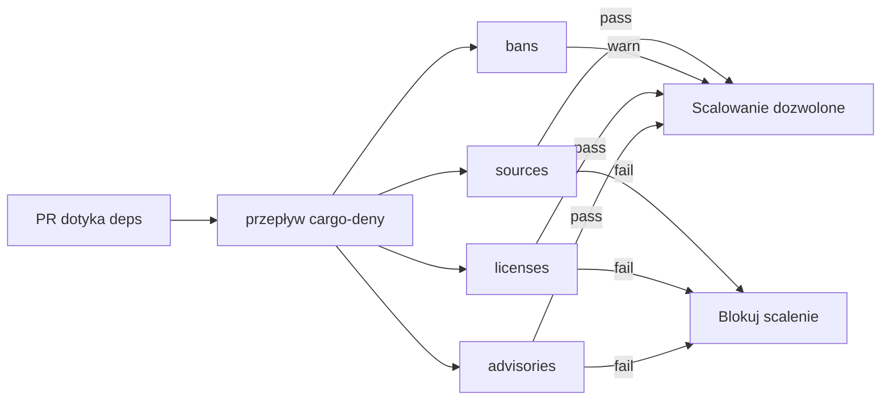

# Root — deny.toml

# `deny.toml` — Konfiguracja audytu łańcucha dostaw

## Cel

`deny.toml` konfiguruje [`cargo-deny`](https://github.com/EmbarkStudios/cargo-deny) w celu egzekwowania polityki łańcucha dostaw w obszarze roboczym LibreFang. Bramkuje cztery kategorie ryzyka:

| Kontrola | Co wykrywa |
|----------|------------|
| **advisories** | Znane podatności, wycofane crate'y (baza RustSec) |
| **licenses** | Licencje spoza jawnegoallow-listy |
| **bans** | Duplikaty wersji crate'ów, wymagania z symbolami wieloznacznymi |
| **sources** | Crate'y pochodzące z rejestrów lub repozytoriów git innych niż crates.io |

Plik jest jedynym źródłem prawdy dla polityki zależności. Każdy `ignore`, `skip` i wyjątek licencyjny powinien odnosić się do udokumentowanego uzasadnienia — patrz CONTRIBUTING.md (§ Polityka zależności).

## Uruchamianie kontroli

### Lokalnie

```sh
cargo deny check advisories
cargo deny check bans licenses sources
```

### W CI

Przepływ pracy GitHub Actions w `.github/workflows/cargo-deny.yml` uruchamia te same kontrole przy każdym pull requeście i przy pushach do `main`, które dotykają `Cargo.toml`, `Cargo.lock`, `deny.toml` lub samego pliku przepływu pracy.



## Graf i rozdzielczość targetów

Sekcja `[graph]` zawiera cztery trójki platform docelowych projektu: Linux x86_64, macOS x86_64 i aarch64 oraz Windows x86_64. Cargo-deny rozwiązuje pełny graf zależności dla każdego targetu, aby crate'y specyficzne dla platformy (np. powiązania GTK na Linuksie) były uwzględniane w audycie, a nie po cichu pomijane.

`[output] feature-depth = 1` sprawia, że unifikacja cech (features) jest widoczna w diagnostyce, co pomaga diagnozować ostrzeżenia o duplikatach wersji.

## Advisory

Baza danych RustSec advisory jest pobierana z kanonicznego repozytorium do `$CARGO_HOME/advisory-dbs`. Wycofane crate'y są odrzucane bezwarunkowo (`yanked = "deny"`).

Lista `ignore` tłumi advisory, których obecnie nie da się usunąć. Każdy wpis zawiera:

- **`id`** — identyfikator RustSec advisory
- **`reason`** — czytelny dla człowieka opis odsyłający do advisory nadrzędnego z adnotacją, dlaczego nie można go jeszcze rozwiązać

Ignorowanie advisory jest ograniczone do identyfikatora, nie do crate+version, więc nowe wystąpienie tego samego advisory na innej ścieżce zależności nadal spowoduje niepowodzenie audytu. Obecne ignorowania dzielą się na trzy grupy:

### Rodzina gtk-rs GTK3 — nieutrzymywana

RUSTSEC-2024-0411 do RUSTSEC-2024-0420 obejmuje `gtk`, `gtk-sys`, `atk`, `atk-sys`, `gdk`, `gdk-sys`, `gdkx11`, `gdkx11-sys`, `gdkwayland-sys` i `gdk-pixbuf`. Pojawiają się tranzytywnie przez `tauri-runtime-wry` na Linuksie. Nie można ich zaktualizować, dopóki Tauri nie przeprowadzi migracji do GTK4 — śledzone nadrzędnie w [tauri-apps/tauri#9220](https://github.com/tauri-apps/tauri/issues/9220).

### Inne nieutrzymywane tranzytywy

| Advisory | Crate | Kontekst |
|----------|-------|----------|
| RUSTSEC-2023-0071 | `rsa` | Atak Marvin; brak poprawki nadrzędnej |
| RUSTSEC-2024-0370 | `proc-macro-error` | Nieutrzymywana zależność tranzytywna |
| RUSTSEC-2025-0057 | `fxhash` | Nieutrzymywana zależność tranzytywna |
| RUSTSEC-2025-0075 / 0080 / 0081 / 0098 / 0100 | `unic-*` | Nieutrzymywane, przez łańcuch kuchikiki/selectors |
| RUSTSEC-2026-0192 | `ttf-parser` | Nieutrzymywane, przez `pdf-extract` → `lopdf`, brak bezpiecznej aktualizacji |

## Licencje

`confidence-threshold = 0.8` wymaga wykrywania SPDX z wysokim poziomem pewności. Lista `allow` jest celowo restrykcyjna: dopuszczalne są tylko licencje permisywne kompatybilne z modelem dystrybucji Apache-2.0 / MIT projektu. Silne licencje copyleft (GPL, AGPL, LGPL) są celowo wykluczone — dodanie którejkolwiek wymaga decyzji na poziomie maintainera udokumentowanej w CONTRIBUTING.md.

Allow-lista obejmuje:

- **Standardowe permisywne:** Apache-2.0, Apache-2.0 WITH LLVM-exception, MIT, BSD-2-Clause, BSD-3-Clause, 0BSD, ISC, Zlib
- **Licencje Unicode:** Unicode-DFS-2016, Unicode-3.0
- **Słaby copyleft (zakres pliku):** MPL-2.0
- **Równoważniki domeny publicznej:** CC0-1.0, Unlicense
- **Licencja danych:** CDLA-Permissive-2.0 (używana przez `webpki-roots`)

Wpis `Unlicense` istnieje konkretnie dla `ksni`. `CDLA-Permissive-2.0` istnieje dla `webpki-roots`.

### Uściślenie licencji `ring`

Crate `ring` dostarcza ręcznie napisany plik wielolicencyjny zamiast pojedynczego identyfikatora SPDX. Blok `[[licenses.clarify]]` nadpisuje automatyczne wykrywanie poprawnym wyrażeniem (`MIT AND ISC AND OpenSSL`) i przypina hash pliku LICENSE (`0xbd0eed23`), aby każda zmiana w pliku nadrzędnym była sygnalizowana.

## Bany

### Duplikaty wersji

`multiple-versions = "warn"` — obszar roboczy legalnie pobiera różne wersje pomocnicze współdzielonych crate'ów (np. `tokio-util`, `hashbrown`). To ustawienie uwidacznia duplikaty w logach CI bez blokowania niezwiązanych PR-ów. Polityka zakłada ponowne przeliczenie liczby podczas rutynowego przeglądu zależności i promowanie do `"deny"` po konsolidacji obszaru roboczego.

### Wymagania z symbolami wieloznacznymi

`wildcards = "warn"` z `allow-wildcard-paths = true` — specyfikacje wersji ze symbolami wieloznacznymi (`*`) są zwykle błędem w opublikowanych crate'ach, ale wewnętrzne crate'y obszaru roboczego zależą od siebie nawzajem przez `path = "..."`. Cargo-deny nadal je flaguje, ponieważ wewnętrzne crate'y deklarują pola `version = "..."`, co sprawia, że z perspektywy narzędzia wyglądają na „publiczne". Ustawienie utrzymuje je widoczne bez przerywania CI.

### Pominięcia wersji

Crate `zip` jest jawnie pominięty (`skip`), ponieważ `tauri-plugin-updater` tranzytywnie pobiera v4.x, podczas gdy własny kod projektu używa v8.x. Ten duplikat jest dozwolony, dopóki nadrzędny Tauri nie nadrobi zaległości.

## Źródła

Wszystkie cztery polityki rejestru/git są domyślnie ustawione na odrzucenie:

- `unknown-registry = "deny"`
- `unknown-git = "deny"`
- `allow-registry` — tylko crates.io (`https://github.com/rust-lang/crates.io-index`)
- `allow-git` — puste (brak zależności git)

Jeśli zależność git stanie się konieczna, dodaj jej URL repozytorium do `allow-git` z komentarzem odsyłającym do nadrzędnego issue lub PR tłumaczącego, dlaczego opublikowana wersja crates.io nie jest jeszcze użyteczna.

## Częste zadania konserwacyjne

### Ignorowanie nowego advisory

Gdy CI zgłosi nowe advisory, którego nie da się natychmiast usunąć:

1. Przeczytaj advisory pod adresem URL `rustsec.org`.
2. Potwierdź, że jest tranzytywne i nie ma bezpiecznej ścieżki aktualizacji.
3. Dodaj wpis do tablicy `ignore` z `id` oraz `reason`, który odsyła do URL advisory i tłumaczy blokadę rozwiązania.

```toml
{ id = "RUSTSEC-20XX-XXXX", reason = "crate-name issue; tranzytywne przez X. https://rustsec.org/advisories/RUSTSEC-20XX-XXXX" },
```

### Zezwalanie na nową licencję

1. Ręcznie przeczytaj plik LICENSE nadrzędnej biblioteki.
2. Zweryfikuj kompatybilność z dystrybucją Apache-2.0 / MIT.
3. Dodaj identyfikator SPDX do tablicy `allow`.
4. Jeśli decyzja nie jest oczywista, udokumentuj ją w CONTRIBUTING.md.

### Obsługa konfliktu duplikatu wersji

Jeśli nowa zależność wprowadzi duplikat blokujący CI, dodaj crate do tablicy `skip`:

```toml
{ name = "crate-name", version = "0.x.y" },
```

Zostaw komentarz tłumaczący, która zależność ją wprowadza i kiedy można usunąć pominięcie.
