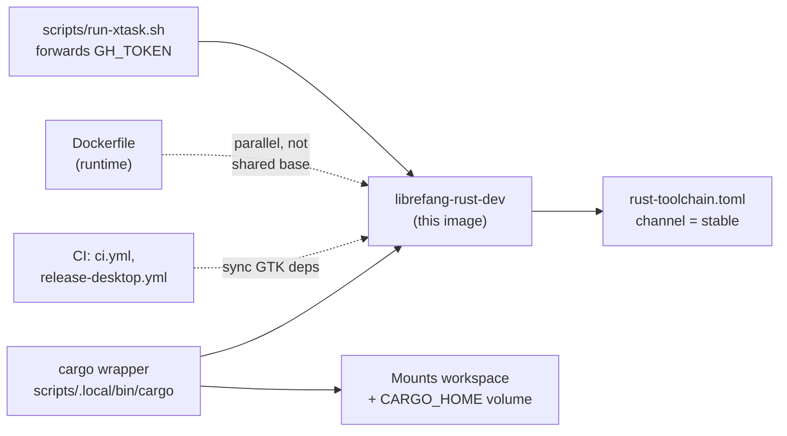

# Root — Dockerfile.rust-dev

# Dockerfile.rust-dev — Developer Rust Toolchain Image

## Purpose

`Dockerfile.rust-dev` builds the `librefang-rust-dev` image: a full Rust development environment for contributors who don't have a native Rust toolchain on their host (e.g. macOS users running `cargo` through Docker). It is invoked by the `cargo` wrapper script at `scripts/.local/bin/cargo`.

This image is **distinct** from the top-level `Dockerfile`, which produces the slim runtime release image. The two differ in important ways:

| Aspect | `Dockerfile.rust-dev` (this file) | `Dockerfile` (runtime) |
|---|---|---|
| Use case | Local development, `cargo check` / `build` / `test` / `xtask` | Production runtime |
| Base image | `rust:1-trixie` (glibc 2.39) | `rust:1.94-slim-bookworm` (glibc 2.36) |
| GTK / WebKit dev libs | **Included** | Stripped out |
| Source tree | Mounted at runtime via volumes | Not present |
| `gh` CLI | **Included** | Not present |
| Toolchain resolution | `rustup` downloads current stable on first run via `rust-toolchain.toml` | Pinned at build time |

## Build & Run

```bash
docker build -t librefang-rust-dev:latest -f Dockerfile.rust-dev .
```

Usage matches the wrapper script:

```bash
LIBREFANG_MOUNT_BASE=/path/to/workspace-parent \
LIBREFANG_RUST_IMAGE=librefang-rust-dev:latest \
    cargo check --workspace --lib
```

The wrapper mounts the workspace and sets `CARGO_HOME` to `/usr/local/cargo` via named volumes. The Dockerfile does not pre-create these directories — they are established by the wrapper at container start.

## Why Trixie (Not Bookworm)

`rust-toolchain.toml` pins `channel = "stable"`, meaning rustup downloads the current stable release on first container start. rust-lang.org publishes `aarch64-unknown-linux-gnu` stable artifacts compiled against glibc 2.39 (trixie). Running them inside a bookworm container (glibc 2.36) crashes every build script:

```
/lib/.../libc.so.6: version `GLIBC_2.39' not found
```

The runtime Dockerfile avoids this by using `rust:1.94-slim-bookworm` — it links a specific toolchain at image build time and never invokes rustup later. The dev image takes the opposite approach: track trixie so the image stays compatible with future stable rustup rolls without rebuilding.

## System Dependencies

Installed in three `RUN` layers, each serving a different invalidation profile.

### Layer 1 — Core Build & Tauri Dependencies

| Package | Purpose |
|---|---|
| `build-essential` | Core compilation toolchain |
| `pkg-config` | Required by native build scripts |
| `libssl-dev` | TLS for the daemon |
| `libdbus-1-dev` | Dragged in by `keyring`'s `sync-secret-service` feature (see #3180, #3259) |
| `libsecret-1-dev` | Secret storage backend |
| `perl` | Build-time scripting dependency |
| `ca-certificates` | TLS certificate store |
| `libwebkit2gtk-4.1-dev` | Tauri 2's `wry` webview backend on Linux |
| `libgtk-3-dev` | `gdk-sys` / `gtk-sys` for Tauri |
| `librsvg2-dev` | SVG icon rasterization in Tauri |
| `patchelf` | Tauri bundler post-processing step |
| `mold` | Fast linker (see below) |

#### Why GTK/WebKit libs are needed at check time

`cargo check --workspace --lib` descends into `librefang-desktop`, which depends on `tauri = "2"`. On Linux, Tauri 2 unconditionally pulls in `wry → webkit2gtk-sys` and `gdk-sys` / `gtk-sys`. Their build scripts execute `pkg-config gdk-3.0` and `webkit2gtk-4.1` during the check phase — not just at link time. Without the dev libraries, the workspace check fails:

```
system library `gdk-3.0` was not found
```

#### Why `mold`

The dev wrapper invokes `mold -run cargo …`, which intercepts the child `ld` invocation without modifying `RUSTFLAGS`. This means cached `target/` artifacts remain valid. `mold` has no effect on `cargo check` (no link step occurs), but it accelerates the link phase of `cargo build` and `cargo test` — the per-iteration cost that even cached incremental builds pay on every change.

### Layer 2 — GitHub CLI

`gh` is required by several `cargo xtask` commands:

- `cargo xtask release` — hard-fails at `xtask/src/changelog.rs:421` with `"gh CLI required"` if absent
- `cargo xtask changelog`
- `release.rs` (version-bump PR creation)
- `cargo xtask contributors` (GitHub-API-backed contributor list)

It is installed from GitHub's official apt repository so the version tracks upstream stable rather than the Debian archive's potentially older package. The release wrapper at `scripts/run-xtask.sh` forwards `GH_TOKEN` from the host, so `gh` authenticates without running `gh auth login` inside the container.

`curl` and `gnupg` are bootstrap-only dependencies in this layer (used for the apt-key fetch). They live in the same `RUN` block that consumes them so that changes to the Layer 1 package list don't invalidate the `gh` installation layer.

## Connection to the Rest of the Codebase



Key relationships to keep in sync:

- **CI parity**: The package list in Layer 1 mirrors what `.github/workflows/ci.yml` and `.github/workflows/release-desktop.yml` install for the Linux Tauri build. If CI's GTK package list grows, this image must be updated to match.
- **`rust-toolchain.toml`**: Dictates that rustup fetches current stable — the reason for the trixie base.
- **Runtime Dockerfile**: Separate base image and toolchain strategy (see comparison table above). Changes to one do not imply changes to the other.
- **`scripts/run-xtask.sh`**: Forwards `GH_TOKEN` from the host (extracted from macOS Keychain when needed) so the in-container `gh` authenticates transparently.