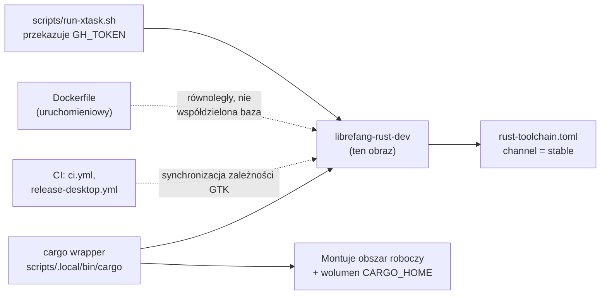

# Root — Dockerfile.rust-dev

# Dockerfile.rust-dev — Obraz narzędzi deweloperskich Rust

## Cel

`Dockerfile.rust-dev` buduje obraz `librefang-rust-dev`: pełne środowisko deweloperskie Rust dla współtwórców, którzy nie mają natywnego łańcucha narzędzi Rust na swoim hoście (np. użytkownicy macOS uruchamiający `cargo` przez Docker). Jest wywoływany przez skrypt wrapper `cargo` w `scripts/.local/bin/cargo`.

Ten obraz jest **odrębny** od głównego `Dockerfile`, który produkuje złożony obraz uruchomieniowy do wydania. Różnią się one w ważnych aspektach:

| Aspekt | `Dockerfile.rust-dev` (ten plik) | `Dockerfile` (uruchomieniowy) |
|---|---|---|
| Przypadek użycia | Lokalny rozwój, `cargo check` / `build` / `test` / `xtask` | Uruchomienie produkcyjne |
| Obraz bazowy | `rust:1-trixie` (glibc 2.39) | `rust:1.94-slim-bookworm` (glibc 2.36) |
| Biblioteki deweloperskie GTK / WebKit | **Dołączone** | Usunięte |
| Drzewo źródłowe | Zamontowane w czasie uruchomienia przez wolumeny | Nieobecne |
| CLI `gh` | **Dołączone** | Nieobecne |
| Rozwiązywanie łańcucha narzędzi | `rustup` pobiera aktualną wersję stabilną przy pierwszym uruchomieniu przez `rust-toolchain.toml` | Przypięte w czasie budowy |

## Budowa i uruchomienie

```bash
docker build -t librefang-rust-dev:latest -f Dockerfile.rust-dev .
```

Użycie odpowiada skryptowi wrapper:

```bash
LIBREFANG_MOUNT_BASE=/path/to/workspace-parent \
LIBREFANG_RUST_IMAGE=librefang-rust-dev:latest \
    cargo check --workspace --lib
```

Wrapper montuje obszar roboczy i ustawia `CARGO_HOME` na `/usr/local/cargo` przez nazwane wolumeny. Dockerfile nie tworzy z góry tych katalogów — są one tworzone przez wrapper przy starcie kontenera.

## Dlaczego Trixie (a nie Bookworm)

`rust-toolchain.toml` przypina `channel = "stable"`, co oznacza, że rustup pobiera aktualne wydanie stabilne przy pierwszym starcie kontenera. rust-lang.org publikuje artefakty stabilne `aarch64-unknown-linux-gnu` skompilowane względem glibc 2.39 (trixie). Uruchomienie ich wewnątrz kontenera bookworm (glibc 2.36) powoduje awarię każdego skryptu budowania:

```
/lib/.../libc.so.6: version `GLIBC_2.39' not found
```

Uruchomieniowy Dockerfile unika tego, używając `rust:1.94-slim-bookworm` — łączy konkretny łańcuch narzędzi w czasie budowy obrazu i nigdy później nie wywołuje rustup. Obraz deweloperski podchodzi do tego odwrotnie: śledzi trixie, aby obraz pozostał kompatybilny z przyszłymi stabilnymi aktualizacjami rustup bez konieczności przebudowy.

## Zależności systemowe

Zainstalowane w trzech warstwach `RUN`, z których każda służy innemu profilowi unieważniania.

### Warstwa 1 — Podstawowe zależności budowania i Tauri

| Pakiet | Cel |
|---|---|
| `build-essential` | Podstawowy łańcuch narzędzi kompilacji |
| `pkg-config` | Wymagany przez natywne skrypty budowania |
| `libssl-dev` | TLS dla demona |
| `libdbus-1-dev` | Wciągnięty przez funkcję `sync-secret-service` z `keyring` (patrz #3180, #3259) |
| `libsecret-1-dev` | Backend magazynu sekretów |
| `perl` | Zależność skryptowania w czasie budowania |
| `ca-certificates` | Magazyn certyfikatów TLS |
| `libwebkit2gtk-4.1-dev` | Backend webview `wry` w Tauri 2 na Linuksie |
| `libgtk-3-dev` | `gdk-sys` / `gtk-sys` dla Tauri |
| `librsvg2-dev` | Rasteryzacja ikon SVG w Tauri |
| `patchelf` | Krok postprocessingu bundlera Tauri |
| `mold` | Szybki linker (patrz niżej) |

#### Dlaczego biblioteki GTK/WebKit są potrzebne w czasie check

`cargo check --workspace --lib` schodzi do `librefang-desktop`, który zależy od `tauri = "2"`. Na Linuksie Tauri 2 bezwarunkowo ciągnie `wry → webkit2gtk-sys` oraz `gdk-sys` / `gtk-sys`. Ich skrypty budowania wykonują `pkg-config gdk-3.0` i `webkit2gtk-4.1` w fazie check — nie tylko w czasie linkowania. Bez bibliotek deweloperskich sprawdzenie obszaru roboczego kończy się niepowodzeniem:

```
system library `gdk-3.0` was not found
```

#### Dlaczego `mold`

Wrapper deweloperski wywołuje `mold -run cargo …`, co przechwytuje podrzędne wywołanie `ld` bez modyfikowania `RUSTFLAGS`. Dzięki temu buforowane artefakty `target/` pozostają ważne. `mold` nie ma wpływu na `cargo check` (nie następuje krok linkowania), ale przyspiesza fazę linkowania `cargo build` i `cargo test` — koszt każdej iteracji, który nawet buforowane budowanie przyrostowe ponosi przy każdej zmianie.

### Warstwa 2 — GitHub CLI

`gh` jest wymagany przez kilka poleceń `cargo xtask`:

- `cargo xtask release` — twardo kończy się niepowodzeniem w `xtask/src/changelog.rs:421` z komunikatem `"gh CLI required"`, jeśli jest nieobecny
- `cargo xtask changelog`
- `release.rs` (tworzenie PR z podwyższeniem wersji)
- `cargo xtask contributors` (lista współtwórców oparta na GitHub-API)

Jest instalowany z oficjalnego repozytorium apt GitHuba, aby wersja śledziła nadrzędną stabilną zamiast potencjalnie starszego pakietu z archiwum Debiana. Wrapper wydania w `scripts/run-xtask.sh` przekazuje `GH_TOKEN` z hosta, więc `gh` uwierzytelnia się bez konieczności uruchamiania `gh auth login` wewnątrz kontenera.

`curl` i `gnupg` to zależności wyłącznie startowe w tej warstwie (używane do pobrania apt-key). Mieszkają w tym samym bloku `RUN`, który je zużywa, aby zmiany na liście pakietów warstwy 1 nie unieważniały warstwy instalacji `gh`.

## Powiązanie z resztą bazy kodu



Kluczowe relacje do utrzymania w synchronizacji:

- **Równoważność CI**: Lista pakietów w warstwie 1 odzwierciedla to, co `.github/workflows/ci.yml` i `.github/workflows/release-desktop.yml` instalują dla budowania Tauri na Linuksie. Jeśli lista pakietów GTK w CI wzrośnie, ten obraz musi zostać zaktualizowany w celu dopasowania.
- **`rust-toolchain.toml`**: Dyktuje, że rustup pobiera aktualną wersję stabilną — powód wyboru bazy trixie.
- **Uruchomieniowy Dockerfile**: Oddzielny obraz bazowy i strategia łańcucha narzędzi (patrz tabela porównawcza wyżej). Zmiany w jednym nie pociągają za sobą zmian w drugim.
- **`scripts/run-xtask.sh`**: Przekazuje `GH_TOKEN` z hosta (pobrany z macOS Keychain w razie potrzeby), aby in-containerowe `gh` uwierzytelniało się w sposób przezroczysty.
