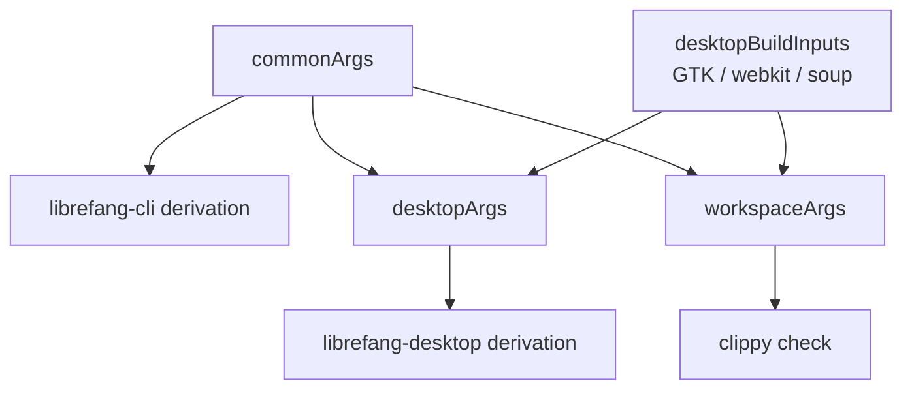
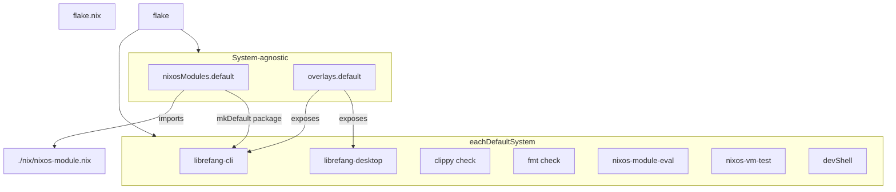

# Root — flake.nix

# flake.nix — LibreFang Nix Flake

## Purpose

The root `flake.nix` is the entry point for all Nix-based building, testing, and deployment of LibreFang. It defines:

- **Two main package derivations** — the CLI/daemon (`librefang-cli`) and the Tauri-based desktop UI (`librefang-desktop`) — built via [crane](https://github.com/ipetkov/crane) against a pinned Rust toolchain.
- **Checks** — clippy, formatting, eval-time NixOS module assertions, and a NixOS VM test.
- **A NixOS module** (`nixosModules.default`) that wires LibreFang into `services.librefang` on a host.
- **An overlay** and **a dev shell** for local development.

The flake is structured as a thin per-system layer wrapped around a small set of system-agnostic outputs, reflecting the split between things that produce a binary (system-specific) and things that describe configuration (system-agnostic).

## Inputs

| Input | Purpose |
|---|---|
| `nixpkgs` | Pinned to `nixpkgs-unstable` for the package set used across all derivations. |
| `crane` | The Rust build library. Provides `buildPackage`, `buildDepsOnly`, `cargoClippy`, `cargoFmt`, `devShell`, and the `fileset.commonCargoSources` helper. |
| `flake-utils` | `eachDefaultSystem` — drives the per-system loop. |
| `rust-overlay` | Oxalica's overlay, used to source a specific stable Rust toolchain with `rust-src`, `rust-analyzer`, and `clippy` extensions. Follows `nixpkgs` to avoid a second nixpkgs instantiation. |

## Per-System Outputs

Everything inside `flake-utils.lib.eachDefaultSystem` is evaluated once per target system.

### Toolchain and Library Setup

```nix
rustToolchain = pkgs.rust-bin.stable.latest.default.override {
  extensions = [ "rust-src" "rust-analyzer" "clippy" ];
};
craneLib = (crane.mkLib pkgs).overrideToolchain rustToolchain;
```

`crane.mkLib` produces a crane library scoped to this nixpkgs instance, and `.overrideToolchain` pins the exact Rust version used for every crane-driven build. This indirection is important: it guarantees the CLI, desktop, clippy, and devShell all compile with the same compiler.

### Native and Runtime Dependencies

The flake deliberately separates three dependency tiers:



- **`nativeBuildInputs`** — `pkg-config`, the Rust toolchain, `perl`. Present in every build.
- **`buildInputs`** — `openssl`, `dbus`, plus macOS-only `apple-sdk` and `libiconv`. Also universal.
- **`desktopBuildInputs`** — Linux-only GTK/webview stack (`glib`, `gtk3`, `libsoup_3`, `webkitgtk_4_1`, `atkmm`, `cairo`, `gdk-pixbuf`, `pango`). This set is empty on Darwin.

This split is the fix for issue **#2937**: compiling the CLI on stock NixOS previously dragged in the entire GTK link chain through workspace-level dependency resolution. By scoping `cliArgs` to `--package librefang-cli` and keeping `desktopBuildInputs` out of `commonArgs`, the CLI build stays self-contained.

### Source Filtering

The `src` attribute uses `pkgs.lib.fileset` to include only the files Crane needs, plus non-Rust assets embedded at compile time:

- `craneLib.fileset.commonCargoSources` — Cargo manifests, lockfile, Rust sources.
- Locale directories, static HTML, Tauri config, icons, capabilities.
- `openrouter-models.snapshot.json` — embedded via `include_str!` in `librefang-runtime` as the offline model catalog fallback.
- `sdk/python/librefang` — embedded via `include_dir!` in `librefang-channels`.
- Deployment configs under `deploy/` and `packages/whatsapp-gateway`.

This keeps the Nix store path minimal, improving cache hit rates and rebuild speed.

### CLI Derivation

```nix
cliArgs = commonArgs // {
  pname = "librefang-cli";
  cargoExtraArgs = "--package librefang-cli";
};
cliCargoArtifacts = craneLib.buildDepsOnly cliArgs;
librefang-cli = craneLib.buildPackage (cliArgs // {
  cargoArtifacts = cliCargoArtifacts;
  doCheck = false;
});
```

The deps-only artifact set is built once and reused as the `cargoArtifacts` input to the final package build. This is the standard Crane caching pattern: dependency compilation is cached independently of application code changes.

Tests are disabled (`doCheck = false`) because they require network and runtime setup not available in the Nix build sandbox.

The package's `meta` sets `mainProgram = "librefang"`, `platforms = platforms.unix`, and an MIT license.

### Desktop Derivation

The desktop build extends `desktopArgs` with:

- `desktopBuildInputs` on Linux (GTK/webview).
- `copyDesktopItems` and `wrapGAppsHook3` as additional native build inputs on Linux.
- A `.desktop` entry generated via `pkgs.makeDesktopItem` with `startupWMClass = "librefang-desktop"` (matching the GTK app id Tauri reports).
- A `postInstall` hook that installs hicolor icons at 32×32, 128×128, 256×256 (from `128x128@2x.png`), and 512×512.

The `wrapGAppsHook3` hook is critical: it injects the GTK runtime environment variables (`XDG_DATA_DIRS`, `GIO_MODULE_DIR`, `GSETTINGS_SCHEMA_DIR`) that the webview process needs at launch time. Without it, the Tauri app starts but the webview fails to render.

Platform support: `platforms.linux ++ platforms.darwin`. The macOS build path skips all the GTK hooks and icon installs via `optionalString` / `optionals` guards.

### Checks

```nix
checks = {
  inherit librefang-cli;
  librefang-clippy = craneLib.cargoClippy (workspaceArgs // { ... });
  librefang-fmt = craneLib.cargoFmt { ... };
}
// optionalAttrs isLinux { inherit librefang-desktop; }
// optionalAttrs (x86_64-linux || aarch64-linux) {
  nixos-module-eval = nixosModuleEval;
  nixos-vm-test = nixosVmTest;
};
```

Four categories:

1. **`librefang-cli`** — the CLI derivation itself acts as a build check.
2. **`librefang-desktop`** — the desktop derivation, gated to Linux. Including it in `checks` (not just `packages`) means a regression in the packaging logic fails `nix flake check`, not just the CI matrix.
3. **`librefang-clippy`** — runs `cargo clippy --workspace --all-targets -- -D warnings`. Uses `workspaceArgs` (which includes `desktopBuildInputs`) because clippy compiles the desktop crate too.
4. **`librefang-fmt`** — `cargo fmt` check against the filtered `src`.

### NixOS Module Eval

`nixosModuleEval` is an evaluation-time check. It:

1. Calls `nixpkgs.lib.nixosSystem` with `self.nixosModules.default` and a minimal container config enabling `services.librefang`.
2. Reads the resulting `systemd.services.librefang` and runs a list of **12 assertions** against it — verifying `ExecStart`, `Type`, environment variables (`LIBREFANG_HOME`, `LIBREFANG_LISTEN`, `RUST_LOG`), `StateDirectory`, `EnvironmentFile`, address family restrictions, hardening flags, `git` on PATH, and the `librefang` system user.
3. Throws an assertion error listing any failed expectations.

The derivation deliberately holds **no reference** to the rendered unit text. The rendered unit embeds `${librefang-cli}/bin/librefang`, so depending on it would force the full workspace compile (80–95 minutes cold). By keeping the check at the evaluation layer, `nix flake check --no-build` catches regressions in ~43 seconds.

### NixOS VM Test

`nixosVmTest` uses `pkgs.testers.runNixOSTest` to boot a real NixOS guest with `services.librefang.enable = true` and verifies the daemon actually starts and serves:

```python
machine.wait_for_unit("librefang.service")
machine.wait_for_open_port(4545)
machine.succeed("curl -sf http://127.0.0.1:4545/api/health")
machine.succeed("test -d /var/lib/librefang")
```

This is the only check that proves the process survives being started by systemd — something `nixosModuleEval` cannot do. It is expensive (compiles the CLI + boots a VM) and is intentionally **not** built by CI. The PR lane runs `nix flake check --no-build`, which evaluates the test without compiling it. Running it for real requires a Linux host with KVM:

```
nix build .#checks.x86_64-linux.nixos-vm-test -L
```

The guest config sets `LIBREFANG_REGISTRY_OFFLINE = "1"` because the VM has no outbound network, and bumps `virtualisation.memorySize` to 2048 MB (the Rust kernel + axum server OOMs at the 1024 MB default).

### Packages, Apps, and Dev Shell

| Output | Value |
|---|---|
| `packages.default` | `librefang-cli` |
| `packages.librefang-cli` | CLI/daemon derivation |
| `packages.librefang-desktop` | Desktop derivation |
| `apps.default` | `mkApp` wrapper around `librefang-cli`, with propagated `meta` |
| `devShells.default` | Crane dev shell including all checks, dev tools (`cargo-watch`, `cargo-edit`, `cargo-expand`, `just`, `gh`, `nodejs`, `python3`), and `desktopBuildInputs` for local desktop development |

The dev shell inherits `inputsFrom = [ librefang-cli ]`, so it carries the CLI's build dependencies automatically.

## System-Agnostic Outputs

These are merged onto the flake result **outside** `eachDefaultSystem`. This is a schema requirement: `nixosModules` and `overlays` are consumed by the host's own `nixpkgs`, not scoped to a system.

### `nixosModules.default` / `nixosModules.librefang`

```nix
nixosModules.librefang = { lib, pkgs, ... }: {
  imports = [ ./nix/nixos-module.nix ];
  services.librefang.package = lib.mkDefault (
    self.packages.${pkgs.stdenv.hostPlatform.system}.librefang-cli
      or (throw "The LibreFang flake does not build librefang-cli for ${system}...")
  );
};
nixosModules.default = self.nixosModules.librefang;
```

The module delegates to `./nix/nixos-module.nix` (the actual option definitions) and wires `services.librefang.package` to this flake's own `librefang-cli` build using `mkDefault`. This means importing the module is sufficient — the consumer does not also need to apply the overlay.

`mkDefault` ensures an explicit `services.librefang.package = …` in the host config takes precedence, and the `throw` is lazy: it only fires if the option is read on a system this flake doesn't build for.

### `overlays.default`

```nix
overlays.default = final: prev:
  let inherit (prev.stdenv.hostPlatform) system;
  in nixpkgs.lib.optionalAttrs (self.packages ? ${system}) {
    inherit (self.packages.${system}) librefang-cli librefang-desktop;
  };
```

Key detail: the system is read from `prev`, not `final`. Reading `final.stdenv` to decide *which* attributes the overlay defines creates a self-referential fixed point. Using `prev` breaks the cycle.

The overlay exposes packages built against this flake's pinned nixpkgs/crane/rust-overlay — not the consumer's nixpkgs. This is intentional: the dependency-tier split and Crane configuration that keep `nix build .#librefang-cli` working on stock NixOS would be forked if Crane were re-instantiated against a foreign nixpkgs.

## Output Topology



## Usage Reference

```bash
# Build the CLI/daemon
nix build .#librefang-cli

# Build the desktop UI (Linux only)
nix build .#librefang-desktop

# Run the CLI via flake app
nix run .#default

# Enter the dev shell
nix develop

# Run all checks without building (fast CI path)
nix flake check --no-build

# Run the full NixOS VM test (requires KVM)
nix build .#checks.x86_64-linux.nixos-vm-test -L
```

NixOS host configuration:

```nix
{
  inputs.librefang.url = "github:librefang/librefang";
  outputs = { self, nixpkgs, librefang, ... }: {
    nixosConfigurations.myhost = nixpkgs.lib.nixosSystem {
      system = "x86_64-linux";
      modules = [
        librefang.nixosModules.default
        { services.librefang.enable = true; }
      ];
    };
  };
}
```