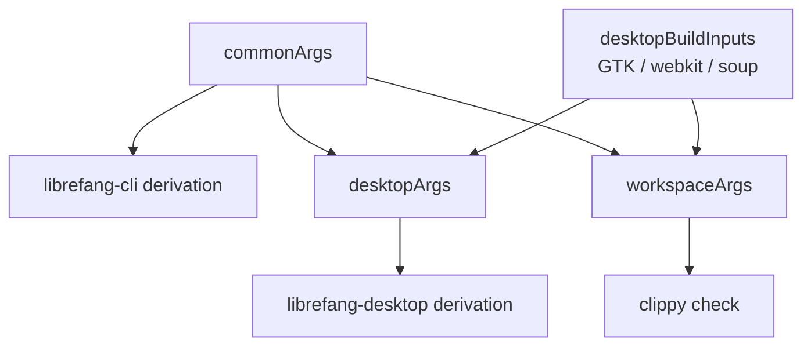
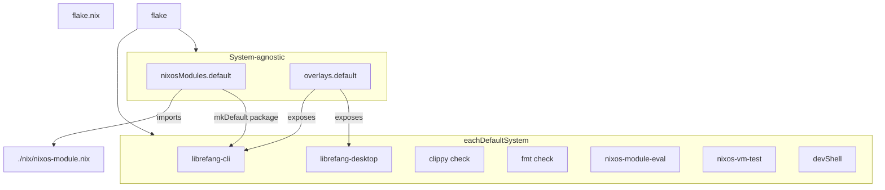

# Root — flake.nix

# flake.nix — LibreFang Nix Flake

## Przeznaczenie

Główny plik `flake.nix` to punkt wejścia dla wszystkich opartych na Nixie procesów budowania, testowania i wdrażania LibreFang. Definiuje:

- **Dwie główne derywacje pakietów** — CLI/daemon (`librefang-cli`) oraz oparty na Tauri interfejs desktopowy (`librefang-desktop`) — budowane za pomocą [crane](https://github.com/ipetkov/crane) względem przypiętego łańcucha narzędzi Rust.
- **Testy** — clippy, formatowanie, asercje modułu NixOS w czasie ewaluacji oraz test maszyny wirtualnej NixOS.
- **Moduł NixOS** (`nixosModules.default`) integrujący LibreFang z `services.librefang` na hoście.
- **Overlay** i **powłokę deweloperską** do lokalnego rozwoju.

Flake jest ustrukturyzowany jako cienka warstwa per-system oparta na niewielkim zestawie wyników niezależnych od systemu, co odzwierciedla podział między elementami produkującymi binarię (specyficznymi dla systemu) a elementami opisującymi konfigurację (niezależnymi od systemu).

## Wejścia

| Wejście | Przeznaczenie |
|---|---|
| `nixpkgs` | Przypięte do `nixpkgs-unstable` dla zestawu pakietów używanego we wszystkich derywacjach. |
| `crane` | Biblioteka budowania Rust. Zapewnia `buildPackage`, `buildDepsOnly`, `cargoClippy`, `cargoFmt`, `devShell` oraz pomocnik `fileset.commonCargoSources`. |
| `flake-utils` | `eachDefaultSystem` — napędza pętlę per-system. |
| `rust-overlay` | Overlay Oxalica, używany do pozyskania konkretnego stabilnego łańcucha narzędzi Rust z rozszerzeniami `rust-src`, `rust-analyzer` i `clippy`. Śledzi `nixpkgs`, aby uniknąć drugiej instancji nixpkgs. |

## Wyniki Per-System

Wszystko wewnątrz `flake-utils.lib.eachDefaultSystem` jest ewaluowane raz dla każdego docelowego systemu.

### Konfiguracja łańcucha narzędzi i bibliotek

```nix
rustToolchain = pkgs.rust-bin.stable.latest.default.override {
  extensions = [ "rust-src" "rust-analyzer" "clippy" ];
};
craneLib = (crane.mkLib pkgs).overrideToolchain rustToolchain;
```

`crane.mkLib` tworzy bibliotekę crane zasięgowaną do tej instancji nixpkgs, a `.overrideToolchain` przypina dokładną wersję Rust używaną dla każdej budowy napędzanej przez crane. Ta pośredniość jest ważna: gwarantuje, że CLI, desktop, clippy i devShell kompilują się tym samym kompilatorem.

### Zależności natywne i runtime

Flake celowo rozdziela trzy poziomy zależności:



- **`nativeBuildInputs`** — `pkg-config`, łańcuch narzędzi Rust, `perl`. Obecne w każdej budowie.
- **`buildInputs`** — `openssl`, `dbus`, oraz specyficzne dla macOS `apple-sdk` i `libiconv`. Również uniwersalne.
- **`desktopBuildInputs`** — Łańcuch GTK/webview tylko dla Linuksa (`glib`, `gtk3`, `libsoup_3`, `webkitgtk_4_1`, `atkmm`, `cairo`, `gdk-pixbuf`, `pango`). Ten zestaw jest pusty na Darwin.

Ten podział to rozwiązanie problemu **#2937**: kompilacja CLI na czystym NixOS wcześniej ciągnęła cały łańcuch linkowania GTK przez rozwiązywanie zależności na poziomie workspace. Ograniczając `cliArgs` do `--package librefang-cli` i wyłączając `desktopBuildInputs` z `commonArgs`, budowa CLI pozostaje samowystarczalna.

### Filtrowanie źródeł

Atrybut `src` używa `pkgs.lib.fileset` do uwzględnienia tylko plików wymaganych przez Crane, plus zasobów nierustowych osadzanych w czasie kompilacji:

- `craneLib.fileset.commonCargoSources` — manifesty Cargo, lockfile, źródła Rust.
- Katalogi locale, statyczny HTML, konfiguracja Tauri, ikony, capabilities.
- `openrouter-models.snapshot.json` — osadzony przez `include_str!` w `librefang-runtime` jako rezerwowy katalog modeli offline.
- `sdk/python/librefang` — osadzony przez `include_dir!` w `librefang-channels`.
- Konfiguracje wdrażania w `deploy/` i `packages/whatsapp-gateway`.

To utrzymuje ścieżkę w sklepie Nix minimalną, poprawiając wskaźnik trafień w pamięci podręcznej i szybkość przebudów.

### Derywacja CLI

```nix
cliArgs = commonArgs // {
  pname = "librefang-cli";
  cargoExtraArgs = "--package librefang-cli";
};
cliCargoArtifacts = craneLib.buildDepsOnly cliArgs;
librefang-cli = craneLib.buildPackage (cliArgs // {
  cargoArtifacts = cliCargoArtifacts;
  doCheck = false;
});
```

Zestaw artefaktów deps-only jest budowany raz i ponownie używany jako wejście `cargoArtifacts` dla finalnej budowy pakietu. To standardowy wzorzec buforowania Crane: kompilacja zależności jest buforowana niezależnie od zmian w kodzie aplikacji.

Testy są wyłączone (`doCheck = false`), ponieważ wymagają sieci i konfiguracji runtime niedostępnej w piaskownicy budowania Nix.

`meta` pakietu ustawia `mainProgram = "librefang"`, `platforms = platforms.unix` oraz licencję MIT.

### Derywacja Desktop

Budowa desktop rozszerza `desktopArgs` o:

- `desktopBuildInputs` na Linuksie (GTK/webview).
- `copyDesktopItems` i `wrapGAppsHook3` jako dodatkowe natywne wejścia budowy na Linuksie.
- Wpis `.desktop` wygenerowany przez `pkgs.makeDesktopItem` z `startupWMClass = "librefang-desktop"` (odpowiadający identyfikatorowi aplikacji GTK, który zgłasza Tauri).
- Hook `postInstall` instalujący ikony hicolor w rozmiarach 32×32, 128×128, 256×256 (z `128x128@2x.png`) oraz 512×512.

Hook `wrapGAppsHook3` jest krytyczny: wstrzykuje zmienne środowiskowe runtime GTK (`XDG_DATA_DIRS`, `GIO_MODULE_DIR`, `GSETTINGS_SCHEMA_DIR`), których proces webview potrzebuje w czasie uruchamiania. Bez niego aplikacja Tauri się uruchamia, ale webview nie renderuje.

Obsługa platform: `platforms.linux ++ platforms.darwin`. Ścieżka budowania macOS pomija wszystkie hooki GTK i instalację ikon poprzez strażniki `optionalString` / `optionals`.

### Testy

```nix
checks = {
  inherit librefang-cli;
  librefang-clippy = craneLib.cargoClippy (workspaceArgs // { ... });
  librefang-fmt = craneLib.cargoFmt { ... };
}
// optionalAttrs isLinux { inherit librefang-desktop; }
// optionalAttrs (x86_64-linux || aarch64-linux) {
  nixos-module-eval = nixosModuleEval;
  nixos-vm-test = nixosVmTest;
};
```

Cztery kategorie:

1. **`librefang-cli`** — sama derywacja CLI pełni rolę testu budowy.
2. **`librefang-desktop`** — derywacja desktop, ograniczona do Linuksa. Umieszczenie jej w `checks` (a nie tylko w `packages`) oznacza, że regresja w logice pakowania powoduje niepowodzenie `nix flake check`, a nie tylko macierzy CI.
3. **`librefang-clippy`** — uruchamia `cargo clippy --workspace --all-targets -- -D warnings`. Używa `workspaceArgs` (które zawiera `desktopBuildInputs`), ponieważ clippy kompiluje też crate desktop.
4. **`librefang-fmt`** — test `cargo fmt` względem przefiltrowanego `src`.

### Ewaluacja modułu NixOS

`nixosModuleEval` to test w czasie ewaluacji. On:

1. Wywołuje `nixpkgs.lib.nixosSystem` z `self.nixosModules.default` i minimalną konfiguracją kontenera włączającą `services.librefang`.
2. Odczytuje wynikowe `systemd.services.librefang` i uruchamia listę **12 asercji** względem niego — weryfikując `ExecStart`, `Type`, zmienne środowiskowe (`LIBREFANG_HOME`, `LIBREFANG_LISTEN`, `RUST_LOG`), `StateDirectory`, `EnvironmentFile`, ograniczenia rodziny adresów, flagi utwardzania, obecność `git` w PATH oraz użytkownika systemowego `librefang`.
3. Rzuca błąd asercji wyliczający wszystkie niespełnione oczekiwania.

Derywacja celowo **nie trzyma odniesienia** do wyrenderowanego tekstu jednostki. Wyrenderowana jednostka zawiera `${librefang-cli}/bin/librefang`, więc zależność od niej wymusiłaby pełną kompilację workspace (80–95 minut od zera). Utrzymując test na warstwie ewaluacji, `nix flake check --no-build` wyłapuje regresje w ~43 sekundy.

### Test maszyny wirtualnej NixOS

`nixosVmTest` używa `pkgs.testers.runNixOSTest` do uruchomienia prawdziwego gościa NixOS z `services.librefang.enable = true` i weryfikuje, czy daemon faktycznie się uruchamia i obsługuje żądania:

```python
machine.wait_for_unit("librefang.service")
machine.wait_for_open_port(4545)
machine.succeed("curl -sf http://127.0.0.1:4545/api/health")
machine.succeed("test -d /var/lib/librefang")
```

To jedyny test udowadniający, że proces przetrwa uruchomienie przez systemd — czego `nixosModuleEval` nie może zrobić. Jest kosztowny (kompiluje CLI + uruchamia maszynę wirtualną) i celowo **nie jest** budowany przez CI. Ścieżka PR uruchamia `nix flake check --no-build`, który ewaluuje test bez kompilacji. Uruchomienie go w pełni wymaga hosta Linuks z KVM:

```
nix build .#checks.x86_64-linux.nixos-vm-test -L
```

Konfiguracja gościa ustawia `LIBREFANG_REGISTRY_OFFLINE = "1"`, ponieważ maszyna wirtualna nie ma dostępu do sieci zewnętrznej, i podnosi `virtualisation.memorySize` do 2048 MB (jądro Rust + serwer axum kończy się brakiem pamięci przy domyślnych 1024 MB).

### Pakiety, aplikacje i powłoka deweloperska

| Wynik | Wartość |
|---|---|
| `packages.default` | `librefang-cli` |
| `packages.librefang-cli` | Derywacja CLI/daemon |
| `packages.librefang-desktop` | Derywacja desktop |
| `apps.default` | Wrapper `mkApp` wokół `librefang-cli`, z propagowanym `meta` |
| `devShells.default` | Powłoka deweloperska Crane obejmująca wszystkie testy, narzędzia deweloperskie (`cargo-watch`, `cargo-edit`, `cargo-expand`, `just`, `gh`, `nodejs`, `python3`) oraz `desktopBuildInputs` do lokalnego rozwoju desktop |

Powłoka deweloperska dziedziczy `inputsFrom = [ librefang-cli ]`, więc automatycznie niesie zależności budowy CLI.

## Wyniki niezależne od systemu

Te wyniki są dołączane do rezultatu flake **poza** `eachDefaultSystem`. To wymóg schematu: `nixosModules` i `overlays` są konsumowane przez własne `nixpkgs` hosta, a nie zasięgowane do systemu.

### `nixosModules.default` / `nixosModules.librefang`

```nix
nixosModules.librefang = { lib, pkgs, ... }: {
  imports = [ ./nix/nixos-module.nix ];
  services.librefang.package = lib.mkDefault (
    self.packages.${pkgs.stdenv.hostPlatform.system}.librefang-cli
      or (throw "The LibreFang flake does not build librefang-cli for ${system}...")
  );
};
nixosModules.default = self.nixosModules.librefang;
```

Moduł deleguje do `./nix/nixos-module.nix` (faktyczne definicje opcji) i łączy `services.librefang.package` z budową `librefang-cli` tego flake za pomocą `mkDefault`. Oznacza to, że zaimportowanie modułu jest wystarczające — konsument nie musi również stosować overlay.

`mkDefault` zapewnia, że jawne `services.librefang.package = …` w konfiguracji hosta ma pierwszeństwo, a `throw` jest leniwy: uruchamia się tylko jeśli opcja jest odczytywana na systemie, dla którego ten flake nie buduje.

### `overlays.default`

```nix
overlays.default = final: prev:
  let inherit (prev.stdenv.hostPlatform) system;
  in nixpkgs.lib.optionalAttrs (self.packages ? ${system}) {
    inherit (self.packages.${system}) librefang-cli librefang-desktop;
  };
```

Kluczowy szczegół: system jest odczytywany z `prev`, nie z `final`. Odczytywanie `final.stdenv` do decydowania *które* atrybuty overlay definiuje tworzy samoodniesiony punkt stały. Użycie `prev` przerywa cykl.

Overlay eksponuje pakiety zbudowane względem przypiętych nixpkgs/crane/rust-overlay tego flake — a nie nixpkgs konsumenta. To celowe: podział na poziomy zależności i konfiguracja Crane utrzymujące działanie `nix build .#librefang-cli` na czystym NixOS zostałyby rozgałęzione, gdyby Crane został ponownie zainicjowany względem obcych nixpkgs.

## Topologia wyników



## Podręcznik użytkowania

```bash
# Budowanie CLI/daemon
nix build .#librefang-cli

# Budowanie interfejsu desktop (tylko Linux)
nix build .#librefang-desktop

# Uruchomienie CLI przez aplikację flake
nix run .#default

# Wejście do powłoki deweloperskiej
nix develop

# Uruchomienie wszystkich testów bez budowania (szybka ścieżka CI)
nix flake check --no-build

# Uruchomienie pełnego testu maszyny wirtualnej NixOS (wymaga KVM)
nix build .#checks.x86_64-linux.nixos-vm-test -L
```

Konfiguracja hosta NixOS:

```nix
{
  inputs.librefang.url = "github:librefang/librefang";
  outputs = { self, nixpkgs, librefang, ... }: {
    nixosConfigurations.myhost = nixpkgs.lib.nixosSystem {
      system = "x86_64-linux";
      modules = [
        librefang.nixosModules.default
        { services.librefang.enable = true; }
      ];
    };
  };
}
```
