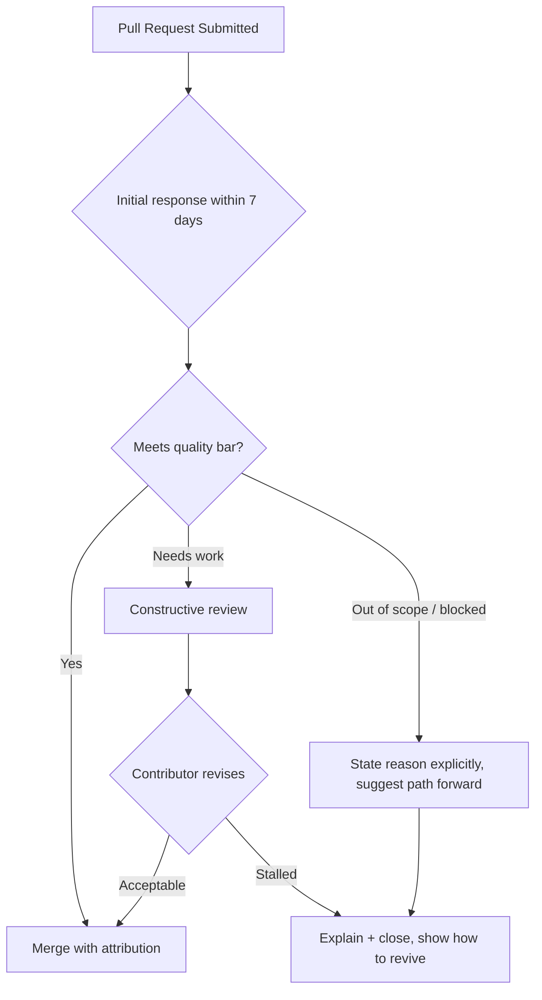

# Root — GOVERNANCE.md

# Governance (`GOVERNANCE.md`)

## Purpose

`GOVERNANCE.md` is the project charter for **LibreFang**. It defines *how decisions are made*, *how contributions are handled*, and *what maintainers are accountable for*. It is not code; it is the policy layer that every maintainer action is expected to follow. The document is itself versioned in the repository, and breaking changes to it must go through a pull request.

The name *LibreFang* ("libre" as in freedom) signals the document's core stance: the codebase is a community-owned project, not a closed shop, and outside contributions are treated as first-class.

---

## Core Principle: Merge-First

The governing axiom of the project:

> **If a contribution positively helps the project, we merge it.**

Merge-first is the *default*, not a reward for special contributors. The document frames three explicit outcomes for a pull request:

| Situation | Required action |
|---|---|
| PR meets quality standards | Merge as-is, with full attribution |
| PR needs work | Constructive review with concrete suggestions — *help the contributor ship it* |
| PR is stalled or out of scope | Close only after explanation; tell the contributor how to revive it |

Two behaviors are explicitly forbidden:

- Silently closing or letting PRs go stale.
- Closing a PR and re-implementing it privately without attribution.

---

## Contribution Lifecycle

The document describes a default flow that every pull request is expected to follow. The diagram below summarizes the decision path a maintainer is expected to take:

Key timing and handling rules that feed this flow:

- **Initial response target:** within **7 days** of a new PR.
- **Blocked PRs:** maintainers must say so *explicitly* and suggest a path forward — not leave the contributor guessing.
- **Stale PRs:** may be closed, but only after the contributor is told the reason and how to revive the work.

---

## Attribution & Patch Handling

When a maintainer adapts or rewrites a contributor's patch, attribution is **non-negotiable**. Acceptable mechanisms include:

- `Co-authored-by:` commit metadata.
- Credit in release notes.

Rewriting someone's contribution under a maintainer's name alone is prohibited. The contributor's name must travel with the work.

---

## Decision-Making Model

Governance is deliberately decentralized:

- **Day-to-day technical decisions** happen in pull requests and issues — in public.
- **Design rejections** must come with concrete technical reasons.
- **Large design changes** should start as an issue so contributors can align *before* heavy implementation.
- **Governance changes themselves** (edits to `GOVERNANCE.md`) must be proposed via pull request against this file.

This means the repository's own history is the audit trail for how the project is run.

---

## Equal Valuation of Contributions

The document is explicit that all contribution types carry equal weight:

- Code
- Documentation
- Tests
- Translations
- Packaging
- Issue triage
- Community support

This is not a code-only project; governance treats these as equally legitimate paths to recognition.

---

## Roles & Progression

Two tiers are described:

1. **Active contributors** — invited to join the LibreFang GitHub organization.
2. **Core participants** — those with sustained, quality contributions gain **commit access** and a voice in project governance.

Maintainers (the people with commit access) have three responsibilities:

- Review quality
- Release management
- Enforcing this governance document

A specific anti-bottleneck rule applies: **maintainers should ensure at least two people can review and release the project.** No single person should be the sole gatekeeper.

---

## Related Documents

`GOVERNANCE.md` does not stand alone — it delegates two concerns to sibling files:

| File | Purpose |
|---|---|
| [`MAINTAINERS.md`](MAINTAINERS.md) | Maintainer expectations and the current roster |
| [`SECURITY.md`](SECURITY.md) | Private vulnerability reporting process (security issues must **not** use public issues) |

When making changes that touch maintainer roster, release expectations, or security handling, the relevant sibling document should be updated alongside `GOVERNANCE.md`.

---

## How to Amend This Document

Because governance changes can be breaking, they follow a stricter path than ordinary code:

1. Open a pull request against `GOVERNANCE.md`.
2. Discuss in the PR, not behind closed doors.
3. Maintainers must justify any rejection with concrete reasons.

There is no separate, out-of-band governance channel. The document's own text is the only source of truth for how the project is run.