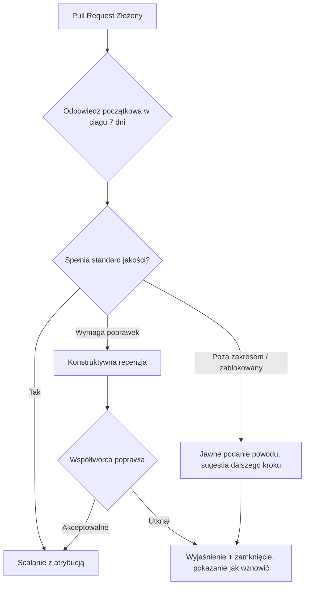

# Root — GOVERNANCE.md

# Zarządzanie (`GOVERNANCE.md`)

## Cel

`GOVERNANCE.md` to statut projektu **LibreFang**. Określa *jak podejmowane są decyzje*, *jak obsługiwane są wkłady* oraz *za co odpowiadają opiekunowie*. To nie jest kod; to warstwa polityki, której każda akcja opiekuna powinna przestrzegać. Sam dokument jest wersjonowany w repozytorium, a zmianyBreaking w nim muszą przejść przez pull request.

Nazwa *LibreFang* ("libre" w znaczeniu wolności) sygnalizuje podstawowe stanowisko dokumentu: kod to projekt własności społeczności, a nie zamknięty sklep, a wkłady z zewnątrz są traktowane jako pełnoprawne.

---

## Zasada Główna: Najpierw Scalanie

Nadrzędny aksjomat projektu:

> **Jeśli wkład pozytywnie pomaga projektowi, scalamy go.**

„Najpierw scalanie" jest *domyślnością*, a nie nagrodą dla wybranych współtwórców. Dokument określa trzy jawne wyniki dla pull requesta:

| Sytuacja | Wymagana akcja |
|---|---|
| PR spełnia standardy jakości | Scalanie bez zmian, z pełną atrybucją |
| PR wymaga poprawek | Konstruktywna recenzja z konkretnymi sugestiami — *pomóż współtwórcy dostarczyć to* |
| PR utknął lub jest poza zakresem | Zamknięcie dopiero po wyjaśnieniu; poinformuj współtwórcę, jak je wznowić |

Dwa zachowania są wyraźnie zabronione:

- Ciche zamykanie lub pozwalanie, aby PR-y stawały się nieaktualne.
- Zamknięcie PR-a i prywatna reimplementacja bez atrybucji.

---

## Cykl Życia Wkładu

Dokument opisuje domyślny przepływ, którego każdy pull request powinien przestrzegać. Poniższy diagram podsumowuje ścieżkę decyzyjną, jakiej opiekun powinien podjąć:

Kluczowe reguły czasowe i dotyczące obsługi, które zasilają ten przepływ:

- **Cel odpowiedzi początkowej:** w ciągu **7 dni** od nowego PR-a.
- **Zablokowane PR-y:** opiekunowie muszą to *wyraźnie* zaznaczyć i zaproponować dalsze kroki — nie zostawiać współtwórcy w niepewności.
- **Nieaktualne PR-y:** mogą zostać zamknięte, ale tylko po poinformowaniu współtwórcy o powodzie i sposobie wznowienia pracy.

---

## Atrybucja i Obsługa Łatek

Gdy opiekun dostosowuje lub przepisuje łatkę współtwórcy, atrybucja jest **niepodlegająca negocjacjom**. Akceptowalne mechanizmy obejmują:

- Metadane commita `Co-authored-by:`.
- Uznanie w notatkach wydania.

Przepisywanie czyjegoś wkładu wyłącznie pod nazwiskiem opiekuna jest zabronione. Imię współtwórcy musi podróżować z pracą.

---

## Model Podejmowania Decyzji

Zarządzanie jest celowo zdecentralizowane:

- **Bieżące decyzje techniczne** odbywają się w pull requestach i issues — publicznie.
- **Odrzucenia projektów** muszą być poparte konkretnymi powodami technicznymi.
- **Duże zmiany projektowe** powinny zaczynać się jako issue, aby współtwórcy mogli się *wcześniej* dopasować przed ciężką implementacją.
- **Zmiany samego zarządzania** (edycje `GOVERNANCE.md`) muszą być zgłoszone poprzez pull request do tego pliku.

To oznacza, że historia repozytorium jest śladem audytu tego, jak projekt jest prowadzony.

---

## Równa Wycena Wkładów

Dokument jasno określa, że wszystkie typy wkładów mają równą wagę:

- Kod
- Dokumentacja
- Testy
- Tłumaczenia
- Pakiety
- Triage zgłoszeń
- Wsparcie społeczności

To nie jest projekt wyłącznie kodowy; zarządzanie traktuje te ścieżki jako równoprawne drogi do uznania.

---

## Role i Progresja

Opisano dwa poziomy:

1. **Aktywni współtwórcy** — zaproszeni do dołączenia do organizacji LibreFang na GitHubie.
2. **Uczestnicy core** — ci z trwałymi, wartościowymi wkładami zyskują **dostęp do commita** i głos w zarządzaniu projektem.

Opiekunowie (osoby z dostępem do commita) mają trzy obowiązki:

- Kontrola jakości
- Zarządzanie wydaniami
- Egzekwowanie tego dokumentu zarządzania

Zasada antywąskiego gardła: **opiekunowie powinni zapewnić, że co najmniej dwie osoby mogą recenzować i wydawać projekt.** Żadna pojedyncza osoba nie powinna być jedynym strażnikiem.

---

## Dokumenty Powiązane

`GOVERNANCE.md` nie istnieje sam — deleguje dwie sprawy do plików równorzędnych:

| Plik | Cel |
|---|---|
| [`MAINTAINERS.md`](MAINTAINERS.md) | Oczekiwania wobec opiekunów i aktualny skład |
| [`SECURITY.md`](SECURITY.md) | Proces prywatnego zgłaszania luk (problemy bezpieczeństwa **nie** mogą używać publicznych zgłoszeń) |

Wprowadzając zmiany dotyczące składu opiekunów, oczekiwań wydawniczych lub obsługi bezpieczeństwa, odpowiedni dokument równorzędny powinien być zaktualizowany wraz z `GOVERNANCE.md`.

---

## Jak Zmieniać Ten Dokument

Ponieważ zmiany zarządzania mogą być breaking, podążają one ścieżką surowszą niż zwykły kod:

1. Otwórz pull request do `GOVERNANCE.md`.
2. Dyskusja odbywa się w PR, nie za zamkniętymi drzwiami.
3. Opiekunowie muszą uzasadnić każde odrzucenie konkretnymi powodami.

Nie ma oddzielnego, pozaślednikowego kanału zarządzania. Tekst samego dokumentu jest jedynym źródłem prawdy tego, jak projekt jest prowadzony.
