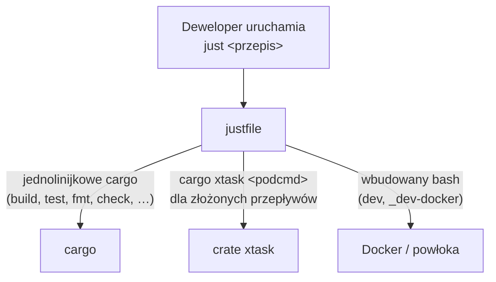

# Root — justfile

# Root — `justfile`

## Przeznaczenie

Plik `justfile` to **kanoniczny punkt wejścia dewelopera** w monorepo LibreFang. Zapewnia cienką, przyjazną dla człowieka warstwę przepisów nałożoną na `cargo` i crate automatyzacji `xtask`. Każdy typowy przepływ pracy deweloperskiej — budowanie, testowanie, lintowanie, wydawanie wersji, uruchamianie benchmarków, tworzenie changelogów — ma odpowiadający mu polecenie `just <przepis>`, które deweloper może uruchomić z katalogu głównego repozytorium.

Sam plik jest celowo zwięzły: jest to *dyspozytor*, a nie powierzchnia implementacyjna. Złożona logika wieloetapowa znajduje się w [`xtask/`](../xtask), a justfile przekazuje do niej argumenty.

---

## Architektura: Dwupoziomowy model dyspozycji



Podział obowiązków opiera się na ścisłej regule:

| Typ przepisu | Gdzie się znajduje | Przykład |
|---|---|---|
| **Czysty jednolinijkowy cargo** | Bezpośrednio w `justfile` | `just build`, `just fmt`, `just lint` |
| **Cokolwiek wieloetapowego** | W `xtask/`, przekazywane stąd | `just ci`, `just release`, `just dist` |
| **Wielolinijkowy przepis `just`** | **Zapach kodu** — przenieś do xtask | _(wyjątki: `dev`, `_dev-docker`)_ |

Jeśli przepis i jego odpowiednik w xtask kiedykolwiek się rozejdą, **xtask jest autorytatywny**. Przepis powinien zostać zaktualizowany tak, aby przekazywać, a nie reimplementować.

---

## Katalog przepisów

### Podstawowe budowanie i testowanie

| Przepis | Opis |
|---|---|
| `just build` | Buduje wszystkie biblioteki w workspace (`cargo build --workspace --lib`) |
| `just test` | Uruchamia wszystkie testy w workspace z `LIBREFANG_REGISTRY_OFFLINE=1` |
| `just test 0` | Ponownie włącza odświeżanie rejestru z sieci podczas testów |
| `just check` | Sprawdza typy w workspace bez produkowania binariów |
| `just lint` | Uruchamia Clippy z `-D warnings` dla wszystkich targetów |
| `just fmt` | Formatuje cały kod Rust |
| `just fmt-check` | Sprawdza formatowanie bez modyfikacji plików |
| `just clean` | Usuwa artefakty budowania z `target/` |
| `just doc` | Buduje i otwiera dokumentację workspace |

### CI i pre-commit

| Przepis | Opis |
|---|---|
| `just ci` | Lokalna symulacja CI: budowanie + testy + clippy + lint web |
| `just pre-commit` | Uruchamia `xtask pre-commit` (fmt + clippy + test) |

### Web i desktop

| Przepis | Opis |
|---|---|
| `just build-web` | Buduje wszystkie targety frontendu (dashboard, web, docs) |
| `just dashboard-build` | Buduje zasoby dashboardu React dla `librefang-api` |
| `just dash` | Uruchamia dashboard React w trybie dev (wymaga API na `:4545`) |
| `just desktop-build` | Buduje aplikację desktopową Tauri (najpierw buduje zasoby dashboardu) |
| `just desktop-dev` | Uruchamia aplikację desktopową Tauri w trybie dev |

### Wydawanie wersji i dystrybucja

| Przepis | Opis |
|---|---|
| `just release` | Wydaje nową wersję (Unix: wraca do Dockera, jeśli brak cargo) |
| `just dist` | Buduje binaria wydania dla wielu platform |
| `just docker` | Buduje i opcjonalnie wypycha obraz Dockera |
| `just changelog` | Generuje CHANGELOG na podstawie scalonych PR-ów |
| `just publish-sdks` | Publikuje SDK na npm / PyPI / crates.io |
| `just publish-npm-binaries` | Publikuje binaria CLI na npm |
| `just publish-pypi-binaries` | Publikuje paczki CLI (wheels) na PyPI |

### Instalacja

| Przepis | Opis |
|---|---|
| `just install` | Buduje CLI w wersji wydania i instaluje w `~/.librefang/bin` |
| `just install-full` | To samo co `install` plus świeże zasoby dashboardu i oznaczenie wersji |

Oba przepisy są świadome platformy (`[unix]` / `[windows]`).

### Środowisko deweloperskie

| Przepis | Opis |
|---|---|
| `just dev` | Uruchamia środowisko deweloperskie (natywne lub automatycznie wykrywa Dockera) |
| `just dev --docker` | Wymusza środowisko deweloperskie oparte na Dockerze |
| `just dev --docker --port 4646` | Środowisko deweloperskie Docker na niestandardowym porcie |
| `just setup` | Jednorazowa konfiguracja lokalnego środowiska deweloperskiego |
| `just doctor` | Diagnozuje problemy w środowisku deweloperskim |

### Jakość kodu i analiza

| Przepis | Opis |
|---|---|
| `just coverage` | Generuje raport pokrycia testów |
| `just deps` | Audytuje zależności pod kątem luk i aktualizacji |
| `just license-check` | Sprawdza licencje zależności |
| `just loc` | Statystyki kodu (linie kodu, graf zależności) |
| `just update-deps` | Aktualizuje zależności Rust + web |
| `just bench` | Uruchamia benchmarki criterion |
| `just fmt-all` | Sprawdza/naprawia formatowanie w Rust + web |

### Generowanie kodu i dokumentacja

| Przepis | Opis |
|---|---|
| `just codegen` | Uruchamia generowanie kodu (specyfikacja OpenAPI itd.) |
| `just api-docs` | Generuje dokumentację API ze specyfikacji OpenAPI |
| `just check-links` | Sprawdza, czy w dokumentacji nie ma uszkodzonych linków |
| `just contributors` | Generuje SVG-ów z listą współtwórców i historią gwiazdek |
| `just sync-versions` | Synchronizuje wersje crate-ów w całym workspace |

### Operacje

| Przepis | Opis |
|---|---|
| `just db` | Zarządzanie bazą danych (info, backup, reset) |
| `just validate-config` | Waliduje `config.toml` |
| `just migrate` | Migruje agentów z innych frameworków |
| `just integration-test` | Uruchamia testy integracyjne na żywym systemie |
| `just clean-all` | Czyści wszystkie artefakty budowania (szerszy zakres niż `just clean`) |

---

## Kluczowe decyzje projektowe

### `LIBREFANG_REGISTRY_OFFLINE`

Kilka przepisów (`test`, `ci`, `pre-commit`) domyślnie eksportuje `LIBREFANG_REGISTRY_OFFLINE=1`. Zapobiega to pobieraniu rejestru treści (git clone / powrót do tarballa) przez każdy kernel uruchamiany w teście, co utrzymuje test suite w izolacji i unika burdy forków git, która wyczerpałaby limity pid kontenerów (issue #6404).

Aby wrócić do odświeżania z sieci:

```
just test 0
```

### Obsługa platform

Plik deklaruje `set windows-shell := ["cmd", "/c"]` i udostępnia przepisy specyficzne dla platform, oznaczone tagami `[unix]` i `[windows]`, dla `install`, `release` i `pre-commit`. Przepis `release` na Uniksie używa wrappera Dockera (`scripts/run-xtask.sh`) jako rezerwy, gdy brak cargo; na Windows wymaga natywnego toolchain, ponieważ `cmd` nie może wykonać opartego na bash wrappera Dockera.

### Przepływ automatycznego powrotu `dev`

Przepis `just dev` jest najbardziej złożonym w pliku. Inspekuje argumenty i środowisko, aby wybrać jedną z dwóch ścieżek wykonania:

```mermaid
flowchart TD
    Start["just dev"] --> CheckDocker{"flag --docker<br/>przekazany?"}
    CheckDocker -->|Tak| Docker["_dev-docker: budowanie i uruchamianie<br/>wewnątrz kontenera librefang-rust-dev"}
    CheckDocker -->|Nie| CheckCargo{"cargo na PATH?"}
    CheckCargo -->|Tak| Native["cargo xtask dev<br/>(natywnie: hot-reload cargo-watch)"}
    CheckCargo -->|Nie| Docker
```

**Tryb natywny** buduje `librefang-cli` na hoście i uruchamia demona + dashboard z hot-reloadem cargo-watch. Wymaga natywnego toolchain Rust na hoście.

**Tryb Docker** (zaimplementowany w `_dev-docker`) buduje demona i Telegram sidecar wewnątrz kontenera `librefang-rust-dev:latest`, używając nazwanych wolumenów (`librefang-cargo`, `librefang-target`) do utrzymania pamięci podręcznej. Bind-mountuje `~/.librefang/` dla utrzymania konfiguracji, przekierowuje port API (domyślnie `4545`) i przekazuje klucze API dostawców (`OPENAI_API_KEY`, `ANTHROPIC_API_KEY`, `GROQ_API_KEY` itd.), jeśli są ustawione w środowisku hosta. Dashboard i cargo-watch nie są uruchamiane w trybie Docker — należą do hosta obok edytora.

Przepis `_dev-docker` przy pierwszym uruchomieniu inicjalizuje również `~/.librefang/config.toml` za pomocą `librefang init --quick` i wyświetla instrukcje konfiguracji dotyczące dodawania Telegram sidecar Rust.

### Dodawanie nowego przepisu

1. Zaimplementuj logikę w `xtask/src/` — dodaj nowy moduł i podepnij go w `xtask/src/main.rs`.
2. Dodaj jednolinijkowy przepis przekazujący do justfile:
   ```
   # Opis tego, co robi
   twój-przepis *ARGS:
       cargo xtask twój-przepis {{ARGS}}
   ```
3. Jeśli przepis wymaga wariantów platformowych lub przełącznika `LIBREFANG_REGISTRY_OFFLINE`, podążaj za wzorcami ustalonymi przez `release`, `install` lub `pre-commit`.

**Nigdy** nie pisz wielolinijkowego przepisu reimplementującego logikę xtask. Jeśli masz ochotę to zrobić, logika powinna znaleźć się w xtask.

---

## Konwencje

- **Dokumentacja użytkownika** powinna zawsze odwoływać się do `just <przepis>`. Wzmianki o `cargo xtask <podcmd>` w dokumentacji zewnętrznej to błąd dokumentacji.
- Przekazywanie argumentów używa interpolacji `*ARGS` i `{{ARGS}}`, aby flagi przechodziły przezroczystie.
- Komentarze przepisów są wyświetlane przez `just --list` i służą jako dokumentacja wbudowana. Trzymaj je zwięzłe, ale znaczące.
