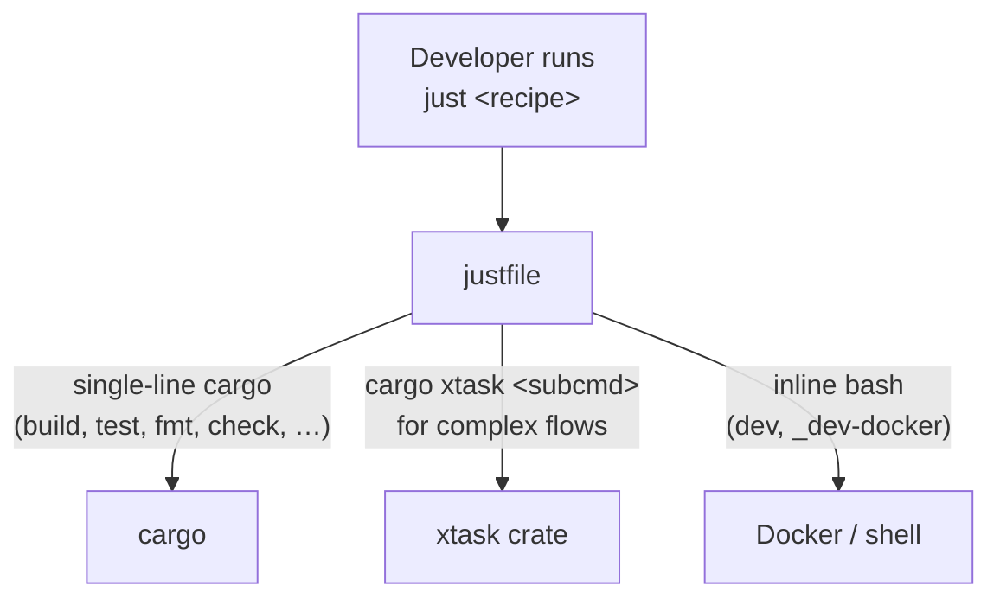
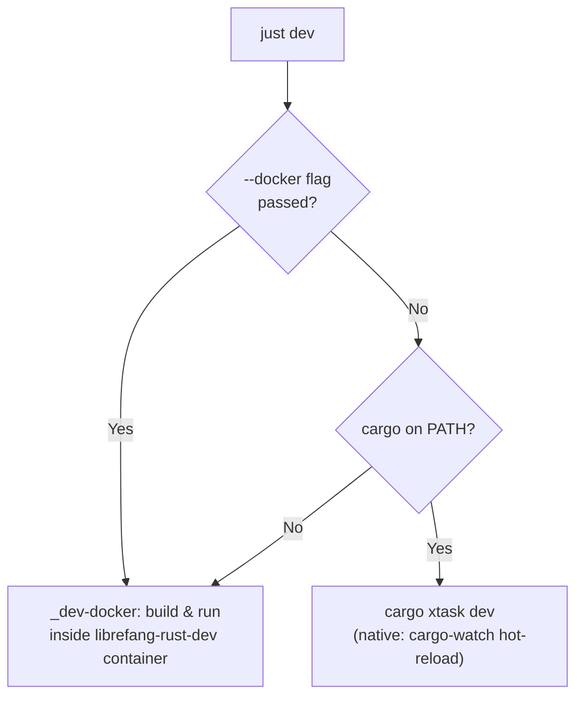

# Root — justfile

# Root — `justfile`

## Purpose

The `justfile` is the **canonical developer entry point** for the LibreFang monorepo. It provides a thin, human-friendly recipe layer over `cargo` and the `xtask` automation crate. Every common development workflow—building, testing, linting, releasing, running benchmarks, cutting changelogs—has a `just <recipe>` command that a developer can run from the repository root.

The file itself is intentionally lean: it is a *dispatcher*, not an implementation surface. Complex multi-step logic lives in [`xtask/`](../xtask), and the justfile forwards arguments to it.

---

## Architecture: Two-Tier Dispatch Model



The division of labor follows a strict rule:

| Recipe type | Where it lives | Example |
|---|---|---|
| **Pure single-line cargo** | Directly in `justfile` | `just build`, `just fmt`, `just lint` |
| **Anything multi-step** | `xtask/`, forwarded here | `just ci`, `just release`, `just dist` |
| **Multi-line `just` recipe** | **Code smell** — move to xtask | _(exceptions: `dev`, `_dev-docker`)_ |

If a recipe and its xtask counterpart ever drift, **xtask is authoritative**. The recipe should be updated to forward, not reimplemented.

---

## Recipe Catalog

### Core Build & Test

| Recipe | Description |
|---|---|
| `just build` | Build all workspace libraries (`cargo build --workspace --lib`) |
| `just test` | Run all workspace tests with `LIBREFANG_REGISTRY_OFFLINE=1` |
| `just test 0` | Re-enable network registry refresh during tests |
| `just check` | Type-check the workspace without producing binaries |
| `just lint` | Clippy with `-D warnings` across all targets |
| `just fmt` | Format all Rust code |
| `just fmt-check` | Verify formatting without modifying files |
| `just clean` | Remove `target/` build artifacts |
| `just doc` | Build and open workspace documentation |

### CI & Pre-Commit

| Recipe | Description |
|---|---|
| `just ci` | Local CI simulation: build + test + clippy + web lint |
| `just pre-commit` | Runs `xtask pre-commit` (fmt + clippy + test) |

### Web & Desktop

| Recipe | Description |
|---|---|
| `just build-web` | Build all frontend targets (dashboard, web, docs) |
| `just dashboard-build` | Build React dashboard assets for `librefang-api` |
| `just dash` | Start React dashboard in dev mode (requires API on `:4545`) |
| `just desktop-build` | Build Tauri desktop app (builds dashboard assets first) |
| `just desktop-dev` | Start Tauri desktop app in dev mode |

### Release & Distribution

| Recipe | Description |
|---|---|
| `just release` | Cut a release (Unix: falls back to Docker if cargo missing) |
| `just dist` | Build release binaries for multiple platforms |
| `just docker` | Build and optionally push Docker image |
| `just changelog` | Generate CHANGELOG from merged PRs |
| `just publish-sdks` | Publish SDKs to npm / PyPI / crates.io |
| `just publish-npm-binaries` | Publish CLI binaries to npm |
| `just publish-pypi-binaries` | Publish CLI wheels to PyPI |

### Installation

| Recipe | Description |
|---|---|
| `just install` | Build release CLI and install to `~/.librefang/bin` |
| `just install-full` | Same as `install` plus fresh dashboard assets and version stamp |

Both recipes are platform-aware (`[unix]` / `[windows]`).

### Development Environment

| Recipe | Description |
|---|---|
| `just dev` | Start dev environment (native or auto-detect Docker) |
| `just dev --docker` | Force Docker-based dev environment |
| `just dev --docker --port 4646` | Docker dev on a custom port |
| `just setup` | One-time local development environment setup |
| `just doctor` | Diagnose development environment issues |

### Code Quality & Analysis

| Recipe | Description |
|---|---|
| `just coverage` | Generate test coverage report |
| `just deps` | Audit dependencies for vulnerabilities and updates |
| `just license-check` | Check dependency licenses |
| `just loc` | Code statistics (lines of code, dependency graph) |
| `just update-deps` | Update Rust + web dependencies |
| `just bench` | Run criterion benchmarks |
| `just fmt-all` | Check/fix formatting across Rust + web |

### Code Generation & Docs

| Recipe | Description |
|---|---|
| `just codegen` | Run code generation (OpenAPI spec, etc.) |
| `just api-docs` | Generate API docs from OpenAPI spec |
| `just check-links` | Check for broken links in documentation |
| `just contributors` | Generate contributors + star history SVGs |
| `just sync-versions` | Synchronize crate versions across workspace |

### Operations

| Recipe | Description |
|---|---|
| `just db` | Database management (info, backup, reset) |
| `just validate-config` | Validate `config.toml` |
| `just migrate` | Migrate agents from other frameworks |
| `just integration-test` | Run live integration tests |
| `just clean-all` | Clean all build artifacts (broader than `just clean`) |

---

## Key Design Decisions

### `LIBREFANG_REGISTRY_OFFLINE`

Several recipes (`test`, `ci`, `pre-commit`) export `LIBREFANG_REGISTRY_OFFLINE=1` by default. This prevents every test-booted kernel from fetching the content registry (git clone / tarball fallback), keeping the test suite hermetic and avoiding a git fork storm that exhausts container pid limits (issue #6404).

To opt back into network refresh:

```
just test 0
```

### Platform Handling

The file declares `set windows-shell := ["cmd", "/c"]` and provides platform-specific recipes tagged `[unix]` and `[windows]` for `install`, `release`, and `pre-commit`. The `release` recipe on Unix uses a Docker fallback (`scripts/run-xtask.sh`) when cargo is missing; on Windows it requires a native toolchain because `cmd` cannot exec the bash-based Docker wrapper.

### `dev` Auto-Fallback Flow

The `just dev` recipe is the most complex in the file. It inspects arguments and environment to choose between two execution paths:



**Native mode** builds `librefang-cli` on the host and starts the daemon + dashboard with cargo-watch hot-reload. Requires a host Rust toolchain.

**Docker mode** (implemented in `_dev-docker`) builds the daemon and Telegram sidecar inside the `librefang-rust-dev:latest` container, using named volumes (`librefang-cargo`, `librefang-target`) for cache persistence. It bind-mounts `~/.librefang/` for config persistence, forwards the API port (default `4545`), and passes through provider API keys (`OPENAI_API_KEY`, `ANTHROPIC_API_KEY`, `GROQ_API_KEY`, etc.) if set in the host environment. Dashboard and cargo-watch are not started in Docker mode—they belong on the host alongside the editor.

The `_dev-docker` recipe also bootstraps `~/.librefang/config.toml` on first run via `librefang init --quick` and prints configuration instructions for adding the Rust Telegram sidecar.

### Adding a New Recipe

1. Implement the logic in `xtask/src/` — add a new module and wire it into `xtask/src/main.rs`.
2. Add a one-line forwarding recipe to the justfile:
   ```
   # Description of what it does
   your-recipe *ARGS:
       cargo xtask your-recipe {{ARGS}}
   ```
3. If the recipe needs platform variants or the `LIBREFANG_REGISTRY_OFFLINE` switch, follow the patterns established by `release`, `install`, or `pre-commit`.

**Never** write a multi-line recipe that reimplements xtask logic. If you find yourself doing so, the logic belongs in xtask instead.

---

## Conventions

- **User-facing documentation** should always reference `just <recipe>`. Mentions of `cargo xtask <subcmd>` in external docs are a documentation bug.
- Argument forwarding uses `*ARGS` and `{{ARGS}}` interpolation so that flags pass through transparently.
- Recipe comments are shown by `just --list` and serve as inline documentation. Keep them concise but meaningful.