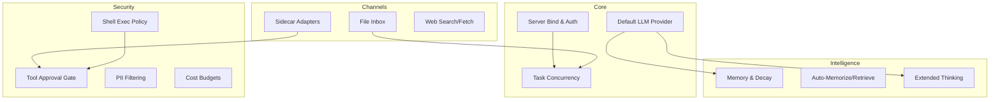

# Root — librefang.toml.example

# LibreFang Agent OS — Configuration Reference

The `librefang.toml.example` file is the canonical template for LibreFang daemon configuration. It ships with the repository and serves as a self-documenting reference for every configurable knob in the system.

## Getting Started

1. Copy the file to `~/.librefang/config.toml`
2. Uncomment and modify the sections relevant to your deployment
3. Place secrets in `~/.librefang/secrets.env` — never inline in the config

The daemon validates configuration at startup. Certain combinations (e.g., binding to a non-loopback address without authentication) will cause the daemon to refuse to start unless explicitly overridden.

## Configuration Topology



---

## Server & Authentication

```toml
api_listen = "127.0.0.1:4545"
log_level = "info"       # trace | debug | info | warn | error
mode = "default"         # stable | default | dev
```

**Loopback enforcement.** The daemon starts on `127.0.0.1` by default. Binding to any other address requires at least one authentication mechanism:

- A non-empty `api_key` for Bearer auth
- Configured `dashboard_user` / `dashboard_pass` (or vault-stored password)
- One or more `[[users]]` entries with `api_key_hash`

If no auth is configured on a non-loopback bind, the daemon aborts startup. The `LIBREFANG_ALLOW_NO_AUTH=1` environment variable overrides this guard, but is strongly discouraged.

### Dashboard Credentials

The dashboard ships with default credentials (`librefang` / `librefang`) that **must be changed** after first login. Two secure storage alternatives exist:

| Method | Syntax |
|--------|--------|
| Vault | `dashboard_pass = "vault:dashboard_password"` |
| Environment | `LIBREFANG_DASHBOARD_PASS=your-secret` |

---

## Default LLM Model

```toml
[default_model]
provider = "anthropic"
model = "claude-sonnet-4-20250514"
api_key_env = "ANTHROPIC_API_KEY"
# base_url = ""   # override API endpoint
```

Supported providers include `anthropic`, `openai`, `gemini`, `groq`, `ollama`, and others registered in the provider registry. API keys are never stored directly — the config references an environment variable name, and the daemon resolves it at runtime.

### Performance Toggles

| Key | Effect |
|-----|--------|
| `prompt_caching` | Enables Anthropic `cache_control` / OpenAI auto-cache |
| `stable_prefix_mode` | Reorders context to improve cache hit rate |
| `usage_footer` | Dashboard footer display: `off`, `tokens`, `cost`, or `full` |

---

## Memory System

### Core Memory

```toml
[memory]
decay_rate = 0.05       # confidence decay per cycle
```

### Embedding Provider

```toml
[embedding]
provider = "openai"
model = "text-embedding-3-small"
api_key_env = "OPENAI_API_KEY"
# dimensions = 1536     # override auto-detected dimensions
```

Bedrock is supported as a special case — `base_url` acts as a region override (e.g., `"eu-west-1"`) rather than a full URL, and credentials come from standard AWS environment variables.

### Time-Based Decay

```toml
[memory.decay]
enabled = false
session_ttl_days = 7
agent_ttl_days = 30
decay_interval_hours = 1
```

> **USER memories never decay.** Only SESSION and AGENT-scoped memories are eligible for time-based expiry.

### Proactive Memory

```toml
[proactive_memory]
enabled = true
auto_memorize = true        # extract facts from conversations
auto_retrieve = true        # recall relevant memories
max_retrieve = 10
# extraction_threshold = 0.7
# duplicate_threshold = 0.5
# max_memories_per_agent = 1000
```

---

## Task Queue & Concurrency

```toml
[queue.concurrency]
main_lane = 3       # user messages
cron_lane = 2       # scheduled jobs
subagent_lane = 3   # child agents
```

The daemon uses separate lanes to isolate workloads. Backpressure on one lane (e.g., a flood of user messages) does not starve scheduled jobs or subagent work.

### Heartbeat Monitor

```toml
[heartbeat]
check_interval_secs = 30
default_timeout_secs = 60
keep_recent = 10
```

Autonomous agents are considered unresponsive after `default_timeout_secs` of inactivity.

---

## Shell Execution Policy

```toml
[exec_policy]
mode = "deny"              # deny | allowlist | full
timeout_secs = 30
max_output_bytes = 102400  # 100 KB
```

Defaults to `deny` — agents cannot execute shell commands unless explicitly escalated. The `allowlist` mode permits only whitelisted commands; `full` grants unrestricted shell access.

---

## Tool Approval Gate

```toml
[approval]
require_approval = ["shell_exec"]
timeout_secs = 60           # 10..=300
auto_approve = false
trusted_senders = ["admin_123", "ops_456"]
second_factor = "none"      # "none" or "totp"
```

### Per-Channel Rules

```toml
[[approval.channel_rules]]
channel = "telegram"
denied_tools = ["shell_exec"]

[[approval.channel_rules]]
channel = "admin_cli"
allowed_tools = ["shell_exec", "file_write", "file_delete"]
```

A channel can use either `denied_tools` (block-list) or `allowed_tools` (allow-list), not both.

### TOTP Second Factor

When `second_factor = "totp"`, approving critical tools requires a 6-digit authenticator code. Setup is via the API endpoints `POST /api/approvals/totp/setup` and `POST /api/approvals/totp/confirm`. The `totp_grace_period_secs` window avoids re-prompting for every consecutive approval.

---

## Sidecar Channel Adapters

All messaging integrations run as **out-of-process Python sidecars** communicating via newline-delimited JSON-RPC over stdin/stdout. This architecture provides process isolation, language-agnostic adapter development, and crash recovery.

### Prerequisites

```bash
pip install librefang-sdk
# Verify resolution from the same python3 the daemon will invoke:
python3 -c 'import librefang.sidecar; print(librefang.__file__)'
```

> **Warning:** Daemons launched under `mise`, `pyenv`, or `conda` often resolve a different `python3` than your shell. Always verify the import path from the launch environment.

### Adapter Block Structure

```toml
[[sidecar_channels]]
name = "telegram"
command = "python3"
args = ["-m", "librefang.sidecar.adapters.telegram"]
channel_type = "telegram"
[sidecar_channels.env]
TELEGRAM_BOT_TOKEN = "..."
```

### Supervision & Restart Behavior

```toml
# [[sidecar_channels]]
restart = true                    # auto-restart on unexpected exit
restart_initial_backoff_ms = 500  # doubles per consecutive failure
restart_max_backoff_ms = 30000    # backoff cap
restart_max_retries = 10          # circuit-break threshold
restart_reset_after_secs = 60     # stable uptime resets the counter
ready_timeout_secs = 30           # max wait for adapter's `ready` signal
shutdown_grace_secs = 5           # SIGKILL grace period
message_buffer = 256              # inbound backpressure buffer (min 1)
overflow = "block"                # or "drop_newest" to shed load
```

### Secret Namespacing

To run multiple instances of the same adapter (e.g., one Matrix bot per agent), prefix the environment variable with `<NAME>__` (uppercased, non-alphanumerics → `_`):

- A block named `agent-a` reads `AGENT_A__MATRIX_ACCESS_TOKEN` as its instance-private `MATRIX_ACCESS_TOKEN`
- Without a prefix, all instances share the global variable
- `__` is reserved as the namespace delimiter — global secret keys containing `__` are treated as namespaced and withheld from children

Secrets belong in `~/.librefang/secrets.env`, not in this config file.

### Available Adapters

| Adapter | Module Path | Key Environment Variables |
|---------|------------|--------------------------|
| Bluesky | `...adapters.bluesky` | `BLUESKY_IDENTIFIER`, `BLUESKY_APP_PASSWORD` |
| DingTalk | `...adapters.dingtalk` | `DINGTALK_APP_KEY`, `DINGTALK_APP_SECRET` |
| Discord | `...adapters.discord` | `DISCORD_BOT_TOKEN` |
| Email | `...adapters.email` | `EMAIL_IMAP_HOST`, `EMAIL_SMTP_HOST`, `EMAIL_USERNAME`, `EMAIL_PASSWORD` |
| Feishu / Lark | `...adapters.feishu` | `FEISHU_APP_ID`, `FEISHU_APP_SECRET` |
| Google Chat | `...adapters.google_chat` | `GOOGLE_CHAT_SERVICE_ACCOUNT_JSON` |
| Gotify | `...adapters.gotify` | `GOTIFY_SERVER_URL`, `GOTIFY_APP_TOKEN`, `GOTIFY_CLIENT_TOKEN` |
| LINE | `...adapters.line` | `LINE_CHANNEL_SECRET`, `LINE_CHANNEL_ACCESS_TOKEN` |
| Mastodon | `...adapters.mastodon` | `MASTODON_INSTANCE_URL`, `MASTODON_ACCESS_TOKEN` |
| Matrix | `...adapters.matrix` | `MATRIX_HOMESERVER_URL`, `MATRIX_USER_ID`, `MATRIX_ACCESS_TOKEN` |
| Mattermost | `...adapters.mattermost` | `MATTERMOST_SERVER_URL`, `MATTERMOST_TOKEN` |
| Nextcloud Talk | `...adapters.nextcloud` | `NEXTCLOUD_SERVER_URL`, `NEXTCLOUD_TOKEN` |
| ntfy | `...adapters.ntfy` | `NTFY_TOPIC` |
| QQ Bot | `...adapters.qq` | `QQ_APP_ID`, `QQ_APP_SECRET` |
| Reddit | `...adapters.reddit` | `REDDIT_CLIENT_ID`, `REDDIT_CLIENT_SECRET`, `REDDIT_USERNAME`, `REDDIT_PASSWORD` |
| Rocket.Chat | `...adapters.rocketchat` | `ROCKETCHAT_SERVER_URL`, `ROCKETCHAT_TOKEN`, `ROCKETCHAT_USER_ID` |
| Signal | `...adapters.signal` | `SIGNAL_API_URL`, `SIGNAL_NUMBER` |
| Slack | `...adapters.slack` | `SLACK_APP_TOKEN`, `SLACK_BOT_TOKEN` |
| Microsoft Teams | `...adapters.teams` | `TEAMS_APP_ID`, `TEAMS_APP_PASSWORD` |
| Telegram | `...adapters.telegram` | `TELEGRAM_BOT_TOKEN` |
| Twitch | `...adapters.twitch` | `TWITCH_OAUTH_TOKEN`, `TWITCH_NICK`, `TWITCH_CHANNELS` |
| Webex | `...adapters.webex` | `WEBEX_BOT_TOKEN` |
| Webhook | `...adapters.webhook` | `WEBHOOK_SECRET` |
| WeChat | `...adapters.wechat` | `WECHAT_BOT_TOKEN` (optional, QR login if absent) |
| WeCom | `...adapters.wecom` | `WECOM_BOT_ID`, `WECOM_BOT_SECRET` |
| WhatsApp | `...adapters.whatsapp` | Cloud API: `WHATSAPP_PHONE_NUMBER_ID`, `WHATSAPP_ACCESS_TOKEN`, `WHATSAPP_VERIFY_TOKEN` — or — Baileys: `WHATSAPP_GATEWAY_URL` |
| Zulip | `...adapters.zulip` | `ZULIP_SERVER_URL`, `ZULIP_BOT_EMAIL`, `ZULIP_API_KEY` |

> All adapters were migrated from in-process channels to the sidecar architecture. Legacy `[channels.*]` table blocks are no longer recognized.

To inspect the full environment-variable inventory for any adapter:

```bash
python3 -m librefang.sidecar.adapters.<name> --describe
```

---

## Web Tools

```toml
[web]
search_provider = "auto"   # Tavily → Brave → Jina → Perplexity → DuckDuckGo

[web.fetch]
max_chars = 50000
timeout_secs = 30
readability = true         # HTML → readable text extraction
```

`auto` selects the first available provider based on which API key environment variables are set. Jina requires a longer timeout (30+ seconds).

---

## Session Management

### Context Injection

```toml
[[session.context_injection]]
name = "project-rules"
content = "Always follow the project coding standards."
position = "system"       # "system" | "before_user" | "after_reset"
condition = "agent.tags contains 'chat'"
```

Multiple named injections are supported, each independently positioned and conditional. The `condition` field accepts simple tag-matching expressions.

### Session Compaction

```toml
[compaction]
threshold = 80            # trigger when message count exceeds this
keep_recent = 20          # recent messages preserved verbatim
max_summary_tokens = 1024 # LLM summary budget for older context
```

---

## Config Hot-Reload

```toml
[reload]
mode = "hybrid"     # off | restart | hot | hybrid
debounce_ms = 500
```

`hybrid` applies hot-reload to settings that support it (model config, memory tuning, etc.) and triggers a daemon restart for structural changes (new channels, queue lanes).

---

## Provider Routing

### Region Selection

```toml
[provider_regions]
qwen = "intl"
minimax = "china"
```

Overrides a provider's `base_url` to a region-specific endpoint defined in the provider registry.

### URL & API Key Overrides

```toml
[provider_urls]
ollama = "http://localhost:11434/v1"

[provider_api_keys]
openai = "OPENAI_API_KEY"
nvidia = "NVIDIA_API_KEY"
```

### Fallback Chain

```toml
[[fallback_providers]]
provider = "openai"
model = "gpt-4o"
api_key_env = "OPENAI_API_KEY"
```

Ordered list — the daemon tries each provider in sequence on failure.

---

## MCP Server Integration

Three transport types are supported:

```toml
# stdio
[[mcp_servers]]
name = "filesystem"
timeout_secs = 30
[mcp_servers.transport]
type = "stdio"
command = "npx"
args = ["-y", "@modelcontextprotocol/server-filesystem", "/tmp"]

# SSE
[[mcp_servers]]
name = "remote-tools"
[mcp_servers.transport]
type = "sse"
url = "https://mcp.example.com/events"

# HTTP-compatible (REST mapping)
[[mcp_servers]]
name = "internal-http"
[mcp_servers.transport]
type = "http_compat"
base_url = "http://127.0.0.1:8080"
[[mcp_servers.transport.tools]]
name = "search"
path = "/search"
method = "get"
request_mode = "query"
response_mode = "json"
```

The `http_compat` transport wraps arbitrary REST endpoints as MCP tools, with per-tool request/response mode mapping.

---

## Extended Thinking & Structured Output

### Chain-of-Thought

```toml
[thinking]
budget_tokens = 10000
stream_thinking = false   # stream thinking tokens to client
```

Supported on Claude, DeepSeek, and other compatible models.

### JSON / Schema-Constrained Output

Configured per-agent:

```toml
[agents.my_agent.response_format]
type = "json_schema"
name = "weather_report"
strict = true

[agents.my_agent.response_format.schema]
type = "object"
properties.location.type = "string"
properties.temperature.type = "number"
required = ["location", "temperature"]
```

OpenAI uses native structured output; Anthropic uses prompt injection to achieve schema enforcement.

---

## Budget & Cost Control

```toml
[budget]
max_hourly_usd = 0.0
max_daily_usd = 0.0
max_monthly_usd = 0.0
alert_threshold = 0.8
```

A value of `0` means unlimited. The daemon halts LLM calls when any limit is reached and emits alerts at the configured threshold percentage.

---

## Privacy Controls

```toml
[privacy]
mode = "pseudonymize"                  # "off" | "redact" | "pseudonymize"
redact_patterns = ["\\bCUST-\\d{6}\\b"]
```

PII filtering runs before prompts are sent to LLM providers. `pseudonymize` replaces entities with consistent placeholders so context is preserved across turns.

---

## Additional Subsystems

| Subsystem | Table | Purpose |
|-----------|-------|---------|
| **Browser Automation** | `[browser]` | Headless browser sessions for web interaction |
| **Docker Sandbox** | `[docker]` | Containerized code execution isolation |
| **Text-to-Speech** | `[tts]` | Voice synthesis (OpenAI, ElevenLabs, Google) |
| **P2P Federation** | `[network]` | Inter-daemon communication with shared secret auth |
| **External Auth** | `[external_auth]` | OAuth2/OIDC identity provider integration |
| **File Inbox** | `[inbox]` | Async agent commands via dropped text files |
| **Vault** | `[vault]` | Encrypted credential storage (auto-detected) |
| **Audit Logging** | `[audit]` | Tamper-evident operation logging with retention |

### Text-to-Speech Output Formats

For ElevenLabs, the `output_format` matters for target platforms. WhatsApp PTT voice notes require `opus_48000_32`. Other options include `mp3_44100_128`, `mp3_22050_32`, `opus_24000_32`, `pcm_16000`, `pcm_44100`, and `ulaw_8000`.

### File Inbox Directives

Dropped files may begin with `agent:<name>` on the first line to target a specific agent. Files without a directive route to `default_agent`. The daemon polls `directory` at `poll_interval_secs` and processes files atomically.