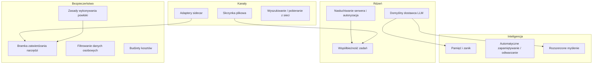

# Root — librefang.toml.example

# LibreFang Agent OS — Dokumentacja konfiguracji

Plik `librefang.toml.example` to kanoniczny szablon konfiguracji demona LibreFang. Jest dostarczany z repozytorium i służy jako samodokumentująca referencja każdego konfigurowalnego parametru w systemie.

## Wprowadzenie

1. Skopiuj plik do `~/.librefang/config.toml`
2. Odkomentuj i zmodyfikuj sekcje dotyczące Twojego wdrożenia
3. Umieść tajemnice w `~/.librefang/secrets.env` — nigdy bezpośrednio w konfiguracji

Demon weryfikuje konfigurację przy uruchomieniu. Niektóre kombinacje (np. nasłuchiwanie na adresie spoza pętli zwrotnej bez uwierzytelniania) spowodują odmowę uruchomienia demona, chyba że zostaną jawnie nadpisane.

## Topologia konfiguracji



---

## Serwer i uwierzytelnianie

```toml
api_listen = "127.0.0.1:4545"
log_level = "info"       # trace | debug | info | warn | error
mode = "default"         # stable | default | dev
```

**Wymuszanie pętli zwrotnej.** Demon domyślnie uruchamia się na `127.0.0.1`. Nasłuchiwanie na jakimkolwiek innym adresie wymaga co najmniej jednego mechanizmu uwierzytelniania:

- Niepusty `api_key` dla autoryzacji Bearer
- Skonfigurowane `dashboard_user` / `dashboard_pass` (lub hasło przechowywane w magazynie)
- Co najmniej jeden wpis `[[users]]` z `api_key_hash`

Jeśli nie skonfigurowano uwierzytelniania przy nasłuchiwaniu na adresie spoza pętli zwrotnej, demon przerywa uruchamianie. Zmienna środowiskowa `LIBREFANG_ALLOW_NO_AUTH=1` nadpisuje to zabezpieczenie, ale jest to stanowczo odradzane.

### Dane logowania panelu

Panel jest dostarczany z domyślnymi danymi logowania (`librefang` / `librefang`), które **należy zmienić** po pierwszym logowaniu. Istnieją dwie alternatywy bezpiecznego przechowywania:

| Metoda | Składnia |
|--------|----------|
| Magazyn | `dashboard_pass = "vault:dashboard_password"` |
| Zmienna środowiskowa | `LIBREFANG_DASHBOARD_PASS=twój-sekret` |

---

## Domyślny model LLM

```toml
[default_model]
provider = "anthropic"
model = "claude-sonnet-4-20250514"
api_key_env = "ANTHROPIC_API_KEY"
# base_url = ""   # nadpisanie punktu końcowego API
```

Obsługiwanymi dostawcami są m.in. `anthropic`, `openai`, `gemini`, `groq`, `ollama` oraz inni zarejestrowani w rejestrze dostawców. Klucze API nigdy nie są przechowywane bezpośrednio — konfiguracja odwołuje się do nazwy zmiennej środowiskowej, a demon rozwiązuje ją w czasie wykonywania.

### Przełączniki wydajności

| Klucz | Efekt |
|-------|-------|
| `prompt_caching` | Włącza Anthropic `cache_control` / automatyczne buforowanie OpenAI |
| `stable_prefix_mode` | Zmienia kolejność kontekstu w celu poprawy współczynnika trafień w pamięci podręcznej |
| `usage_footer` | Wyświetlanie stopki panelu: `off`, `tokens`, `cost` lub `full` |

---

## System pamięci

### Pamięć podstawowa

```toml
[memory]
decay_rate = 0.05       # zanik ufności na cykl
```

### Dostawca osadzeń

```toml
[embedding]
provider = "openai"
model = "text-embedding-3-small"
api_key_env = "OPENAI_API_KEY"
# dimensions = 1536     # nadpisanie automatycznie wykrytych wymiarów
```

Bedrock jest obsługiwany jako przypadek szczególny — `base_url` działa jako nadpisanie regionu (np. `"eu-west-1"`) zamiast pełnego adresu URL, a poświadczenia pochodzą ze standardowych zmiennych środowiskowych AWS.

### Zanik oparty na czasie

```toml
[memory.decay]
enabled = false
session_ttl_days = 7
agent_ttl_days = 30
decay_interval_hours = 1
```

> **Pamięci USER nigdy nie wygasają.** Tylko pamięci w zakresie SESSION i AGENT podlegają wygasaniu na podstawie czasu.

### Pamięć proaktywna

```toml
[proactive_memory]
enabled = true
auto_memorize = true        # ekstrakcja faktów z rozmów
auto_retrieve = true        # odtwarzanie istotnych wspomnień
max_retrieve = 10
# extraction_threshold = 0.7
# duplicate_threshold = 0.5
# max_memories_per_agent = 1000
```

---

## Kolejka zadań i współbieżność

```toml
[queue.concurrency]
main_lane = 3       # wiadomości użytkownika
cron_lane = 2       # zaplanowane zadania
subagent_lane = 3   # agenci podrzędni
```

Demon używa oddzielnych pasm do izolacji obciążeń. Presja zwrotna na jednym pasmie (np. powódź wiadomości użytkownika) nie powoduje zagłodzenia zaplanowanych zadań ani pracy agentów podrzędnych.

### Monitor pulsowania

```toml
[heartbeat]
check_interval_secs = 30
default_timeout_secs = 60
keep_recent = 10
```

Agenci autonomiczni są uznawani za nieodpowiadających po `default_timeout_secs` braku aktywności.

---

## Zasady wykonywania powłoki

```toml
[exec_policy]
mode = "deny"              # deny | allowlist | full
timeout_secs = 30
max_output_bytes = 102400  # 100 KB
```

Wartość domyślna to `deny` — agenci nie mogą wykonywać poleceń powłoki, chyba że zostanie to jawnie podniesione. Tryb `allowlist` zezwala tylko na zlistowane polecenia; `full` nadaje nieograniczony dostęp do powłoki.

---

## Bramka zatwierdzania narzędzi

```toml
[approval]
require_approval = ["shell_exec"]
timeout_secs = 60           # 10..=300
auto_approve = false
trusted_senders = ["admin_123", "ops_456"]
second_factor = "none"      # "none" lub "totp"
```

### Reguły dla poszczególnych kanałów

```toml
[[approval.channel_rules]]
channel = "telegram"
denied_tools = ["shell_exec"]

[[approval.channel_rules]]
channel = "admin_cli"
allowed_tools = ["shell_exec", "file_write", "file_delete"]
```

Kanał może używać albo `denied_tools` (lista blokowania), albo `allowed_tools` (lista dozwolonych), ale nie obu jednocześnie.

### Drugi czynnik TOTP

Gdy `second_factor = "totp"`, zatwierdzenie krytycznych narzędzi wymaga 6-cyfrowego kodu z aplikacji uwierzytelniającej. Konfiguracja odbywa się poprzez punkty końcowe API `POST /api/approvals/totp/setup` i `POST /api/approvals/totp/confirm`. Okno `totp_grace_period_secs` pozwala uniknąć ponownego pytania o kod przy kolejnych zatwierdzeniach.

---

## Adaptery kanałów sidecar

Wszystkie integracje komunikacyjne działają jako **zewnętrzne procesy Python sidecar**, komunikujące się za pomocą JSON-RPC oddzielonego znakiem nowej linii przez stdin/stdout. Ta architektura zapewnia izolację procesów, niezależną od języka rozwój adapterów oraz odzyskiwanie po awariach.

### Wymagania wstępne

```bash
pip install librefang-sdk
# Weryfikacja rozwiązania z tego samego python3, którego użyje demon:
python3 -c 'import librefang.sidecar; print(librefang.__file__)'
```

> **Ostrzeżenie:** Demony uruchamiane pod `mise`, `pyenv` lub `conda` często rozwiązują inny `python3` niż powłoka użytkownika. Zawsze weryfikuj ścieżkę importu ze środowiska uruchomieniowego.

### Struktura bloku adaptera

```toml
[[sidecar_channels]]
name = "telegram"
command = "python3"
args = ["-m", "librefang.sidecar.adapters.telegram"]
channel_type = "telegram"
[sidecar_channels.env]
TELEGRAM_BOT_TOKEN = "..."
```

### Nadzór i zachowanie restartowe

```toml
# [[sidecar_channels]]
restart = true                    # automatyczny restart po nieoczekiwanym wyjściu
restart_initial_backoff_ms = 500  # podwaja się przy każdym kolejnym niepowodzeniu
restart_max_backoff_ms = 30000    # limit oczekiwania
restart_max_retries = 10          # próg bezpiecznika
restart_reset_after_secs = 60     # stabilny czas pracy resetuje licznik
ready_timeout_secs = 30           # maksymalny czas oczekiwania na sygnał `ready` adaptera
shutdown_grace_secs = 5           # okres karencji przed SIGKILL
message_buffer = 256              # bufor presji zwrotnej przychodzących (min 1)
overflow = "block"                # lub "drop_newest" w celu zrzucenia obciążenia
```

### Przestrzenie nazw tajemnic

Aby uruchomić wiele instancji tego samego adaptera (np. jeden bot Matrix na agenta), poprzedź zmienną środowiskową prefiksem `<NAZWA>__` (wielkimi literami, znaki niealfanumeryczne → `_`):

- Blok o nazwie `agent-a` odczytuje `AGENT_A__MATRIX_ACCESS_TOKEN` jako swój prywatny `MATRIX_ACCESS_TOKEN`
- Bez prefiksu wszystkie instancje współdzielą zmienną globalną
- `__` jest zarezerwowane jako ogranicznik przestrzeni nazw — globalne klucze tajemnic zawierające `__` są traktowane jako przestrzenne i nie są przekazywane potomkom

Tajemnice należą do `~/.librefang/secrets.env`, nie do tego pliku konfiguracji.

### Dostępne adaptery

| Adapter | Ścieżka modułu | Kluczowe zmienne środowiskowe |
|---------|----------------|------------------------------|
| Bluesky | `...adapters.bluesky` | `BLUESKY_IDENTIFIER`, `BLUESKY_APP_PASSWORD` |
| DingTalk | `...adapters.dingtalk` | `DINGTALK_APP_KEY`, `DINGTALK_APP_SECRET` |
| Discord | `...adapters.discord` | `DISCORD_BOT_TOKEN` |
| Email | `...adapters.email` | `EMAIL_IMAP_HOST`, `EMAIL_SMTP_HOST`, `EMAIL_USERNAME`, `EMAIL_PASSWORD` |
| Feishu / Lark | `...adapters.feishu` | `FEISHU_APP_ID`, `FEISHU_APP_SECRET` |
| Google Chat | `...adapters.google_chat` | `GOOGLE_CHAT_SERVICE_ACCOUNT_JSON` |
| Gotify | `...adapters.gotify` | `GOTIFY_SERVER_URL`, `GOTIFY_APP_TOKEN`, `GOTIFY_CLIENT_TOKEN` |
| LINE | `...adapters.line` | `LINE_CHANNEL_SECRET`, `LINE_CHANNEL_ACCESS_TOKEN` |
| Mastodon | `...adapters.mastodon` | `MASTODON_INSTANCE_URL`, `MASTODON_ACCESS_TOKEN` |
| Matrix | `...adapters.matrix` | `MATRIX_HOMESERVER_URL`, `MATRIX_USER_ID`, `MATRIX_ACCESS_TOKEN` |
| Mattermost | `...adapters.mattermost` | `MATTERMOST_SERVER_URL`, `MATTERMOST_TOKEN` |
| Nextcloud Talk | `...adapters.nextcloud` | `NEXTCLOUD_SERVER_URL`, `NEXTCLOUD_TOKEN` |
| ntfy | `...adapters.ntfy` | `NTFY_TOPIC` |
| QQ Bot | `...adapters.qq` | `QQ_APP_ID`, `QQ_APP_SECRET` |
| Reddit | `...adapters.reddit` | `REDDIT_CLIENT_ID`, `REDDIT_CLIENT_SECRET`, `REDDIT_USERNAME`, `REDDIT_PASSWORD` |
| Rocket.Chat | `...adapters.rocketchat` | `ROCKETCHAT_SERVER_URL`, `ROCKETCHAT_TOKEN`, `ROCKETCHAT_USER_ID` |
| Signal | `...adapters.signal` | `SIGNAL_API_URL`, `SIGNAL_NUMBER` |
| Slack | `...adapters.slack` | `SLACK_APP_TOKEN`, `SLACK_BOT_TOKEN` |
| Microsoft Teams | `...adapters.teams` | `TEAMS_APP_ID`, `TEAMS_APP_PASSWORD` |
| Telegram | `...adapters.telegram` | `TELEGRAM_BOT_TOKEN` |
| Twitch | `...adapters.twitch` | `TWITCH_OAUTH_TOKEN`, `TWITCH_NICK`, `TWITCH_CHANNELS` |
| Webex | `...adapters.webex` | `WEBEX_BOT_TOKEN` |
| Webhook | `...adapters.webhook` | `WEBHOOK_SECRET` |
| WeChat | `...adapters.wechat` | `WECHAT_BOT_TOKEN` (opcjonalny, logowanie QR jeśli brak) |
| WeCom | `...adapters.wecom` | `WECOM_BOT_ID`, `WECOM_BOT_SECRET` |
| WhatsApp | `...adapters.whatsapp` | Cloud API: `WHATSAPP_PHONE_NUMBER_ID`, `WHATSAPP_ACCESS_TOKEN`, `WHATSAPP_VERIFY_TOKEN` — lub — Baileys: `WHATSAPP_GATEWAY_URL` |
| Zulip | `...adapters.zulip` | `ZULIP_SERVER_URL`, `ZULIP_BOT_EMAIL`, `ZULIP_API_KEY` |

> Wszystkie adaptery zostały przeniesione z kanałów wewnętrznych do architektury sidecar. Przestarzałe bloki tabel `[channels.*]` nie są już rozpoznawane.

Aby sprawdzić pełną listę zmiennych środowiskowych dla dowolnego adaptera:

```bash
python3 -m librefang.sidecar.adapters.<name> --describe
```

---

## Narzędzia sieciowe

```toml
[web]
search_provider = "auto"   # Tavily → Brave → Jina → Perplexity → DuckDuckGo

[web.fetch]
max_chars = 50000
timeout_secs = 30
readability = true         # ekstrakcja HTML → czytelny tekst
```

`auto` wybiera pierwszego dostępnego dostawcę na podstawie ustawionych zmiennych środowiskowych z kluczami API. Jina wymaga dłuższego czasu oczekiwania (30+ sekund).

---

## Zarządzanie sesjami

### Wstrzykiwanie kontekstu

```toml
[[session.context_injection]]
name = "project-rules"
content = "Zawsze przestrzegaj standardów kodowania projektu."
position = "system"       # "system" | "before_user" | "after_reset"
condition = "agent.tags contains 'chat'"
```

Obsługiwane jest wiele nazwanych wstrzyknięć, z których każde jest niezależnie pozycjonowane i warunkowe. Pole `condition` przyjmuje proste wyrażenia dopasowujące tagi.

### Kompakcja sesji

```toml
[compaction]
threshold = 80            # aktywacja gdy liczba wiadomości przekroczy tę wartość
keep_recent = 20          # ostatnie wiadomości zachowane dosłownie
max_summary_tokens = 1024 # budżet podsumowania LLM dla starszego kontekstu
```

---

## Gorące przeładowanie konfiguracji

```toml
[reload]
mode = "hybrid"     # off | restart | hot | hybrid
debounce_ms = 500
```

`hybrid` stosuje gorące przeładowanie do ustawień, które je obsługują (konfiguracja modelu, dostrajanie pamięci itd.) i wymusza restart demona przy zmianach strukturalnych (nowe kanały, pasma kolejki).

---

## Trasowanie dostawców

### Wybór regionu

```toml
[provider_regions]
qwen = "intl"
minimax = "china"
```

Nadpisuje `base_url` dostawcy na punkt końcowy specyficzny dla regionu zdefiniowany w rejestrze dostawców.

### Nadpisywanie URL-i i kluczy API

```toml
[provider_urls]
ollama = "http://localhost:11434/v1"

[provider_api_keys]
openai = "OPENAI_API_KEY"
nvidia = "NVIDIA_API_KEY"
```

### Łańcuch zapasowy

```toml
[[fallback_providers]]
provider = "openai"
model = "gpt-4o"
api_key_env = "OPENAI_API_KEY"
```

Lista uporządkowana — demon próbuje każdego dostawcy po kolei w przypadku niepowodzenia.

---

## Integracja serwerów MCP

Obsługiwane są trzy rodzaje transportu:

```toml
# stdio
[[mcp_servers]]
name = "filesystem"
timeout_secs = 30
[mcp_servers.transport]
type = "stdio"
command = "npx"
args = ["-y", "@modelcontextprotocol/server-filesystem", "/tmp"]

# SSE
[[mcp_servers]]
name = "remote-tools"
[mcp_servers.transport]
type = "sse"
url = "https://mcp.example.com/events"

# HTTP-kompatybilny (mapowanie REST)
[[mcp_servers]]
name = "internal-http"
[mcp_servers.transport]
type = "http_compat"
base_url = "http://127.0.0.1:8080"
[[mcp_servers.transport.tools]]
name = "search"
path = "/search"
method = "get"
request_mode = "query"
response_mode = "json"
```

Transport `http_compat` opakowuje dowolne punkty końcowe REST jako narzędzia MCP, z mapowaniem trybu żądania/odpowiedzi dla każdego narzędzia.

---

## Rozszerzone myślenie i wyjście ustrukturyzowane

### Łańcuch myślenia

```toml
[thinking]
budget_tokens = 10000
stream_thinking = false   # przesyłanie strumieniowe tokenów myślenia do klienta
```

Obsługiwane w modelach Claude, DeepSeek i innych kompatybilnych.

### Wyjście JSON / ograniczone schematem

Konfigurowane dla poszczególnych agentów:

```toml
[agents.my_agent.response_format]
type = "json_schema"
name = "weather_report"
strict = true

[agents.my_agent.response_format.schema]
type = "object"
properties.location.type = "string"
properties.temperature.type = "number"
required = ["location", "temperature"]
```

OpenAI używa natywnego wyjścia ustrukturyzowanego; Anthropic stosuje wstrzykiwanie promptów w celu wymuszenia schematu.

---

## Budżet i kontrola kosztów

```toml
[budget]
max_hourly_usd = 0.0
max_daily_usd = 0.0
max_monthly_usd = 0.0
alert_threshold = 0.8
```

Wartość `0` oznacza brak ograniczeń. Demon wstrzymuje wywołania LLM po osiągnięciu dowolnego limitu i wysyła alerty po przekroczeniu skonfigurowanego progu procentowego.

---

## Kontrola prywatności

```toml
[privacy]
mode = "pseudonymize"                  # "off" | "redact" | "pseudonymize"
redact_patterns = ["\\bCUST-\\d{6}\\b"]
```

Filtrowanie danych osobowych działa przed wysłaniem promptów do dostawców LLM. Tryb `pseudonymize` zastępuje jednostki spójnymi symbolami zastępczymi, aby kontekst był zachowywany między turami.

---

## Dodatkowe podsystemy

| Podsystem | Tabela | Przeznaczenie |
|----------|--------|---------------|
| **Automatyzacja przeglądarki** | `[browser]` | Bezokienkowe sesje przeglądarki do interakcji z siecią |
| **Sandbox Docker** | `[docker]` | Izolacja wykonania kodu w kontenerach |
| **Synteza mowy** | `[tts]` | Synteza głosu (OpenAI, ElevenLabs, Google) |
| **Federacja P2P** | `[network]` | Komunikacja między demonami z uwierzytelnianiem współdzielonym sekretem |
| **Uwierzytelnianie zewnętrzne** | `[external_auth]` | Integracja dostawców tożsamości OAuth2/OIDC |
| **Skrzynka plikowa** | `[inbox]` | Asynchroniczne polecenia agenta poprzez pliki tekstowe |
| **Magazyn** | `[vault]` | Szyfrowane przechowywanie poświadczeń (wykrywany automatycznie) |
| **Dziennik audytu** | `[audit]` | Odporny na manipulacje logowanie operacji z zasadami retencji |

### Formaty wyjściowe syntezy mowy

Dla ElevenLabs, `output_format` ma znaczenie dla platform docelowych. Wiadomości głosowe WhatsApp PTT wymagają `opus_48000_32`. Inne opcje to `mp3_44100_128`, `mp3_22050_32`, `opus_24000_32`, `pcm_16000`, `pcm_44100` i `ulaw_8000`.

### Dyrektywy skrzynki plikowej

Porzucone pliki mogą zaczynać się od `agent:<nazwa>` w pierwszej linii, aby celować w konkretnego agenta. Pliki bez dyrektywy są kierowane do `default_agent`. Demon odpytuje `directory` w odstępach `poll_interval_secs` i przetwarza pliki atomowo.
