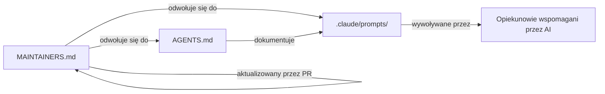

# Root — MAINTAINERS.md

# MAINTAINERS.md

## Cel

`MAINTAINERS.md` to plik rządzący, który stanowi rejestr osób utrzymujących repozytorium LibreFang oraz określa, czego się od nich oczekuje. Nie jest to kod wykonywalny — pełni funkcję umowy między współtwórcami projektu, administratorami i wszelkimi zautomatyzowanymi narzędziami, które odwołują się do obowiązków opiekunów.

Plik służy trzem grupom odbiorców:

- **Współtwórcom** — aby wiedzieli, kto recenzuje ich pracę i jakie standardy ich obowiązują.
- **Opiekunom / administratorom** — aby mieli pisemny, uzgodniony zestaw obowiązków.
- **Opiekunom wspieranym przez AI** — jako wskazówka do promptów-checklist specyficznych dla ról, które kodują te same obowiązki w formie zdatnej do przetwarzania przez maszynę.

## Obecny stan zarządzania

LibreFang jest opisywany jako projekt w połowie transformacji z forka w niezależny projekt społecznościowy. W tym okresie przejściowym **administratorzy repozytorium pełnią de facto rolę opiekunów**. W pliku nie ma wymienionych z imienia ani po pseudonimie poszczególnych opiekunów — dokument odsyła do roli administratora do czasu formalnego opublikowania szerszej grupy.

Oznacza to:

- Obecnie nie istnieje nazwana lista opiekunów, którą można by przetworzyć programowo.
- Każde narzędzie czytające `MAINTAINERS.md` w celu logiki w stylu CODEOWNERS powinno odwoływać się do dostępu na poziomie administratora.
- Oczekuje się, że plik ulegnie zmianie po zakończeniu transformacji.

## Obowiązki opiekunów

Plik definiuje cztery główne obowiązki:

| Odpowiedzialność | Opis |
|---|---|
| **Recenzja pull requestów** | Recenzje powinny odbywać się w terminowym trybie. Nie określono konkretnego SLA w pliku. |
| **Zachowanie atrybucji** | Gdy opiekunowie przyjmują lub adaptują prace społeczności, oryginalne autorstwo musi zostać zachowane. |
| **Dokładność dokumentacji** | Notki wydania i dokumenty zarządzające muszą być aktualne. |
| **Triaging bezpieczeństwa i regresji** | Zgłoszenia problemów bezpieczeństwa lub regresji muszą być szybko przyporządkowane. |

### Haczyki wspomagane przez AI do utrzymania

Każda odpowiedzialność odpowiada samodzielnemu promptowi-checkliście w katalogu `.claude/prompts/`. Te prompty przeznaczone są dla opiekunów wspomaganych przez AI (np. agenta opartego na Claude działającego w roli opiekuna):

| Prompt | Odpowiedzialność |
|---|---|
| `pr-maintainer` | Przepływ pracy recenzji pull requestów |
| `release-maintainer` | Notki wydania i utrzymanie dokumentów zarządzających |
| `ghsa-maintainer` | Triaging bezpieczeństwa/doradców (GHSA) |

Plik odsyła czytelników do `AGENTS.md → Maintainer prompts` w celu uzyskania szczegółów na temat struktury i wywoływania tych promptów.

## Dodawanie nowych opiekunów

Plik definiuje uproszczony proces dołączania oparty na pull requestach:

1. Kandydat musi wykazać się historią **konstruktywnych recenzji**, **scalonych kontrybucji** oraz **niezawodnego doprowadzania do końca zgłoszeń użytkowników**.
2. Nominacja następuje poprzez otwarcie pull requesta, który **aktualizuje właśnie ten plik**.
3. PR jest recenzowany według tych samych standardów co każda inna kontrybucja.

Nie opisano oddzielnego formularza nominacji, mechanizmu głosowania ani procesu poza repozytorium. Zmiana zarządzania jest sama w sobie zmianą w kodzie.

## Relacje z innymi plikami

Plik nie ma zależności wykonawczych, importów ani wywołań. Jego połączenia mają charakter wyłącznie dokumentacyjny:

- **`.claude/prompts/`** — zawiera trzy nazwane prompty-checklisty (`pr-maintainer`, `release-maintainer`, `ghsa-maintainer`).
- **`AGENTS.md`** — kanoniczna dokumentacja opisująca strukturę i sposób użycia promptów opiekunów; `MAINTAINERS.md` jest punktem wejścia, który odsyła do szczegółów w tym pliku.
- **Sam plik** — plik jest z założenia samomodyfikujący; akceptowany mechanizm zmiany zarządzania to PR edytujący `MAINTAINERS.md`.

## Wskazówki praktyczne dla współtwórców

- **Nie spodziewaj się jeszcze nazwanej listy opiekunów.** Jeśli potrzebujesz recenzenta, oznacz bezpośrednio administratorów repozytorium.
- **Zgłoszenia bezpieczeństwa** powinny być kierowane zgodnie z procesem ujawniania udokumentowanym gdzie indziej (np. w pliku `SECURITY.md`); `MAINTAINERS.md` zobowiązuje opiekunów jedynie do *szybkiego triagingu*, a nie do określonego kanału przyjmowania zgłoszeń.
- **Jeśli jesteś agentem AI**, przeczytaj `AGENTS.md` przed podjęciem działań związanych z czegokolwiek, do czego odsyła ten plik. Prompty-checklisty, a nie ten plik, są operacyjnym źródłem prawdy dla zautomatyzowanych przepływów pracy utrzymania.
