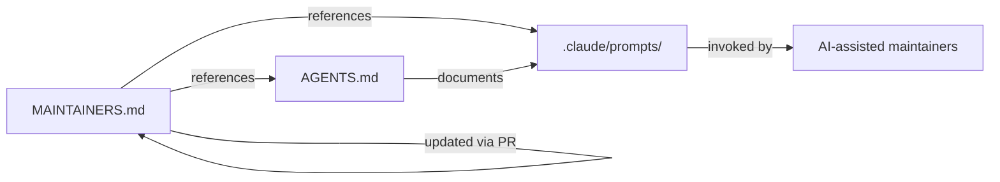

# Root — MAINTAINERS.md

# MAINTAINERS.md

## Purpose

`MAINTAINERS.md` is the governance file of record for who maintains the LibreFang repository and what those maintainers are expected to do. It is not executable code — it functions as a contract between the project's contributors, admins, and any automated tooling that references maintainer responsibilities.

The file serves three audiences:

- **Contributors** — to know who reviews their work and what standards apply.
- **Maintainers / admins** — to have a written, agreed-upon set of responsibilities.
- **AI-assisted maintainers** — as a pointer to role-specific prompt checklists that encode the same responsibilities in machine-actionable form.

## Current Governance State

LibreFang is described as being mid-transition from a fork into a standalone community project. During this interim period, **repository admins are acting as the de facto maintainer set**. No individual maintainers are listed by name or handle in the file itself; instead, the document defers to the admin role until a broader group is formally published.

This means:

- There is no named maintainer list to parse or depend on programmatically today.
- Any tooling that reads `MAINTAINERS.md` for CODEOWNERS-style logic should fall back to admin-level access.
- The file is expected to change when the transition completes.

## Maintainer Responsibilities

The file defines four core duties:

| Responsibility | Description |
|---|---|
| **Pull request review** | Reviews should happen in a timely manner. No specific SLA is codified in the file. |
| **Attribution preservation** | When maintainers accept or adapt community work, original authorship must be retained. |
| **Documentation accuracy** | Release notes and governance documents must be kept current. |
| **Security & regression triage** | Reports of security issues or regressions must be triaged quickly. |

### AI-Assisted Maintenance Hooks

Each responsibility maps to a self-contained prompt checklist under `.claude/prompts/`. These prompts are intended for AI-assisted maintainers (e.g., a Claude-based agent operating in a maintainer role):

| Prompt | Responsibility |
|---|---|
| `pr-maintainer` | Pull request review workflow |
| `release-maintainer` | Release notes and governance doc upkeep |
| `ghsa-maintainer` | Security/advisory (GHSA) triage |

The file directs readers to `AGENTS.md → Maintainer prompts` for details on how these prompts are structured and invoked.

## Adding New Maintainers

The file defines a lightweight, PR-based onboarding process:

1. A candidate must demonstrate a history of **constructive reviews**, **merged contributions**, and **reliable follow-through on user-facing issues**.
2. A nomination is made by opening a pull request that **updates this very file**.
3. The PR is reviewed under the same standards as any other contribution.

There is no separate nomination form, voting mechanism, or off-repo process described. Governance change is itself a code change.

## Relationship to Other Files

The file has no runtime dependencies, no imports, and no callers. Its connections are purely documentary:

- **`.claude/prompts/`** — contains the three named prompt checklists (`pr-maintainer`, `release-maintainer`, `ghsa-maintainer`).
- **`AGENTS.md`** — the canonical documentation for how maintainer prompts are structured and used; `MAINTAINERS.md` is an entry point that defers detail there.
- **Itself** — the file is self-modifying by design; the accepted mechanism for changing governance is a PR that edits `MAINTAINERS.md`.

## Practical Notes for Contributors

- **Don't expect a named maintainer list yet.** If you need a reviewer, ping the repo admins directly.
- **Security reports** should follow whatever disclosure process is documented elsewhere (e.g., a `SECURITY.md`); `MAINTAINERS.md` only commits maintainers to *triaging quickly*, not to a specific intake channel.
- **If you're an AI agent**, read `AGENTS.md` before acting on anything referenced here. The prompt checklists, not this file, are the operational source of truth for automated maintenance workflows.