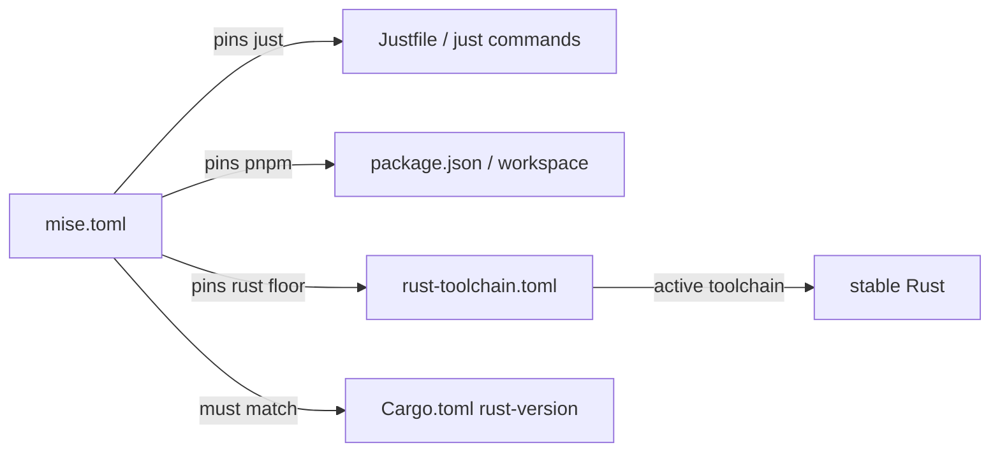

# Root — mise.toml

# mise.toml

## Purpose

`mise.toml` is the root configuration file for [mise](https://mise.jdx.dev/) (a polyglot tool version manager and task runner). It declares the **pinned versions** of external development tools that every contributor needs installed in their local environment. When a developer runs `mise install` (or opens the repository with mise activated), the tools listed here are provisioned automatically—no manual installs, no version drift.

This file is the single source of truth for "which versions of these tools does this project expect?"

## Managed Tools

| Tool    | Pinned Version | Role in the project                         |
|---------|---------------|---------------------------------------------|
| `just`  | `1.48`        | Command runner used for task automation      |
| `pnpm`  | `10.33`       | JavaScript/TypeScript package manager        |
| `rust`  | `1.94.1`      | Rust toolchain **floor** (see below)         |

## The Rust Version Nuance

The `rust` entry deserves special attention because it interacts with two other configuration sources:

```
rust-toolchain.toml  ──►  Controls the *active* toolchain (currently `stable`)
mise.toml            ──►  Controls the *minimum installed* floor (1.94.1)
Cargo.toml           ──►  Declares the workspace MSRV via rust-version
```

mise guarantees that **at least** Rust `1.94.1` is installed when bootstrapping. However, the toolchain that `cargo` actually invokes is determined by `rust-toolchain.toml`, which currently pins `stable`. This means:

- **`mise.toml`'s rust version is a floor, not the build version.** Its job is to ensure the local environment has a Rust compiler new enough to not trip the MSRV check.
- **It must match the workspace MSRV** declared in `[workspace.package].rust-version` inside `Cargo.toml`. If the mise floor falls *below* the MSRV, cargo emits an immediate `rustc` version error on bootstrap—a confusing failure mode that looks like a compiler bug rather than a config drift.

> **When updating the MSRV:** Update `rust-version` in `Cargo.toml` **and** the `rust` entry here in the same change. These two values must stay in lockstep.

## How It Connects to the Rest of the Repository



- **`just`** supports the project's `Justfile` (or any `just`-based task definitions). Without the correct version, task definitions may use syntax or features that don't exist in older releases.
- **`pnpm`** supports the JavaScript/TypeScript workspace. Pinning prevents lockfile incompatibilities and behavioral differences across pnpm major versions.
- **`rust`** ensures the bootstrapped environment can compile the project without MSRV errors, even though the day-to-day toolchain is governed by `rust-toolchain.toml`.

## Developer Workflow

**First-time setup:**

```sh
mise install   # installs just 1.48, pnpm 10.33, rust 1.94.1
```

After this, the tools are available in your shell (assuming mise's shims or activation hook are in place).

**Upgrading a pinned version:**

1. Update the version string in `mise.toml`.
2. Run `mise install` to provision the new version locally.
3. Verify any downstream config (e.g., `Cargo.toml` MSRV, lockfile regeneration, Justfile syntax compatibility).
4. Commit `mise.toml` alongside any lockfile or config changes.

## Design Constraints

- **No `[env]` or task definitions here.** This file is intentionally scoped to tool versioning only. Environment variables and task automation live elsewhere (e.g., `Justfile`, `.env` files, or `mise.toml` tasks in a different section if added later).
- **Versions are exact, not ranges.** Each entry uses a precise version string to guarantee reproducibility across all contributor machines and CI environments.