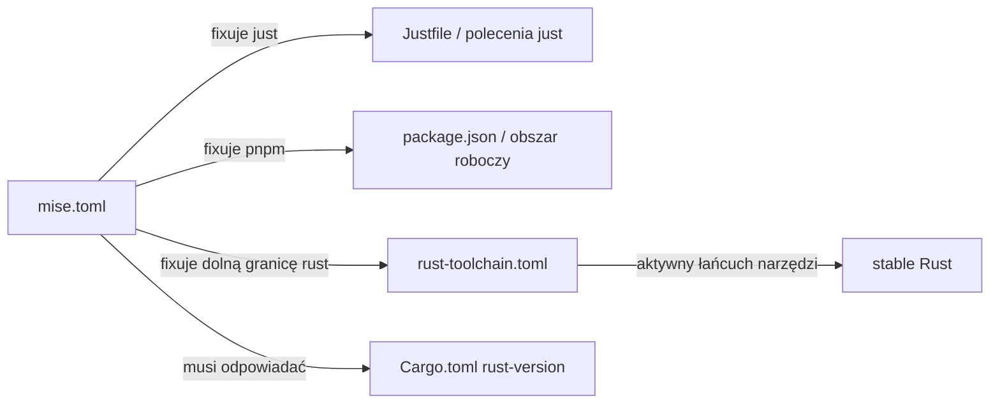

# Root — mise.toml

# mise.toml

## Przeznaczenie

`mise.toml` to główny plik konfiguracyjny dla narzędzia [mise](https://mise.jdx.dev/) (wielojęzycznego menedżera wersji narzędzi i uruchamiacza zadań). Deklaruje on **zafiksowane wersje** zewnętrznych narzędzi deweloperskich, które każdy współtwórca musi mieć zainstalowane w swoim środowisku lokalnym. Gdy deweloper uruchomi `mise install` (lub otworzy repozytorium z aktywowanym mise), narzędzia wymienione tutaj są instalowane automatycznie — bez ręcznej instalacji, bez rozjazdów wersji.

Ten plik jest jedynym źródłem prawdy dla pytania „jakich wersji tych narzędzi wymaga ten projekt?"

## Zarządzane narzędzia

| Narzędzie    | Zafiksowana wersja | Rola w projekcie                                |
|--------------|---------------------|--------------------------------------------------|
| `just`       | `1.48`              | Uruchamiacz poleceń używany do automatyzacji zadań |
| `pnpm`       | `10.33`             | Menedżer pakietów JavaScript/TypeScript           |
| `rust`       | `1.94.1`            | **Dolna granica** łańcucha narzędzi Rust (patrz niżej) |

## Niuanse wersji Rust

Wpis `rust` wymaga szczególnej uwagi, ponieważ współdziała z dwoma innymi źródłami konfiguracji:

```
rust-toolchain.toml  ──►  Kontroluje *aktywny* łańcuch narzędzi (obecnie `stable`)
mise.toml            ──►  Kontroluje *minimalną zainstalowaną* dolną granicę (1.94.1)
Cargo.toml           ──►  Deklaruje MSRV obszaru roboczego poprzez rust-version
```

mise gwarantuje, że przy inicjalizacji zainstalowany jest **co najmniej** Rust `1.94.1`. Łańcuch narzędzi faktycznie wywoływany przez `cargo` jest jednak określany przez `rust-toolchain.toml`, który obecnie fixuje `stable`. Oznacza to:

- **Wersja rust w `mise.toml` to dolna granica, a nie wersja buildu.** Jej zadaniem jest zapewnienie, że środowisko lokalne posiada sufficiently nowy kompilator Rust, aby nie naruszyć sprawdzenia MSRV.
- **Musi odpowiadać MSRV obszaru roboczego** zadeklarowanemu w `[workspace.package].rust-version` w pliku `Cargo.toml`. Jeśli dolna granica mise spadnie *poniżej* MSRV, cargo przy inicjalizacji natychmiast zgłosi błąd wersji `rustc` — mylący tryb awarii wyglądający jak błąd kompilatora, a nie rozjazd konfiguracji.

> **Podczas aktualizacji MSRV:** Zaktualizuj `rust-version` w `Cargo.toml` **oraz** wpis `rust` tutaj w tej samej zmianie. Te dwie wartości muszą pozostać zsynchronizowane.

## Jak to łączy się z resztą repozytorium



- **`just`** obsługuje plik `Justfile` projektu (lub dowolne definicje zadań oparte na `just`). Bez poprawnej wersji definicje zadań mogą używać składni lub funkcji niedostępnych w starszych wydaniach.
- **`pnpm`** obsługuje obszar roboczy JavaScript/TypeScript. Fiksowanie zapobiega niezgodnościom pliku blokady i różnicom w zachowaniu pomiędzy głównymi wersjami pnpm.
- **`rust`** zapewnia, że zainicjowane środowisko może skompilować projekt bez błędów MSRV, nawet jeśli bieżący łańcuch narzędzi jest zarządzany przez `rust-toolchain.toml`.

## Przepływ pracy dewelopera

**Pierwsze uruchomienie:**

```sh
mise install   # instaluje just 1.48, pnpm 10.33, rust 1.94.1
```

Po tym kroku narzędzia są dostępne w powłoce (zakładając, że shims mise lub hook aktywacji są włączone).

**Aktualizacja zafiksowanej wersji:**

1. Zaktualizuj ciąg wersji w `mise.toml`.
2. Uruchom `mise install`, aby zainstalować nową wersję lokalnie.
3. Zweryfikuj wszelkie konfiguracje zależne (np. MSRV w `Cargo.toml`, ponowne wygenerowanie pliku blokady, kompatybilność składni Justfile).
4. Zatwierdź `mise.toml` wraz z ewentualnymi zmianami pliku blokady lub konfiguracji.

## Ograniczenia projektowe

- **Brak sekcji `[env]` ani definicji zadań.** Ten plik jest celowo ograniczony wyłącznie do zarządzania wersjami narzędzi. Zmienne środowiskowe i automatyzacja zadań znajdują się w innym miejscu (np. `Justfile`, pliki `.env` lub zadania `mise.toml` w osobnej sekcji, jeśli zostaną dodane później).
- **Wersje są dokładne, a nie zakresowe.** Każdy wpis używa precyzyjnego ciągu wersji, aby zagwarantować powtarzalność na wszystkich maszynach współtwórców i w środowiskach CI.
