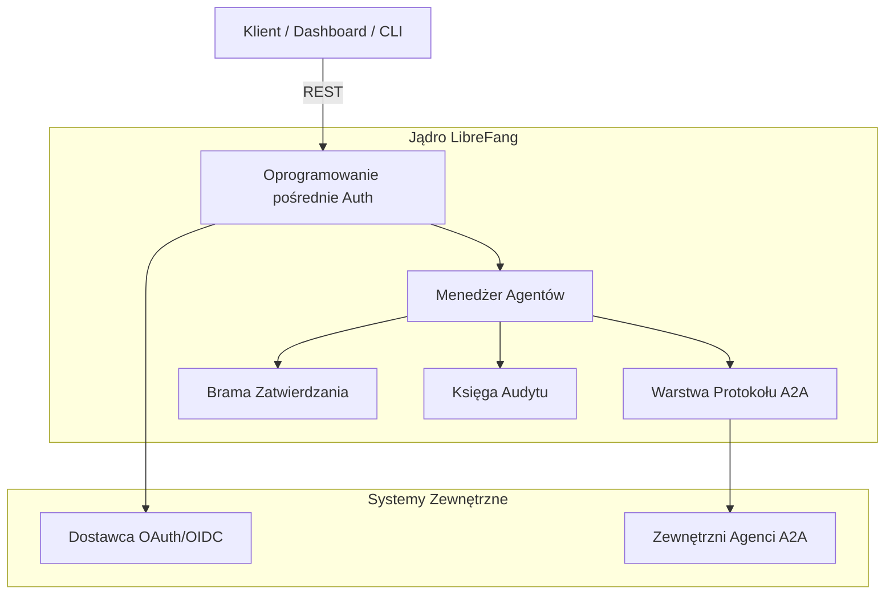
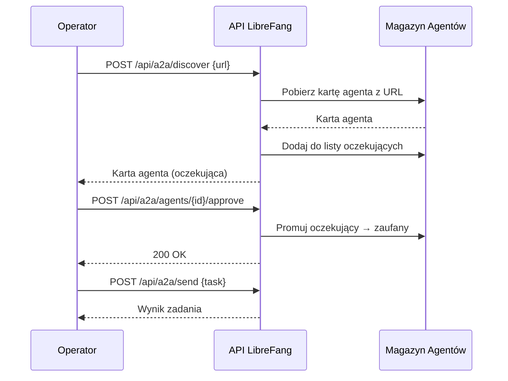

# Root — openapi.json

# API LibreFang — Specyfikacja OpenAPI

## Przegląd

`openapi.json` to kanoniczny kontrakt czytelny maszynowo dla REST API **Systemu Operacyjnego Agentów LibreFang** (wersja `2026.7.31`, OpenAPI 3.1.0). Definiuje każdy punkt końcowy HTTP, jaki jądro udostępnia do zarządzania agentami AI, ich narzędziami, sesjami, pamięcią, komunikacją międzyagentową, uwierzytelnianiem i śladami audytu.

Specyfikacja jest zorganizowana w sześć domen funkcjonalnych za pomocą tagów OpenAPI:

| Tag | Domena |
|------|--------|
| `agents` | Cykl życia agenta, konfiguracja, sesje, narzędzia, metryki, pliki |
| `a2a` | Protokół Agent-to-Agent (lokalne karty, zewnętrzne odkrywanie, routing zadań) |
| `approvals` | Obieg zatwierdzania z udziałem człowieka do wykonywania narzędzi |
| `auth` | OAuth2/OIDC, poświadczenia dashboardu, passkey (WebAuthn), introspekcja tokenów |
| `memory` | Import/eksport pamięci KV na agenta |
| `system` | Zapytania dziennika audytu, eksport, weryfikacja łańcucha |

---

## Architektura w pigułce

---

## Zarządzanie cyklem życia agenta

Przestrzeń `/api/agents` jest największym obszarem funkcjonalnym. Opiera się na zorientowanym na zasoby projekcie, w którym każdy agent jest adresowalny przez UUID i obsługuje zagnieżdżone podzasoby.

### Podstawowe operacje CRUD

- **`POST /api/agents`** (`spawn_agent`) — Uruchamia nowego agenta z manifestu `SpawnRequest`. Zwraca `SpawnResponse`.
- **`GET /api/agents`** (`list_agents`) — Paginacyjna lista z filtrowaniem (`q`, `status`), sortowaniem (`sort`, `order`) i paginacją (`limit`, `offset`).
- **`GET /api/agents/{id}`** (`get_agent`) — Szczegóły pojedynczego agenta.
- **`PATCH /api/agents/{id}`** (`patch_agent`) — Częściowa aktualizacja nazwy, opisu, modelu, podpowiedzi systemowej.
- **`DELETE /api/agents/{id}`** (`kill_agent`) — Zabija agenta **i** usuwa jego kanoniczne powiązanie UUID. Wymaga jawnego `confirm=true`.

### Rejestr kanonicznych UUID (#4614)

Tożsamość agenta opiera się na trwałym mapowaniu `name → canonical_uuid` przechowywanym w `<home_dir>/agent_identities.toml`. Zapewnia to, że ponowne uruchomienie agenta pod tą samą nazwą trafia na ten sam UUID. Kluczowe punkty końcowe:

- **`GET /api/agents/identities`** — Zwraca pełny rejestr, posortowany po nazwie dla deterministycznego wyniku.
- **`POST /api/agents/identities/{name}/reset`** — Usuwa powiązanie UUID dla nazwy. Wymaga `confirm=true`; sam agent **nie jest** zabijany (operatorzy muszą osobno wywołać `DELETE /api/agents/{id}`, jeśli wymagane jest też zabicie w czasie wykonywania).
- **`DELETE /api/agents/{id}`** — Ścieżka destrukcyjna: z `confirm=true`, zabija agenta **i** usuwa kanoniczny UUID. Wewnętrzne resetowania cyklu życia (hot reload, restart po panice) pomijają to i zachowują powiązanie, wywołując `kill_agent` bezpośrednio.

> **Ważne:** `404` przy DELETE jest zarezerwowane wyłącznie dla nieprawidłowo sformułowanych UUID. Usunięcie już nieistniejącego agenta zwraca `200 OK` z `{"status": "already-deleted"}`, co pozwala na bezpieczne ponowienia zgodnie z RFC 9110 §9.2.2.

### Operacje zbiorcze

| Punkt końcowy | Operacja |
|----------|-----------|
| `POST /api/agents/bulk` | Utworzenie wielu agentów (`BulkCreateRequest`) |
| `DELETE /api/agents/bulk` | Usunięcie wielu agentów (`BulkAgentIdsRequest`) |
| `POST /api/agents/bulk/start` | Ustawienie wielu agentów w tryb Full |
| `POST /api/agents/bulk/stop` | Zatrzymanie bieżących uruchomień wielu agentów |

### Obsługa wiadomości i sesji

Agenty obsługują zarówno komunikację synchroniczną, jak i strumieniową:

- **`POST /api/agents/{id}/message`** — Synchroniczna wymiana wiadomości (`MessageRequest` → `MessageResponse`).
- **`POST /api/agents/{id}/message/stream`** — Strumieniowa odpowiedź SSE.
- **`POST /api/agents/{id}/inject`** — Przerywa aktywną pętlę narzędzi, aby wstrzyknąć wiadomość między wywołaniami narzędzi. Zwraca `{"injected": true/false}`. Może zwrócić `503`, gdy kanały wstrzykiwania są pełne (#3575).
- **`POST /api/agents/{id}/push`** — Wysyła proaktywną wiadomość wychodzącą do odbiorcy na kanale (Telegram, Slack, e-mail) bez przechodzenia przez pętlę agenta.

Sesje są pełnoprawnymi zasobami:

| Punkt końcowy | Przeznaczenie |
|----------|---------|
| `GET /api/agents/{id}/sessions` | Lista wszystkich sesji |
| `POST /api/agents/{id}/sessions` | Utworzenie nowej sesji z opcjonalną etykietą |
| `GET /api/agents/{id}/session` | Historia bieżącej/aktywnej sesji |
| `POST /api/agents/{id}/sessions/{session_id}/switch` | Przełączenie aktywnej sesji |
| `POST /api/agents/{id}/sessions/{session_id}/stop` | Anulowanie pojedynczej pętli `(agent, sesja)` bez wpływu na współbieżne sesje |
| `GET /api/agents/{id}/sessions/{session_id}/stream` | **Multi-klientowe podłączenie SSE** — dowolna liczba klientów może subskrybować zdarzenia aktywnej tury |
| `GET /api/agents/{id}/sessions/{session_id}/export` | Eksport sesji do hibernacji |
| `POST /api/agents/{id}/sessions/import` | Import wcześniej eksportowanej sesji |
| `GET /api/agents/{id}/sessions/{session_id}/trajectory` | Ślad audytu z ograniczeniami prywatności (`format=json` lub `format=jsonl`) |
| `POST /api/agents/{id}/session/compact` | Wyzwolenie kompakcji kontekstu LLM |
| `POST /api/agents/{id}/session/reboot` | Twardy restart (pełne czyszczenie, bez podsumowania) |
| `POST /api/agents/{id}/session/reset` | Reset bieżącej sesji |
| `GET /api/agents/{id}/session/context` | Wskaźnik wykorzystania okna kontekstu (`SessionContextResponse`) |

### Konfiguracja i zarządzanie narzędziami

- **`PATCH /api/agents/{id}/config`** — Aktualizuje w locie nazwę, opis, podpowiedź systemową, tożsamość i model za pomocą `PatchAgentConfigRequest`.
- **`PATCH /api/agents/{id}/identity`** — Aktualizuje pola wizualnej tożsamości (`UpdateIdentityRequest`). Używa semantyki PATCH, gdzie `null` oznacza „nie podano", a pominięte pola zachowują istniejące wartości.
- **`PUT /api/agents/{id}/tools`** — Aktualizuje przestrzeń przyznanych narzędzi. Zobacz [Model Możliwości Narzędzi](#tool-capability-model-6609) poniżej.
- **`PUT /api/agents/{id}/mode`** — Zmienia tryb operacyjny (`SetModeRequest`).
- **`PUT /api/agents/{id}/model`** — Zmienia model/dostawcę LLM.
- **`PUT /api/agents/{id}/skills`** / **`PUT /api/agents/{id}/channels`** / **`PUT /api/agents/{id}/mcp_servers`** — Zarządzanie listami dozwolonych dla umiejętności, kanałów i serwerów MCP odpowiednio.
- **`POST /api/agents/{id}/reload`** — Ponowne odczytanie `agent.toml` z dysku w celu podjęcia ręcznych edycji bez restartu demona.
- **`POST /api/agents/{id}/clone`** — Klonowanie agenta z jego plikami obszaru roboczego (`CloneAgentRequest`).

#### Model Możliwości Narzędzi (#6609)

Dostęp do narzędzi opiera się na dwuwarstwowym modelu:

1. **`capabilities_tools`** — Przestrzeń przyznań. Definiuje, jakich narzędzi agent *może* używać.
2. **`tool_allowlist` / `tool_blocklist`** — Stosowane *po* przestrzeni przyznań jako zawężenie retencji. Wpis na liście dozwolonych, który nazywa narzędzie nieobecne w `capabilities_tools`, niczego nie przyznaje. **Narzędzia MCP są wyjątkiem** — nie są filtrowane przez `capabilities_tools`, więc wpis `mcp_*` na liście dozwolonych bezpośrednio wybiera spośród nich.

Odpowiedź `PUT /api/agents/{id}/tools` (`SetAgentToolsRequest`) zawiera tablicę `warnings` wymieniającą zapisane wpisy `tool_allowlist`, które udowodnialnie nie mogą dopuścić żadnego narzędzia, pomagając operatorom wykryć bezużyteczną konfigurację.

### Obserwowalność

| Punkt końcowy | Zwraca |
|----------|---------|
| `GET /api/agents/{id}/metrics` | Zagregowane metryki: liczba wiadomości, użycie tokenów, liczba wykonanych narzędzi, błędy, średni czas odpowiedzi, koszt |
| `GET /api/agents/{id}/stats` | 24-godzinna konsolidacja KPI (`AgentStats24hView`): sesje, koszt, opóźnienie P95, aktywne teraz |
| `GET /api/agents/{id}/events` | Zdarzenia na poziomie tury z `usage_events` (wysyłka modelu, opóźnienie, tokeny, koszt) — zasila zakładkę Dzienniki w dashboardzie (`AgentEventsResponse`) |
| `GET /api/agents/{id}/logs` | Strukturalne dzienniki wykonania z filtrowaniem `n`, `level`, `offset` |
| `GET /api/agents/{id}/traces` | Ślady decyzyjne pokazujące, dlaczego każde narzędzie zostało wybrane w najnowszej pętli |
| `GET /api/agents/{id}/runtime` | Migawka aktywnych pętli `(agent, sesja)` |
| `GET /api/agents/{id}/deliveries` | Ostatnie potwierdzenia doręczenia |

### Konfiguracja czasu wykonania agenta Hand

Specjalne punkty końcowe dla agentów zarządzanych przez podsystem „hand":

- **`PATCH /api/agents/{id}/hand-runtime-config`** — Nadpisanie tylko w czasie wykonania dla agentów hand. Stosuje się do aktywnego manifestu i jest utrwalane w `hand_state.json`. Trimowanie białych znaków na wszystkich polach tekstowych; puste ciągi w `model`/`provider` oznaczają „pozostaw bez zmian"; puste ciągi na dopuszczających wartość null sekretach (`api_key_env`, `base_url`) czyszczą nadpisanie.
- **`DELETE /api/agents/{id}/hand-runtime-config`** — Usuwa wszystkie nadpisania czasu wykonania, przywracając domyślne z `HAND.toml`. Idempotentne (zwraca `204`).

---

## Protokół Agent-to-Agent (A2A)

Przestrzeń A2A umożliwia zarówno lokalne odkrywanie kart agentów, jak i komunikację z zewnętrznymi agentami zgodnymi z A2A.

### Lokalne A2A

| Punkt końcowy | Przeznaczenie |
|----------|---------|
| `GET /.well-known/agent.json` | Standardowa karta agenta A2A |
| `GET /a2a/agents` | Lista wszystkich lokalnych kart agentów A2A |
| `POST /a2a/tasks/send` | Przesłanie zadania do lokalnego agenta przez A2A |
| `GET /a2a/tasks/{id}` | Pobranie statusu zadania z magazynu zadań |
| `POST /a2a/tasks/{id}/cancel` | Anulowanie śledzonego zadania |

### Zewnętrzne odkrywanie A2A i zatwierdzanie (#3786)

Komunikacja z zewnętrznymi agentami następuje według przepływu odkryj → zatwierdź → wyślij:

Odkryci agenci wchodzą w stan **oczekujący** i nie mogą odbierać zadań, dopóki operator ich jawnie nie zatwierdzi. `{id}` do zatwierdzenia jest URL-zakodowanym adresem odkrycia.

- **`GET /api/a2a/agents`** — Zwraca `{trusted: [...], pending: [...]}`.
- **`GET /api/a2a/agents/{id}`** — Wyszukiwanie po indeksie, URL lub nazwie.
- **`POST /api/a2a/send`** — Wysyła zadanie do zaufanego zewnętrznego agenta. Uznaje `Idempotency-Key` (#3637): ten sam klucz + to samo ciało odtwarza buforowaną odpowiedź; inne ciało pod tym samym kluczem zwraca `409 Conflict`.
- **`GET /api/a2a/tasks/{id}/status`** — Zapytanie o status zewnętrznego zadania (wymaga `?url=` zewnętrznego agenta).

---

## Brama zatwierdzania

System zatwierdzania zapewnia nadzór z udziałem człowieka nad wykonywaniem narzędzi przez agentów.

### Podstawowe operacje

| Punkt końcowy | Operacja |
|----------|-----------|
| `GET /api/approvals` | Lista oczekujących/ostatnich zatwierdzeń (nazwy pól przekształcone dla dashboardu: `action_summary → action`, `agent_id → agent_name`, `requested_at → created_at`) |
| `GET /api/approvals/count` | Lekka liczba oczekujących dla odznak powiadomień |
| `POST /api/approvals/{id}/approve` | Zatwierdzenie pojedynczego żądania |
| `POST /api/approvals/{id}/reject` | Odrzucenie pojedynczego żądania |
| `POST /api/approvals/{id}/modify` | Modyfikacja oczekującego żądania |
| `POST /api/approvals/batch` | Zbiorcze rozstrzygnięcie wielu żądań |

### Operacje w zakresie sesji

| Punkt końcowy | Zachowanie |
|----------|----------|
| `GET /api/approvals/session/{session_id}` | Lista wszystkich oczekujących zatwierdzeń dla sesji (odzwierciedla `has_blocking_approval(session_key)`) |
| `POST /api/approvals/session/{session_id}/approve_all` | Atomowe zatwierdzenie wszystkich oczekujących zatwierdzeń sesji. Może zwrócić `400`, jeśli wymagany jest TOTP, lub `409`, jeśli zestaw oczekujących uległ zmianie od momentu wydania (`ApproveAllForSessionRequest`) |
| `POST /api/approvals/session/{session_id}/reject_all` | Atomowe odrzucenie wszystkich (odzwierciedla `resolve_gateway_approval(session_key, "deny", resolve_all=True)`) |

### Audyt

- **`GET /api/approvals/audit`** — Filtrowany dziennik audytu z `agent_id`, `tool_name`, paginacją.

Rozstrzygnięcie zatwierdzenia jest idempotentne: rozstrzygnięcie już rozstrzygniętego żądania zwraca `409 Conflict`.

---

## Uwierzytelnianie

LibreFang obsługuje wiele trybów uwierzytelniania, określanych dynamicznie przez **`GET /api/auth/dashboard-check`**, który zwraca jedną z wartości: `none`, `api_key`, `credentials` lub `hybrid`.

### Przepływ OAuth2/OIDC

1. **`GET /api/auth/login/{provider}`** — Przekierowuje do nazwanego dostawcy OAuth.
2. **`GET /api/auth/callback`** (przeglądarka) / **`POST /api/auth/callback`** (`CallbackBody`) — Obsługuje wywołanie zwrotne kodu autoryzacji.
3. **`GET /api/auth/providers`** — Wyświetla skonfigurowanych dostawców. Zwraca tylko `id` + `display_name` — zakresy OAuth nigdy nie są ujawniane przez ten punkt końcowy, niezależnie od uprawnień wywołującego.
4. **`POST /api/auth/introspect`** — Walidacja tokena RFC 7662 zwracająca `{"active": true/false, ...}`.

### Uwierzytelnianie poświadczeniami dashboardu

- **`POST /api/auth/dashboard-login`** — Waliduje poświadczenia przy użyciu Argon2id (z przezroczystym powrotem do starszego czystego tekstu). Zwraca token sesji lub sygnalizuje `requires_totp` dla 2FA.
- **`POST /api/auth/change-password`** (`ChangePasswordRequest`) — Aktualizuje hasło i/lub nazwę użytkownika. Unieważnia wszystkie istniejące sesje po sukcesie.
- **`POST /api/auth/logout`** — Unieważnia sesję i czyści plik cookie `librefang_session`. Akceptuje token przez cookie, `Authorization: Bearer` lub `X-API-Key`.

### Passkey (WebAuthn)

Pełna obsługa ceremonii WebAuthn z przepływami rejestracji i uwierzytelniania:

| Punkt końcowy | Faza |
|----------|-------|
| `POST /api/auth/passkey/registration-options` | Start: zwraca `ceremony_id` + `PublicKeyCredentialCreationOptions` |
| `POST /api/auth/passkey/registration-verify` | Zakończenie: weryfikacja atestacji, utrwalenie poświadczenia |
| `POST /api/auth/passkey/authentication-options` | Start logowania: zwraca `PublicKeyCredentialRequestOptions` |
| `POST /api/auth/passkey/authentication-verify` | Zakończenie logowania: weryfikacja asercji, wytworzenie sesji |
| `GET /api/auth/passkey/credentials` | Lista zarejestrowanych passkey (tylko metadane) |
| `DELETE /api/auth/passkey/credentials/{id}` | Odwołanie passkey po base64url id poświadczenia |

Wszystkie operacje passkey są ograniczone do uwierzytelnionej strony. Blob poświadczenia nigdy nie jest ujawniany. Zwraca `503`, gdy logowanie passkey nie jest włączone.

---

## Zarządzanie pamięcią

- **`GET /api/agents/{id}/memory/export`** — Eksportuje całą pamięć KV jako JSON.
- **`POST /api/agents/{id}/memory/import`** — Importuje pamięć KV z ciała JSON z obiektem `kv`. Opcjonalnie akceptuje `clear_existing: true`.

> **Kontrakt odpowiedzi:** Klienci **muszą** badać `body.status`, nie tylko kod statusu HTTP. Odpowiedź `200` może wskazywać na:
> - `{"status": "imported", "keys_imported": N}` — pełny sukces
> - `{"status": "partial", "keys_imported": N, "failed_keys": [...]}` — błąd warstwy podłoża dla niektórych kluczy
>
> Punkt końcowy celowo unika `207 Multi-Status`, aby nie łamać wywołujących, którzy warunkują na `status == 200`. Traktuj każdy nie-`"imported"` status ciała jako miękką awarię wymagającą ponowienia dla wymienionych kluczy.

---

## System audytu

| Punkt końcowy | Przeznaczenie |
|----------|---------|
| `GET /api/audit/query` | Filtrowane zapytanie tylko dla administratorów (użytkownik, akcja, agent, kanał, zakres dat, limit do 5000) |
| `GET /api/audit/export` | Eksport jako JSON lub CSV (twardy limit 50 000 wierszy) |
| `GET /api/audit/recent` | Ostatnie wpisy (tablica) |
| `GET /api/audit/verify` | Weryfikacja integralności łańcucha audytu |

---

## Wzorce przekrojowe

### Obsługa Idempotency-Key (#3637)

Kilka mutujących punktów końcowych uznaje nagłówek `Idempotency-Key`:

- `POST /api/agents` (uruchomienie)
- `POST /api/a2a/send` (wysyłka zewnętrznego zadania)

**Semantyka:** Zduplikowane żądanie z tym samym kluczem i identycznym ciałem odtwarza buforowaną odpowiedź. Inne ciało pod tym samym kluczem jest odrzucane z `409 Conflict`.

### Wymagania potwierdzenia

Operacje destrukcyjne wymagają jawnego `confirm=true` (akceptowane jako parametr zapytania lub pole ciała JSON):

| Operacja | Bez potwierdzenia | Z potwierdzeniem |
|-----------|----------------|---------------|
| `DELETE /api/agents/{id}` | `409 Conflict` + ostrzeżenie o utracie danych | Zabija agenta + usuwa kanoniczny UUID |
| `POST /api/agents/identities/{name}/reset` | `409 Conflict` + ostrzeżenie o utracie danych | Usuwa powiązanie UUID |

### Pliki obszaru roboczego

Agenty mają przestrzeń roboczą plików tożsamości dostępną przez:

- `GET /api/agents/{id}/files` — Lista plików
- `GET /api/agents/{id}/files/{filename}` — Odczyt pliku
- `PUT /api/agents/{id}/files/{filename}` — Zapis pliku (`SetAgentFileRequest`)
- `DELETE /api/agents/{id}/files/{filename}` — Usunięcie pliku

### Przesyłanie pliku

`POST /api/agents/{id}/upload` akceptuje surowe bajty ciała z dwoma wymaganymi nagłówkami:
- `Content-Type` — typ MIME załącznika
- `X-Filename` — oryginalna nazwa pliku

### Multi-klientowe podłączenie strumienia sesji

`GET /api/agents/{id}/sessions/{session_id}/stream` pozwala dowolnej liczbie klientów subskrybować zdarzenia SSE z aktywnej tury. Późni subskrybenci zaczynają odbierać zdarzenia od momentu subskrypcji — migawki częściowych tur nie są odtwarzane. Umożliwia to dashboardowi, CLI i klientom desktopowym jednoczesne obserwowanie tej samej tury agenta.

---

## Kluczowe odniesienia schematów

Specyfikacja definiuje następujące nazwane schematy (poza ogólnymi przejściami `JsonObject`/`JsonArray` używanymi dla luźno typowanych punktów końcowych):

| Schemat | Używany przez |
|--------|---------|
| `SpawnRequest` / `SpawnResponse` | Tworzenie agenta |
| `BulkCreateRequest` / `BulkAgentIdsRequest` | Operacje zbiorcze |
| `MessageRequest` / `MessageResponse` | Obsługa wiadomości agenta |
| `InjectMessageRequest` / `InjectMessageResponse` | Wstrzykiwanie do pętli narzędzi |
| `PushMessageRequest` | Proaktywne wysyłanie na kanał |
| `SetModeRequest` | Zmiana trybu operacyjnego |
| `PatchAgentConfigRequest` | Konfiguracja agenta / konfiguracja czasu wykonania hand |
| `UpdateIdentityRequest` | Aktualizacja wizualnej tożsamości |
| `SetAgentToolsRequest` | Lista dozwolonych/zablokowanych narzędzi |
| `CloneAgentRequest` | Klonowanie agenta |
| `SetAgentFileRequest` | Zapis pliku obszaru roboczego |
| `AgentIdentityRow` | Wykaz rejestru UUID |
| `AgentStats24hView` | 24-godzinna konsolidacja KPI |
| `AgentEventsResponse` | Dziennik zdarzeń na poziomie tury |
| `SessionContextResponse` | Wykorzystanie okna kontekstu |
| `ApproveAllForSessionRequest` | Zbiorcze zatwierdzenie sesji |
| `ChangePasswordRequest` | Aktualizacja poświadczeń |
| `CallbackBody` | Wywołanie zwrotne OAuth (POST) |

---

## Konwencje

- **Typ zawartości:** Wszystkie punkty końcowe JSON używają `application/json`. Eksport trajectory obsługuje `format=jsonl` (NDJSON z `Content-Type: application/x-ndjson`). Przesyłanie pliku używa `application/octet-stream`.
- **Model błędów:** Kody statusu HTTP są autorytatywne dla błędów na poziomie transportu. Niektóre punkty końcowe (zwłaszcza import pamięci) osadzają wtórne pole `status` w ciele odpowiedzi dla częściowych awarii na poziomie aplikacji.
- **Paginacja:** Parametry zapytania `limit` + `offset` wszędzie, z maksimum specyficznymi dla punktu końcowego udokumentowanymi dla każdej operacji.
- **Format ID agenta:** UUID. Nieprawidłowo sformułowane UUID zwracają `400`; brakujące agenty zwracają `404`.
