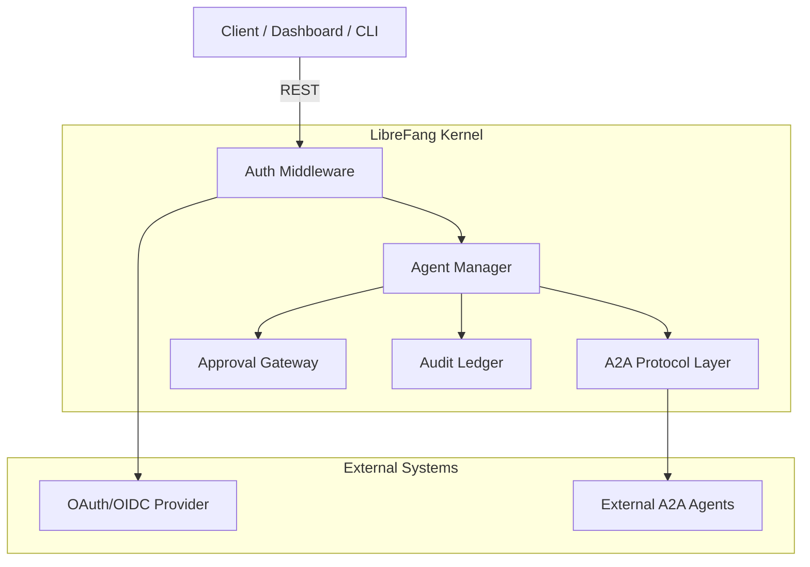
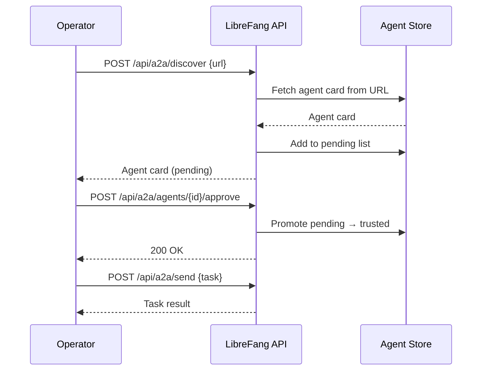

# Root — openapi.json

# LibreFang API — OpenAPI Specification

## Overview

`openapi.json` is the canonical machine-readable contract for the **LibreFang Agent Operating System** REST API (version `2026.7.31`, OpenAPI 3.1.0). It defines every HTTP endpoint the kernel exposes for managing AI agents, their tools, sessions, memories, inter-agent communication, authentication, and audit trails.

The specification is organized into six functional domains via OpenAPI tags:

| Tag | Domain |
|------|--------|
| `agents` | Agent lifecycle, configuration, sessions, tools, metrics, files |
| `a2a` | Agent-to-Agent protocol (local cards, external discovery, task routing) |
| `approvals` | Human-in-the-loop approval workflow for tool execution |
| `auth` | OAuth2/OIDC, dashboard credentials, passkey (WebAuthn), token introspection |
| `memory` | KV memory import/export per agent |
| `system` | Audit log query, export, chain verification |

---

## Architecture at a Glance

---

## Agent Lifecycle Management

The `/api/agents` surface is the largest functional area. It follows a resource-oriented design where each agent is addressable by UUID and supports nested sub-resources.

### Core CRUD

- **`POST /api/agents`** (`spawn_agent`) — Spawns a new agent from a `SpawnRequest` manifest. Returns `SpawnResponse`.
- **`GET /api/agents`** (`list_agents`) — Paginated listing with filtering (`q`, `status`), sorting (`sort`, `order`), and pagination (`limit`, `offset`).
- **`GET /api/agents/{id}`** (`get_agent`) — Single agent detail.
- **`PATCH /api/agents/{id}`** (`patch_agent`) — Partial update of name, description, model, system prompt.
- **`DELETE /api/agents/{id}`** (`kill_agent`) — Kills the agent **and** purges its canonical UUID binding. Requires explicit `confirm=true`.

### Canonical UUID Registry (#4614)

Agent identity is backed by a persistent `name → canonical_uuid` mapping stored in `<home_dir>/agent_identities.toml`. This ensures that re-spawning an agent under the same name lands on the same UUID. Key endpoints:

- **`GET /api/agents/identities`** — Returns the full registry, sorted by name for deterministic output.
- **`POST /api/agents/identities/{name}/reset`** — Drops the UUID binding for a name. Requires `confirm=true`; the agent itself is **not** killed (operators must call `DELETE /api/agents/{id}` separately if a runtime kill is also needed).
- **`DELETE /api/agents/{id}`** — The destructive path: with `confirm=true`, kills the agent **and** purges the canonical UUID. Internal lifecycle resets (hot reload, panic restart) bypass this and preserve the binding by calling `kill_agent` directly.

> **Important:** `404` on DELETE is reserved exclusively for malformed UUIDs. Deleting an already-gone agent returns `200 OK` with `{"status": "already-deleted"}`, making retries safe per RFC 9110 §9.2.2.

### Bulk Operations

| Endpoint | Operation |
|----------|-----------|
| `POST /api/agents/bulk` | Create multiple agents (`BulkCreateRequest`) |
| `DELETE /api/agents/bulk` | Delete multiple agents (`BulkAgentIdsRequest`) |
| `POST /api/agents/bulk/start` | Set multiple agents to Full mode |
| `POST /api/agents/bulk/stop` | Stop multiple agents' current runs |

### Messaging and Sessions

Agents support both synchronous and streaming communication:

- **`POST /api/agents/{id}/message`** — Synchronous message round-trip (`MessageRequest` → `MessageResponse`).
- **`POST /api/agents/{id}/message/stream`** — SSE streaming response.
- **`POST /api/agents/{id}/inject`** — Interrupts an active tool loop to inject a message between tool calls. Returns `{"injected": true/false}`. Can return `503` when injection channels are full (#3575).
- **`POST /api/agents/{id}/push`** — Sends a proactive outbound message to a channel recipient (Telegram, Slack, email) without going through the agent loop.

Sessions are first-class resources:

| Endpoint | Purpose |
|----------|---------|
| `GET /api/agents/{id}/sessions` | List all sessions |
| `POST /api/agents/{id}/sessions` | Create new session with optional label |
| `GET /api/agents/{id}/session` | Get current/active session history |
| `POST /api/agents/{id}/sessions/{session_id}/switch` | Switch active session |
| `POST /api/agents/{id}/sessions/{session_id}/stop` | Cancel a single `(agent, session)` loop without affecting concurrent sessions |
| `GET /api/agents/{id}/sessions/{session_id}/stream` | **Multi-client SSE attach** — any number of clients can subscribe to an in-flight turn's events |
| `GET /api/agents/{id}/sessions/{session_id}/export` | Export session for hibernation |
| `POST /api/agents/{id}/sessions/import` | Import a previously exported session |
| `GET /api/agents/{id}/sessions/{session_id}/trajectory` | Privacy-redacted audit trail (`format=json` or `format=jsonl`) |
| `POST /api/agents/{id}/session/compact` | Trigger LLM context compaction |
| `POST /api/agents/{id}/session/reboot` | Hard-reboot (full clear, no summary) |
| `POST /api/agents/{id}/session/reset` | Reset current session |
| `GET /api/agents/{id}/session/context` | Context-window usage indicator (`SessionContextResponse`) |

### Configuration and Tool Management

- **`PATCH /api/agents/{id}/config`** — Hot-updates name, description, system prompt, identity, and model via `PatchAgentConfigRequest`.
- **`PATCH /api/agents/{id}/identity`** — Updates visual identity fields (`UpdateIdentityRequest`). Uses PATCH semantics where `null` means "not provided" and omitted fields preserve existing values.
- **`PUT /api/agents/{id}/tools`** — Updates the tool grant surface. See [Tool Capability Model](#tool-capability-model-6609) below.
- **`PUT /api/agents/{id}/mode`** — Changes operational mode (`SetModeRequest`).
- **`PUT /api/agents/{id}/model`** — Changes the LLM model/provider.
- **`PUT /api/agents/{id}/skills`** / **`PUT /api/agents/{id}/channels`** / **`PUT /api/agents/{id}/mcp_servers`** — Manage allowlists for skills, channels, and MCP servers respectively.
- **`POST /api/agents/{id}/reload`** — Re-reads `agent.toml` from disk to pick up manual edits without restarting the daemon.
- **`POST /api/agents/{id}/clone`** — Clones an agent with its workspace files (`CloneAgentRequest`).

#### Tool Capability Model (#6609)

Tool access follows a two-layer model:

1. **`capabilities_tools`** — The grant surface. This defines what tools the agent *can* use.
2. **`tool_allowlist` / `tool_blocklist`** — Applied *after* the grant surface as a narrowing retain. An allowlist entry naming a tool absent from `capabilities_tools` grants nothing. **MCP tools are the exception** — they are not filtered by `capabilities_tools`, so an `mcp_*` allowlist entry directly selects among them.

The `PUT /api/agents/{id}/tools` response (`SetAgentToolsRequest`) includes a `warnings` array naming stored `tool_allowlist` entries that provably cannot admit any tool, helping operators catch inert configuration.

### Observability

| Endpoint | Returns |
|----------|---------|
| `GET /api/agents/{id}/metrics` | Aggregated metrics: message count, token usage, tool execution count, errors, avg response time, cost |
| `GET /api/agents/{id}/stats` | 24-hour KPI rollup (`AgentStats24hView`): sessions, cost, P95 latency, active-now |
| `GET /api/agents/{id}/events` | Turn-level events from `usage_events` (model dispatch, latency, tokens, cost) — backs the dashboard Logs tab (`AgentEventsResponse`) |
| `GET /api/agents/{id}/logs` | Structured execution logs with `n`, `level`, `offset` filtering |
| `GET /api/agents/{id}/traces` | Decision traces showing why each tool was selected in the most recent loop |
| `GET /api/agents/{id}/runtime` | Snapshot of in-flight `(agent, session)` loops |
| `GET /api/agents/{id}/deliveries` | Recent delivery receipts |

### Hand Agent Runtime Config

Special endpoints for agents managed by the "hand" subsystem:

- **`PATCH /api/agents/{id}/hand-runtime-config`** — Runtime-only override for hand agents. Applies to the live manifest and persists to `hand_state.json`. Whitespace trimming on all string fields; empty strings on `model`/`provider` mean "leave unchanged"; empty strings on nullable secrets (`api_key_env`, `base_url`) clear the override.
- **`DELETE /api/agents/{id}/hand-runtime-config`** — Drops all runtime overrides, restoring `HAND.toml` defaults. Idempotent (returns `204`).

---

## Agent-to-Agent (A2A) Protocol

The A2A surface enables both local agent-card discovery and communication with external A2A-compatible agents.

### Local A2A

| Endpoint | Purpose |
|----------|---------|
| `GET /.well-known/agent.json` | Standard A2A agent card |
| `GET /a2a/agents` | List all local A2A agent cards |
| `POST /a2a/tasks/send` | Submit a task to a local agent via A2A |
| `GET /a2a/tasks/{id}` | Get task status from the task store |
| `POST /a2a/tasks/{id}/cancel` | Cancel a tracked task |

### External A2A Discovery and Approval (#3786)

External agent communication follows a discover → approve → send flow:

Discovered agents enter a **pending** state and cannot receive tasks until an operator explicitly approves them. The `{id}` for approval is the URL-encoded discovery URL.

- **`GET /api/a2a/agents`** — Returns `{trusted: [...], pending: [...]}`.
- **`GET /api/a2a/agents/{id}`** — Lookup by index, URL, or name.
- **`POST /api/a2a/send`** — Sends a task to a trusted external agent. Honours `Idempotency-Key` (#3637): same key + same body replays the cached response; different body under the same key returns `409 Conflict`.
- **`GET /api/a2a/tasks/{id}/status`** — Query external task status (requires `?url=` of the external agent).

---

## Approval Gateway

The approval system provides human-in-the-loop oversight for agent tool execution.

### Core Operations

| Endpoint | Operation |
|----------|-----------|
| `GET /api/approvals` | List pending/recent approvals (field names transformed for dashboard: `action_summary → action`, `agent_id → agent_name`, `requested_at → created_at`) |
| `GET /api/approvals/count` | Lightweight pending count for notification badges |
| `POST /api/approvals/{id}/approve` | Approve a single request |
| `POST /api/approvals/{id}/reject` | Reject a single request |
| `POST /api/approvals/{id}/modify` | Modify a pending request |
| `POST /api/approvals/batch` | Batch resolve multiple requests |

### Session-Scoped Operations

| Endpoint | Behavior |
|----------|----------|
| `GET /api/approvals/session/{session_id}` | List all pending approvals for a session (mirrors `has_blocking_approval(session_key)`) |
| `POST /api/approvals/session/{session_id}/approve_all` | Atomically approve all pending session approvals. Can return `400` if TOTP is required, or `409` if the pending set changed since issuance (`ApproveAllForSessionRequest`) |
| `POST /api/approvals/session/{session_id}/reject_all` | Atomically reject all (mirrors `resolve_gateway_approval(session_key, "deny", resolve_all=True)`) |

### Audit

- **`GET /api/approvals/audit`** — Filtered audit log with `agent_id`, `tool_name`, pagination.

Approval resolution is idempotent: resolving an already-resolved request returns `409 Conflict`.

---

## Authentication

LibreFang supports multiple authentication modes, determined dynamically by **`GET /api/auth/dashboard-check`** which returns one of: `none`, `api_key`, `credentials`, or `hybrid`.

### OAuth2/OIDC Flow

1. **`GET /api/auth/login/{provider}`** — Redirects to the named OAuth provider.
2. **`GET /api/auth/callback`** (browser) / **`POST /api/auth/callback`** (`CallbackBody`) — Handles the authorization code callback.
3. **`GET /api/auth/providers`** — Lists configured providers. Returns only `id` + `display_name` — OAuth scopes are never exposed through this endpoint, regardless of caller privilege.
4. **`POST /api/auth/introspect`** — RFC 7662 token validation returning `{"active": true/false, ...}`.

### Dashboard Credential Auth

- **`POST /api/auth/dashboard-login`** — Validates credentials using Argon2id (with transparent fallback from legacy plaintext). Returns a session token or signals `requires_totp` for 2FA.
- **`POST /api/auth/change-password`** (`ChangePasswordRequest`) — Updates password and/or username. Invalidates all existing sessions on success.
- **`POST /api/auth/logout`** — Invalidates session and clears the `librefang_session` cookie. Accepts token via cookie, `Authorization: Bearer`, or `X-API-Key`.

### Passkey (WebAuthn)

Full WebAuthn ceremony support with registration and authentication flows:

| Endpoint | Phase |
|----------|-------|
| `POST /api/auth/passkey/registration-options` | Begin: returns `ceremony_id` + `PublicKeyCredentialCreationOptions` |
| `POST /api/auth/passkey/registration-verify` | Finish: verify attestation, persist credential |
| `POST /api/auth/passkey/authentication-options` | Begin login: returns `PublicKeyCredentialRequestOptions` |
| `POST /api/auth/passkey/authentication-verify` | Finish login: verify assertion, mint session |
| `GET /api/auth/passkey/credentials` | List registered passkeys (metadata only) |
| `DELETE /api/auth/passkey/credentials/{id}` | Revoke a passkey by base64url credential id |

All passkey operations are scoped to the authenticated principal. The credential blob is never exposed. Returns `503` when passkey login is not enabled.

---

## Memory Management

- **`GET /api/agents/{id}/memory/export`** — Exports all KV memory as JSON.
- **`POST /api/agents/{id}/memory/import`** — Imports KV memory from a JSON body with a `kv` object. Optionally accepts `clear_existing: true`.

> **Response contract:** Clients **must** inspect `body.status`, not just the HTTP status code. A `200` response can indicate either:
> - `{"status": "imported", "keys_imported": N}` — full success
> - `{"status": "partial", "keys_imported": N, "failed_keys": [...]}` — substrate-layer failure on some keys
>
> The endpoint deliberately avoids `207 Multi-Status` to avoid breaking callers that gate on `status == 200`. Treat any non-`"imported"` body status as a soft failure requiring retry of the listed keys.

---

## Audit System

| Endpoint | Purpose |
|----------|---------|
| `GET /api/audit/query` | Admin-only filtered query (user, action, agent, channel, date range, limit up to 5000) |
| `GET /api/audit/export` | Export as JSON or CSV (hard cap 50,000 rows) |
| `GET /api/audit/recent` | Recent entries (array) |
| `GET /api/audit/verify` | Verify audit chain integrity |

---

## Cross-Cutting Patterns

### Idempotency-Key Support (#3637)

Several mutating endpoints honor the `Idempotency-Key` header:

- `POST /api/agents` (spawn)
- `POST /api/a2a/send` (external task dispatch)

**Semantics:** A duplicate request with the same key and identical body replays the cached response. A different body under the same key is rejected with `409 Conflict`.

### Confirmation Requirements

Destructive operations require explicit `confirm=true` (accepted as either a query parameter or JSON body field):

| Operation | Without confirm | With confirm |
|-----------|----------------|---------------|
| `DELETE /api/agents/{id}` | `409 Conflict` + data-loss warning | Kills agent + purges canonical UUID |
| `POST /api/agents/identities/{name}/reset` | `409 Conflict` + data-loss warning | Purges UUID binding |

### Workspace Files

Agents have an identity-file workspace accessible via:

- `GET /api/agents/{id}/files` — List files
- `GET /api/agents/{id}/files/{filename}` — Read file
- `PUT /api/agents/{id}/files/{filename}` — Write file (`SetAgentFileRequest`)
- `DELETE /api/agents/{id}/files/{filename}` — Delete file

### File Upload

`POST /api/agents/{id}/upload` accepts raw body bytes with two required headers:
- `Content-Type` — the MIME type of the attachment
- `X-Filename` — the original filename

### Session Stream Multi-Client Attach

`GET /api/agents/{id}/sessions/{session_id}/stream` allows any number of clients to subscribe to SSE events from an active turn. Late attachers begin receiving events from the point of subscription — partial-turn snapshots are not replayed. This enables the dashboard, CLI, and desktop clients to all observe the same agent turn simultaneously.

---

## Key Schema References

The specification defines these named schemas (beyond the generic `JsonObject`/`JsonArray` pass-throughs used for loosely-typed endpoints):

| Schema | Used By |
|--------|---------|
| `SpawnRequest` / `SpawnResponse` | Agent creation |
| `BulkCreateRequest` / `BulkAgentIdsRequest` | Bulk operations |
| `MessageRequest` / `MessageResponse` | Agent messaging |
| `InjectMessageRequest` / `InjectMessageResponse` | Tool-loop injection |
| `PushMessageRequest` | Proactive channel push |
| `SetModeRequest` | Operational mode change |
| `PatchAgentConfigRequest` | Agent config / hand runtime config |
| `UpdateIdentityRequest` | Visual identity update |
| `SetAgentToolsRequest` | Tool allowlist/blocklist |
| `CloneAgentRequest` | Agent cloning |
| `SetAgentFileRequest` | Workspace file write |
| `AgentIdentityRow` | UUID registry listing |
| `AgentStats24hView` | 24-hour KPI rollup |
| `AgentEventsResponse` | Turn-level event log |
| `SessionContextResponse` | Context-window usage |
| `ApproveAllForSessionRequest` | Bulk session approval |
| `ChangePasswordRequest` | Credential update |
| `CallbackBody` | OAuth callback (POST) |

---

## Conventions

- **Content type:** All JSON endpoints use `application/json`. The trajectory export supports `format=jsonl` (NDJSON with `Content-Type: application/x-ndjson`). File upload uses `application/octet-stream`.
- **Error model:** HTTP status codes are authoritative for transport-level errors. Some endpoints (notably memory import) embed a secondary `status` field in the response body for application-level partial failures.
- **Pagination:** `limit` + `offset` query parameters throughout, with endpoint-specific maximums documented per-operation.
- **Agent ID format:** UUIDs. Malformed UUIDs return `400`; missing agents return `404`.