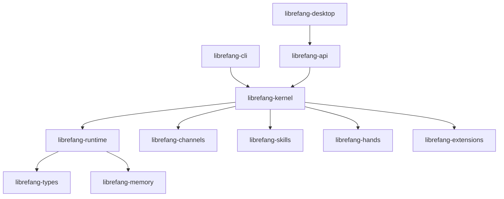

# Root — README.md

# LibreFang — Project Overview

LibreFang is an **Agent Operating System** written in Rust. Unlike traditional chatbot frameworks or Python agent wrappers, LibreFang runs autonomous agents ("Hands") that operate on schedules, monitor targets, and report to a dashboard — without requiring continuous user prompts.

This document is the developer reference for the root README, covering project structure, crate relationships, the Hands system, installation, and development workflow.

---

## Project Identity

LibreFang is a community fork of [`RightNow-AI/openfang`](https://github.com/RightNow-AI/openfang) with open governance and a merge-first PR policy. Governance details are in [`GOVERNANCE.md`](GOVERNANCE.md). The project is MIT-licensed and organized as a Cargo workspace with **24 crates** plus an `xtask` build automation crate.

Key scale metrics: 2,100+ tests, zero clippy warnings, 45 channel adapters, 28 LLM providers, 60 bundled skills.

---

## Crate Architecture

The workspace follows a layered kernel design. The diagram below shows the primary dependency relationships — runtime sits at the core, kernel orchestrates above it, and the user-facing layers (CLI, API, desktop) sit on top.



### Core Crates

| Crate | Responsibility |
|---|---|
| `librefang-kernel` | Top-level orchestration: workflows, metering, RBAC, scheduler, budget enforcement |
| `librefang-runtime` | Agent loop, tool execution, WASM sandbox, MCP client, A2A protocol |
| `librefang-api` | 140+ REST/WS/SSE endpoints, OpenAI-compatible API, serves the web dashboard |
| `librefang-types` | Core types, taint tracking, Ed25519 signing, model catalog — the shared type foundation |

### Capability Crates

| Crate | Responsibility |
|---|---|
| `librefang-channels` | 45 messaging adapters (Telegram, Discord, Slack, etc.) with rate limiting and DM/group policies |
| `librefang-memory` | SQLite persistence, vector embeddings, session management, memory compaction |
| `librefang-skills` | 60 bundled skills, `SKILL.md` parser, FangHub marketplace integration |
| `librefang-hands` | `HAND.toml` parser, Hand registry, lifecycle management |
| `librefang-extensions` | 25 MCP templates, AES-256-GCM vault, OAuth2 PKCE |

### Kernel Sub-Crates

The kernel is split into focused sub-crates for maintainability:

- `librefang-kernel-handle` — `KernelHandle` trait for in-process callers
- `librefang-kernel-router` — Hand/Template routing engine
- `librefang-kernel-metering` — Cost metering and quota enforcement

### LLM Driver Layer

- `librefang-llm-driver` — LLM driver trait and shared types
- `librefang-llm-drivers` — Concrete provider implementations (Anthropic, OpenAI, Gemini, Groq, DeepSeek, OpenRouter, Ollama, etc.)

### Protocol & Infrastructure Crates

| Crate | Responsibility |
|---|---|
| `librefang-wire` | OFP P2P protocol with HMAC-SHA256 mutual auth (see security note below) |
| `librefang-http` | Shared HTTP client builder, proxy support, TLS fallback |
| `librefang-runtime-mcp` | MCP (Model Context Protocol) client for the runtime |
| `librefang-telemetry` | OpenTelemetry + Prometheus instrumentation |
| `librefang-testing` | Test infrastructure: mock kernel, mock LLM driver, API route test utilities |

### User-Facing Crates

| Crate | Responsibility |
|---|---|
| `librefang-cli` | CLI interface, daemon management, TUI dashboard, MCP server mode |
| `librefang-desktop` | Tauri 2.0 native app with system tray, notifications, global shortcuts |
| `librefang-import` | OpenClaw, LangChain, AutoGPT import/migration engine |

---

## The Hands System

**Hands** are LibreFang's autonomous agent packages. Unlike traditional agents that wait for user input, Hands run independently on schedules — monitoring, generating leads, managing social media, and reporting to the dashboard.

### Hand Anatomy

A Hand consists of:

1. **`HAND.toml`** — manifest defining the Hand's configuration, schedule, and capabilities
2. **System prompt** — defines the agent's behavior and role
3. **Optional `SKILL.md` files** — loaded from the configured `hands_dir`, parsed by `librefang-skills`

### Hand Lifecycle Commands

```bash
librefang hand activate researcher   # Starts working immediately
librefang hand status researcher     # Check progress
librefang hand list                  # See all installed Hands
```

### Community Hands

Example Hands (Researcher, Collector, Predictor, Strategist, Analytics, Trader, Lead, Twitter, Reddit, LinkedIn, Clip, Browser, API Tester, DevOps) are available in the [community hands repository](https://github.com/librefang-registry/hands).

To build your own Hand, define a `HAND.toml` plus system prompt plus `SKILL.md` file. The [skills guide](https://docs.librefang.ai/agent/skills) covers this in detail.

---

## Installation

### Quick Start

The dashboard auto-initializes on first run and is available at `http://localhost:4545`:

```bash
curl -fsSL https://librefang.ai/install.sh | sh
librefang start

# Or run the interactive setup wizard for provider selection:
librefang init
```

### Platform-Specific Notes

**Homebrew**: The CLI is in `homebrew-core` (accepted 2026-07-08). Install with `brew install librefang`. The desktop app and pre-release channels use a separate tap: `brew tap librefang/tap`, then `brew install --cask librefang`.

**Arch Linux**: Signed packages are published through LibreFang's own pacman repository (AUR registration was unavailable). Import the GPG key (`2C325B0F88706ED99C45E216DD09DC7D3E70E1E9`) and add the `[librefang]` repository to `/etc/pacman.conf`. Two independent packages exist: `librefang-bin` (CLI/daemon/web dashboard) and `librefang-desktop-bin` (desktop app, x86_64 only). See `packaging/arch-repo/README.md` for details.

**NixOS**: The flake exposes two scoped packages. `librefang-cli` builds `--package librefang-cli` only, deliberately excluding the Tauri/GTK webview stack so it builds on headless machines. `librefang-desktop` links the full GTK/webview closure (`gtk3`, `libsoup_3`, `webkitgtk_4_1`) and takes significantly longer to build. For declarative setup, import `librefang.nixosModules.default` and set `services.librefang.enable = true`. Full NixOS documentation is in `docs/operations/nixos.md`.

**Debian/Ubuntu/deepin**: No apt repository is published. The install script fetches a fully static musl build (`x86_64-unknown-linux-musl` or `aarch64-unknown-linux-musl`) — release CI hard-fails if `file` does not report the binary as statically linked. The desktop `.deb` declares an empty dependency list, so you must manually install the webview stack:

```bash
sudo apt-get install -y libwebkit2gtk-4.1-dev libgtk-3-dev librsvg2-dev libdbus-1-dev
```

deepin's webkit2gtk version is **not verified** by this project — run `librefang doctor` to audit your environment.

**Docker**:

```bash
docker run -p 4545:4545 ghcr.io/librefang/librefang
```

---

## Security Architecture

LibreFang implements 16 security layers in a defense-in-depth strategy. Key mechanisms include:

- **WASM sandbox** — tool execution isolation
- **Merkle audit trail** — tamper-evident activity logs
- **Taint tracking** — data flow security, implemented in `librefang-types`
- **Ed25519 signing** — cryptographic identity verification
- **SSRF protection** — network request validation
- **Secret zeroization** — sensitive data wiped from memory on drop
- **AES-256-GCM vault** — credential storage in `librefang-extensions`

### OFP Wire Protocol Note

The `librefang-wire` crate implements the OFP P2P protocol with **plaintext-by-design** framing. Security is provided through HMAC-SHA256 mutual authentication, per-message HMAC, and nonce replay protection — but frame contents are **not encrypted**. For cross-network federation, run OFP behind a private overlay (WireGuard, Tailscale, SSH tunnel) or a service-mesh mTLS layer.

Details: [docs.librefang.ai/architecture/ofp-wire](https://docs.librefang.ai/architecture/ofp-wire)

---

## Development

### Build & Test

```bash
cargo build --workspace --lib                            # Build all libraries
cargo test --workspace                                   # Run 2,100+ tests
cargo clippy --workspace --all-targets -- -D warnings    # Lint (zero warnings enforced)
cargo fmt --all -- --check                               # Format check
```

### Committing Changes

Use `scripts/commit.sh` instead of `git commit` directly. The wrapper:

1. Runs `cargo fmt` on staged `*.rs` files
2. Re-stages the formatted files
3. Holds a soft lock against parallel commits in the same worktree
4. Forwards all flags to `git commit` unchanged

```bash
scripts/commit.sh -m "feat: add foo"
scripts/commit.sh -F .git/COMMIT_EDITMSG
```

If `cargo` is unavailable, the script skips formatting and warns. The pre-commit hook still gates the commit regardless.

### Build Automation

The `xtask` crate provides build automation tasks beyond standard Cargo commands.

---

## Client SDKs

LibreFang ships client SDKs for four languages, all targeting the REST API at port 4545:

**JavaScript/TypeScript** — `npm install @librefang/sdk`

```javascript
const { LibreFang } = require("@librefang/sdk");
const client = new LibreFang("http://localhost:4545");
const agent = await client.agents.create({ template: "assistant" });
const reply = await client.agents.message(agent.id, "Hello!");
```

**Python** — `pip install librefang`

```python
from librefang import Client
client = Client("http://localhost:4545")
agent = client.agents.create(template="assistant")
reply = client.agents.message(agent["id"], "Hello!")
```

**Rust** — `cargo add librefang`

```rust
use librefang::LibreFang;
let client = LibreFang::new("http://localhost:4545");
let agent = client.agents().create(CreateAgentRequest { template: Some("assistant".into()), .. }).await?;
```

**Go** — `go get github.com/librefang/librefang/sdk/go`

```go
import "github.com/librefang/librefang/sdk/go"
client := librefang.New("http://localhost:4545")
agent, _ := client.Agents.Create(map[string]interface{}{"template": "assistant"})
```

---

## Migration

The `librefang-import` crate handles migration from other agent frameworks:

```bash
librefang migrate --from openclaw
```

Supported sources: OpenClaw, LangChain, AutoGPT. The engine imports agents, history, skills, and configuration.

---

## Integration Points

| Feature | Details |
|---|---|
| **MCP** | Built-in MCP client and server. Connect to IDEs, extend with custom tools, compose agent pipelines. Runtime support via `librefang-runtime-mcp`. |
| **A2A Protocol** | Google Agent-to-Agent protocol support for cross-system delegation. |
| **OpenAI-Compatible API** | Drop-in `/v1/chat/completions` endpoint for existing tooling. |
| **EveryAPI** | Official integration partner — Agent OS + unified AI infrastructure. |

---

## Key Resources

- **Documentation**: [docs.librefang.ai](https://docs.librefang.ai)
- **API Reference**: [docs.librefang.ai/integrations/api](https://docs.librefang.ai/integrations/api)
- **Getting Started**: [docs.librefang.ai/getting-started](https://docs.librefang.ai/getting-started)
- **Troubleshooting**: [docs.librefang.ai/operations/troubleshooting](https://docs.librefang.ai/operations/troubleshooting)
- **Contributing**: [`CONTRIBUTING.md`](CONTRIBUTING.md)
- **Governance**: [`GOVERNANCE.md`](GOVERNANCE.md)
- **Security**: [`SECURITY.md`](SECURITY.md)
- **Discord**: [discord.gg/DzTYqAZZmc](https://discord.gg/DzTYqAZZmc)

The [unofficial wiki](https://leszek3737.github.io/librefang-WIki/) contains additional contributor-maintained information.