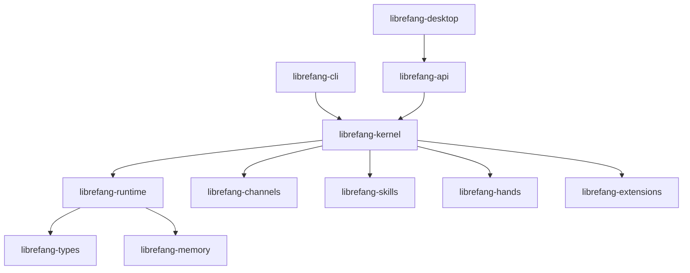

# Root — README.md

# LibreFang — Przegląd projektu

LibreFang to **System Operacyjny Agentów** napisany w Rust. W przeciwieństwie do tradycyjnych frameworków chatbotów czy Pythonowych wrapperów agentów, LibreFang uruchamia autonomiczne agenty („Ręce"), które działają według harmonogramu, monitorują cele i raportują do panelu — bez konieczności ciągłych poleceń użytkownika.

Ten dokument to podręcznik referencyjny dla deweloperów opisujący root README, obejmujący strukturę projektu, relacje między crate'ami, system Rąk, instalację i przepływ pracy deweloperskiej.

---

## Tożsamość projektu

LibreFang to fork społecznościowy projektu [`RightNow-AI/openfang`](https://github.com/RightNow-AI/openfang) z otwartym zarządzaniem i polityką PR „merge-first". Szczegóły zarządzania znajdują się w [`GOVERNANCE.md`](GOVERNANCE.md). Projekt jest licencjonowany na licencji MIT i zorganizowany jako workspace Cargo z **24 crate'ami** plus crate automatyzacji budowania `xtask`.

Kluczowe wskaźniki skali: ponad 2100 testów, zero ostrzeżeń clippy, 45 adapterów kanałów, 28 dostawców LLM, 60 wbudowanych umiejętności.

---

## Architektura crate'ów

Workspace opiera się na warstwowym projekcie jądra. Poniższy diagram przedstawia główne relacje zależności — runtime znajduje się w centrum, kernel orkiestruje nad nim, a warstwy użytkownika (CLI, API, desktop) leżą na górze.



### Główne crate'y

| Crate | Odpowiedzialność |
|---|---|
| `librefang-kernel` | Orkiestracja najwyższego poziomu: przepływy pracy, metering, RBAC, scheduler, egzekwowanie budżetu |
| `librefang-runtime` | Pętla agenta, wykonywanie narzędzi, piaskownica WASM, klient MCP, protokół A2A |
| `librefang-api` | Ponad 140 punktów końcowych REST/WS/SSE, API kompatybilne z OpenAI, serwuje panel webowy |
| `librefang-types` | Typy podstawowe, śledzenie zanieczyszczeń, podpisywanie Ed25519, katalog modeli — wspólne fundamenty typów |

### Crate'y funkcjonalności

| Crate | Odpowiedzialność |
|---|---|
| `librefang-channels` | 45 adapterów wiadomości (Telegram, Discord, Slack itd.) z limitowaniem szybkości i politykami DM/grup |
| `librefang-memory` | Persystencja SQLite, wektorowe osadzenia, zarządzanie sesjami, kompaktowanie pamięci |
| `librefang-skills` | 60 wbudowanych umiejętności, parser `SKILL.md`, integracja z marketplace FangHub |
| `librefang-hands` | Parser `HAND.toml`, rejestr Rąk, zarządzanie cyklem życia |
| `librefang-extensions` | 25 szablonów MCP, skarbiec AES-256-GCM, OAuth2 PKCE |

### Sub-crate'y jądra

Jądro jest podzielone na wyspecjalizowane sub-crate'y dla lepszej utrzymywalności:

- `librefang-kernel-handle` — cecha `KernelHandle` dla wywołań wewnątrzprocesowych
- `librefang-kernel-router` — silnik routingu Rąk/Szablonów
- `librefang-kernel-metering` — metering kosztów i egzekwowanie limitów

### Warstwa sterowników LLM

- `librefang-llm-driver` — cecha sterownika LLM i wspólne typy
- `librefang-llm-drivers` — Konkretne implementacje dostawców (Anthropic, OpenAI, Gemini, Groq, DeepSeek, OpenRouter, Ollama itd.)

### Crate'y protokołów i infrastruktury

| Crate | Odpowiedzialność |
|---|---|
| `librefang-wire` | Protokół P2P OFP z wzajemnym uwierzytelnianiem HMAC-SHA256 (patrz uwaga o bezpieczeństwie poniżej) |
| `librefang-http` | Współdzielony budowniczy klienta HTTP, obsługa proxy, powrót TLS |
| `librefang-runtime-mcp` | Klient MCP (Model Context Protocol) dla runtime'u |
| `librefang-telemetry` | Instrumentacja OpenTelemetry + Prometheus |
| `librefang-testing` | Infrastruktura testowa: jądro mockowe, mockowy sterownik LLM, narzędzia testowe dla tras API |

### Crate'y użytkownika

| Crate | Odpowiedzialność |
|---|---|
| `librefang-cli` | Interfejs CLI, zarządzanie demonem, panel TUI, tryb serwera MCP |
| `librefang-desktop` | Natywna aplikacja Tauri 2.0 z ikoną zasobnika, powiadomieniami, globalnymi skrótami |
| `librefang-import` | Silnik importu/migracji z OpenClaw, LangChain, AutoGPT |

---

## System Rąk

**Ręce** to autonomiczne pakiety agentów LibreFang. W przeciwieństwie do tradycyjnych agentów czekających na wejście użytkownika, Ręce działają niezależnie według harmonogramu — monitorując, generując kontakty, zarządzając mediami społecznościowymi i raportując do panelu.

### Anatomia Ręki

Ręka składa się z:

1. **`HAND.toml`** — manifest definiujący konfigurację, harmonogram i możliwości Ręki
2. **Prompt systemowy** — definiuje zachowanie i rolę agenta
3. **Opcjonalne pliki `SKILL.md`** — ładowane ze skonfigurowanego `hands_dir`, parsowane przez `librefang-skills`

### Polecenia cyklu życia Ręki

```bash
librefang hand activate researcher   # Rozpoczyna pracę natychmiast
librefang hand status researcher     # Sprawdza postęp
librefang hand list                  # Wyświetla wszystkie zainstalowane Ręce
```

### Ręce społeczności

Przykładowe Ręce (Researcher, Collector, Predictor, Strategist, Analytics, Trader, Lead, Twitter, Reddit, LinkedIn, Clip, Browser, API Tester, DevOps) są dostępne w [społecznościowym repozytorium Rąk](https://github.com/librefang-registry/hands).

Aby zbudować własną Rękę, zdefiniuj `HAND.toml` plus prompt systemowy plus plik `SKILL.md`. [Przewodnik umiejętności](https://docs.librefang.ai/agent/skills) opisuje to szczegółowo.

---

## Instalacja

### Szybki start

Panel automatycznie inicjalizuje się przy pierwszym uruchomieniu i jest dostępny pod adresem `http://localhost:4545`:

```bash
curl -fsSL https://librefang.ai/install.sh | sh
librefang start

# Lub uruchom interaktywnego kreatora konfiguracji do wyboru dostawcy:
librefang init
```

### Uwagi dotyczące platform

**Homebrew**: CLI jest w `homebrew-core` (zaakceptowane 2026-07-08). Zainstaluj przez `brew install librefang`. Aplikacja desktopowa i kanały pre-release używają osobnego tap'a: `brew tap librefang/tap`, następnie `brew install --cask librefang`.

**Arch Linux**: Sygnowane pakiety są publikowane przez własne repozytorium pacman LibreFang (rejestracja w AUR była niedostępna). Zaimportuj klucz GPG (`2C325B0F88706ED99C45E216DD09DC7D3E70E1E9`) i dodaj repozytorium `[librefang]` do `/etc/pacman.conf`. Istnieją dwa niezależne pakiety: `librefang-bin` (CLI/daemon/panel webowy) oraz `librefang-desktop-bin` (aplikacja desktopowa, tylko x86_64). Szczegóły w `packaging/arch-repo/README.md`.

**NixOS**: Flaka eksponuje dwa pakietu z określonym zakresem. `librefang-cli` buduje tylko `--package librefang-cli`, celowo wykluczając stos Tauri/GTK webview, aby kompilować się na maszynach headless. `librefang-desktop` linkuje pełną domkniętość GTK/webview (`gtk3`, `libsoup_3`, `webkitgtk_4_1`) i wymaga znacznie więcej czasu na kompilację. Dla konfiguracji deklaratywnej zaimportuj `librefang.nixosModules.default` i ustaw `services.librefang.enable = true`. Pełna dokumentacja NixOS znajduje się w `docs/operations/nixos.md`.

**Debian/Ubuntu/deepin**: Repozytorium apt nie jest publikowane. Skrypt instalacyjny pobiera w pełni statyczną kompilację musl (`x86_64-unknown-linux-musl` lub `aarch64-unknown-linux-musl`) — CI wersji twarde awarii, jeśli `file` nie zgłasza binarium jako statycznie linkowanego. Pakiet `.deb` desktopowy deklaruje pustą listę zależności, więc musisz ręcznie zainstalować stos webview:

```bash
sudo apt-get install -y libwebkit2gtk-4.1-dev libgtk-3-dev librsvg2-dev libdbus-1-dev
```

Wersja webkit2gtk deepin **nie jest weryfikowana** przez ten projekt — uruchom `librefang doctor`, aby przeprowadzić audyt środowiska.

**Docker**:

```bash
docker run -p 4545:4545 ghcr.io/librefang/librefang
```

---

## Architektura bezpieczeństwa

LibreFang implementuje 16 warstw bezpieczeństwa w strategii obrony w głąb. Kluczowe mechanizmy obejmują:

- **Piaskownica WASM** — izolacja wykonywania narzędzi
- **Ślad audytowy Merkle** — dzienniki aktywności odporne na manipulację
- **Śledzenie zanieczyszczeń** — bezpieczeństwo przepływu danych, zaimplementowane w `librefang-types`
- **Podpisywanie Ed25519** — weryfikacja tożsamości kryptograficznej
- **Ochrona SSRF** — walidacja żądań sieciowych
- **Zerowanie sekretów** — dane wrażliwe usuwane z pamięci przy drop
- **Skarbiec AES-256-GCM** — przechowywanie poświadczeń w `librefang-extensions`

### Uwaga dotycząca protokołu OFP Wire

Crate `librefang-wire` implementuje protokół P2P OFP z ramowaniem **z założenia jawnym**. Bezpieczeństwo jest zapewnione przez wzajemne uwierzytelnianie HMAC-SHA256, HMAC na każdą wiadomość i ochronę przed powtórzeniem nonce — ale treść ramek **nie jest szyfrowana**. Dla federacji między sieciami, uruchom OFP za prywatną nakładką (WireGuard, Tailscale, tunel SSH) lub warstwą mTLS service-mesh.

Szczegóły: [docs.librefang.ai/architecture/ofp-wire](https://docs.librefang.ai/architecture/ofp-wire)

---

## Rozwój

### Budowanie i testowanie

```bash
cargo build --workspace --lib                            # Budowanie wszystkich bibliotek
cargo test --workspace                                   # Uruchomienie ponad 2100 testów
cargo clippy --workspace --all-targets -- -D warnings    # Lint (zero ostrzeżeń wymuszonych)
cargo fmt --all -- --check                               # Sprawdzenie formatowania
```

### Zatwierdzanie zmian

Używaj `scripts/commit.sh` zamiast bezpośredniego `git commit`. Wrapper:

1. Uruchamia `cargo fmt` na zgłoszonych plikach `*.rs`
2. Ponownie zgłasza sformatowane pliki
3. Utrzymuje blokadę miękką przed równoległymi commitami w tym samym worktree
4. Przekazuje wszystkie flagi do `git commit` bez zmian

```bash
scripts/commit.sh -m "feat: add foo"
scripts/commit.sh -F .git/COMMIT_EDITMSG
```

Jeśli `cargo` jest niedostępny, skrypt pomija formatowanie i ostrzega. Hook pre-commit nadal blokuje commit niezależnie od tego.

### Automatyzacja budowania

Crate `xtask` dostarcza zadania automatyzacji budowania wykraczające poza standardowe polecenia Cargo.

---

## SDK klienta

LibreFang dostarcza SDK klienta dla czterech języków, wszystkie celujące w REST API na porcie 4545:

**JavaScript/TypeScript** — `npm install @librefang/sdk`

```javascript
const { LibreFang } = require("@librefang/sdk");
const client = new LibreFang("http://localhost:4545");
const agent = await client.agents.create({ template: "assistant" });
const reply = await client.agents.message(agent.id, "Hello!");
```

**Python** — `pip install librefang`

```python
from librefang import Client
client = Client("http://localhost:4545")
agent = client.agents.create(template="assistant")
reply = client.agents.message(agent["id"], "Hello!")
```

**Rust** — `cargo add librefang`

```rust
use librefang::LibreFang;
let client = LibreFang::new("http://localhost:4545");
let agent = client.agents().create(CreateAgentRequest { template: Some("assistant".into()), .. }).await?;
```

**Go** — `go get github.com/librefang/librefang/sdk/go`

```go
import "github.com/librefang/librefang/sdk/go"
client := librefang.New("http://localhost:4545")
agent, _ := client.Agents.Create(map[string]interface{}{"template": "assistant"})
```

---

## Migracja

Crate `librefang-import` obsługuje migrację z innych frameworków agentów:

```bash
librefang migrate --from openclaw
```

Obsługiwane źródła: OpenClaw, LangChain, AutoGPT. Silnik importuje agentów, historię, umiejętności i konfigurację.

---

## Punkty integracji

| Funkcja | Szczegóły |
|---|---|
| **MCP** | Wbudowany klient i serwer MCP. Łączenie z IDE, rozszerzanie własnymi narzędziami, komponowanie potoków agentów. Wsparcie runtime'u przez `librefang-runtime-mcp`. |
| **Protokół A2A** | Wsparcie dla protokołu Google Agent-to-Agent do delegacji między systemami. |
| **API kompatybilne z OpenAI** | Zastępczy punkt końcowy `/v1/chat/completions` dla istniejących narzędzi. |
| **EveryAPI** | Oficjalny partner integracji — Agent OS + zunifikowana infrastruktura AI. |

---

## Kluczowe zasoby

- **Dokumentacja**: [docs.librefang.ai](https://docs.librefang.ai)
- **Referencja API**: [docs.librefang.ai/integrations/api](https://docs.librefang.ai/integrations/api)
- **Wprowadzenie**: [docs.librefang.ai/getting-started](https://docs.librefang.ai/getting-started)
- **Rozwiązywanie problemów**: [docs.librefang.ai/operations/troubleshooting](https://docs.librefang.ai/operations/troubleshooting)
- **Wkład w projekt**: [`CONTRIBUTING.md`](CONTRIBUTING.md)
- **Zarządzanie**: [`GOVERNANCE.md`](GOVERNANCE.md)
- **Bezpieczeństwo**: [`SECURITY.md`](SECURITY.md)
- **Discord**: [discord.gg/DzTYqAZZmc](https://discord.gg/DzTYqAZZmc)

[Nieoficjalne wiki](https://leszek3737.github.io/librefang-WIki/) zawiera dodatkowe informacje utrzymywane przez współtwórców.
