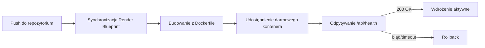

# Root — render.yaml

# render.yaml

## Przeznaczenie

`render.yaml` to **Render Blueprint** — deklaratywna konfiguracja infrastruktury informująca Render.com, jak zbudować, wdrożyć i uruchomić aplikację `librefang`. Jest przetwarzana przez silnik blueprintów Rendera i nie ma wpływu na zachowanie w trakcie działania kodu aplikacji.

## Definicja usługi

Blueprint definiuje pojedynczą usługę internetową:

| Właściwość | Wartość | Opis |
|------------|---------|------|
| `type` | `web` | Usługa internetowa serwowana przez HTTP (przyjmuje ruch przychodzący) |
| `runtime` | `docker` | Budowana z obrazu kontenera |
| `name` | `librefang` | Identyfikuje usługę w panelu Rendera |
| `dockerfilePath` | `./Dockerfile` | Wskazuje na kontekst budowania Dockera w katalogu głównym repozytorium |
| `plan` | `free` | Plan darmowy — brak trwałego dysku, usypianie po bezczynności |
| `healthCheckPath` | `/api/health` | Punkt końcowy odpytywany przez Rendera w celu potwierdzenia działania usługi |

Render używa ścieżki sprawdzania zdrowia do określenia sukcesu wdrożenia i stanu instancji. Aplikacja **musi** zwracać prawidłową odpowiedź (zazwyczaj `200 OK`) pod `/api/health`, w przeciwnym razie wdrożenia zostaną oznaczone jako nieudane.

## Zmienne środowiskowe

Trzy klucze API są zadeklarowane z `sync: false`, co oznacza, że ich wartości **nie są** pobierane z repozytorium. Należy je wprowadzić ręcznie przez panel Rendera lub CLI i są przechowywane w zaszyfrowanym magazynie sekretów Rendera.

| Zmienna | Przeznaczenie |
|---------|---------------|
| `GROQ_API_KEY` | Dane uwierzytelniające dla wnioskowania LLM hostowanego przez Groq |
| `OPENAI_API_KEY` | Dane uwierzytelniające dla dostępu do API OpenAI |
| `ANTHROPIC_API_KEY` | Dane uwierzytelniające dla dostępu do API Anthropic Claude |

Ponieważ ustawiono `sync: false`, zmiana tych wartości nie wymaga commita ani ponownego wdrożenia — można je zaktualizować bezpośrednio w panelu.

## Ostrzeżenie o trwałym przechowywaniu danych

Początkowy komentarz w pliku wskazuje na kluczowe ograniczenie planu darmowego:

```yaml
# Render free tier does not support persistent disks.
# Data (config, conversation history, local DB) will be lost on each deploy/restart.
```

W planie darmowym system plików jest **efemeryczny**. Każde wdrożenie, restart lub wyłączenie instancji usuwa lokalnie przechowywane dane. Dotyczy to wszystkiego, co jest zapisywane na dysku — lokalnych baz danych, logów konwersacji, pamięci podręcznej konfiguracji.

### Uaktualnienie w celu uzyskania trwałości

Komentarz dokumentuje ścieżkę migracji do planu płatnego:

```yaml
disk:
  name: librefang-data
  mountPath: /data
  sizeGB: 1
```

Po połączeniu z ustawieniem `LIBREFANG_HOME=/data` w `envVars`, aplikacja zyskuje zamontowany wolumen, który przetrwa restarty i wdrożenia.

## Przepływ wdrażania



## Relacja z kodem

Ten plik jest punktem wejścia dla wdrożeń na Renderze, ale zależy od dwóch zasobów zewnętrznych, które nie są tu zdefiniowane:

1. **`./Dockerfile`** — wskazywany przez `dockerfilePath`. Musi istnieć w katalogu głównym repozytorium i produkować uruchamialny obraz kontenera.
2. **`/api/health`** — aplikacja musi zaimplementować ten punkt końcowy i zwracać prawidłowy status, gdy usługa jest gotowa do przyjmowania ruchu.

Programiści modyfikujący ten blueprint powinni upewnić się, że Dockerfile i punkt końcowy sprawdzania zdrowia pozostają zsynchronizowane z zadeklarowanymi tutaj ścieżkami.
