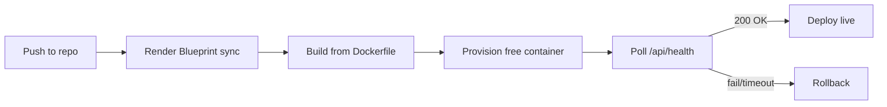

# Root — render.yaml

# render.yaml

## Purpose

`render.yaml` is a **Render Blueprint** — a declarative infrastructure configuration that tells Render.com how to build, deploy, and run the `librefang` application. It is processed by Render's blueprint engine and has no runtime behavior within the application codebase itself.

## Service Definition

The blueprint defines a single web service:

| Property | Value | Description |
|----------|-------|-------------|
| `type` | `web` | HTTP-served web service (receives incoming traffic) |
| `runtime` | `docker` | Built from a container image |
| `name` | `librefang` | Identifies the service in the Render dashboard |
| `dockerfilePath` | `./Dockerfile` | Points to the Docker build context at the repo root |
| `plan` | `free` | Free tier — no persistent disk, sleeps after inactivity |
| `healthCheckPath` | `/api/health` | Endpoint Render polls to confirm the service is live |

Render uses the health check path to determine deploy success and instance health. The application **must** serve a successful response (typically `200 OK`) at `/api/health` or deploys will be marked as failed.

## Environment Variables

Three API keys are declared with `sync: false`, meaning their values are **not** pulled from the repository. Instead, they must be entered manually through the Render dashboard or CLI and are stored encrypted in Render's secret store.

| Variable | Purpose |
|----------|---------|
| `GROQ_API_KEY` | Credentials for Groq-hosted LLM inference |
| `OPENAI_API_KEY` | Credentials for OpenAI API access |
| `ANTHROPIC_API_KEY` | Credentials for Anthropic Claude API access |

Because `sync: false` is set, changing these values does not require a commit or redeploy — they can be rotated directly in the dashboard.

## Persistent Storage Warning

The file's leading comment flags a critical constraint of the free tier:

```yaml
# Render free tier does not support persistent disks.
# Data (config, conversation history, local DB) will be lost on each deploy/restart.
```

On the free plan, the filesystem is **ephemeral**. Every deploy, restart, or instance spin-down wipes locally stored data. This affects anything written to disk — local databases, conversation logs, configuration caches.

### Upgrading for Persistence

The comment documents the migration path to a paid plan:

```yaml
disk:
  name: librefang-data
  mountPath: /data
  sizeGB: 1
```

When combined with setting `LIBREFANG_HOME=/data` in `envVars`, the application gains a mounted volume that survives restarts and deploys.

## Deployment Flow



## Relationship to the Codebase

This file is the entry point for Render deployments, but it depends on two external assets not defined here:

1. **`./Dockerfile`** — referenced by `dockerfilePath`. Must exist at the repo root and produce a runnable container image.
2. **`/api/health`** — the application must implement this endpoint and return a healthy status when the service is ready to accept traffic.

Developers modifying this blueprint should ensure the Dockerfile and health endpoint remain in sync with the paths declared here.