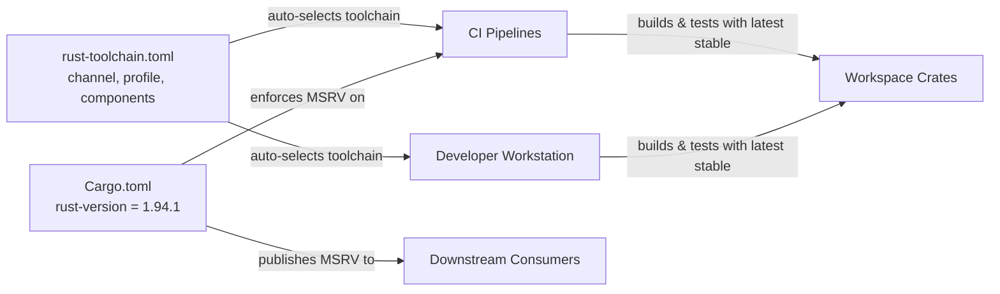

# Root — rust-toolchain.toml

# `rust-toolchain.toml`

## Purpose

This file pins the Rust toolchain used by the workspace. It ensures that every developer, CI runner, and automated process invokes the same compiler version and component set without manual `rustup` commands. When any `cargo` command is run inside this repository, `rustup` reads this file and automatically installs/switchs to the specified toolchain.

## Configuration

```toml
[toolchain]
channel = "stable"
profile = "minimal"
components = ["rustfmt", "clippy"]
```

### `channel = "stable"`

Tracks the latest stable release of Rust. The toolchain updates when new stable versions are published—there is no hard pin to a specific version number.

### `profile = "minimal"`

Installs only `rustc`, `cargo`, and `rust-std`. This skips `rust-docs` (~150 MB), which neither CI nor typical development needs. To get offline standard library documentation locally:

```sh
rustup component add rust-docs
```

### `components`

| Component  | Purpose                                      |
|------------|----------------------------------------------|
| `rustfmt`  | Code formatting (`cargo fmt`)               |
| `clippy`   | Linting (`cargo clippy`)                     |

## MSRV Contract

The Minimum Supported Rust Version is **not** defined here. It lives in `Cargo.toml`:

```toml
# Cargo.toml
[workspace.package]
rust-version = "1.94.1"
```

This separation is intentional:

- **`rust-toolchain.toml`** controls what toolchain you *build and test with* (latest stable).
- **`Cargo.toml` `rust-version`** declares the minimum compiler downstream consumers *must have* to use the published crates.

Because the toolchain tracks stable while the MSRV is pinned to a specific version, bumping the stable compiler is **non-breaking** for downstream consumers as long as all new code respects the declared MSRV. Contributors must avoid using language features or standard library APIs stabilized after Rust 1.94.1, even though their local compiler may be newer.

## How It Connects to the Rest of the Codebase



Every `cargo` invocation in this repository—build, test, fmt, clippy, doc—is governed by this file. CI pipelines do not need to install Rust separately; `rustup` handles it automatically when the job enters the repository directory. The same applies to developers cloning the repo for the first time.

## Practical Notes

- **Changing the channel** to `nightly` or a specific version (e.g., `"1.95.0"`) affects all contributors and CI simultaneously. Do this with care and coordinate.
- **Adding a component** (e.g., `rust-src` for IDE support or `miri` for undefined-behavior detection) is a workspace-wide change. Add it to the `components` array so CI picks it up too.
- **Checking MSRV compliance locally**: use a tool like [`cargo-msrv`](https://github.com/foresterre/cargo-msrv) to verify that code compiles against Rust 1.94.1, since your local toolchain will be newer stable.