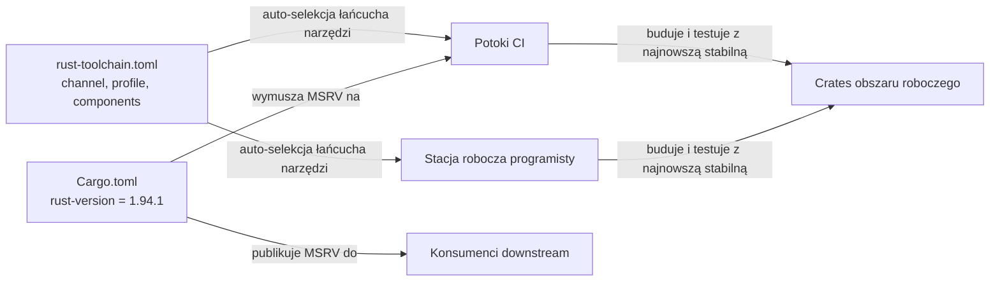

# Root — rust-toolchain.toml

# `rust-toolchain.toml`

## Przeznaczenie

Ten plik przypina łańcuch narzędzi Rust używany przez obszar roboczy. Zapewnia, że każdy programista, proces CI i procesy automatyczne wywołują tę samą wersję kompilatora i zestaw komponentów bez ręcznych poleceń `rustup`. Gdy jakiekolwiek polecenie `cargo` jest uruchamiane w tym repozytorium, `rustup` odczytuje ten plik i automatycznie instaluje/przełącza na określony łańcuch narzędzi.

## Konfiguracja

```toml
[toolchain]
channel = "stable"
profile = "minimal"
components = ["rustfmt", "clippy"]
```

### `channel = "stable"`

Śledzi najnowsze stabilne wydanie Rusta. Łańcuch narzędzi aktualizuje się, gdy publikowane są nowe wersje stabilne — nie ma twardego przypięcia do konkretnej numeru wersji.

### `profile = "minimal"`

Instaluje tylko `rustc`, `cargo` i `rust-std`. Pomija `rust-docs` (~150 MB), które nie są potrzebne ani CI, ani typowemu rozwojowi. Aby uzyskać dokumentację standardowej biblioteki offline lokalnie:

```sh
rustup component add rust-docs
```

### `components`

| Komponent | Przeznaczenie                               |
|-----------|---------------------------------------------|
| `rustfmt` | Formatowanie kodu (`cargo fmt`)             |
| `clippy`  | Linting (`cargo clippy`)                    |

## Kontrakt MSRV

Minimalna Wersja Obsługiwana Rusta (Minimum Supported Rust Version) **nie jest** zdefiniowana tutaj. Znajduje się w `Cargo.toml`:

```toml
# Cargo.toml
[workspace.package]
rust-version = "1.94.1"
```

To rozdzielenie jest celowe:

- **`rust-toolchain.toml`** kontroluje, z jakim łańcuchem narzędzi *budujesz i testujesz* (najnowsza stabilna).
- **`Cargo.toml` `rust-version`** deklaruje minimalny kompilator, jaki konsumenci downstream *muszą posiadać*, aby korzystać z opublikowanych crate-ów.

Ponieważ łańcuch narzędzi śledzi stabilną, podczas gdy MSRV jest przypięty do konkretnej wersji, aktualizacja stabilnego kompilatora jest **niełamiąca** dla konsumentów downstream, o ile cały nowy kod szanuje zadeklarowaną MSRV. Kontrybutorzy muszą unikać używania funkcji językowych lub API standardowej biblioteki ustabilizowanych po Rust 1.94.1, nawet jeśli ich lokalny kompilator jest nowszy.

## Jak to się łączy z resztą bazy kodu



Każde wywołanie `cargo` w tym repozytorium — build, test, fmt, clippy, doc — jest zarządzane przez ten plik. Potoki CI nie muszą instalować Rusta osobno; `rustup` obsługuje to automatycznie, gdy zadanie wchodzi do katalogu repozytorium. To samo dotyczy programistów klonujących repozytorium po raz pierwszy.

## Uwagi praktyczne

- **Zmiana kanału** na `nightly` lub konkretną wersję (np. `"1.95.0"`) wpływa na wszystkich kontrybutorów i CI jednocześnie. Rób to ostrożnie i w porozumieniu.
- **Dodanie komponentu** (np. `rust-src` do wsparcia IDE lub `miri` do wykrywania niezdefiniowanego zachowania) jest zmianą obejmującą cały obszar roboczy. Dodaj go do tablicy `components`, aby CI również go pobrał.
- **Sprawdzanie zgodności z MSRV lokalnie**: użyj narzędzia takiego jak [`cargo-msrv`](https://github.com/foresterre/cargo-msrv), aby zweryfikować, że kod kompiluje się z Rust 1.94.1, ponieważ Twój lokalny łańcuch narzędzi będzie nowszą stabilną.
