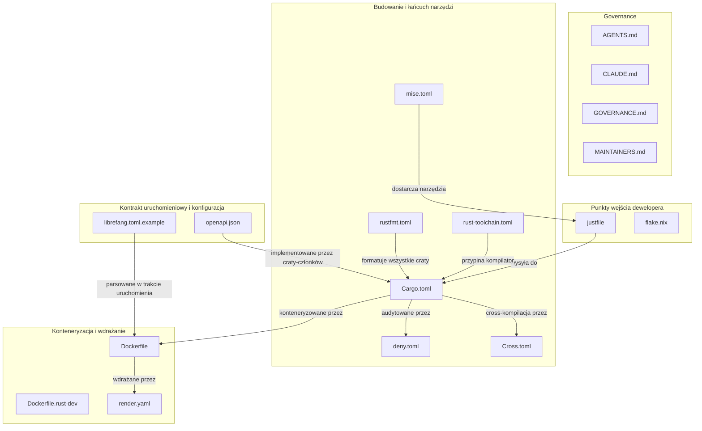

# Root

# Moduł Root

Moduł Root jest **płaszczyzną sterowania monorepozytorium LibreFang** — nie zawiera kodu aplikacji, ale zarządza każdym aspektem budowania, testowania, formatowania, zarządzania, wdrażania i wnioskowania wkładów do projektu. Każdy plik tutaj stanowi jedyne źródło prawdy dla jakiegoś przekrojowego zagadnienia obowiązującego w całym obszarze roboczym.

---

## Grupy plików

Pliki root klastrowane są w pięć grup funkcyjnych:

### Tożsamość projektu i zarządzanie

| Plik | Rola |
|------|------|
| [README.md](README.md) | Przegląd projektu — czym jest LibreFang, jak relacjonują się craty, jak zacząć |
| [GOVERNANCE.md](GOVERNANCE.md) | Karta decyzyjna; polityka merge-first |
| [MAINTAINERS.md](MAINTAINERS.md) | Kto utrzymuje co; odpowiedzialności maintainerów |
| [AGENTS.md](AGENTS.md) | Szybka ściągawka dla każdego pracującego w repozytorium |
| [CLAUDE.md](CLAUDE.md) | Pełny kontrakt agenta AI — zasady worktree, hooki, polityka CI |

`AGENTS.md` i `CLAUDE.md` stanowią świadomie parę: pierwszy to podsumowanie, drugi to egzekwowalne prawo. Razem z `GOVERNANCE.md` i `MAINTAINERS.md` tworzą **warstwę współpracy** — określając granice zarówno dla ludzkich, jak i wspomaganych przez AI wkładów.

### Budowanie i łańcuch narzędzi

| Plik | Rola |
|------|------|
| [Cargo.toml](Cargo.md) | Manifest obszaru roboczego — deklaruje craty-członków, przypina wszystkie zależności, ustawia profile i linty |
| [rust-toolchain.toml](rust-toolchain.md) | Przypina kanał kompilatora Rust (`stable`, profil minimalny z `rustfmt` + `clippy`) |
| [rustfmt.toml](rustfmt.md) | Reguły formatowania obszaru roboczego egzekwowane przez CI |
| [deny.toml](deny.md) | Audyt łańcucha dostaw — doradztwa, licencje, blokady, źródła |
| [Cross.toml](Cross.md) | Konfiguracja cross-kompilacji dla celów ARM64 Linux i Android |
| [mise.toml](mise.md) | Przypina zewnętrzne narzędzia deweloperskie (`just` itp.) dla odtwarzalnych środowisk lokalnych |

Te pliki tworzą **łańcuch kontroli wersji**: `rust-toolchain.toml` blokuje kompilator, `mise.toml` blokuje otaczające narzędzia, `Cargo.toml` blokuje wszystkie zależności Rust jednokrotnie dla każdego crata-członka, a `deny.toml` audytuje te zależności pod kątem luk i zgodności licencyjnej.

### Punkty wejścia dewelopera

| Plik | Rola |
|------|------|
| [justfile](justfile.md) | Kanoniczny dyspozytor komend — chude przepisy przekazujące do `cargo` lub `xtask` |
| [flake.nix](flake.md) | Flake Nix do budowania, testowania i wdrażania NixOS |

`justfile` jest głównym interfejsem dla deweloperów. Jest celowo chudy — dyspozytor, nie powierzchnia implementacyjna. Złożona automatyzacja znajduje się w cracie `xtask`, a justfile przekazuje mu argumenty.

### Konteneryzacja i wdrażanie

| Plik | Rola |
|------|------|
| [Dockerfile](Dockerfile.md) | Trzyetapowy obraz produkcyjny (build React → build Rust → minimalne środowisko uruchomieniowe) |
| [Dockerfile.rust-dev](Dockerfile.rust-dev.md) | Pełne środowisko deweloperskie Rust dla współtwórców bez natywnego łańcucha narzędzi |
| [render.yaml](render.md) | Schemat Render.com do wdrażania w chmurze |

### Kontrakt uruchomieniowy i konfiguracja

| Plik | Rola |
|------|------|
| [openapi.json](openapi.md) | Maszynowo czytelny kontrakt REST API dla jądra LibreFang |
| [librefang.toml.example](librefang-toml-example.md) | Kanoniczny szablon konfiguracji do wdrażania demona |

---

## Kluczowe przepływy między plikami

### „Chcę wnioskować zmianę"

1. Przeczytaj [AGENTS.md](AGENTS.md) dla orientacji i [CLAUDE.md](CLAUDE.md) dla kontraktu agenta.
2. `mise install` dostarcza poprawne wersje narzędzi z [mise.toml](mise.md).
3. Brama worktree z [CLAUDE.md](CLAUDE.md) wymusza bezpieczną edycję.
4. `just <przepis>` wysyła komendy build/test/lint przez [justfile](justfile.md).
5. `rust-toolchain.toml` i `rustfmt.toml` zapewniają spójność formatowania i kompilatora.
6. `deny.toml` bramkuje łańcuch dostaw; CI wymusza wszystko powyższe.
7. [GOVERNANCE.md](GOVERNANCE.md) zarządza decyzją o scaleniu (merge-first).

### „Chcę wdrożyć LibreFang"

1. Skopiuj [librefang.toml.example](librefang-toml-example.md), aby skonfigurować demona.
2. Zbuduj przez [Dockerfile](Dockerfile.md) (lub wdróż przez [render.yaml](render.md)).
3. Powierzchnia API jest zdefiniowana przez [openapi.json](openapi.md).
4. Dla wdrożeń opartych na Nix, użyj [flake.nix](flake.md).

### „Chcę cross-kompilować dla ARM64"

1. [rust-toolchain.toml](rust-toolchain.md) dostarcza bazowy kompilator.
2. [Cross.toml](Cross.md) konfiguruje obrazy Docker i biblioteki systemowe dla każdego celu.
3. Przypinki zależności obszaru roboczego w [Cargo.toml](Cargo.md) zapewniają odtwarzalne buildy między celami.

---

## Podsumowanie architektury

Nadrzędną zasadą modułu Root jest **jednoźródłowa konfiguracja**: każda przypinka wersji, reguła formatowania, polityka lintów, zasada zarządzania i kształt wdrożenia jest zadeklarowana dokładnie raz tutaj i dziedziczona w dół przez wszystkie craty-członków i potoki CI.
