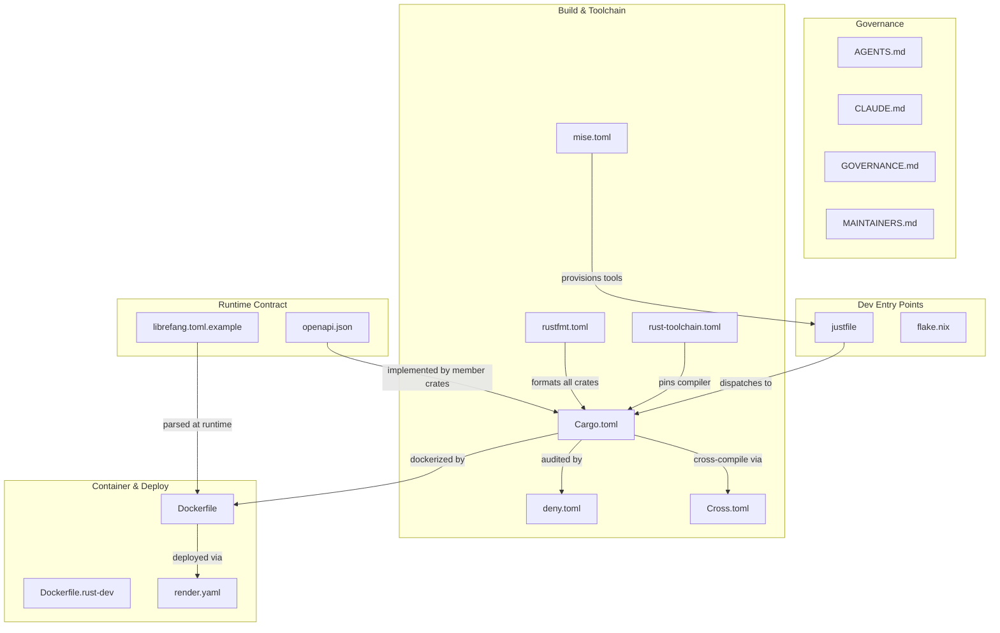

# Root

# Root Module

The Root module is the **control plane of the LibreFang monorepo** — it contains no application code, but governs every aspect of how the project is built, tested, formatted, governed, deployed, and contributed to. Every file here is a single source of truth for some cross-cutting concern that applies workspace-wide.

---

## File Families

The root files cluster into five functional groups:

### Project Identity & Governance

| File | Role |
|------|------|
| [README.md](README.md) | Project overview — what LibreFang is, how crates relate, how to get started |
| [GOVERNANCE.md](GOVERNANCE.md) | Decision-making charter; merge-first policy |
| [MAINTAINERS.md](MAINTAINERS.md) | Who maintains what; maintainer responsibilities |
| [AGENTS.md](AGENTS.md) | Scannable quick-reference for anyone working in the repo |
| [CLAUDE.md](CLAUDE.md) | Full AI-agent contract — worktree rules, hooks, CI policy |

`AGENTS.md` and `CLAUDE.md` are intentionally paired: the first is the summary, the second is the enforceable law. Together with `GOVERNANCE.md` and `MAINTAINERS.md`, they form the **collaboration layer** — defining boundaries for both human and AI-assisted contributions.

### Build & Toolchain

| File | Role |
|------|------|
| [Cargo.toml](Cargo.md) | Workspace manifest — declares member crates, pins all dependencies, sets profiles and lints |
| [rust-toolchain.toml](rust-toolchain.md) | Pins the Rust compiler channel (`stable`, minimal profile with `rustfmt` + `clippy`) |
| [rustfmt.toml](rustfmt.md) | Workspace formatting rules enforced via CI |
| [deny.toml](deny.md) | Supply-chain audit — advisories, licenses, bans, sources |
| [Cross.toml](Cross.md) | Cross-compilation config for ARM64 Linux and Android targets |
| [mise.toml](mise.md) | Pins external dev tools (`just`, etc.) for reproducible local environments |

These files form a **chain of version control**: `rust-toolchain.toml` locks the compiler, `mise.toml` locks the surrounding tools, `Cargo.toml` locks all Rust dependencies once for every member crate, and `deny.toml` audits those dependencies for vulnerabilities and license compliance.

### Developer Entry Points

| File | Role |
|------|------|
| [justfile](justfile.md) | Canonical command dispatcher — thin recipes that forward to `cargo` or `xtask` |
| [flake.nix](flake.md) | Nix flake for building, testing, and NixOS deployment |

The `justfile` is the primary interface for developers. It is deliberately lean — a dispatcher, not an implementation surface. Complex automation lives in the `xtask` crate, and the justfile forwards arguments to it.

### Containerization & Deployment

| File | Role |
|------|------|
| [Dockerfile](Dockerfile.md) | Three-stage production image (React build → Rust build → minimal runtime) |
| [Dockerfile.rust-dev](Dockerfile.rust-dev.md) | Full Rust dev environment for contributors without a native toolchain |
| [render.yaml](render.md) | Render.com blueprint for cloud deployment |

### Runtime Contract & Configuration

| File | Role |
|------|------|
| [openapi.json](openapi.md) | Machine-readable REST API contract for the LibreFang kernel |
| [librefang.toml.example](librefang-toml-example.md) | Canonical configuration template for daemon deployment |

---

## Key Cross-File Workflows

### "I want to contribute a change"

1. Read [AGENTS.md](AGENTS.md) for orientation and [CLAUDE.md](CLAUDE.md) for the agent contract.
2. `mise install` provisions the correct tool versions from [mise.toml](mise.md).
3. The worktree gate from [CLAUDE.md](CLAUDE.md) enforces safe editing.
4. `just <recipe>` dispatches build/test/lint through [justfile](justfile.md).
5. `rust-toolchain.toml` and `rustfmt.toml` ensure formatting and compiler consistency.
6. `deny.toml` gates the supply chain; CI enforces all of the above.
7. [GOVERNANCE.md](GOVERNANCE.md) governs the merge decision (merge-first).

### "I want to deploy LibreFang"

1. Copy [librefang.toml.example](librefang-toml-example.md) to configure the daemon.
2. Build via [Dockerfile](Dockerfile.md) (or deploy through [render.yaml](render.md)).
3. The API surface is defined by [openapi.json](openapi.md).
4. For Nix-based deployments, use [flake.nix](flake.md).

### "I want to cross-compile for ARM64"

1. [rust-toolchain.toml](rust-toolchain.md) provides the base compiler.
2. [Cross.toml](Cross.md) configures Docker images and system libraries per target.
3. The workspace dependency pins in [Cargo.toml](Cargo.md) ensure reproducible builds across targets.

---

## Architecture Summary

The Root module's unifying principle is **single-source-of-truth configuration**: every version pin, formatting rule, lint policy, governance rule, and deployment shape is declared exactly once here and inherited downward by all member crates and CI pipelines.