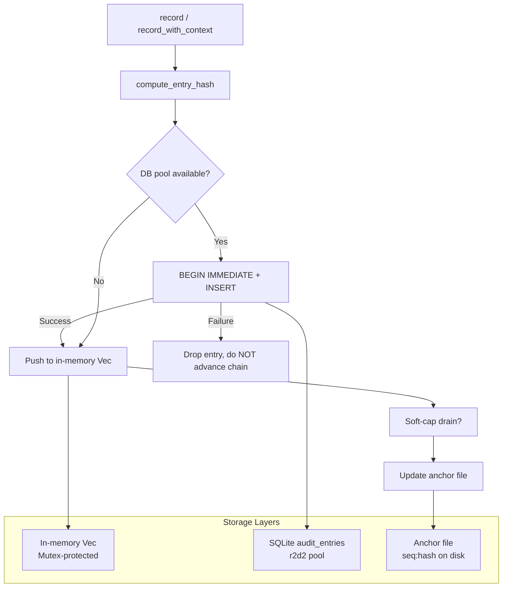

# Runtime Audit

# Runtime Audit

Merkle hash chain audit trail for security-critical actions in the LibreFang agent runtime.

## Overview

Every auditable event is appended to an append-only log where each entry contains the SHA-256 hash of its own contents concatenated with the hash of the previous entry, forming a tamper-evident chain. Any modification to a historical entry invalidates the hash of every subsequent entry, making tampering structurally detectable.

When a SQLite connection pool is provided, entries are persisted to the `audit_entries` table (schema V8+) so the trail survives daemon restarts. An optional external anchor file closes the gap where an attacker with DB write access could fabricate an entire replacement chain.

## Architecture



## Core Concepts

### Hash Chain

Each `AuditEntry` stores two hashes:

- **`prev_hash`**: the `hash` field of the immediately preceding entry (64 zero-characters for the genesis entry)
- **`hash`**: SHA-256 of this entry's fields concatenated with `prev_hash`, computed by the private `compute_entry_hash` function

The hash input includes `seq`, `timestamp`, `agent_id`, `action` (via `Display`), `detail`, `outcome`, and `prev_hash`. The optional `user_id` and `channel` fields are included only when present — this preserves hash stability for pre-M1 entries recorded before user attribution existed, while committing those fields to the chain for any entry that supplies them.

### Chain Anchor

When the retention trim job removes a prefix of the chain, the first surviving entry's `prev_hash` points at a dropped entry rather than the genesis sentinel. The `chain_anchor` field stores that `prev_hash` value so `verify_integrity` seeds its walk from the correct starting point instead of expecting all-zeros.

On startup, `with_db` recovers the anchor automatically: if the lowest-surviving entry's `prev_hash` is not the genesis sentinel, that value becomes the anchor. No separate schema column is needed.

### External Anchor File

A DB-only chain is self-consistent but cannot detect a full rewrite of `audit_entries` — an attacker who recomputes every hash from genesis forward passes the linked-list check. The anchor file stores the latest `seq:hash` pair outside SQLite (format: `<seq> <hex-hash>\n`), providing an independent witness that must agree with the in-DB tip.

The anchor is written atomically via a `.tmp` + rename to prevent truncated writes on crash. On boot, `with_db_anchored` compares the file against the loaded chain and logs a loud error on mismatch.

### Soft Cap

The in-memory buffer grows unbounded without intervention. Two mechanisms bound it:

1. **Scheduled trim** (`trim`): runs on a configured interval, applies per-action retention policies
2. **Append-path soft cap**: enforced inside `record_with_context` on every write. When the buffer exceeds `max_in_memory_entries × 1.5` (or the hard default of 10,000), the oldest prefix is drained immediately. Every drained entry is already persisted to SQLite, so no forensic data is lost.

Set the operator cap via `set_max_in_memory_entries`. A value of `0` falls back to the hard default.

## Key Types

### `AuditAction`

Enum of auditable event categories. **Append-only** — adding new variants is safe, but renaming or reordering existing variants is a breaking change that invalidates every persisted hash because the variant name is folded into the SHA-256 via `Display` (which delegates to `Debug`).

Variants include: `ToolInvoke`, `CapabilityCheck`, `AgentSpawn`, `AgentKill`, `AgentMessage`, `MemoryAccess`, `FileAccess`, `NetworkAccess`, `ShellExec`, `AuthAttempt`, `WireConnect`, `ConfigChange`, `DreamConsolidation`, `UserLogin`, `RoleChange`, `PermissionDenied`, `BudgetExceeded`, `RetentionTrim`, `A2aDiscovered`, `A2aTrusted`.

### `AuditEntry`

A single chain entry with fields: `seq` (monotonically increasing, 0-indexed), `timestamp` (ISO-8601), `agent_id`, `action`, `detail`, `outcome`, `user_id` (optional, post-M1), `channel` (optional, post-M1), `prev_hash`, `hash`.

### `AuditLog`

The main log structure. Thread-safe — all access serialized through internal `Mutex` guards. Fields:

| Field | Purpose |
|---|---|
| `entries` | `Mutex<Vec<AuditEntry>>` — in-memory window |
| `tip` | `Mutex<String>` — hash of the most recent entry |
| `db` | Optional `r2d2` SQLite connection pool |
| `anchor_path` | Optional filesystem path for external tip witness |
| `chain_anchor` | `Mutex<Option<String>>` — hash of the last dropped entry after trim |
| `max_in_memory_entries` | `AtomicUsize` — operator-configured soft cap |

### `TrimReport`

Returned by `trim`. Contains `dropped_by_action` (`BTreeMap<String, usize>`), `total_dropped`, and `new_chain_anchor` (`Option<String>`).

## API Reference

### Construction

```rust
// In-memory only, no persistence
let log = AuditLog::new();

// Persisted to SQLite
let log = AuditLog::with_db(pool);

// Persisted + external anchor file
let log = AuditLog::with_db_anchored(pool, PathBuf::from("/var/lib/librefang/audit.anchor"));
```

`with_db` loads all existing rows from `audit_entries`, recovers the chain anchor, and runs `verify_integrity` at WARN level. `with_db_anchored` additionally compares the anchor file against the DB tip, seeds the file if it doesn't exist, and logs an error on mismatch.

### Recording Events

```rust
// Without user attribution (pre-M1 call sites)
let hash = log.record("agent-1", AuditAction::ToolInvoke, "curl", "ok");

// With user and channel attribution
let hash = log.record_with_context(
    "agent-1",
    AuditAction::ToolInvoke,
    "curl",
    "ok",
    Some(user_id),
    Some("telegram".into()),
);
```

Both return the SHA-256 hash of the new entry. The entry is appended to the in-memory chain and persisted to SQLite if available.

**Failure semantics**: if the SQLite `INSERT` fails (disk full, connection pool exhausted, etc.), the entry is dropped and the chain is **not** advanced. This prevents the in-memory tip from diverging from the persisted tail, which would cause a chain break on the next restart. An `ERROR`-level log message is emitted. The next `record` call reuses the same `seq` with a fresh timestamp.

**Concurrency**: the SQLite write uses `BEGIN IMMEDIATE` to acquire a RESERVED lock, ensuring at most one writer is between `prev_hash` derivation and `INSERT` at any instant. This is the invariant the Merkle chain depends on under concurrent access.

### Querying

```rust
log.len();                    // entry count
log.is_empty();               // whether empty
log.tip_hash();               // hash of the most recent entry
log.anchor_path();            // configured anchor path, if any

log.recent(50);               // last 50 entries (cloned)
log.since_seq(99);            // all entries with seq > 99
```

`since_seq` is cursor-based for streaming consumers (e.g. SSE endpoints). It uses binary search (`partition_point`) for O(log n) seek. The cursor is the highest seq the consumer has already received, so `since_seq(N)` returns entries with seq strictly greater than N. An initial backfill via `recent` is required before the cursor loop starts.

### Verification

```rust
match log.verify_integrity() {
    Ok(()) => println!("Chain intact"),
    Err(msg) => eprintln!("Integrity failure: {msg}"),
}
```

Walks the entire chain, recomputes every hash, and checks `prev_hash` links. When an anchor file is configured, also compares the in-DB tip against the external file. Returns `Err` on the first inconsistency found — either a `prev_hash` mismatch, a hash recomputation failure, or an anchor disagreement.

### Retention

```rust
// Policy-based trim (per-action windows + memory cap)
let report = log.trim(&retention_config, Utc::now());

// Simple time-based prune
let dropped = log.prune(30);  // drop entries older than 30 days
```

Both are **prefix-only** — they walk forward from the oldest entry and stop at the first survivor. This preserves the contiguous Merkle chain. The `chain_anchor` is updated to the hash of the last dropped entry so `verify_integrity` continues to pass across the trim boundary. The same prefix is deleted from SQLite so restarts see a consistent view.

After trimming, the external anchor file is refreshed to reflect the new `entries.len()` (the tip hash itself does not change — only a prefix was removed).

### Configuration

```rust
// Set the in-memory soft cap (typically from config.toml at boot)
log.set_max_in_memory_entries(5000);
// Effective ceiling: 5000 × 3 / 2 = 7500 entries
```

## Threat Model

| Attack | Detected by |
|---|---|
| Modify a historical entry | `verify_integrity` — hash mismatch at the modified seq |
| Delete a middle entry | `verify_integrity` — `prev_hash` link broken |
| Delete the tail entry | Anchor file — `seq`/`hash` disagree with DB |
| Fabricate an entire replacement chain | Anchor file — tip disagrees with external witness |
| Delete the anchor file | `verify_integrity` — fails closed ("anchor missing") |

The anchor file's security depends on the attacker not having write access to it. For production deployments, point `anchor_path` at a location the daemon can write to but unprivileged code cannot (chmod-0400 file owned by a different user, read-only mount, NFS share, etc.).

## Hash Stability Contract

The inputs to `compute_entry_hash` are part of the module's stability guarantee:

- `seq`, `timestamp`, `agent_id`, `action` (via `Debug`/`Display`), `detail`, `outcome`, `prev_hash` — always included
- `user_id` — included only when `Some`, prefixed with `\x1fuser_id=`
- `channel` — included only when `Some`, prefixed with `\x1fchannel=`

Pre-M1 entries that lack `user_id`/`channel` verify with their original hash because the absent fields are skipped. New entries that supply either field commit it to the chain — stripping attribution from a row would break the Merkle link.

## Recovery

When `verify_integrity` fails on boot (common in dev after untracked restarts), the recommended operator flow is:

1. `librefang security verify` — inspect the failure
2. If the loss of pre-break forensic value is acceptable (dev only): `librefang security audit-reset` truncates the chain and re-anchors at zero
3. **Do not** run `audit-reset` in compliance or production environments