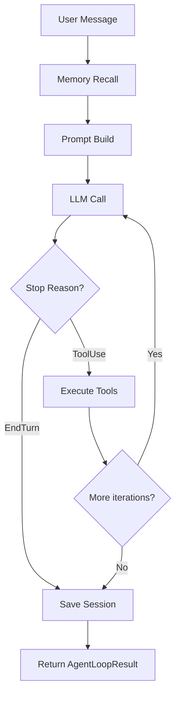
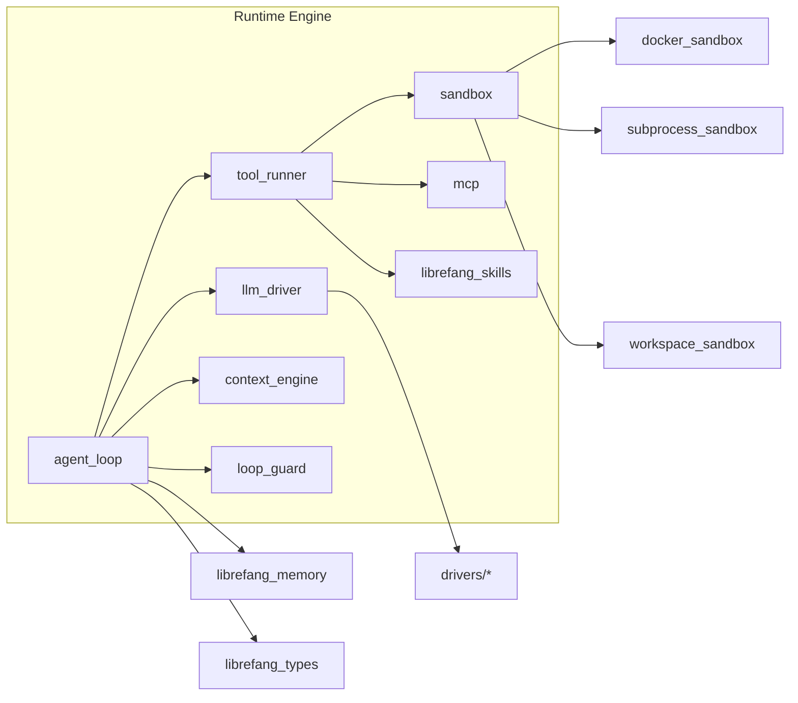

# Runtime Engine

# Runtime Engine

The runtime engine (`librefang-runtime`) is the execution core of LibreFang. It manages the agent lifecycle — from receiving a message through LLM inference, tool execution, and session persistence — while providing isolation, safety, and extensibility through sandboxing, plugins, and the MCP protocol.

## Module Overview

The crate exposes a single library target with a flat module structure. Key domains:

| Domain | Modules |
|--------|---------|
| Agent execution | `agent_loop`, `loop_guard` |
| LLM abstraction | `llm_driver`, `llm_errors`, `drivers/*` |
| Tool system | `tool_runner`, `tool_policy`, `sandbox`, `subprocess_sandbox`, `docker_sandbox`, `workspace_sandbox` |
| Protocol | `a2a`, `mcp`, `mcp_server` |
| Context management | `context_engine`, `context_budget`, `context_overflow`, `compactor` |
| Memory & embeddings | `embedding`, `proactive_memory` |
| Web & media | `web_search`, `web_fetch`, `web_cache`, `web_content`, `browser`, `media`, `media_understanding`, `image_gen`, `tts` |
| Utilities | `http_client`, `retry`, `auth_cooldown`, `graceful_shutdown`, `hooks`, `pii_filter`, `audit`, `trace_store`, `session_repair` |

## The Agent Loop

The core execution engine is `agent_loop::run_agent_loop`. It implements a tool-use loop: the agent calls the LLM, the LLM returns text and/or tool calls, tools execute, and the results feed back into the next LLM call.

### Loop Lifecycle

### Key Parameters

- **Max iterations**: 50 default, configurable per agent via `autonomous.max_iterations`
- **Max history**: 40 messages; older messages are trimmed at conversation-turn boundaries
- **Tool timeout**: 600 seconds for agent_send/agent_spawn and browser tools; configurable per agent
- **Max continuations**: 5 consecutive MaxTokens responses before returning partial output
- **Consecutive all-failed abort**: 3 iterations where every tool call hard-fails triggers loop exit

### Context Assembly

Before each LLM call, the loop assembles the context window:

1. **Overflow recovery** (`context_overflow`): If the message list exceeds the context window, messages are compressed using structured extraction. If compression fails, the loop exits with an error.
2. **Context guard** (`context_budget`): A head+tail strategy ensures the prompt always fits within available tokens, leaving room for the response.

After each iteration, tool result content is truncated to prevent token bloat. When a `ContextEngine` is registered, truncation is delegated to it so plugins can customize the strategy.

### Memory Integration

The loop integrates two memory systems:

- **Recall**: Before each turn, the loop retrieves up to 5 relevant memories using vector similarity (if an `EmbeddingDriver` is available) or text search. Retrieved memories are injected into the prompt.
- **Remember**: After each turn, the interaction is saved as an episodic memory with optional embedding.

Proactive memory (`proactive_memory`) provides additional retrieval and memorization hooks via `auto_retrieve` and `auto_memorize`.

### Loop Phases

Callbacks (`PhaseCallback`) notify callers of lifecycle transitions:

| Phase | Meaning |
|-------|---------|
| `Thinking` | LLM call in progress |
| `ToolUse { tool_name }` | Tool execution in progress |
| `Streaming` | Tokens being streamed to client |
| `Done` | Loop completed successfully |
| `Error` | Loop terminated with error |

## Tool Execution

### `tool_runner::execute_tool`

This is the single entry point for all tool calls. It:

1. Resolves the tool name (handles normalization and aliases)
2. Checks the loop guard (circuit breaker)
3. Routes to the appropriate handler:
   - **Skill tools**: loaded from `librefang_skills` registry
   - **Built-in tools**: file I/O, shell, web fetch/search, knowledge graph, task posting, agent spawning
   - **MCP tools**: forwarded over MCP connections
   - **Browser tools**: executed via `BrowserManager`
4. Enforces workspace boundaries and path traversal guards
5. Runs taint analysis on shell execution inputs
6. Records execution traces for debugging

### Sandboxing

Multiple sandbox layers provide defense in depth:

| Sandbox | Module | Isolation mechanism |
|---------|--------|---------------------|
| Subprocess | `subprocess_sandbox` | `tokio::process::Command` with environment filtering |
| Docker | `docker_sandbox` | OCI container with configurable image and resource limits |
| Workspace | `workspace_sandbox` | Path canonicalization and traversal detection |

The workspace sandbox is particularly important: it validates that all file paths resolve within the agent's configured workspace root, blocking path traversal attacks.

## A2A Protocol

The `a2a` module implements Google's Agent-to-Agent protocol for cross-framework interoperability.

### Core Types

- **`AgentCard`**: A JSON capability manifest served at `/.well-known/agent.json`. Describes agent name, description, skills, and supported input/output modes.
- **`A2aTask`**: The unit of work exchanged between agents, with status tracking and message/artifact accumulation.
- **`A2aTaskStore`**: In-memory task store with TTL-based eviction (24h default) and capacity management. Terminal-state tasks (Completed/Failed/Cancelled) are evicted before non-terminal tasks when at capacity.

### Client Operations

- **`discover`**: Fetches an external agent's `AgentCard` from `/.well-known/agent.json`
- **`send_task`**: Sends a task via JSON-RPC `tasks/send`
- **`get_task`**: Polls task status via JSON-RPC `tasks/get`

### Server

- **`build_agent_card`**: Generates an `AgentCard` from an `AgentManifest`, converting LibreFang tools into A2A skill descriptors

## LLM Driver Architecture

The `llm_driver` module defines the `LlmDriver` trait and `CompletionRequest`/`CompletionResponse` types. Driver implementations live in `drivers/`:

- `openai.rs` — OpenAI-compatible APIs (OpenAI, Azure, generic OpenAI-compatible)
- `anthropic.rs` — Anthropic Claude API
- `google.rs` — Google Vertex AI and Gemini API
- `openrouter.rs` — OpenRouter aggregation
- `ollama.rs` — Local Ollama
- `cloudflare.rs` — Cloudflare Workers AI
- `deepseek.rs` — DeepSeek API

Each driver implements:
- **`complete`**: Single-shot completion
- **`stream`**: Streaming completion yielding `StreamEvent`s
- **`is_configured`**: Returns true when the driver has valid credentials

## Context Management

### `context_engine`

A pluggable trait (`ContextEngine`) allows custom context assembly strategies. Implementations can override:
- `ingest`: Called before the LLM call to recall relevant memories
- `assemble`: Called to build the full message list for the LLM
- `truncate_tool_result`: Called to truncate tool result content
- `after_turn`: Called after each turn for post-processing

### `context_budget`

Implements head+tail truncation: the system prompt goes at the front, recent messages at the tail, with older middle messages dropped while preserving conversation boundaries.

### `context_overflow`

Handles severe overflow by attempting progressive recovery:
1. Strip all images from prior turns
2. Merge adjacent messages
3. Strip thinking blocks
4. Truncate all tool results to a fixed limit
5. Final error if still overflowed

## HTTP Client

`http_client::proxied_client_builder` constructs a `reqwest::Client` that respects system proxy environment variables (`HTTP_PROXY`, `HTTPS_PROXY`, `NO_PROXY`). All outgoing HTTP requests from the runtime (A2A discovery, web search, web fetch) route through this client.

## Web Tools

| Module | Function |
|--------|----------|
| `web_search` | Tavily, Perplexity, DuckDuckGo, Jina, Brave Search, DuckDuckGo Instant Answers |
| `web_fetch` | HTTP GET with host allowlist, redirects, timeout, ETag/Last-Modified caching |
| `web_cache` | In-memory cache for web content with TTL |
| `web_content` | HTML-to-Markdown conversion |
| `browser` | Browser automation (via CDP) for JavaScript-heavy pages |

## Hooks System

`hooks` provides lifecycle hooks that plugins can register:

| Event | Timing |
|-------|--------|
| `BeforePromptBuild` | Before the system prompt and messages are assembled |
| `BeforeToolCall` | Before each tool call; can block the tool |
| `AfterToolCall` | After each tool completes |
| `AgentLoopEnd` | After the loop finishes (success or failure) |

Hooks run best-effort: failures are logged but do not abort the loop.

## Loop Guard (Circuit Breaker)

`loop_guard` implements a circuit breaker that prevents tool call loops:

- **Per-tool circuit breaker**: After a tool is called `N` times in a single turn (default 3), subsequent calls to that tool return a soft error
- **Global circuit breaker**: After `N` total tool calls (default 150), the loop exits
- **Loop detection**: Tracks repeated patterns in tool call sequences

The guard classifies outcomes:
- **`Allow`**: Tool call proceeds
- **`Warn`**: Tool call proceeds but a warning is appended to the result
- **`Block`**: Tool call is rejected with an error
- **`CircuitBreak`**: Loop terminates immediately

## Retry and Backoff

`retry` handles transient failures with exponential backoff:
- Rate limit (429) and overload (529) responses trigger retry with exponential backoff
- Configurable base delay and max retries
- Auth cooldown (`auth_cooldown`) tracks per-provider cooldown windows to avoid hammering rate-limited providers

## Shell Bleed Prevention

`shell_bleed` strips ANSI escape sequences and terminal control codes from tool results. This prevents malicious tools from injecting color codes or control sequences that could obscure output or exploit terminal vulnerabilities.

## PII Filtering

`pii_filter` redacts personally identifiable information (emails, phone numbers, credit cards, etc.) from user messages before they reach the LLM, and from tool results before they are persisted. The redaction patterns are configurable.

## Audit and Tracing

- `audit` logs structured events for compliance and debugging
- `trace_store` persists decision traces (tool call inputs, outputs, timing) that are captured during the agent loop
- `reply_directives` extracts structured directives from agent responses (e.g., `reply_to`, `silent`, `current_thread`)

## Graceful Shutdown

`graceful_shutdown` coordinates orderly shutdown across all runtime components, ensuring in-flight tool executions and LLM calls complete or are cancelled cleanly.

## Key Dependencies

## Configuration Points

The runtime is configured via `AgentManifest` metadata fields:

| Field | Purpose |
|-------|---------|
| `sender_user_id` | Per-sender trust and authorization context |
| `sender_channel` | Channel-specific tool authorization |
| `hand_allowed_env` | Environment variables exposed to skill tools |
| `privacy` | PII redaction configuration |
| `is_group` | Enable group chat `[sender]:` prefix |
| `sender_display_name` | Display name for group chat prefix |
| `stable_prefix_mode` | Disable vector memory recall |
| `prompt_caching` | Enable prompt caching for applicable providers |
| `timeout_secs` | Override tool execution timeout |
| `exec_policy` | Execution policy for sandboxed tools |