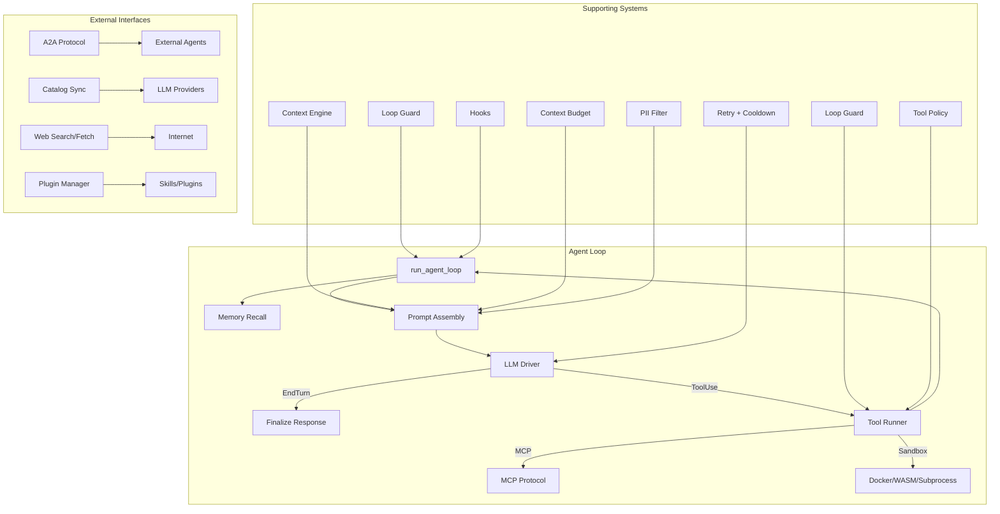

# Runtime Engine

# Runtime Engine (`librefang-runtime`)

The agent runtime and execution environment. Manages the agent execution loop, LLM driver abstraction, tool execution, and WASM sandboxing for untrusted skill/plugin code.

## Architecture Overview



## Core: Agent Execution Loop

The `agent_loop` module is the heart of the runtime. `run_agent_loop` processes a single user message through the full lifecycle:

1. **Provider check** — returns early with `provider_not_configured` if the LLM driver isn't ready
2. **Experiment selection** — when an A/B prompt experiment is running, selects a variant deterministically from the session ID
3. **Memory recall** — retrieves relevant memories via the context engine (preferred), embedding-based vector search, or text search fallback
4. **Prompt assembly** — builds system prompt (with experiment variant if active), injects memory context, applies PII filtering
5. **LLM call** — sends the completion request with retry logic and rate-limit handling
6. **Response handling** — dispatches on `StopReason`:
   - `EndTurn` / `StopSequence` — final text response, parse directives, check for NO_REPLY/silent
   - `ToolUse` — stage the turn, execute tools, feed results back into the loop
   - `MaxTokens` — continue generation with accumulated partial output
7. **Post-turn finalization** — save session, persist episodic memory, run proactive memory `auto_memorize`, fire hooks

### Key Constants

| Constant | Value | Purpose |
|----------|-------|---------|
| `MAX_ITERATIONS` | 50 | Hard cap on loop iterations (overridable via autonomous config) |
| `MAX_RETRIES` | 3 | Retries for rate-limited/overloaded API calls |
| `TOOL_TIMEOUT_SECS` | 600 | Per-tool execution timeout (kernel can override) |
| `MAX_CONTINUATIONS` | 5 | Consecutive `MaxTokens` turns before returning partial response |
| `MAX_HISTORY_MESSAGES` | 40 | Message history size before auto-trimming |
| `MAX_CONSECUTIVE_ALL_FAILED` | 3 | Consecutive iterations where every tool failed before abort |

### Staged Tool Use (`StagedToolUseTurn`)

Tool-use turns are staged in memory before committing to the session. This prevents half-committed states where an assistant `ToolUse` message is persisted without its paired user `ToolResult` message — a condition that causes API rejections ("tool_call_ids did not have response messages", issue #2381).

Flow:
1. `stage_tool_use_turn` — buffers the assistant message and tool call IDs
2. `execute_single_tool_call` — executes each tool, appends result to the staged turn
3. `pad_missing_results` — fills in synthetic error results for any tool that wasn't executed (mid-turn signal, hard error break)
4. `commit` — atomically pushes the assistant message + user tool-result message to both `session.messages` and the LLM working copy

### Mid-Turn Signals

The loop accepts out-of-band signals via an `mpsc::Receiver<AgentLoopSignal>`:
- **`Message`** — injects arbitrary text into the conversation mid-turn
- **`ApprovalResolved`** — patches an in-flight tool result that was waiting for human approval, updating its content/status in-place

When a signal arrives, the staged turn is padded and committed, the signal is injected as a user message, and the loop continues.

### Context Management

Context overflow is handled in two layers:

- **`context_overflow::recover_from_overflow`** — progressive recovery: strip tool results → strip old turns → strip all but current turn → give up
- **`context_engine`** — pluggable context assembly via the `ContextEngine` trait; when present, delegates assembly entirely

`ContextBudget` tracks token allocation. `safe_trim_messages` trims both the LLM working copy and the persistent session store at conversation-turn boundaries so `ToolUse`/`ToolResult` pairs are never split.

### Error Classification

Tool errors are classified as **soft** or **hard**:

- **Soft errors** — approval denials, sandbox rejections, parameter errors, argument truncation. The LLM can self-correct on the next iteration. Do not count toward the consecutive-failure abort threshold.
- **Hard errors** — network failures, unrecognized tools, permanent API errors. Accumulate toward `MAX_CONSECUTIVE_ALL_FAILED`.

### Provider Prefix Stripping

Model IDs stored as `provider/org/model` (e.g., `openrouter/google/gemini-2.5-flash`) are stripped to `org/model` before API calls. For providers requiring qualified format (OpenRouter, Together, Fireworks, Replicate, Chutes, HuggingFace), bare model names like `gemini-2.5-flash` are normalized to `google/gemini-2.5-flash` automatically.

### Group Chat Support

When `is_group` is set in manifest metadata, user messages are prefixed with `[SanitizedSenderName]: ` so the LLM can distinguish speakers. The prefix is applied after PII filtering to prevent redaction of display names.

### `AgentLoopResult`

The return type carries everything the kernel needs to route the response:

| Field | Purpose |
|-------|---------|
| `response` | Final text output |
| `total_usage` | Accumulated `TokenUsage` across all LLM calls |
| `iterations` | How many loop iterations ran |
| `silent` | Agent chose NO_REPLY |
| `provider_not_configured` | No LLM provider available |
| `decision_traces` | Per-tool-call traces (rationale, timing, outcome) |
| `memories_saved` / `memories_used` | Proactive memory summaries |
| `directives` | Reply routing (thread, channel) |
| `new_messages_start` | Index into `session.messages` where this turn's messages begin |

## A2A Protocol (`a2a`)

Implements Google's Agent-to-Agent protocol for cross-framework agent interoperability.

### Agent Cards

`AgentCard` is a JSON capability manifest served at `/.well-known/agent.json`. `build_agent_card` converts an `AgentManifest` into an A2A card, mapping LibreFang tool names to A2A skill descriptors.

### Task Lifecycle

Tasks (`A2aTask`) are the unit of inter-agent work:

```
Submitted → Working → Completed
                   → Failed
                   → InputRequired → Working (loop)
                   → Cancelled
```

`A2aTaskStatusWrapper` handles both the bare string form (`"completed"`) and object form (`{"state": "completed", "message": ...}`) used by different A2A implementations.

### Task Store (`A2aTaskStore`)

In-memory bounded store for task tracking with two-tier eviction:

1. **TTL sweep** — on every insert, tasks older than 24 hours (configurable) are removed regardless of state
2. **Capacity eviction** — if at capacity after TTL sweep, evict the oldest terminal-state task; fall back to the oldest task overall

### Discovery and Communication

- `discover_external_agents` — called at boot, fetches agent cards from all configured external agents
- `A2aClient` — HTTP client using JSON-RPC for `tasks/send`, `tasks/get` operations

## Tool Execution (`tool_runner`)

Dispatches tool calls to the appropriate handler:

- **Built-in tools** — shell exec, file operations, browser automation, speech-to-text, Docker exec, process management
- **MCP tools** — delegated to MCP connections via `call_tool`
- **Skills** — dispatched through the `SkillRegistry`
- **Approval flow** — tools requiring human approval are submitted via `submit_tool_approval` and their results patched in by `ApprovalResolved` signals

Security checks before execution:
- **Taint analysis** — `check_taint_shell_exec`, `check_taint_net_fetch`, `check_taint_outbound_header`, `check_taint_outbound_text` validate that tool inputs don't leak sensitive data
- **Tool policy** — `resolve_tool_access` enforces per-agent tool allowlists and group-based permissions
- **Loop guard** — circuit breaker and per-tool rate limiting to prevent infinite tool loops

## Supporting Systems

### Memory

- **Recall** — embedding-based vector search with text fallback; filtered by agent ID and optional peer ID
- **Proactive memory** — `auto_retrieve` fetches contextually relevant memories; `auto_memorize` extracts new memories from turn messages after completion
- **Episodic persistence** — `remember_interaction_best_effort` stores "User asked: X / I responded: Y" pairs after each turn

### Context Engine

The `ContextEngine` trait provides a plugin interface for context assembly. When present, it handles:
- `ingest` — recall memories and prepare context for the current turn
- `assemble` — build the final message list within the context window
- `after_turn` — post-turn processing (e.g., updating indices)

When no context engine is registered, the built-in `recover_from_overflow` + `apply_context_guard` pipeline runs instead.

### Hooks (`hooks`)

`HookRegistry` fires callbacks at defined lifecycle points:
- `BeforePromptBuild` — before system prompt assembly
- `BeforeToolCall` — can block tool execution with a reason
- `AfterToolCall` — after tool completes
- `AgentLoopEnd` — after the loop finishes

Hooks are best-effort: failures are logged but don't abort the loop.

### Session Repair (`session_repair`)

Maintains message history integrity:
- `validate_and_repair` — ensures `ToolUse`/`ToolResult` pairing, removes orphaned blocks
- `find_safe_trim_point` — locates trim boundaries that don't split tool-use pairs
- `prune_heartbeat_turns` — removes autonomous heartbeat noise, keeping the most recent N turns
- `strip_tool_result_details` — removes injection markers from tool output

### Retry and Cooldown (`retry`, `auth_cooldown`)

`call_with_retry` wraps LLM calls with exponential backoff. `ProviderCooldown` tracks per-provider cooldown periods when errors indicate temporary failures (rate limits, overload).

### Provider Health (`provider_health`)

`probe_provider_cached` checks LLM provider reachability, used by the kernel's provider listing endpoint. Probes are cached to avoid hammering provider APIs.

### Web Tools

- **`web_search`** — DuckDuckGo (default), Brave, Jina; auto-selects based on configured API keys
- **`web_fetch`** — HTTP content fetching with proxy support, content type detection
- **`web_content`** — HTML→Markdown conversion, tag stripping, link extraction
- **`web_cache`** — time-bounded response cache for fetched content

### Media (`media`, `media_understanding`)

- Vision/understanding through `MediaEngine` — image analysis, transcription
- TTS synthesis (`tts`) — OpenAI, Google, ElevenLabs providers
- Speech-to-text via `tool_speech_to_text` → `transcribe_audio`

### Sandboxing

- **`docker_sandbox`** — containerized tool execution
- **`subprocess_sandbox`** — restricted subprocess execution
- **`workspace_sandbox`** — path validation preventing traversal and sandbox escapes
- **`sandbox`** (WASM) — WebAssembly sandboxing for untrusted plugin code via `librefang-runtime-wasm`

### Plugin System

- **`plugin_manager`** — plugin discovery, parsing, lifecycle
- **`plugin_runtime`** — plugin execution environment
- **`python_runtime`** — Python code execution support

### Model Catalog (`model_catalog`)

Maintains model metadata and pricing. `merge_catalog_file` loads catalog data from disk. `find_model` and `list_models` support model selection and cost estimation.

### Catalog Sync (`catalog_sync`)

`sync_catalog_to` / `sync_catalog_http` synchronize model catalogs from remote providers, using the HTTP client with TLS configuration.

### Registry Sync (`registry_sync`)

`sync_registry` downloads the extension registry index. `resolve_home_dir_for_tests` provides a test-safe home directory resolution used across the codebase.

## Re-exports

The crate re-exports several sub-crates for convenience:

| Re-export | Source Crate |
|-----------|-------------|
| `drivers` | `librefang-llm-drivers` |
| `llm_driver`, `llm_errors` | `librefang-llm-driver` |
| `http_client` | `librefang-http` |
| `kernel_handle` | `librefang-kernel-handle` |
| `mcp`, `mcp_oauth` | `librefang-runtime-mcp` |
| `sandbox`, `host_functions` | `librefang-runtime-wasm` |
| `chatgpt_oauth`, `copilot_oauth` | `librefang-runtime-oauth` |