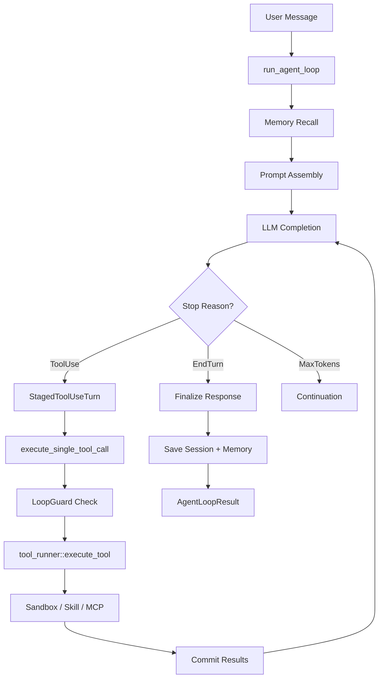

# Runtime Engine

# Runtime Engine (`librefang-runtime`)

## Purpose

The runtime engine is the execution heart of LibreFang. It manages the full lifecycle of an agent turn: receiving a user message, recalling relevant memories, calling the LLM, executing tool calls in a sandboxed environment, and persisting the updated session. Everything the agent *does* passes through this crate.

## Architecture Overview



## Key Submodules

| Submodule | Role |
|---|---|
| `agent_loop` | Core execution loop, `run_agent_loop` / `run_agent_loop_streaming` |
| `tool_runner` | Dispatches individual tool calls to built-in tools, skills, or MCP servers |
| `llm_driver` | Abstracted LLM completion interface (re-exported from `librefang-llm-driver`) |
| `context_budget` | Token-aware truncation strategies for tool results and conversation history |
| `context_engine` | Pluggable context-assembly pipeline (overflow recovery, summarization) |
| `context_overflow` | Recovery heuristics when the prompt exceeds the model's context window |
| `loop_guard` | Circuit breaker and rate limiter for tool calls within a single turn |
| `session_repair` | Validates and repairs message sequences (orphan tool results, malformed blocks) |
| `workspace_sandbox` | Path validation and symlink resolution for file-access tools |
| `sandbox` | WASM sandboxing for untrusted plugin/skill code (re-exported from `librefang-runtime-wasm`) |
| `subprocess_sandbox` | OS-level process isolation for tool execution |
| `docker_sandbox` | Container-based sandboxing for tool execution |
| `web_search` / `web_fetch` / `web_cache` / `web_content` | Web toolchain: search providers, HTTP fetching with SSRF protection, caching, HTML→Markdown |
| `mcp` | Model Context Protocol client connections (re-exported from `librefang-runtime-mcp`) |
| `mcp_server` | In-process MCP server exposing agent tools to external clients |
| `hooks` | Lifecycle hooks (`BeforeToolCall`, `AfterToolCall`, `AgentLoopEnd`, etc.) |
| `pii_filter` | Redacts PII patterns from user messages before they reach the LLM |
| `proactive_memory` | Auto-memorize and auto-retrieve hooks that extract/ inject memories per turn |
| `prompt_builder` | Constructs system prompts, memory sections, and context blocks |
| `compactor` | Conversation compaction to reduce token usage |
| `reply_directives` | Parses `[[reply_to:...]]` / `[[silent]]` directives from LLM responses |
| `silent_response` | Detects `NO_REPLY` / `[no reply needed]` sentinels |
| `routing` | Request routing across LLM providers |
| `retry` | Exponential backoff for rate-limited or overloaded API calls |
| `provider_health` | Tracks per-provider availability |
| `embedding` | Embedding driver trait for vector-based memory recall |
| `tts` | Text-to-speech synthesis (OpenAI, ElevenLabs, Google) |
| `media` / `media_understanding` | Media driver cache and multimodal content analysis |
| `browser` | Browser automation manager |
| `image_gen` | Image generation tool |
| `trace_store` | Persistent storage for decision traces |
| `audit` | Audit logging for tool invocations |
| `process_manager` | Manages long-running child processes |
| `plugin_manager` / `plugin_runtime` | Plugin discovery, loading, and lifecycle |
| `a2a` | Agent-to-agent communication protocol |
| `model_catalog` | Model metadata, aliases, and pricing |
| `graceful_shutdown` | Coordinated shutdown of in-flight work |
| `auth_cooldown` | Provider-level cooldown after repeated auth failures |
| `link_understanding` | Extracts and summarizes content from shared URLs |
| `shell_bleed` | Detects and mitigates shell-injection leakage |
| `str_utils` | String utilities shared across the runtime |
| `python_runtime` | Python script execution for tools |
| `kernel_handle` | Kernel RPC interface (re-exported from `librefang-kernel-handle`) |
| `http_client` | Shared HTTP client with proxy support (re-exported from `librefang-http`) |
| `catalog_sync` / `registry_sync` | Remote registry and model catalog synchronization |
| `channel_registry` | Channel configuration registry |
| `command_lane` | Command dispatch lane for agent messaging |

## The Agent Loop

### Entry Points

Two public functions drive agent execution:

- **`run_agent_loop`** — non-streaming. Returns a complete `AgentLoopResult`.
- **`run_agent_loop_streaming`** — streams `StreamEvent`s to an `mpsc` receiver and signals `PHASE_RESPONSE_COMPLETE` when text generation finishes, then continues post-processing asynchronously.

Both share identical tool-execution, context-management, and persistence logic.

### Execution Phases

1. **Pre-flight checks** — Verify the LLM driver is configured (`driver.is_configured()`). Return early with `provider_not_configured: true` if not.

2. **Experiment selection** — If an A/B prompt experiment is running for this agent, deterministically select a variant based on `session.id` hash. The variant's system prompt replaces the manifest default for this turn.

3. **Memory recall** — Uses `setup_recalled_memories` which:
   - Delegates to `context_engine.ingest()` if a context engine is available, or
   - Falls back to embedding-based vector recall (`recall_with_embedding_async`), or
   - Falls back to plain text search (`recall`).
   - Appends proactive memories from `auto_retrieve` when not in fork mode.
   - All recall failures are non-fatal — the loop continues with empty memories and logs a warning.

4. **Prompt assembly** — `build_prompt_setup` merges:
   - The agent's base system prompt (possibly overridden by experiment variant).
   - Recalled memories formatted as a context section.
   - A language-matching instruction appended to the system prompt.

5. **PII filtering** — The user message (and any content blocks) pass through `pii_filter::filter_message` based on the privacy config extracted from manifest metadata. Group-chat sender prefixes are applied after filtering.

6. **Message preparation** — `prepare_llm_messages`:
   - Extracts non-system messages from the session.
   - Inserts `canonical_context_msg` and memory context at the front.
   - Runs `safe_trim_messages` to enforce `MAX_HISTORY_MESSAGES` (40) at turn boundaries.
   - Strips stale image data from prior turns (`strip_prior_image_data`).

7. **Web search augmentation** — For models without tool support, `web_search_augment` optionally generates search queries via a small LLM call, executes web searches, and injects results as context.

8. **Iterative loop** — For each iteration (up to `MAX_ITERATIONS` = 50, configurable via `manifest.autonomous.max_iterations`):
   - **Context assembly** — Either via `context_engine.assemble()` or inline overflow recovery + context guard.
   - **LLM completion** — `call_with_retry` with exponential backoff (up to 3 retries, base 1s delay).
   - **Response handling** by stop reason (see below).

### Stop Reason Handling

#### `EndTurn` / `StopSequence`

The LLM finished its response. The loop:

1. Parses reply directives (`[[reply_to:...]]`, `[[silent]]`).
2. Checks for silent response (`NO_REPLY`, `[no reply needed]`). If silent, saves session and returns `silent: true`.
3. Checks for retry conditions via `classify_end_turn_retry`:
   - **Empty response** — Retries once with a nudge message.
   - **Hallucinated action** — LLM described an action without calling tools. Retries with a correction.
   - **Action intent** — User asked for action but LLM responded with text only. Retries with a nudge.
4. Finalizes the response text and calls `finalize_successful_end_turn`.

#### `ToolUse`

The LLM wants to execute tools. The loop:

1. Creates a `StagedToolUseTurn` — buffers the assistant message and tool-result blocks locally without mutating `session.messages` yet.
2. Executes each tool call via `execute_single_tool_call`.
3. On hard errors, skips remaining tools in the batch and appends stub results (prevents "tool_call_ids did not have response messages" errors — issue #2381).
4. Commits the staged turn atomically to both `session.messages` and the LLM working copy.
5. Saves session interim (unless fork mode).
6. Tracks consecutive all-failed iterations. After `MAX_CONSECUTIVE_ALL_FAILED` (3) consecutive iterations with only hard errors, exits with `RepeatedToolFailures`.

#### `MaxTokens`

The LLM hit the token limit. If there are no tool calls (pure text overflow) or the continuation counter reaches `MAX_CONTINUATIONS` (5), returns the partial response. Otherwise, appends the partial text and continues the loop.

### StagedToolUseTurn

A critical data structure that solves the **orphan tool_use** problem (#2381). Previously, the assistant's `tool_use` message was eagerly pushed to `session.messages` before any tool executed. If execution was interrupted (error, signal, crash), the session would contain an assistant message with `ToolUse` blocks but no matching user message with `ToolResult` blocks — causing API 400 errors on the next turn.

`StagedToolUseTurn` buffers everything locally:

```
stage_tool_use_turn()     // Creates the staged turn
  → append_result()       // Per-tool: adds a ToolResult block
  → pad_missing_results() // Fills in "tool interrupted" for unexecuted IDs
  → commit()              // Atomically pushes assistant + user messages
```

If the staged turn is dropped without committing (e.g., `?` propagation from an error), `session.messages` is untouched.

### LoopGuard

`LoopGuard` provides circuit-breaker semantics for tool calls within a turn:

- **`Block`** — Tool is rate-limited; returns a synthetic error to the LLM.
- **`Warn`** — Tool is approaching its limit; appends a warning to the tool result.
- **`CircuitBreak`** — Global limit exceeded; breaks out of the loop entirely with a persistent session save.

For autonomous agents, the circuit breaker threshold scales with `max_iterations * 3`.

### LoopOptions

| Field | Purpose |
|---|---|
| `is_fork` | Marks derivative (ephemeral) turns. Forks skip session persistence, proactive memory, and context-engine updates. Prevents recursive auto-memorize loops. |
| `allowed_tools` | Runtime tool allowlist enforced at execute time (not request-schema time) to preserve Anthropic prompt-cache alignment. |

### AgentLoopResult

Returned to the kernel after the loop completes:

| Field | Description |
|---|---|
| `response` | Final text response (empty if silent) |
| `total_usage` | Cumulative token usage across all LLM calls |
| `iterations` | Number of loop iterations |
| `silent` | Agent intentionally chose not to reply |
| `directives` | Parsed reply directives |
| `decision_traces` | Per-tool-call traces with timing, rationale, and outcomes |
| `memories_saved` / `memories_used` | Memory activity summaries |
| `provider_not_configured` | True when no LLM provider was available |
| `new_messages_start` | Index into `session.messages` where this turn's messages begin |
| `skill_evolution_suggested` | True when 5+ tool calls suggest a skill-creation opportunity |

## Tool Execution

`execute_single_tool_call` is the per-tool execution path:

1. **LoopGuard check** — Block, warn, or circuit-break.
2. **Fork allowlist check** — Reject tools outside `LoopOptions::allowed_tools`.
3. **Hook** — Fire `BeforeToolCall`; block if the hook returns an error.
4. **Timeout** — Execute via `tool_runner::execute_tool` with a configurable timeout (default 600s).
5. **Trace** — Record a `DecisionTrace` with timing, rationale, and output summary.
6. **Hook** — Fire `AfterToolCall` (best-effort).
7. **Sanitize** — Strip injection markers and truncate the result content.

`tool_runner::execute_tool` dispatches to:
- Built-in tools (file I/O, process management, web search, agent spawn, etc.)
- Skills from the `SkillRegistry`
- MCP server tool calls via `McpConnection`
- Sandbox-specific execution (WASM, subprocess, Docker)

## Context Management

### Context Budget

`ContextBudget` defines allocation ratios for system prompt, conversation history, tool results, and response space within the model's context window. `apply_context_guard` enforces these budgets by trimming older messages.

### Context Overflow Recovery

`recover_from_overflow` applies a graduated recovery strategy:
1. Strip tool-result details.
2. Summarize old messages.
3. Drop oldest messages.
4. Final error — suggest `/reset` or `/compact`.

Each stage is non-destructive: if the context still fits after stage 1, no further action is taken.

### Context Engine

`ContextEngine` is a trait for pluggable context-assembly strategies. When provided, it handles:
- `ingest` — Recall memories for a user message.
- `assemble` — Build the final message list within token budget.
- `after_turn` — Post-turn state updates (summary chains, etc.).

When no context engine is provided, the inline fallback (overflow recovery + context guard) is used.

## Memory Integration

The runtime integrates with `librefang-memory` at several points:

1. **Pre-turn recall** — Vector or text search for relevant memories, plus proactive `auto_retrieve`.
2. **Post-turn memorize** — `remember_interaction_best_effort` stores a "User asked: ... I responded: ..." episodic memory with optional embedding.
3. **Proactive auto_memorize** — After a successful turn, the proactive memory store extracts structured memories and relations from the conversation.
4. **Session persistence** — `save_session_async` writes the full session (messages + metadata) to the memory substrate.

All memory operations are best-effort: failures log warnings but never fail the agent loop.

## Web Toolchain

### Web Search

Supports multiple providers: DuckDuckGo (no API key), Brave, Tavily. The `search_auto` function selects the first configured provider. For models without tool support, `web_search_augment` optionally uses a small LLM call to generate focused search queries from the conversation, then injects results as context.

### Web Fetch

HTTP client with SSRF protection (`check_ssrf` blocks cloud metadata IPs), configurable TTL caching (`web_cache`), and HTML-to-Markdown conversion (`web_content`).

## Provider Prefix Handling

`strip_provider_prefix` normalizes model IDs for multi-provider setups. For example, `openrouter/google/gemini-2.5-flash` becomes `google/gemini-2.5-flash` when sent to the OpenRouter API. For providers requiring `org/model` format (OpenRouter, Together, Fireworks, etc.), bare model names are normalized using `normalize_bare_model_id` (e.g., `gemini-2.5-flash` → `google/gemini-2.5-flash`).

## Group Chat Support

In group channels (detected via `manifest.metadata.is_group`), user messages are prefixed with a sanitized `[sender]:` label so the LLM can distinguish speakers. The prefix is applied after PII filtering to prevent display-name redaction.

## PII Filtering

`pii_filter::PiiFilter` redacts configured patterns (emails, phone numbers, etc.) from user messages based on the privacy mode (`Off`, `Redact`, `Replace`). The filter runs before the message enters the session.

## A/B Experiments

When a prompt experiment is active for an agent, `select_running_experiment` deterministically assigns a variant based on `session.id` hash modulo traffic-split weights. The variant's system prompt replaces the manifest default. `ExperimentContext` is returned in `AgentLoopResult` for metric tracking.

## Key Constants

| Constant | Value | Purpose |
|---|---|---|
| `MAX_ITERATIONS` | 50 | Loop iterations before giving up (overridable via `manifest.autonomous.max_iterations`) |
| `MAX_RETRIES` | 3 | Retries for rate-limited API calls |
| `BASE_RETRY_DELAY_MS` | 1000 | Exponential backoff base |
| `TOOL_TIMEOUT_SECS` | 600 | Per-tool execution timeout |
| `MAX_CONTINUATIONS` | 5 | Consecutive MaxTokens continuations |
| `MAX_HISTORY_MESSAGES` | 40 | Message history cap (≈7–10 conversation turns) |
| `MAX_CONSECUTIVE_ALL_FAILED` | 3 | Consecutive all-failed iterations before abort |
| `DEFAULT_CONTEXT_WINDOW` | 200,000 | Token-based trimming fallback |

## Error Handling Philosophy

The runtime prioritizes **forward progress** over strict correctness:

- Memory recall failures → empty memories + warning log.
- Embedding failures → fallback to text search.
- Hook failures in best-effort paths → warning log, loop continues.
- Tool execution timeouts → synthetic error result returned to LLM.
- Context overflow → graduated recovery (strip details → summarize → drop → fail).

Only truly unrecoverable states (provider misconfiguration, repeated hard tool failures, circuit-breaker trips) terminate the loop with an error.

## Thread Safety

`run_agent_loop` is `async` and designed to run on a Tokio runtime. The session (`&mut Session`) is exclusively borrowed for the duration. MCP connections are shared via `tokio::sync::Mutex`. The `PhaseCallback` is `Arc<dyn Fn>` for fire-and-forget UX updates.