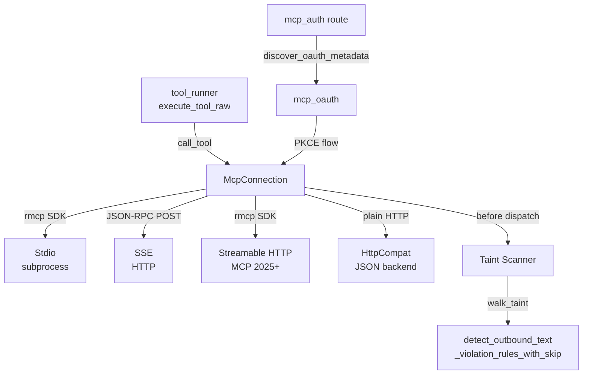
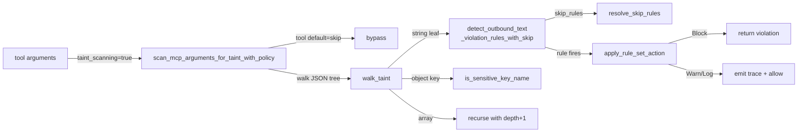

# Runtime Protocol Integrations — librefang-runtime-mcp-src

# librefang-runtime-mcp

MCP (Model Context Protocol) client module that connects librefang to external MCP servers. Handles the full lifecycle — connection, handshake, tool discovery, invocation, and security scanning — across four transport types.

## Architecture

## Transport Types

The module supports four transports, selected by the `McpTransport` enum:

### Stdio

Spawns a subprocess and communicates over stdin/stdout using the `rmcp` SDK for proper MCP protocol handling. This is the primary transport for local MCP servers (e.g. `npx @modelcontextprotocol/server-github`).

- Full MCP `initialize` handshake with capability negotiation
- Tool discovery via `tools/list`
- Optional `roots` capability declaration for filesystem-aware servers
- Environment variable sandboxing (only safe system vars + explicitly declared vars)
- Shell interpreter blocking (`bash`, `sh`, `powershell`, etc. are rejected)

### SSE (Server-Sent Events)

Legacy HTTP transport using JSON-RPC 2.0 over HTTP POST. Implemented directly via `reqwest` without the rmcp SDK.

- Unidirectional — client-initiated requests only; `roots` capability is never declared
- Handshake via `sse_initialize` → `notifications/initialized`
- Tool discovery via `sse_discover_tools` (calls `tools/list`)

### Streamable HTTP

MCP 2025-03-26+ transport using the rmcp SDK's `StreamableHttpClientTransport`. Single endpoint with `Accept: application/json, text/event-stream` and `Mcp-Session-Id` tracking.

- Full rmcp SDK handshake and tool discovery
- OAuth-aware: on 401, extracts the `WWW-Authenticate` header and delegates to `mcp_oauth::discover_oauth_metadata` for three-tier OAuth resolution. Returns `"OAUTH_NEEDS_AUTH"` error to signal the API layer to drive PKCE via the UI
- Local filesystem roots are only advertised when the URL resolves to `localhost`/`127.0.0.1`/`::1` (checked by `is_local_url`)

### HttpCompat

Built-in adapter for plain HTTP/JSON backends that don't speak MCP at all. Tools are declared statically in config, and calls are translated to HTTP requests with path template rendering.

- No MCP handshake — tools are registered from config at connect time
- Supports path templates with `{param}` placeholders (percent-encoded), multiple HTTP methods, query/body request modes
- Static or environment-variable-backed headers (`value` or `value_env`)

## Connection Lifecycle

All transports follow the same lifecycle via `McpConnection::connect`:

1. **Transport-specific connect** — spawn subprocess, create HTTP client, or build rmcp transport
2. **MCP handshake** — `initialize` + `notifications/initialized` (Stdio and Streamable HTTP handled by rmcp; SSE sends manually)
3. **Tool discovery** — `tools/list` response parsed into `ToolDefinition` structs, namespaced as `mcp_{server}_{tool}`
4. **Annotation injection** — MCP `readOnlyHint`/`destructiveHint` annotations translated into `metadata.tool_class` on the JSON Schema (`readonly_search` or `mutating`)

The resulting `McpConnection` holds:
- `config: McpServerConfig` — full server configuration
- `tools: Vec<ToolDefinition>` — discovered, namespaced tools
- `original_names: HashMap<String, String>` — namespaced name → server's original name
- `inner: McpInner` — transport-specific handle (`DynRmcpClient`, `reqwest::Client`, etc.)
- `auth_state: McpAuthState` — current OAuth state

## Taint Scanning

Every `call_tool` invocation passes arguments through the outbound taint scanner before sending them to the MCP server. This prevents an LLM that has been pushed into smuggling credentials from exfiltrating them through tool-call arguments.

### Scanning Flow

### What Gets Scanned

- **String leaves** — checked against `TaintSink::mcp_tool_call()` denylist patterns (credential-shaped strings, PII like emails/phones, `api_key=...` key-value patterns)
- **Object keys** — keys matching `MCP_SENSITIVE_KEY_NAMES` (`authorization`, `api_key`, `secret`, `password`, etc.) with non-empty string values are blocked unconditionally
- **Non-string leaves** (numbers, bools, null) — skipped

### Depth Cap

Recursion is hard-capped at `MCP_TAINT_SCAN_MAX_DEPTH` (64). Deeper trees are rejected outright to prevent pathological payloads from blowing the stack.

### Policy Controls

Three levels of exemption, configured per-server via `McpTaintPolicy`:

| Level | Config | Effect |
|-------|--------|--------|
| **Server-wide disable** | `taint_scanning = false` | Skips content-based heuristic entirely; key-name blocking remains active |
| **Tool-level kill switch** | `taint_policy.tools.<name>.default = "skip"` | Bypasses all scanning for that tool, including key-name checks |
| **Per-path rule skip** | `taint_policy.tools.<name>.paths.<pattern>.skip_rules` | Skip specific `TaintRuleId`s for matching JSON paths |

### JSONPath Matching

Path patterns in `McpTaintPathPolicy` use a minimal JSONPath subset:

- `$.a.b` — exact nested property
- `$.a.*` — any direct child of `$.a` (single segment, non-array)
- `$.a[*]` — any array element of `$.a`
- `$.*` — any top-level property

**Known limitation**: Object keys containing `.` or `[` cannot be addressed precisely. The matcher splits on `.` and treats `[` as array notation. Use broader patterns (`$.*`, `$.headers.*`) as a workaround.

### Named Rule Sets

Tools can reference named `[[taint_rules]]` sets from config to downgrade `Block` to `Warn` or `Log`:

- `lookup_rule_set_action` finds the most permissive action across all sets referenced by the tool that cover the fired rule
- Priority: `Log` > `Warn` > `Block`
- All fired rules are iterated — a downgrade for rule A does **not** mask an unauthorized rule B firing on the same payload
- Unknown rule-set names trigger a one-shot `WARN` per name per process (deduped via `UNKNOWN_RULE_SET_WARNED`)

### Hot-Reload Contract

The `TaintRuleSetsHandle` (`Arc<ArcSwap<Vec<NamedTaintRuleSet>>>`) is shared across all servers. The kernel calls `.store(Arc::new(new_rules))` on config reload; the next `call_tool` picks up the new rules. A `.load()` snapshot taken at scan start stays stable for the entire argument-tree walk.

### Error Sanitization

Violation messages are deliberately redacted — they contain only the JSON path and rule name, never the offending payload value. These messages flow back to the LLM as errors and into logs; echoing the blocked secret would defeat the filter.

## Tool Namespacing

All MCP tools are namespaced as `mcp_{server}_{tool}` to prevent collisions between servers with identical tool names:

- `format_mcp_tool_name("github", "create_issue")` → `"mcp_github_create_issue"`
- Server names are normalized (lowercased, hyphens → underscores): `"my-server"` → `"mcp_my_server_do_thing"`
- `resolve_mcp_server_from_known` reverses the mapping using the known server list (longest-prefix match handles names containing underscores)
- `is_mcp_tool` checks the `mcp_` prefix for routing in `tool_runner`

**Caution**: `extract_mcp_server` splits on the first `_` after `mcp_` and only works for single-word server names. Use `resolve_mcp_server_from_known` when the server list is available.

## Security Hardening

### SSRF Protection

`check_ssrf` blocks URLs targeting cloud metadata endpoints (`169.254.169.254`, `metadata.google`). `is_local_url` uses proper `url::Url` host parsing to prevent bypasses like `127.0.0.1@attacker.com` or `localhost.evil.com`.

### Subprocess Sandboxing

Stdio transport enforces:

- No path traversal (`..` in command rejected)
- No shell interpreters (must use specific runtimes: `npx`, `node`, `python`, etc.)
- Environment is fully cleared; only `SAFE_ENV_VARS` (PATH, HOME, language/locale, runtime-specific vars like `NODE_PATH`, `CARGO_HOME`) plus explicitly declared `env` entries are passed through
- `$VAR` and `${VAR}` expansion in args avoids needing `sh -c` wrappers
- Windows `.cmd` detection for npm/npx

### Credential-Shaped Key Blocking

`MCP_SENSITIVE_KEY_NAMES` catches common credential container keys (`authorization`, `api_key`, `secret`, `password`, `private_key`, etc.) that the value-only text heuristic might miss (e.g. `"Authorization": "Bearer …"` has whitespace + scheme word that evades pattern matching).

## Roots Capability

`RootsClientHandler` implements `rmcp::ClientHandler` to advertise filesystem root directories during the MCP `initialize` handshake. Paths are converted to well-formed `file://` URIs with proper percent-encoding. Only local servers receive roots; remote HTTP servers do not.

## Integration Points

| Caller | Entry Point | Purpose |
|--------|-------------|---------|
| `tool_runner::execute_tool_raw` | `is_mcp_tool`, `resolve_mcp_server_from_known`, `call_tool` | Route tool calls to the correct MCP server |
| `routes::agents::get_agent_mcp_servers` | `resolve_mcp_server_from_known` | Map namespaced tools back to servers for API responses |
| `routes::mcp_auth::auth_start` | `mcp_oauth::discover_oauth_metadata` | OAuth discovery for servers requiring authentication |
| `kernel::mcp_oauth_provider::load_token` | `mcp_oauth::store_tokens` | Persist OAuth tokens after PKCE completion |
| `tui::event::spawn_fetch_agent_mcp_servers` | `resolve_mcp_server_from_known` | Resolve servers in the TUI layer |