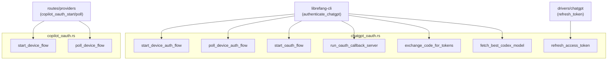
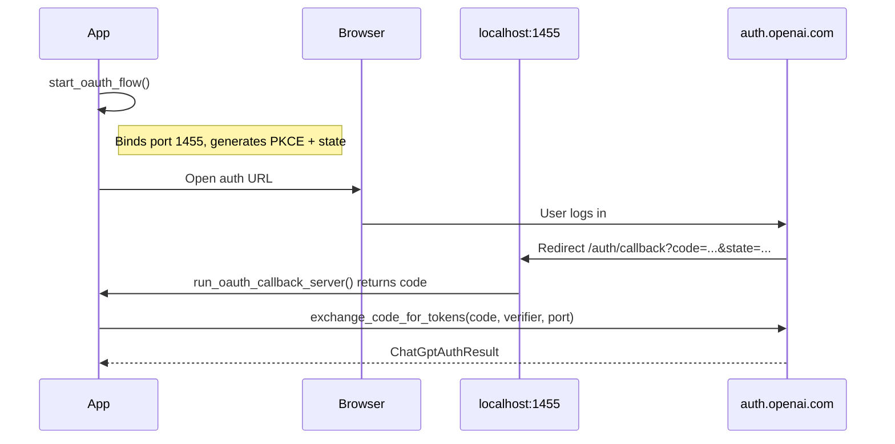
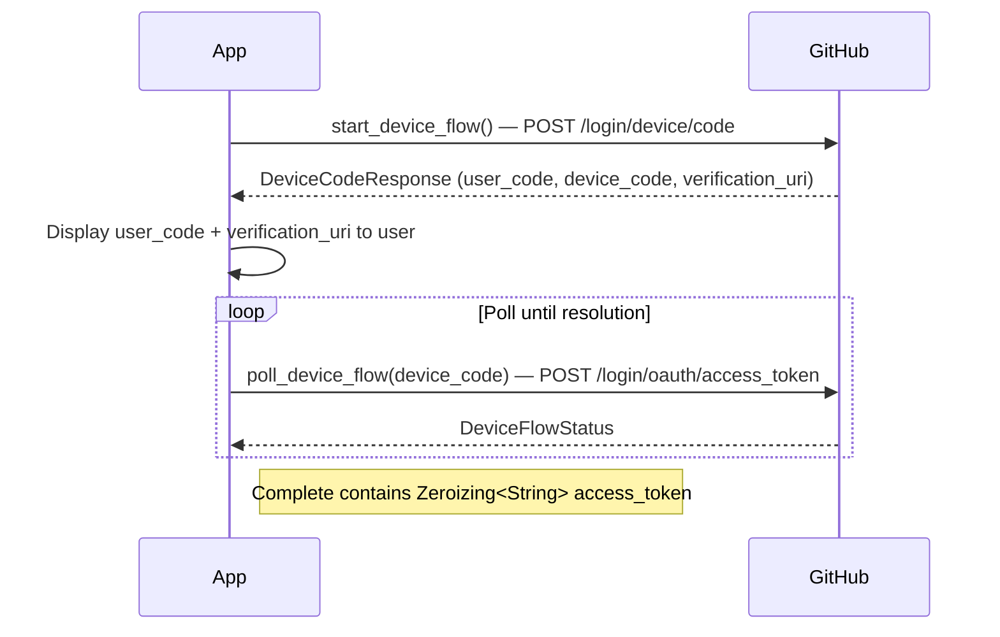

# Runtime Protocol Integrations — librefang-runtime-oauth-src

# librefang-runtime-oauth

OAuth 2.0 authentication integrations for ChatGPT (OpenAI) and GitHub Copilot. This module provides ready-to-use flows that handle PKCE generation, browser callbacks, device authorization polling, token exchange, and token refresh — without requiring any external OAuth libraries beyond standard HTTP.

## Module Layout

```
librefang-runtime-oauth/src/
├── lib.rs                # Re-exports chatgpt_oauth and copilot_oauth
├── chatgpt_oauth.rs      # OpenAI/ChatGPT OAuth — browser & device flows
└── copilot_oauth.rs      # GitHub Copilot OAuth — device flow (RFC 8628)
```

## Architecture



---

## ChatGPT OAuth (`chatgpt_oauth`)

Authenticates users against OpenAI's Codex OAuth endpoints. Supports two flows:

1. **Browser flow** — opens the user's browser, waits for a localhost callback on port 1455.
2. **Device auth flow** — for headless environments; the user visits a URL and enters a one-time code.

Both flows produce a `ChatGptAuthResult` containing an access token, optional refresh token, and expiry.

### Constants

| Constant | Purpose |
|---|---|
| `CHATGPT_BASE_URL` | ChatGPT backend API base (`https://chatgpt.com/backend-api`). OAuth tokens with `api.connectors` scopes work with the Responses API here, not `/v1/chat/completions`. |
| `CLIENT_ID` | OpenAI Codex CLI OAuth client ID (`app_EMoamEEZ73f0CkXaXp7hrann`). |
| `AUTHORIZE_URL` | Authorization endpoint (`https://auth.openai.com/oauth/authorize`). |
| `TOKEN_URL` | Token exchange endpoint (`https://auth.openai.com/oauth/token`). |
| `DEVICE_AUTH_URL` | Device verification page shown to users (`https://auth.openai.com/codex/device`). |
| `DEVICE_AUTH_REDIRECT_URI` | Redirect URI used for device flow token exchange. |
| `CALLBACK_BIND` | Browser flow binds `127.0.0.1:1455` (matches OpenAI's registered redirect URI). |

OAuth scopes requested: `openid profile email offline_access api.connectors.read api.connectors.invoke`.

### Key Types

#### `ChatGptAuthResult`

Result of a successful OAuth flow. All sensitive fields use `Zeroizing<String>` to minimize credential lifetime in memory:

```rust
pub struct ChatGptAuthResult {
    pub access_token: Zeroizing<String>,
    pub refresh_token: Option<Zeroizing<String>>,
    pub expires_in: Option<u64>,
}
```

#### `DeviceAuthPrompt`

Details returned by `start_device_auth_flow()` that must be displayed to the user:

```rust
pub struct DeviceAuthPrompt {
    pub device_auth_id: String,   // Server-issued identifier for polling
    pub user_code: String,        // One-time code to enter at DEVICE_AUTH_URL
    pub interval_secs: u64,       // Recommended poll interval
}
```

#### `DeviceAuthFlowError`

Distinguishes recoverable fallback from fatal errors:

- **`BrowserFallback`** — device auth isn't enabled for the account/workspace. Callers should fall back to the browser flow.
- **`Fatal`** — unrecoverable failure; do not silently retry or fall back.

#### `PkceChallenge`

PKCE verifier/challenge pair generated by `generate_pkce()`:

```rust
pub struct PkceChallenge {
    pub verifier: String,    // 64 random bytes, base64url-encoded (86 chars)
    pub challenge: String,   // SHA-256 of verifier, base64url-encoded
}
```

### Browser Flow

The browser flow binds a localhost TCP server, builds an authorization URL, and waits for the OAuth redirect.



**Step-by-step:**

1. **`start_oauth_flow()`** — Binds `CALLBACK_BIND` (verifies the port is available), generates a PKCE challenge and random state, and returns `(auth_url, port, pkce_verifier, state)`. The caller opens `auth_url` in the user's browser.

2. **`run_oauth_callback_server(port, expected_state)`** — Starts an async HTTP server on the given port. Handles `GET /auth/callback?code=...&state=...`. Validates the `state` parameter against `expected_state` to prevent CSRF. On success, serves a styled HTML confirmation page. Times out after 5 minutes (`AUTH_TIMEOUT_SECS`).

3. **`exchange_code_for_tokens(code, code_verifier, port)`** — POSTs to `TOKEN_URL` with the authorization code, PKCE verifier, and the browser redirect URI. Returns `ChatGptAuthResult`.

### Device Auth Flow

For headless environments where opening a browser isn't practical.

**Step-by-step:**

1. **`start_device_auth_flow()`** — POSTs to `DEVICE_AUTH_USERCODE_URL` with the client ID. Returns `DeviceAuthPrompt` containing the `user_code` and `device_auth_id`. Returns `DeviceAuthFlowError::BrowserFallback` if the feature isn't enabled (HTTP 404).

2. **`poll_device_auth_flow(prompt)`** — Polls `DEVICE_AUTH_TOKEN_URL` at `prompt.interval_secs` intervals. HTTP 403/404 are treated as "still pending" (user hasn't completed verification). On success, the response contains an `authorization_code` and `code_verifier`, which are passed to `exchange_code_for_tokens_with_redirect_uri()` with `DEVICE_AUTH_REDIRECT_URI`. Times out after 15 minutes (`DEVICE_AUTH_TIMEOUT_SECS`).

### Token Refresh

**`refresh_access_token(refresh_token)`** — POSTs to `TOKEN_URL` with `grant_type=refresh_token`. Returns a new `ChatGptAuthResult`. Called from `src/drivers/chatgpt.rs` when the current access token expires.

### Model Discovery

**`fetch_best_codex_model(access_token)`** — Queries `GET {CHATGPT_BASE_URL}/codex/models` with the bearer token. Parses the model list, sorts by `priority` (descending), and returns the highest-priority model slug. Falls back to `"gpt-5.1-codex-mini"` on any failure. Called from `librefang-cli` after authentication to determine which model to use.

### Session Token Check

**`chatgpt_session_available()`** — Returns `true` if the `CHATGPT_SESSION_TOKEN` environment variable is set and non-empty. Useful for callers to decide whether to attempt session-based auth before launching an OAuth flow.

### Utility Functions

| Function | Description |
|---|---|
| `generate_pkce()` | Creates a `PkceChallenge` with 64 random bytes for the verifier and SHA-256 S256 challenge. |
| `create_state()` | Generates a 16-byte hex-encoded random state parameter. |
| `build_authorization_url(port, code_challenge, state)` | Constructs the full authorization URL with all OAuth query parameters. |

---

## Copilot OAuth (`copilot_oauth`)

Implements GitHub's OAuth 2.0 Device Authorization Grant (RFC 8628) using the VSCode Copilot extension's public client ID. This is a pure device flow — there is no browser callback path.

### Key Types

#### `DeviceCodeResponse`

Parsed response from `start_device_flow()`:

```rust
pub struct DeviceCodeResponse {
    pub device_code: String,
    pub user_code: String,
    pub verification_uri: String,
    pub expires_in: u64,
    pub interval: u64,
}
```

#### `DeviceFlowStatus`

Result of each `poll_device_flow()` call. Models all possible states from RFC 8628:

| Variant | Meaning |
|---|---|
| `Pending` | User hasn't completed authorization yet |
| `Complete { access_token }` | Authorization succeeded |
| `SlowDown { new_interval }` | Server requested longer poll interval |
| `Expired` | Device code expired; restart the flow |
| `AccessDenied` | User explicitly denied access |
| `Error(String)` | Unexpected error |

### Flow



1. **`start_device_flow()`** — POSTs to `GITHUB_DEVICE_CODE_URL` with the Copilot client ID and `read:user` scope. Returns `DeviceCodeResponse` with the `user_code` and `verification_uri` to display to the user.

2. **`poll_device_flow(device_code)`** — POSTs to `GITHUB_TOKEN_URL` with the device code. GitHub returns HTTP 200 with an `error` field during polling (as per RFC 8628). The function maps these to the appropriate `DeviceFlowStatus` variant. On success, returns `Complete` with the access token wrapped in `Zeroizing<String>`.

### Constants

| Constant | Value |
|---|---|
| `GITHUB_DEVICE_CODE_URL` | `https://github.com/login/device/code` |
| `GITHUB_TOKEN_URL` | `https://github.com/login/oauth/access_token` |
| `COPILOT_CLIENT_ID` | `Iv1.b507a08c87ecfe98` (VSCode Copilot extension client ID) |

---

## Integration Points

### Incoming Calls (who uses this module)

| Caller | Functions Used |
|---|---|
| `librefang-cli/src/main.rs` (`authenticate_chatgpt`) | `start_oauth_flow`, `start_device_auth_flow`, `poll_device_auth_flow`, `run_oauth_callback_server`, `exchange_code_for_tokens`, `fetch_best_codex_model` |
| `src/routes/providers.rs` (`copilot_oauth_start`) | `start_device_flow` |
| `src/routes/providers.rs` (`copilot_oauth_poll`) | `poll_device_flow` |
| `src/drivers/chatgpt.rs` | `refresh_access_token` |

### Outgoing Dependencies

| Dependency | Usage |
|---|---|
| `librefang_http` | `proxied_client()` and `proxied_client_builder()` for all HTTP requests — respects system proxy settings |
| `librefang_types` | `VERSION` constant for the Codex models API `client_version` parameter |
| `zeroize` | `Zeroizing<String>` wrapper for all credential fields |
| `reqwest`, `tokio`, `serde`, `sha2`, `base64`, `rand` | Standard async HTTP, serialization, crypto, and randomness |

## Security Considerations

- **PKCE** is mandatory for the browser flow — `generate_pkce()` creates a 64-byte random verifier with S256 challenge.
- **State parameter** validation prevents CSRF in the callback server — `run_oauth_callback_server` rejects mismatches with HTTP 400.
- **Zeroizing** — `ChatGptAuthResult.access_token`, `refresh_token`, and Copilot's `access_token` are all `Zeroizing<String>`, which zeroes memory on drop.
- **Device auth fallback** — `DeviceAuthFlowError::BrowserFallback` is a distinct error variant so callers can fall back to the browser flow only when appropriate, never silently on fatal errors.
- **Timeouts** — browser callback times out after 5 minutes; device auth polling times out after 15 minutes.