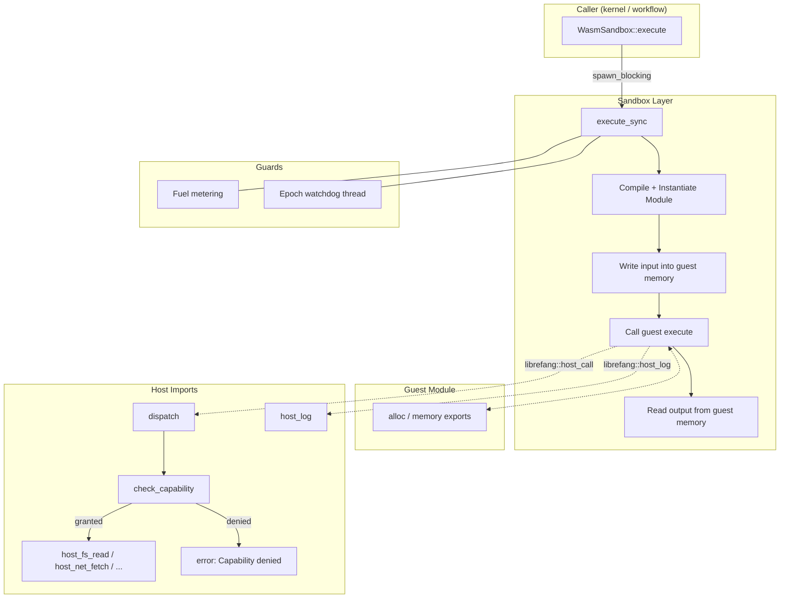

# Runtime Protocol Integrations — librefang-runtime-wasm-src

# Runtime Protocol Integrations — `librefang-runtime-wasm-src`

WASM sandbox for executing untrusted skills and plugins inside LibreFang. Built on Wasmtime with deny-by-default capability enforcement, deterministic fuel metering, wall-clock epoch timeouts, and layered defenses against SSRF, path traversal, and environment exfiltration.

## Architecture



## Module Structure

| File | Responsibility |
|---|---|
| `lib.rs` | Crate root — re-exports `host_functions` and `sandbox`. |
| `sandbox.rs` | `WasmSandbox` engine, `SandboxConfig`, `GuestState`, guest ABI marshalling, fuel/epoch enforcement. |
| `host_functions.rs` | `dispatch` function and all individual host handlers (`host_fs_read`, `host_net_fetch`, etc.), capability checks, SSRF and path-traversal protections. |

---

## Sandbox Engine — `sandbox.rs`

### `WasmSandbox`

The top-level type. Create **once per kernel** and reuse across invocations — the Wasmtime `Engine` is expensive to construct but compiles and instantiates many modules cheaply.

```rust
let sandbox = WasmSandbox::new()?;
```

Construction enables two Wasmtime features:
- **Fuel consumption** — deterministic instruction counting.
- **Epoch interruption** — wall-clock timeout via a cooperative interrupt flag.

#### `execute` → `execute_sync` flow

`execute` is `async` but immediately offloads to `spawn_blocking` because WASM execution is CPU-bound and must not starve the Tokio runtime. The inner `execute_sync` performs these steps in order:

1. **Compile** the WASM/WAT bytes into a `Module`.
2. **Create a `Store<GuestState>`** carrying capabilities, an optional `KernelHandle`, the agent ID, and a Tokio handle.
3. **Set fuel budget** from `SandboxConfig::fuel_limit` (0 = unlimited).
4. **Start epoch watchdog thread** — see below.
5. **Register host function imports** into a `Linker` under the `"librefang"` module name.
6. **Instantiate** the module (no WASI — the guest has no ambient filesystem or network).
7. **Validate guest exports**: `memory`, `alloc(i32) → i32`, `execute(i32, i32) → i64`.
8. **Marshal input**: serialize the input `serde_json::Value` to bytes, call `alloc` inside the guest, copy bytes into guest memory with `checked_add` overflow protection.
9. **Call guest `execute`**, trap on `OutOfFuel` or `Interrupt` (epoch timeout).
10. **Marshal output**: unpack the packed `i64` result `(ptr << 32 | len)`, read JSON bytes back out with overflow-checked bounds, deserialize.
11. **Report fuel consumed**.

#### Epoch watchdog

The watchdog prevents a runaway guest from blocking forever. It spawns an OS thread that:

- Computes a deadline (`now + timeout_secs`, default 30 s).
- Loops on `park_timeout(remaining)` — cheap sleep, no polling.
- On deadline expiry: calls `engine.increment_epoch()`, which traps the guest on its next epoch check.
- On early wake (via `Thread::unpark`): re-reads an `AtomicBool` done flag. If set, exits cleanly without touching the epoch counter, so concurrent sandboxes sharing the same engine are not falsely interrupted.

An RAII `WatchdogGuard` sets the done flag, unparks, and joins the thread on every exit path (`?`, panic, normal return). This eliminates the previous bug where fire-and-forget watchdog threads accumulated and eventually exhausted the OS thread limit.

### `SandboxConfig`

```rust
pub struct SandboxConfig {
    pub fuel_limit: u64,           // Default: 1_000_000
    pub max_memory_bytes: usize,   // Default: 16 MiB (reserved for future enforcement)
    pub capabilities: Vec<Capability>,
    pub timeout_secs: Option<u64>, // Default: 30 s when None
}
```

### `GuestState`

Carried inside the Wasmtime `Store` and accessible to host functions via `Caller<GuestState>`:

| Field | Purpose |
|---|---|
| `capabilities` | Checked by every host handler before performing any privileged operation. |
| `kernel` | `Option<Arc<dyn KernelHandle>>` — required for `kv_get`, `kv_set`, `agent_send`, `agent_spawn`. |
| `agent_id` | The calling agent's identifier, used for logging and capability inheritance checks. |
| `tokio_handle` | Allows synchronous host functions to `.block_on` async kernel operations. |

### `ExecutionResult`

```rust
pub struct ExecutionResult {
    pub output: serde_json::Value,
    pub fuel_consumed: u64,
}
```

### `SandboxError`

| Variant | Trigger |
|---|---|
| `Compilation` | Wasmtime module compilation failure. |
| `Instantiation` | Linker/instantiation failure (missing imports, type mismatches). |
| `Execution` | Generic runtime error, epoch timeout. |
| `FuelExhausted` | Guest consumed its entire fuel budget. |
| `AbiError` | Missing exports, pointer overflow, out-of-bounds memory access, invalid JSON. |

---

## Guest ABI

WASM modules must export three symbols:

| Export | Signature | Description |
|---|---|---|
| `memory` | `(memory 1)` | Linear memory, at least 1 page. |
| `alloc` | `(func (param i32) (result i32))` | Bump allocator: given a byte count, returns a pointer to that many bytes. |
| `execute` | `(func (param i32 i32) (result i64))` | Main entry point. Receives `(input_ptr, input_len)` pointing to JSON bytes. Returns a packed `i64`: high 32 bits = result pointer, low 32 bits = result length. Result must also be valid JSON. |

## Host ABI

The host provides two imports in the `"librefang"` module:

### `host_call(request_ptr: i32, request_len: i32) -> i64`

Single RPC entry point. The guest writes a JSON request into its own memory:

```json
{"method": "fs_read", "params": {"path": "/data/config.toml"}}
```

The host reads it, dispatches to the appropriate handler, and writes a JSON response back into guest memory using the guest's `alloc` export. The return value is the same packed `(ptr << 32 | len)` format.

Responses are always one of:

```json
{"ok": <value>}
{"error": "human-readable message"}
```

### `host_log(level: i32, msg_ptr: i32, msg_len: i32)`

Lightweight logging — no capability check. Levels: 0 = trace, 1 = debug, 2 = info, 3 = warn, ≥4 = error. Messages are prefixed with `[wasm]` and include the agent ID in the tracing span.

---

## Host Functions — `host_functions.rs`

### `dispatch`

```rust
pub fn dispatch(state: &GuestState, method: &str, params: &serde_json::Value) -> serde_json::Value
```

Central switchboard. Routes the method string to the appropriate handler. Unknown methods return `{"error": "Unknown host method: ..."}`. Called from `WasmSandbox::host_call`, which is the `"librefang" "host_call"` import.

#### Method routing

| Method | Handler | Required Capability | Notes |
|---|---|---|---|
| `time_now` | `host_time_now` | None (always allowed) | Returns Unix epoch seconds. |
| `fs_read` | `host_fs_read` | `FileRead` | Reads file contents as string. |
| `fs_write` | `host_fs_write` | `FileWrite` | Writes string to file. |
| `fs_list` | `host_fs_list` | `FileRead` | Lists directory entries. |
| `net_fetch` | `host_net_fetch` | `NetConnect` | HTTP GET/POST/PUT/DELETE with SSRF protection. |
| `shell_exec` | `host_shell_exec` | `ShellExec` | Runs a process with stripped environment. |
| `env_read` | `host_env_read` | `EnvRead` | Reads a single environment variable. |
| `kv_get` | `host_kv_get` | `MemoryRead` | Reads from kernel key-value store. |
| `kv_set` | `host_kv_set` | `MemoryWrite` | Writes to kernel key-value store. |
| `agent_send` | `host_agent_send` | `AgentMessage` | Sends a message to another agent. |
| `agent_spawn` | `host_agent_spawn` | `AgentSpawn` | Spawns a child agent (capabilities ≤ parent). |

### Capability checking

```rust
fn check_capability(capabilities: &[Capability], required: &Capability) -> Result<(), serde_json::Value>
```

Iterates the guest's granted capabilities and calls `capability_matches` (from `librefang_types`). Returns `Ok(())` on first match, or an error JSON if nothing matches. Every handler (except `time_now`) calls this **before** performing any side effect.

### Security layers

Handlers apply multiple security layers in sequence. The order matters — cheap checks (capability gating) run before expensive ones (filesystem operations, network requests).

#### Path traversal protection

`safe_resolve_path` and `safe_resolve_parent` enforce:

1. **No `..` components** — any path containing a `Component::ParentDir` is rejected immediately, even if it would resolve safely. This is a strict policy that eliminates class of symlink-based traversal attacks.
2. **Canonicalization** — `std::fs::canonicalize` resolves symlinks and normalizes the path for reads. For writes where the target may not exist yet, `safe_resolve_parent` canonicalizes only the parent directory and re-attaches the filename after validating it contains no `..`.

#### SSRF protection

`is_ssrf_target` runs before every `net_fetch`. It:

1. **Scheme allowlist**: Only `http://` and `https://` — blocks `file://`, `gopher://`, `ftp://`, etc.
2. **Hostname blocklist**: Rejects `localhost`, cloud metadata endpoints (`metadata.google.internal`, `metadata.aws.internal`, `169.254.169.254`), and `instance-data`.
3. **DNS resolution and IP validation**: Resolves the hostname to socket addresses, canonicalizes IPv4-mapped IPv6 (`::ffff:X.X.X.X`) to their IPv4 form via `canonical_ip`, then rejects any address that is loopback, unspecified, link-local (`169.254.x.x`), or in a private range (`10.x`, `172.16–31.x`, `192.168.x`, `fc00::/7`, `fe80::/10`).
4. **DNS pinning**: Returns `SsrfResolved { hostname, resolved }` so the caller can build an HTTP client pinned to the already-validated IPs, preventing DNS rebinding / TOCTOU attacks.

```rust
let mut builder = librefang_http::proxied_client_builder();
for addr in &ssrf_result.resolved {
    builder = builder.resolve(&ssrf_result.hostname, *addr);
}
```

#### Shell environment sanitization

`host_shell_exec` calls `sanitize_shell_env` which:

- Calls `env_clear()` on the child `Command` to remove every inherited variable.
- Re-adds only a hard-coded allowlist: `PATH`, `HOME`, `TMPDIR`, `TMP`, `TEMP`, `LANG`, `LC_ALL`, `TERM`.
- On Windows, additionally restores `USERPROFILE`, `SYSTEMROOT`, `APPDATA`, `LOCALAPPDATA`, `COMSPEC`, `WINDIR`, `PATHEXT`.

This closes the exfiltration vector where a WASM guest with `ShellExec` capability could read the daemon's full environment (LLM API keys, vault tokens, cloud metadata) from the child process.

The command is executed via `Command::new` directly — not through a shell — so argument injection is not possible. Each argument is passed individually to the spawned process.

#### Capability inheritance for agent spawning

`host_agent_spawn` calls `kernel.spawn_agent_checked` with the parent's capability list. The kernel enforces that the child's capabilities are a subset of the parent's — a guest cannot escalate its own privileges by spawning a new agent.

### Handler parameter details

#### `fs_read`

| Param | Type | Description |
|---|---|---|
| `path` | string (required) | File path to read. |

Returns `{"ok": "<file contents as string>"}`.

#### `fs_write`

| Param | Type | Description |
|---|---|---|
| `path` | string (required) | File path to write. |
| `content` | string (required) | Content to write. |

Returns `{"ok": true}`.

#### `fs_list`

| Param | Type | Description |
|---|---|---|
| `path` | string (required) | Directory to list. |

Returns `{"ok": ["entry1", "entry2", ...]}`.

#### `net_fetch`

| Param | Type | Description |
|---|---|---|
| `url` | string (required) | HTTP(S) URL. |
| `method` | string (optional) | `"GET"`, `"POST"`, `"PUT"`, or `"DELETE"`. Default: `"GET"`. |
| `body` | string (optional) | Request body for POST/PUT. Default: `""`. |

Returns `{"ok": {"status": 200, "body": "..."}}`.

#### `shell_exec`

| Param | Type | Description |
|---|---|---|
| `command` | string (required) | Binary to execute (not a shell command). |
| `args` | array of strings (optional) | Arguments passed directly to the binary. |

Returns `{"ok": {"exit_code": 0, "stdout": "...", "stderr": "..."}}`.

#### `env_read`

| Param | Type | Description |
|---|---|---|
| `name` | string (required) | Environment variable name. |

Returns `{"ok": "<value>"}` or `{"ok": null}` if not set.

#### `kv_get`

| Param | Type | Description |
|---|---|---|
| `key` | string (required) | Key to look up. |

Returns `{"ok": <value>}`, `{"ok": null}`, or `{"error": "No kernel handle available"}`.

#### `kv_set`

| Param | Type | Description |
|---|---|---|
| `key` | string (required) | Key to store. |
| `value` | any JSON (required) | Value to store. |

Returns `{"ok": true}` or error.

#### `agent_send`

| Param | Type | Description |
|---|---|---|
| `target` | string (required) | Target agent identifier. |
| `message` | string (required) | Message content. |

Returns `{"ok": <response>}` from the target agent.

#### `agent_spawn`

| Param | Type | Description |
|---|---|---|
| `manifest` | string (required) | TOML manifest for the new agent. |

Returns `{"ok": {"id": "...", "name": "..."}}`. The child's capabilities are validated to be ≤ the parent's.

---

## Integration with the Rest of LibreFang

- **`librefang_types::capability`** — provides `Capability` enum and `capability_matches`. Every host handler depends on this for authorization decisions.
- **`librefang_kernel_handle::KernelHandle`** — async trait for kernel operations. `GuestState` holds an `Option<Arc<dyn KernelHandle>>`; `kv_get`, `kv_set`, `agent_send`, and `agent_spawn` all dispatch through it.
- **`librefang_http`** — provides `proxied_client_builder()` which creates an HTTP client that respects proxy configuration. Used in `host_net_fetch` for DNS-pinned requests.
- **No dependency on `librefang-runtime`** — the safe environment variable allowlist is duplicated inline to avoid a crate dependency cycle. The list mirrors the one in `librefang-runtime/src/subprocess_sandbox.rs`.

## Testing

The test suite in `sandbox.rs` includes WAT modules that exercise the full round-trip:

- `ECHO_WAT` — returns input unchanged, validates marshalling and fuel counting.
- `INFINITE_LOOP_WAT` — verifies `FuelExhausted` trap with a low fuel budget.
- `HOST_CALL_PROXY_WAT` — forwards input to `host_call`, enabling integration tests for capability denial, `time_now`, and unknown methods.

The test suite in `host_functions.rs` tests each handler directly by constructing a `GuestState` with specific capabilities and validating JSON error messages for denied operations, missing parameters, and security violations (path traversal, SSRF, env exfiltration).