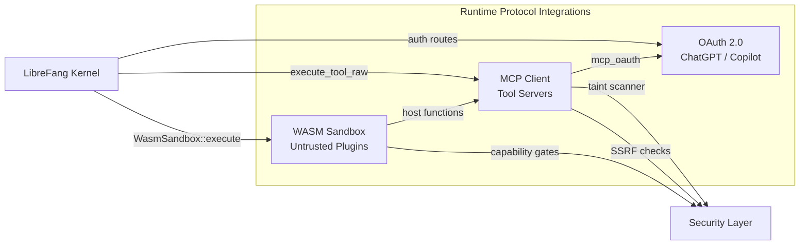

# Runtime Protocol Integrations

# Runtime Protocol Integrations

Connects LibreFang to the outside world — external tool servers, identity providers, and untrusted plugin code — through three specialised sub-modules that share authentication, security, and execution infrastructure.

## Sub-modules

| Module | Purpose |
|---|---|
| [MCP Client](librefang-runtime-mcp-src.md) | Connects to external MCP tool servers over stdio, SSE, Streamable HTTP, and plain HTTP. Manages the full lifecycle from handshake through invocation, with integrated taint scanning on every tool call. |
| [OAuth 2.0](librefang-runtime-oauth-src.md) | Provides ready-to-use OAuth flows for ChatGPT (browser + device) and GitHub Copilot (RFC 8628 device flow). Handles PKCE, token exchange, refresh, and browser callbacks with no external OAuth dependencies. |
| [WASM Sandbox](librefang-runtime-wasm-src.md) | Executes untrusted skills and plugins inside a Wasmtime sandbox with deny-by-default capabilities, fuel metering, epoch timeouts, and defences against SSRF, path traversal, and environment exfiltration. |

## How they work together

### Authentication spanning modules

When a user or an MCP server requires OAuth, the flow crosses module boundaries:

1. The kernel's `mcp_auth` route calls into **MCP Client**'s `discover_oauth_metadata`.
2. MCP Client resolves the metadata URL via `extract_metadata_url`, with SSRF host validation applied at each step.
3. For ChatGPT or Copilot specifically, the **OAuth 2.0** module takes over — running PKCE-based browser flows or RFC 8628 device-authorisation polling, then persisting the resulting tokens.

### Plugin-to-tool execution

A WASM plugin can invoke MCP tools through host functions exposed by the sandbox:

1. **WASM Sandbox** receives `WasmSandbox::execute` from the kernel.
2. Inside the sandbox, a guest calls a host function (e.g. `kv_get`, `host_call`).
3. If the capability is denied by the `SandboxConfig`, the call is blocked; otherwise it is dispatched — potentially routing through **MCP Client**'s `execute_tool_raw` → `McpConnection` → transport layer.
4. Before the MCP response reaches the guest, the taint scanner walks outbound text for policy violations.

### Shared security posture

All three modules enforce consistent hardening:

- **SSRF protection** — both MCP Client (`is_ssrf_blocked_host`) and WASM Sandbox validate outbound destinations.
- **Capability gating** — WASM denies by default; MCP applies taint rules with configurable skip paths (`resolve_skip_rules` → `jsonpath_matches`).
- **No external auth dependencies** — OAuth flows use standard HTTP only, keeping the trust surface small.