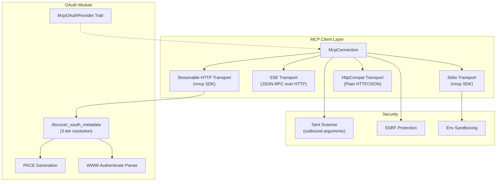
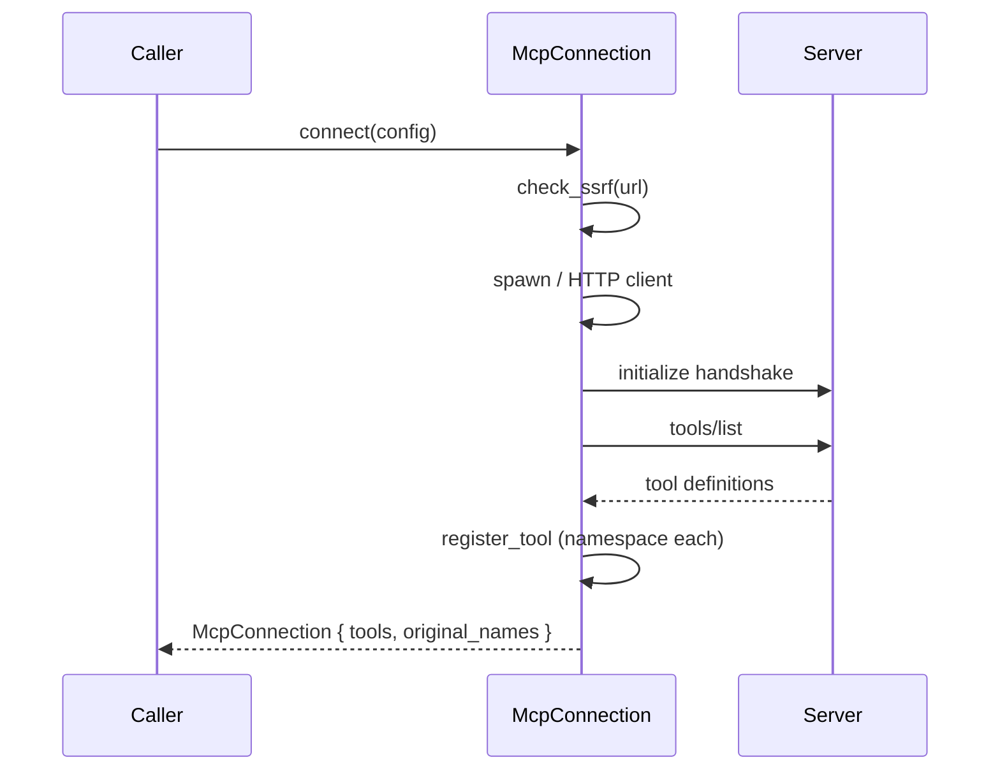

# Runtime Protocols (MCP & OAuth) — librefang-runtime-mcp-src

# Runtime Protocols (MCP & OAuth) — `librefang-runtime-mcp`

This module implements the MCP (Model Context Protocol) client layer and its OAuth authentication infrastructure. It connects librefang to external MCP servers, discovers their tools, and invokes those tools on behalf of the LLM — with security boundaries at every stage.

## Architecture Overview



---

## Transport Types

`McpTransport` is a serde-tagged enum (`#[serde(tag = "type")]`) with four variants. The choice of transport determines which connection path `McpConnection::connect` takes and how tool calls are dispatched.

### `Stdio` — Subprocess via rmcp SDK

Spawns a child process and communicates over stdin/stdout using the rmcp SDK's `TokioChildProcess` transport. This is the primary transport for local MCP servers (npm packages, Python scripts, etc.).

**Security constraints enforced at spawn:**
- **No path traversal** — command containing `..` is rejected.
- **No shell interpreters** — `bash`, `sh`, `zsh`, `cmd`, `powershell`, etc. are blocked. Use a specific runtime (`npx`, `node`, `python`) instead.
- **Environment sandboxing** — the subprocess does NOT inherit the parent environment. Only the `SAFE_ENV_VARS` allowlist (PATH, HOME, language runtime paths like `NODE_PATH`, `CARGO_HOME`, `VIRTUAL_ENV`, etc.) plus explicitly declared `config.env` entries are passed.
- **Windows `.cmd` detection** — on Windows, if the command doesn't already end in `.cmd`/`.bat`, librefang checks whether a `.cmd` variant exists on PATH (for npm/npx batch wrappers).

Environment variable references (`$VAR`, `${VAR}`) in args are expanded via `expand_env_vars` before spawning, so templates can reference `$HOME` without requiring a shell wrapper.

### `Sse` — JSON-RPC over HTTP POST

Legacy SSE transport. Uses a `reqwest::Client` to send JSON-RPC 2.0 requests (`JsonRpcRequest` / `JsonRpcResponse`) directly via HTTP POST. The handshake is manual: `sse_initialize` sends the `initialize` method, then `sse_discover_tools` calls `tools/list`.

SSE is unidirectional — the server cannot push requests back. Roots capability is deliberately not declared for SSE connections.

### `Http` — Streamable HTTP (rmcp SDK)

The modern MCP transport (spec version 2025-03-26+). Uses rmcp's `StreamableHttpClientTransport` which handles Accept headers, `Mcp-Session-Id` tracking, SSE stream parsing, and content-type negotiation.

When the server returns a 401 with `WWW-Authenticate`, the connection attempt extracts the auth header via `extract_auth_header_from_error`, triggers OAuth metadata discovery, and returns `"OAUTH_NEEDS_AUTH"` to signal the API layer to drive the PKCE flow.

Local filesystem roots are only advertised when the URL resolves to the local machine (`is_local_url`), using proper URL host parsing to prevent spoofing (`127.0.0.1.evil.com`, `127.0.0.1@attacker.com`).

### `HttpCompat` — Plain HTTP/JSON Adapter

A built-in compatibility layer for non-MCP HTTP backends. Tools are declared statically in config rather than discovered via protocol handshake. Each tool has:

- **`path`** — URL path template with `{param}` placeholders (percent-encoded via `encode_http_compat_path_value`)
- **`method`** — GET, POST, PUT, PATCH, or DELETE
- **`request_mode`** — `JsonBody`, `Query`, or `None`
- **`response_mode`** — `Text` or `Json` (pretty-printed)

Headers can come from static `value` or environment variable lookups via `value_env`. Config validation (`validate_http_compat_config`) enforces non-empty names, paths, and at least one value source per header.

---

## Connection Lifecycle



1. **`McpConnection::connect(config)`** — Entry point. Dispatches to the appropriate `connect_*` method based on `config.transport`.
2. **Handshake** — rmcp-based transports (Stdio, Streamable HTTP) handle this via the SDK. SSE does it manually. HttpCompat skips it entirely.
3. **Tool discovery** — `tools/list` response is processed, each tool is registered with a namespaced name.
4. **`call_tool(name, arguments)`** — Resolves the namespaced name back to the original, runs the taint scanner, then dispatches to the transport-specific invocation path.

---

## Tool Namespacing

All MCP tools are prefixed with `mcp_{server}_{tool}` to prevent collisions across multiple servers. The normalization is: lowercase, hyphens → underscores.

```
server "github", tool "create_issue" → "mcp_github_create_issue"
server "my-server", tool "do_thing"  → "mcp_my_server_do_thing"
```

**Key functions:**

| Function | Purpose |
|---|---|
| `format_mcp_tool_name` | Build namespaced name from server + tool |
| `is_mcp_tool` | Check if a name starts with `mcp_` |
| `extract_mcp_server` | Heuristic single-segment extraction (unreliable for multi-word names) |
| `resolve_mcp_server_from_known` | **Preferred** — longest-prefix match against known server names |
| `strip_mcp_prefix` | Strip the namespace to recover the original tool name |

`resolve_mcp_server_from_known` is the robust runtime dispatch function because server names may contain underscores after normalization (e.g., `"my-mcp-server"` → `"mcp_my_mcp_server_tool"`). It iterates all known server names and picks the longest matching prefix.

**Callers:** `execute_tool_raw` in `librefang-runtime/src/tool_runner.rs` uses `is_mcp_tool` to detect MCP tools, then `resolve_mcp_server_from_known` to route to the correct connection, then `call_tool` to invoke.

---

## Outbound Taint Scanning

Before any tool call leaves the process, `scan_mcp_arguments_for_taint` walks the entire JSON argument tree looking for credentials and PII that the LLM might be smuggling.

**Two detection mechanisms:**

1. **Value-based** (`check_outbound_text_violation`) — Each string leaf is checked against the `TaintSink::mcp_tool_call` denylist. Catches API keys, tokens, SSNs, email addresses, etc. by content pattern.

2. **Key-name-based** (`MCP_SENSITIVE_KEY_NAMES`) — Object keys like `authorization`, `api_key`, `secret`, `password`, `private_key` are flagged when they hold a non-empty string value, regardless of content. This catches `{"Authorization": "Bearer sk-..."}` where the Bearer prefix and whitespace would evade the value-only heuristic.

**Security properties:**
- Error messages are **redacted** — they contain only the JSON path (e.g., `$.headers.Authorization`), never the offending payload. This prevents the error from becoming an exfiltration channel back to the LLM or into logs.
- Recursion is capped at `MCP_TAINT_SCAN_MAX_DEPTH` (64) to prevent stack overflow from pathological payloads.
- Can be disabled per-server via `config.taint_scanning = false` for trusted local servers. Key-name blocking remains active even when disabled.

---

## Subprocess Environment Sandboxing

Stdio MCP servers run as subprocesses with a stripped environment. `SAFE_ENV_VARS` defines the allowlist of system variables that pass through:

- **POSIX essentials:** PATH, HOME, USER, SHELL, TERM, LANG, TMPDIR, XDG_\*
- **Windows essentials:** SystemRoot, APPDATA, USERPROFILE, COMSPEC, ProgramFiles
- **Node.js/npm:** NODE_PATH, NPM_CONFIG_PREFIX, NVM_DIR, FNM_DIR
- **Python:** PYTHONPATH, VIRTUAL_ENV, CONDA_PREFIX
- **Rust:** CARGO_HOME, RUSTUP_HOME
- **Ruby/Go:** GEM_HOME, GOPATH, GOROOT

User-declared `config.env` entries are added on top. Entries with `=` are passed as-is (`KEY=VALUE`); bare names are looked up from the parent process environment (legacy format).

---

## MCP Roots Capability

The `RootsClientHandler` implements rmcp's `ClientHandler` trait to declare filesystem root directories during the MCP `initialize` handshake. Servers that support Roots use this list to scope their file-system operations.

- Paths are converted to `file://` URIs using the `url` crate for proper percent-encoding and Windows drive-letter handling.
- Roots are only advertised to local servers (Stdio always; HTTP only when `is_local_url` returns true).
- SSE never declares roots (unidirectional transport).
- HttpCompat has no MCP handshake, so roots don't apply.

`roots` is populated at runtime by the kernel (home dir + agent workspaces) and is `#[serde(skip)]` — never serialized to config.

---

## SSRF Protection

Two layers:

1. **`check_ssrf`** — URL-level blocklist for known metadata endpoints (`169.254.169.254`, `metadata.google`). Applied to all HTTP-based transports.

2. **`is_local_url`** — Proper URL parsing via the `url` crate to determine if a host is loopback (127.0.0.0/8, ::1) or `localhost`. Prevents spoofing via:
   - Domain tricks: `127.0.0.1.evil.com`
   - Userinfo injection: `http://127.0.0.1@attacker.com`
   - Subdomain abuse: `localhost.evil.com`

---

## OAuth Module (`mcp_oauth`)

### Three-Tier Metadata Discovery

`discover_oauth_metadata` resolves OAuth endpoints using a cascading fallback:

| Tier | Source | Mechanism |
|---|---|---|
| 1 | `WWW-Authenticate` header | Parse `Bearer resource_metadata="..."` → fetch → parse RFC 8414 metadata |
| 2 | `.well-known` | Construct `{origin}/.well-known/oauth-authorization-server` → fetch → parse |
| 3 | Config | Use `McpOAuthConfig.auth_url` + `token_url` directly |

Config values always override discovered values via `merge_metadata_with_config`. Empty scopes in config means "use discovered scopes."

### WWW-Authenticate Parsing

`parse_www_authenticate` strips the `Bearer ` prefix (case-insensitive), splits parameters on commas while respecting quoted strings (`split_auth_params`), and returns a `HashMap<String, String>` of key-value pairs.

### Metadata URL Validation (`extract_metadata_url`)

Three-layered security before accepting a metadata URL:

1. **HTTPS only** — `http://` is rejected per RFC 8414.
2. **Same-origin** — metadata URL must share scheme+host+port with `server_url`.
3. **No private IPs** — `is_ssrf_blocked_host` blocks loopback, private, and link-local ranges (127.0.0.0/8, 10.0.0.0/8, 172.16.0.0/12, 192.168.0.0/16, 169.254.0.0/16, ::1, fc00::/7, fe80::/10, `localhost`, `metadata.google.internal`).

### PKCE Support

`generate_pkce()` returns a (verifier, challenge) pair — 32 random bytes base64url-encoded for the verifier, SHA-256 of that base64url-encoded for the challenge. `generate_state()` produces a 16-byte random state parameter.

The PKCE flow itself is driven by the API layer (`src/routes/mcp_auth.rs`), not by this module. When `connect_streamable_http` encounters a 401, it returns `"OAUTH_NEEDS_AUTH"` to signal the API layer.

### McpOAuthProvider Trait

```rust
#[async_trait]
pub trait McpOAuthProvider: Send + Sync {
    async fn load_token(&self, server_url: &str) -> Option<String>;
    async fn store_tokens(&self, server_url: &str, tokens: OAuthTokens) -> Result<(), String>;
    async fn clear_tokens(&self, server_url: &str) -> Result<(), String>;
}
```

Implementors handle token persistence (e.g., encrypted vault). The kernel provides the concrete implementation (`librefang-kernel/src/mcp_oauth_provider.rs`). At connection time, `connect_streamable_http` calls `provider.load_token` to inject a cached `Authorization: Bearer` header before attempting the handshake.

### Authentication State Machine

`McpAuthState` tracks the per-server OAuth lifecycle:

```
NotRequired → NeedsAuth (401 detected at boot)
NeedsAuth → PendingAuth (user clicked Authorize)
PendingAuth → Authorized (token exchange completed)
Authorized → Expired → back to NeedsAuth
Any → Error { message }
```

States are shared via `McpAuthStates` (`Mutex<HashMap<String, McpAuthState>>`).

---

## Integration Points

| Caller | Module | Functions Used |
|---|---|---|
| `execute_tool_raw` | `librefang-runtime/src/tool_runner.rs` | `is_mcp_tool`, `resolve_mcp_server_from_known`, `call_tool` |
| `get_agent_mcp_servers` | `src/routes/agents.rs` | `resolve_mcp_server_from_known` |
| `spawn_fetch_agent_mcp_servers` | `src/tui/event.rs` | `resolve_mcp_server_from_known` |
| `auth_start` | `src/routes/mcp_auth.rs` | `discover_oauth_metadata` |
| `load_token` (kernel) | `librefang-kernel/src/mcp_oauth_provider.rs` | `store_tokens` |

---

## Configuration Reference

### `McpServerConfig`

| Field | Type | Default | Notes |
|---|---|---|---|
| `name` | `String` | — | Display name, used in tool namespacing |
| `transport` | `McpTransport` | — | One of `stdio`, `sse`, `http`, `http_compat` |
| `timeout_secs` | `u64` | 60 | Request timeout |
| `env` | `Vec<String>` | `[]` | `"KEY=VALUE"` or bare `"KEY"` for subprocess |
| `headers` | `Vec<String>` | `[]` | `"Header-Name: value"` for HTTP transports |
| `oauth_provider` | `Option<Arc<dyn McpOAuthProvider>>` | `None` | Injected at runtime, not serialized |
| `oauth_config` | `Option<McpOAuthConfig>` | `None` | Config-file OAuth fallback |
| `taint_scanning` | `bool` | `true` | Disable for trusted local servers |
| `roots` | `Vec<String>` | `[]` | Filesystem roots, runtime-populated, not serialized |

### `McpTransport` Variants (serde tag: `type`)

- **`{ "type": "stdio", "command": "npx", "args": ["-y", "@mcp/server"] }`**
- **`{ "type": "sse", "url": "https://example.com/mcp" }`**
- **`{ "type": "http", "url": "https://mcp.example.com/v1" }`**
- **`{ "type": "http_compat", "base_url": "...", "tools": [...] }`**

### `HttpCompatToolConfig`

| Field | Type | Description |
|---|---|---|
| `name` | `String` | Tool identifier |
| `description` | `String` | Human-readable description |
| `path` | `String` | URL path with `{param}` placeholders |
| `method` | `HttpCompatMethod` | GET, POST, PUT, PATCH, DELETE |
| `request_mode` | `HttpCompatRequestMode` | `json_body`, `query`, or `none` |
| `response_mode` | `HttpCompatResponseMode` | `text` or `json` |
| `input_schema` | `serde_json::Value` | JSON Schema for tool arguments |