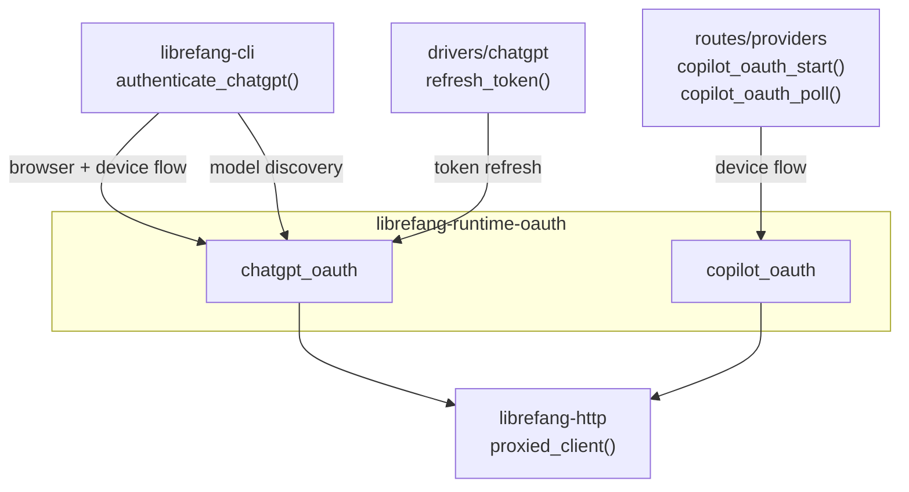

# Runtime Protocols (MCP & OAuth) — librefang-runtime-oauth-src

# Runtime Protocols (MCP & OAuth) — `librefang-runtime-oauth`

OAuth 2.0 authentication drivers for ChatGPT and GitHub Copilot. Each provider implements its own authorization grant type and token lifecycle, but both share the same pattern: obtain credentials, exchange for tokens, and return `Zeroizing<String>` protected results to the caller.

## Module Layout

```
librefang-runtime-oauth/src/
├── lib.rs              # Re-exports both submodules
├── chatgpt_oauth.rs    # OpenAI/ChatGPT OAuth — browser + device flows
└── copilot_oauth.rs    # GitHub Copilot OAuth — device flow only
```

## Architecture



---

## ChatGPT OAuth (`chatgpt_oauth`)

Handles authentication against OpenAI's Codex OAuth endpoints. Supports two grant flows and a token refresh path.

### Key Constants

| Constant | Value | Purpose |
|---|---|---|
| `CHATGPT_BASE_URL` | `https://chatgpt.com/backend-api` | Backend API for OAuth-scoped calls (Responses API, not `/v1/chat/completions`) |
| `CLIENT_ID` | `app_EMoamEEZ73f0CkXaXp7hrann` | OpenAI Codex CLI registered client |
| `CALLBACK_BIND` | `127.0.0.1:1455` | Local redirect target (matches OpenAI's registered `redirect_uri`) |
| `AUTH_TIMEOUT_SECS` | 300 | Browser flow timeout (5 minutes) |
| `DEVICE_AUTH_TIMEOUT_SECS` | 900 | Device flow polling timeout (15 minutes) |
| `SCOPE` | `openid profile email offline_access api.connectors.read api.connectors.invoke` | Requested OAuth scopes |

### Data Types

**`ChatGptAuthResult`** — Returned by every successful token acquisition or refresh:

```rust
pub struct ChatGptAuthResult {
    pub access_token: Zeroizing<String>,
    pub refresh_token: Option<Zeroizing<String>>,
    pub expires_in: Option<u64>,
}
```

All sensitive string fields use `Zeroizing` to ensure memory is scrubbed on drop.

**`DeviceAuthPrompt`** — Returned by `start_device_auth_flow()`, must be displayed to the user before polling begins:

```rust
pub struct DeviceAuthPrompt {
    pub device_auth_id: String,
    pub user_code: String,
    pub interval_secs: u64,
}
```

**`DeviceAuthFlowError`** — Distinguishes recoverable fallback from fatal errors:
- `BrowserFallback { message }` — Device auth not enabled for this account/workspace; caller should fall back to browser flow
- `Fatal(String)` — Unrecoverable error

**`PkceChallenge`** — PKCE verifier/challenge pair (S256 method):

```rust
pub struct PkceChallenge {
    pub verifier: String,
    pub challenge: String,
}
```

### Flow 1: Browser-Based OAuth

Used when the user has a local browser available. Opens the browser at the OpenAI authorization endpoint, waits for a callback on localhost.

**Entry points:**
1. `start_oauth_flow()` — Binds port 1455, generates PKCE (`generate_pkce()`) and state (`create_state()`), builds the authorization URL via `build_authorization_url()`.
2. `run_oauth_callback_server(port, expected_state)` — Spawns an async TCP listener that handles `GET /auth/callback?code=...&state=...`. Validates the CSRF `state` parameter, extracts the authorization code, and serves a success or error HTML page to the browser.
3. `exchange_code_for_tokens(code, code_verifier, port)` — Sends the code + PKCE verifier to the token endpoint and returns a `ChatGptAuthResult`.

**Caller pattern (from `librefang-cli`):**

```rust
let (auth_url, port, verifier, state) = start_oauth_flow().await?;
open::that(&auth_url)?;
let code = run_oauth_callback_server(port, &state).await?;
let tokens = exchange_code_for_tokens(&code, &verifier, port).await?;
```

**Callback server behavior:**
- Parses raw HTTP/1.1 requests (no hyper/axum — minimal TCP handler via `handle_oauth_callback`)
- Validates `state` matches the expected value (CSRF protection)
- If the OAuth provider returns an error (`error` + `error_description` params), renders `error_html()`
- On success, sends the code through a `oneshot::Sender` and aborts the server task

### Flow 2: Device Authorization (Headless)

For environments without a browser (SSH, containers). Uses OpenAI's device auth endpoints.

**Entry points:**
1. `start_device_auth_flow()` → `POST /api/accounts/deviceauth/usercode` — Returns a `DeviceAuthPrompt` with `device_auth_id`, `user_code`, and recommended poll interval.
2. `poll_device_auth_flow(prompt)` → Repeatedly `POST`s to `/api/accounts/deviceauth/token` until the user completes verification. On success, the response contains an `authorization_code` and `code_verifier`, which are immediately exchanged via `exchange_code_for_tokens_with_redirect_uri()` using `DEVICE_AUTH_REDIRECT_URI`.

**Polling logic:**
- HTTP 403 and 404 are treated as "still pending" (OpenAI-specific convention)
- Respects the server-recommended `interval_secs` (defaults to 5s)
- Times out after `DEVICE_AUTH_TIMEOUT_SECS` (15 minutes)

**Fallback handling:** If `start_device_auth_flow()` returns `DeviceAuthFlowError::BrowserFallback`, the caller should retry with the browser flow.

### Token Refresh

```rust
pub async fn refresh_access_token(refresh_token: &str) -> Result<ChatGptAuthResult, String>
```

Uses the `refresh_token` grant type against the same token endpoint. Called by `drivers/chatgpt` when the access token expires.

### Model Discovery

```rust
pub async fn fetch_best_codex_model(access_token: &str) -> String
```

Queries `GET {CHATGPT_BASE_URL}/codex/models?client_version={VERSION}` with the bearer token, sorts the returned models by `priority` descending, and returns the highest-priority slug. Falls back to `"gpt-5.1-codex-mini"` on any failure.

### Session Token Check

```rust
pub fn chatgpt_session_available() -> bool
```

Returns `true` if the `CHATGPT_SESSION_TOKEN` environment variable is set and non-empty.

### PKCE and State Generation

- `generate_pkce()` — Generates 64 random bytes, base64url-encodes as the verifier, SHA-256 hashes it for the S256 challenge
- `create_state()` — Generates 16 random bytes, hex-encodes for the CSRF state parameter

---

## GitHub Copilot OAuth (`copilot_oauth`)

Implements the OAuth 2.0 Device Authorization Grant (RFC 8628) against GitHub's device flow endpoints. Uses the same public client ID as the VSCode Copilot extension (`Iv1.b507a08c87ecfe98`).

### Data Types

**`DeviceCodeResponse`** — Result of initiating the device flow:

```rust
pub struct DeviceCodeResponse {
    pub device_code: String,
    pub user_code: String,
    pub verification_uri: String,
    pub expires_in: u64,
    pub interval: u64,
}
```

**`DeviceFlowStatus`** — Result of each poll attempt:

| Variant | Meaning |
|---|---|
| `Pending` | User hasn't completed authorization yet |
| `Complete { access_token }` | Success — contains the PAT wrapped in `Zeroizing<String>` |
| `SlowDown { new_interval }` | Server requests longer poll interval |
| `Expired` | Device code expired, must restart |
| `AccessDenied` | User denied the authorization |
| `Error(String)` | Unexpected error |

### API

**`start_device_flow()`** — `POST https://github.com/login/device/code` with `client_id` and `scope=read:user`. Returns the device code, user code, and verification URI.

**`poll_device_flow(device_code)`** — `POST https://github.com/login/oauth/access_token` with the device code. GitHub returns HTTP 200 with an `error` field during polling (not error status codes), so the function checks the JSON body first. Returns the appropriate `DeviceFlowStatus` variant.

**Caller pattern (from `routes/providers`):**

```rust
// Start
let response = start_device_flow().await?;
// Display response.user_code and response.verification_uri to the user

// Poll (caller manages timing)
loop {
    match poll_device_flow(&response.device_code).await {
        DeviceFlowStatus::Complete { access_token } => { /* done */ },
        DeviceFlowStatus::Pending => tokio::time::sleep(interval).await,
        DeviceFlowStatus::SlowDown { new_interval } => interval = new_interval,
        DeviceFlowStatus::Expired | DeviceFlowStatus::AccessDenied => { /* abort */ },
        DeviceFlowStatus::Error(msg) => { /* handle */ },
    }
}
```

**Important:** Unlike the ChatGPT module, polling orchestration (timing, retries, timeout) is the caller's responsibility.

---

## Shared Dependencies

Both modules depend on:

- **`librefang-http`** — `proxied_client()` and `proxied_client_builder()` for HTTP requests that respect system proxy configuration
- **`zeroize`** — All tokens use `Zeroizing<String>` for secure memory handling
- **`serde_json`** — Response parsing
- **`reqwest`** — HTTP client (via `librefang-http`)

The ChatGPT module additionally uses `tokio` for the async callback TCP server and `sha2`/`base64` for PKCE.

## Security Considerations

- All tokens are wrapped in `Zeroizing<String>` — memory is zeroed on drop
- Browser flow validates the `state` parameter against the generated value to prevent CSRF
- PKCE (S256) prevents authorization code interception
- The callback server binds exclusively to `127.0.0.1`
- Raw HTTP parsing in `handle_oauth_callback` is intentionally minimal — no external HTTP framework attack surface