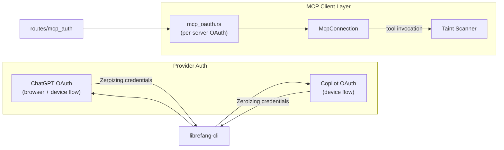

# Runtime Protocols (MCP & OAuth)

# Runtime Protocols (MCP & OAuth)

This module group provides the protocol layer that connects librefang to external services: **MCP servers** for tool invocation and **OAuth 2.0 providers** (ChatGPT, GitHub Copilot) for authentication. Together, they form the bridge between the LLM runtime and the outside world — with security boundaries enforced at every network hop.

## Sub-Modules

| Sub-module | Responsibility |
|---|---|
| [MCP Client (`librefang-runtime-mcp`)](librefang-runtime-mcp-src.md) | Connects to MCP servers over multiple transports, discovers their tools, and invokes them. Includes `mcp_oauth.rs` for server-level OAuth flows and taint scanning on all tool arguments. |
| [OAuth Providers (`librefang-runtime-oauth`)](librefang-runtime-oauth-src.md) | Implements the OAuth 2.0 device-flow and browser-based authorization flows for ChatGPT and GitHub Copilot, returning secrets as `Zeroizing<String>` to minimize credential exposure. |

## How They Fit Together

**Provider authentication** (`librefang-runtime-oauth`) runs at the top level: the CLI or web routes call into `chatgpt_oauth` or `copilot_oauth` to obtain access tokens before the session even begins.

**Per-server OAuth** (`mcp_oauth.rs` inside the MCP module) handles a different problem: individual MCP servers may require their own OAuth authorization. When `auth_start` is triggered from the routes layer, it calls `discover_oauth_metadata` → `extract_metadata_url` → SSRF validation → PKCE generation to build a secure authorization URL for that specific server.

**Tool invocation** then flows through the MCP client: `connect` discovers tools, `call_tool` invokes them, and `scan_mcp_arguments_for_taint` inspects all arguments before they leave the boundary.

## Key Cross-Module Workflows

1. **Session bootstrap** — Provider OAuth (ChatGPT/Copilot) obtains credentials → returned as `Zeroizing<String>` → stored for the session lifetime.
2. **MCP server authorization** — Route handler calls `auth_start` → `discover_oauth_metadata` fetches the server's authorization metadata → `generate_pkce` creates a verifiable challenge → user completes the grant → tokens are exchanged and stored.
3. **Secure tool call** — `call_tool` or `call_http_compat_tool` prepares the request → `scan_mcp_arguments_for_taint` walks all JSON arguments → transport sends the sanitized request → result is returned to the LLM.