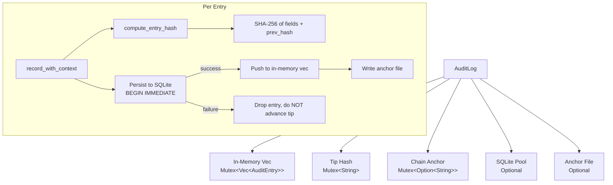

# Runtime Subsystems — librefang-runtime-audit-src

# Runtime Audit Trail — `librefang-runtime-audit`

## Overview

This module provides an append-only, tamper-evident audit log for security-critical actions in the LibreFang agent runtime. Every auditable event is appended to a Merkle hash chain where each entry contains a SHA-256 hash of its own contents concatenated with the hash of the previous entry. Any modification or deletion of a historical entry breaks the chain and is detected by `verify_integrity`.

When a SQLite connection pool is provided, entries are persisted to the `audit_entries` table (schema V8+) so the trail survives daemon restarts. An optional **anchor file** stores the chain tip outside the database, closing the gap where an attacker with write access to SQLite could rewrite the entire table.

## Architecture



## Core Types

### `AuditAction`

An enum of all auditable action categories. Each variant is folded into the per-entry SHA-256 hash via its `Debug` representation (e.g. `"ToolInvoke"`, `"UserLogin"`).

**Stability contract — treat this enum as append-only.** Adding new variants is safe because old entries keep their original action string. Renaming or removing a variant is a breaking change that invalidates every persisted hash from that point forward.

Notable variants:

| Variant | Purpose |
|---|---|
| `ToolInvoke`, `ShellExec`, `FileAccess`, `NetworkAccess` | Agent capability usage |
| `AgentSpawn`, `AgentKill`, `AgentMessage` | Agent lifecycle |
| `UserLogin`, `RoleChange`, `PermissionDenied`, `BudgetExceeded` | RBAC events (M5) |
| `DreamConsolidation` | Auto-dream memory consolidation lifecycle |
| `RetentionTrim` | Self-auditing trim job execution |
| `A2aDiscovered`, `A2aTrusted` | A2A agent onboarding (Bug #3786) |

### `AuditEntry`

A single entry in the chain. Key fields:

- **`seq`** — Monotonically increasing 0-indexed sequence number. Derived from the last entry's seq + 1, **not** from `Vec::len()` (because retention trims may have dropped a prefix).
- **`timestamp`** — ISO-8601 (RFC 3339) timestamp from `Utc::now()`.
- **`prev_hash`** — SHA-256 of the previous entry (64 zeros for genesis or chain anchor after a trim).
- **`hash`** — SHA-256 of this entry's content concatenated with `prev_hash`.
- **`user_id`** — Optional `UserId` for the user that triggered the action. `None` for kernel-internal events and pre-migration entries.
- **`channel`** — Optional origin channel (e.g. `"telegram"`, `"dashboard"`). `None` for kernel-internal events.

### `TrimReport`

Returned by `trim()`. Contains per-action drop counts (`dropped_by_action`), total dropped (`total_dropped`), and the hash of the last dropped entry (`new_chain_anchor`).

## Construction

### `AuditLog::new()`

Creates a pure in-memory log with no persistence. The initial tip is 64 zero characters (the genesis sentinel). Suitable for tests and short-lived processes.

### `AuditLog::with_db(pool)`

Creates a log backed by a SQLite connection pool. On construction:

1. Loads all rows from `audit_entries` ordered by `seq ASC`.
2. Recovers the chain anchor if the first surviving entry's `prev_hash` is non-genesis (meaning a predecessor was previously trimmed).
3. Runs `verify_integrity()` and logs the result.

### `AuditLog::with_db_anchored(pool, anchor_path)`

Same as `with_db`, plus an external tip-anchor file. On construction:

1. Loads and verifies the chain as above.
2. Compares the anchor file against the in-DB tip:
   - **Agree** → normal startup.
   - **Disagree** → logs a loud error. The daemon still starts, but `verify_integrity()` will return `Err` until resolved.
   - **Anchor missing** → seeds the anchor from the current tip (first-run upgrade path).
   - **Anchor corrupt** → logs an error and refuses to overwrite; verification fails until an operator inspects.

The anchor file format is a single line: `<seq> <hex-hash>\n`. It is written atomically via a `.tmp` file + `rename`.

## Recording Events

### `record(agent_id, action, detail, outcome) -> String`

Convenience wrapper that omits user/channel attribution. Used by pre-M1 call sites. Returns the SHA-256 hash of the new entry.

### `record_with_context(agent_id, action, detail, outcome, user_id, channel) -> String`

Full recording path. The flow:

1. Acquires locks on `entries` and `tip`.
2. Derives `seq` from `entries.last().seq + 1` (or 0 if empty).
3. Computes the entry hash via `compute_entry_hash`.
4. **If DB is present**: opens a `BEGIN IMMEDIATE` transaction, inserts the row, commits. If the insert fails, the entry is **dropped** — the in-memory chain is NOT advanced. This prevents chain corruption where a later restart would find an entry whose `prev_hash` points at a never-persisted predecessor.
5. Pushes the entry to the in-memory buffer and advances the tip.
6. If the buffer exceeds `MAX_AUDIT_ENTRIES` (10,000), drains the oldest prefix and updates `chain_anchor` to the hash of the last dropped entry.
7. Rewrites the external anchor file if configured.

### `compute_entry_hash` — Hash Inputs

The SHA-256 hash is computed over these fields concatenated in order:

```
seq | timestamp | agent_id | action | detail | outcome | [user_id] | [channel] | prev_hash
```

`user_id` and `channel` are conditionally included (`\x1fuser_id=<uid>` and `\x1fchannel=<ch>`) only when present. This means pre-M1 entries (recorded before user attribution existed) verify with their original hashes. Once a field is present, it is committed to the chain — stripping it later breaks the Merkle link.

## Integrity Verification

### `verify_integrity() -> Result<(), String>`

Walks the entire chain and recomputes every hash:

1. Seeds `expected_prev` from `chain_anchor` (or genesis if no anchor).
2. For each entry, checks that `prev_hash` matches `expected_prev`.
3. Recomputes the hash from the entry's fields and compares against the stored `hash`.
4. If an external anchor is configured, reads the anchor file and confirms both `seq` and `hash` agree with the in-memory tip.

Returns `Err` on the first inconsistency found, describing the seq number and expected vs. found values.

**Anchor disagreement** is the key detection mechanism for a full table rewrite. Without it, an attacker could delete all rows, fabricate a new history, and recompute every hash from genesis — `verify_integrity` would return `Ok` because the linked list is internally consistent. The anchor file forces agreement with an external witness.

## Retention & Pruning

Both `trim` and `prune` remove a **contiguous prefix** from the front of the chain. This is a structural requirement: you cannot punch holes in a Merkle list because each entry's hash depends on its predecessor.

### `trim(policy, now) -> TrimReport`

Applies a `AuditRetentionConfig` with two passes:

1. **Hard cap** (`max_in_memory_entries`): if set and non-zero, drops oldest entries until the survivor count is within the cap.
2. **Per-action retention** (`retention_days_by_action`): extends the prefix as long as each next entry's action has a configured retention window AND the entry is older than that window. Stops at the first entry that should be kept.

The per-action map uses `AuditAction`'s `Display` string as keys. Actions without a configured entry are kept indefinitely (default = preserve).

After computing the drop prefix:
- Deletes the same rows from SQLite (`DELETE FROM audit_entries WHERE seq < ?`).
- Updates `chain_anchor` to the hash of the last dropped entry.
- Refreshes the external anchor file's `seq` column (the tip hash itself does not change — only the prefix is removed).

### `prune(retention_days) -> usize`

Simpler age-based pruning. Walks forward from the oldest entry and drops a contiguous prefix of entries whose timestamps fall before `now - retention_days`. Stops at the first entry inside the window. Same persistence and anchor logic as `trim`.

Both methods update `chain_anchor` **before** draining from the in-memory buffer so that a concurrent `verify_integrity` blocked on the entries lock will see a consistent (anchor, first-survivor) pair when it acquires.

## Cursor-Based Streaming

### `recent(n) -> Vec<AuditEntry>`

Returns the last `n` entries (cloned). O(1) slice.

### `since_seq(cursor) -> Vec<AuditEntry>`

Returns all entries with `seq > cursor`. Uses `partition_point` for O(log n) seek followed by O(k) clone where `k` is the result count.

The **strictly-greater-than** semantics mean `since_seq(0)` skips an entry with `seq=0`. The SSE handler at `/api/logs/stream` handles this by calling `recent()` for the initial backfill before entering the cursor loop.

## Thread Safety

All shared state is protected by `Mutex`:

- `entries: Mutex<Vec<AuditEntry>>`
- `tip: Mutex<String>`
- `chain_anchor: Mutex<Option<String>>`

Lock poisoning is handled with `unwrap_or_else(|e| e.into_inner())` — a panic in one thread does not deadlock the rest. The `record_with_context` path acquires `entries` and `tip` locks in a consistent order to prevent deadlocks.

SQLite writes use `BEGIN IMMEDIATE` transactions, which acquire a RESERVED lock at the SQLite level. This prevents concurrent processes (or background jobs with their own pooled connections) from interleaving appends against the same `prev_hash`.

## Failure Modes

| Scenario | Behavior |
|---|---|
| SQLite INSERT fails | Entry is dropped. In-memory chain is NOT advanced. Next `record()` reuses the same `seq` with a fresh timestamp. |
| Anchor file write fails | Logged as a warning. Entry is already persisted to SQLite; the anchor simply trails by one tick. |
| Anchor file missing on verify | Returns `Err` — fail closed. A silent disappearance is indistinguishable from tampering. |
| Anchor file corrupt on boot | Logs error, refuses to overwrite. `verify_integrity()` will fail until an operator inspects. |
| Chain break detected on boot | Logs error. Daemon still starts so `/api/audit/verify` can surface the failure. Operator can run `librefang security audit-reset` in dev (DO NOT use in production). |

## Migration Notes

Schema V22 added `user_id` and `channel` columns. Rows persisted before that migration return `NULL` for both, which deserializes to `None`. Because `compute_entry_hash` omits absent fields, old entries verify with their original hashes without any migration step.