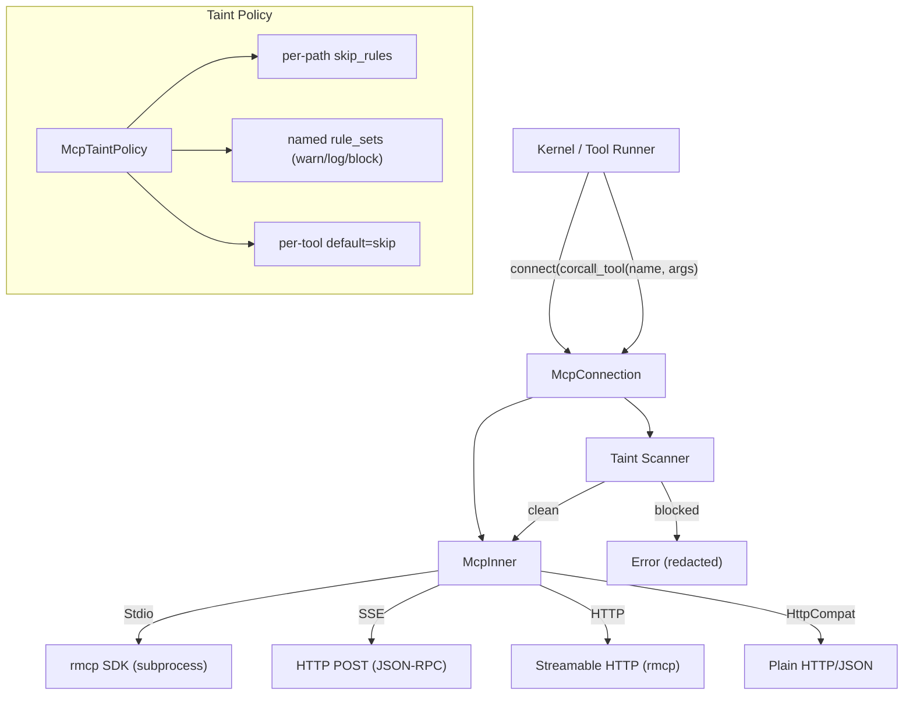

# Runtime Subsystems — librefang-runtime-mcp-src

# librefang-runtime-mcp — MCP Client Runtime

## Overview

This module implements the Model Context Protocol (MCP) client that connects the daemon to external MCP servers and exposes their tools to the agent runtime. It handles the full lifecycle: transport negotiation, tool discovery, argument taint scanning, tool invocation, and connection teardown.

All MCP tools are namespaced as `mcp_{server}_{tool}` to prevent naming collisions between servers.

## Architecture

## Transport Types

The module supports four transports, selected via the `McpTransport` enum in `McpServerConfig`:

### Stdio (`McpTransport::Stdio`)

Spawns a subprocess and communicates over stdin/stdout using the `rmcp` SDK for full MCP protocol handling. This is the primary transport for local MCP servers (npx, python, uvx).

Key behaviors:
- **Shell blocking**: `bash`, `sh`, `powershell`, and similar interpreters are rejected. The command must point to a specific runtime.
- **Environment sandboxing**: The subprocess does NOT inherit the parent environment. Only variables in `SAFE_ENV_VARS` (PATH, HOME, NODE_PATH, etc.) plus operator-declared `env` entries are passed through.
- **Env expansion**: `$VAR` / `${VAR}` in args are expanded only for allowlisted variable names (safe system vars + declared env), preventing accidental reads of daemon secrets like `ANTHROPIC_API_KEY`.
- **Tilde expansion**: Leading `~` in args is expanded to `$HOME` / `$USERPROFILE`.
- **Windows adaptation**: Automatically appends `.cmd` when the bare command resolves to a batch wrapper.
- **Stderr draining**: Child stderr is read line-by-line in a background task, logged at DEBUG, capped at 100 lines (draining continues past the cap to prevent pipe stalls).
- **Roots capability**: When `roots` are configured, a `RootsClientHandler` is used that responds to `roots/list` requests from the server.
- **Process lifecycle**: `kill_on_drop(true)` ensures the subprocess is terminated. Explicit `close()` awaits cleanup with a 10s timeout; the `Drop` impl fires a best-effort async cancel.

### SSE (`McpTransport::Sse`)

Legacy HTTP Server-Sent Events transport using JSON-RPC over HTTP POST. Performs its own `initialize` handshake and `tools/list` discovery. Does **not** declare the `roots` capability (SSE is unidirectional — the server cannot send requests back).

### HTTP (`McpTransport::Http`)

Streamable HTTP transport (MCP spec 2025-03-26+). Uses the `rmcp` SDK's `StreamableHttpClientTransport`. Supports `Mcp-Session-Id` tracking and content-type negotiation. Local filesystem roots are advertised only when the URL resolves to `localhost` / `127.0.0.1` / `[::1]`.

When the server returns a 401, the module attempts OAuth metadata discovery (see below). If auth is required, it returns the sentinel error `"OAUTH_NEEDS_AUTH"` so the API layer can drive the PKCE flow.

### HttpCompat (`McpTransport::HttpCompat`)

A built-in adapter for plain HTTP/JSON backends that don't implement MCP. Tools are statically declared in config rather than discovered at runtime. Supports path templates (`{param}`), multiple HTTP methods, JSON body or query string request modes, and configurable headers (static values or environment variable lookups).

## Connection Lifecycle

### `McpConnection::connect(config)`

1. Dispatches to the transport-specific connect method.
2. Performs the MCP handshake (`initialize` + `notifications/initialized` for SSE; automatic for rmcp transports).
3. Discovers tools via `tools/list`.
4. Translates MCP `annotations` (readOnlyHint, destructiveHint) into `metadata.tool_class` entries on each tool's JSON Schema.
5. Registers namespaced tools (`mcp_{server}_{tool}`) into the internal tool list.

### `McpConnection::call_tool(name, arguments)`

1. **Resolve raw name**: Strips the `mcp_{server}_` prefix to recover the tool name the server expects.
2. **Taint scan**: Walks every string leaf in `arguments` (see Taint Scanning below). Rejects the call if any violation is found.
3. **Dispatch**: Routes to the appropriate transport handler.
4. **Return**: Extracts text content from the MCP response. If `is_error` is true, returns `Err`.

### `McpConnection::close()`

Explicit teardown that cancels the rmcp service, awaits subprocess cleanup (10s timeout), and relies on `kill_on_drop` as a fallback. The `Drop` impl provides a best-effort async cancel for cases where `close()` is not called explicitly.

## Tool Namespacing

Functions in the `format_mcp_tool_name` / `resolve_mcp_server_from_known` family handle the bidirectional mapping:

| Direction | Function | Purpose |
|-----------|----------|---------|
| Register | `format_mcp_tool_name(server, tool)` | Produces `mcp_{server}_{tool}` |
| Detect | `is_mcp_tool(name)` | Checks `mcp_` prefix |
| Resolve | `resolve_mcp_server_from_known(name, servers)` | Longest-prefix match against known server names |
| Extract | `extract_mcp_server(name)` | Heuristic first-segment split (use only when server list unavailable) |

Server and tool names are normalized (lowercased, hyphens → underscores) so `"my-server"` and `"My_Server"` produce the same namespace.

## Taint Scanning

The taint scanner prevents credential and PII exfiltration through MCP tool-call arguments. It walks every string leaf in the JSON argument tree before it leaves the daemon.

### Scan Entry Point

`scan_mcp_arguments_for_taint_with_policy(value, taint_policy, rule_set_registry, tool_name)` returns `Some(redacted_description)` on violation, `None` if clean.

### How It Works

1. **Tool-level bypass**: If the tool's policy has `default = Skip`, scanning is skipped entirely.
2. **Tree walk** (`walk_taint`): Recursively traverses objects, arrays, and string leaves. Depth is capped at `MCP_TAINT_SCAN_MAX_DEPTH` (64).
3. **Sensitive key detection**: Object keys matching entries in `MCP_SENSITIVE_KEY_NAMES` (e.g. `authorization`, `api_key`, `password`) with non-empty string values are blocked regardless of the value's content — this catches patterns like `{"Authorization": "Bearer sk-..."}` that the text heuristic misses.
4. **Content scanning**: Each string leaf is checked against `TaintSink::mcp_tool_call()` via `detect_outbound_text_violation_rules_with_skip`.
5. **Rule set downgrade**: If named rule sets are configured, violations can be downgraded from `Block` to `Warn` (log + allow) or `Log` (audit + allow). Multiple rule sets covering the same rule merge to the most permissive action.
6. **Redaction**: The returned error string contains only the JSON path and rule name — never the offending payload value — since this error flows back to the LLM and into logs.

### Policy Configuration Layers

| Layer | Field | Effect |
|-------|-------|--------|
| Server-wide | `taint_scanning: bool` | Disables content-based scanning (key-name blocking stays active) |
| Tool default | `McpTaintToolPolicy.default = Skip` | Bypasses all scanning for that tool |
| Per-path skip | `McpTaintToolPolicy.paths[pattern].skip_rules` | Exempts specific rules at specific JSON paths |
| Named rule sets | `McpTaintToolPolicy.rule_sets` | Downgrades block → warn/log for rules in referenced sets |

### JSONPath Matching

The scanner uses a minimal JSONPath matcher (`jsonpath_matches`) supporting:

- `$.a.b` — exact nested property
- `$.a.*` — any direct child
- `$.a[*]` — any array element
- `$.*` — any top-level property

**Limitation**: Keys containing `.` or `[` cannot be addressed precisely. Use broader wildcards as a workaround.

### Hot-Reload Contract

`TaintRuleSetsHandle` is an `Arc<ArcSwap<Vec<NamedTaintRuleSet>>>` — the kernel owns one instance and clones it into every `McpServerConfig`. On config reload, the kernel calls `.store(Arc::new(new_rules))`. Each scan takes a `.load()` snapshot that stays stable for the duration of that argument-tree walk.

## Security Measures

### SSRF Protection

`check_ssrf(url, label)` is called for every HTTP-based transport before connecting. Delegated to `mcp_oauth::is_ssrf_blocked_url_for_connect`, which:

- Parses URLs with the `url` crate (no substring matching)
- Rejects non-HTTP schemes, userinfo in URLs
- Blocks cloud-metadata pivots: `0.0.0.0`, `169.254/16`, CGNAT `100.64.0.0/10`, Azure IMDS, Google/AWS metadata hostnames
- Unwraps IPv4-mapped IPv6 and NAT64 prefixes

`is_local_url(url)` uses proper host parsing to avoid false positives on attacker-controlled domains like `127.0.0.1.evil.com`.

### Response Size Capping

`read_response_bytes_capped` streams HTTP responses with a 16 MiB cap (`MAX_RESPONSE_BYTES`). Rejects oversized `Content-Length` immediately; streams chunk-by-chunk for chunked transfers to avoid buffering unbounded bodies.

### JSON-RPC ID Verification

SSE responses are checked for matching JSON-RPC `id`. Mismatched responses are dropped to prevent cross-request data corruption.

### Content-Type Validation

SSE responses must have `application/json` or `text/event-stream` Content-Type. Anything else is rejected as likely a proxy error page.

## OAuth Integration

The `mcp_oauth` submodule handles OAuth 2.0 + PKCE for MCP servers requiring authentication:

- `discover_oauth_metadata(url, www_authenticate, oauth_config)` — three-tier resolution: WWW-Authenticate header → `.well-known/oauth-authorization-server` → config fallback
- `McpOAuthProvider` trait — load/store tokens via platform keychain
- `McpAuthState` — tracks per-connection auth state (NotRequired, Authorized, etc.)

When an HTTP transport gets a 401, the module extracts the `WWW-Authenticate` header via `extract_auth_header_from_error` (downcasting through rmcp's type-erased error chain), discovers OAuth metadata, and returns `"OAUTH_NEEDS_AUTH"` to signal the API layer to start the browser-based PKCE flow.

## Spawn Error Diagnostics

`format_spawn_error` converts `io::Error` from subprocess spawning into actionable messages. `NotFound` errors include runtime-specific install hints (Node.js, Python, uv, Deno, Bun, etc.) and a note about systemd/Docker PATH limitations.

## MCP Protocol Versioning

`SUPPORTED_MCP_VERSIONS` lists `["2024-11-05", "2025-03-26"]`. The first entry is advertised in `initialize`; unknown versions from the server trigger a warning but don't abort the connection.

## Integration Points

| Consumer | Usage |
|----------|-------|
| `tool_runner/dispatch.rs` | `is_mcp_tool()` to detect MCP tools, `resolve_mcp_server_from_known()` for dispatch, `call_tool()` for execution |
| `routes/agents.rs`, `tui/event.rs` | `resolve_mcp_server_from_known()` to list MCP servers for agents |
| `routes/mcp_auth.rs` | `discover_oauth_metadata()`, `generate_state()`, `is_ssrf_blocked_url()` for OAuth flows |
| `kernel/mcp_summary.rs` | `normalize_name()`, `resolve_mcp_server_from_known()` for status rendering |