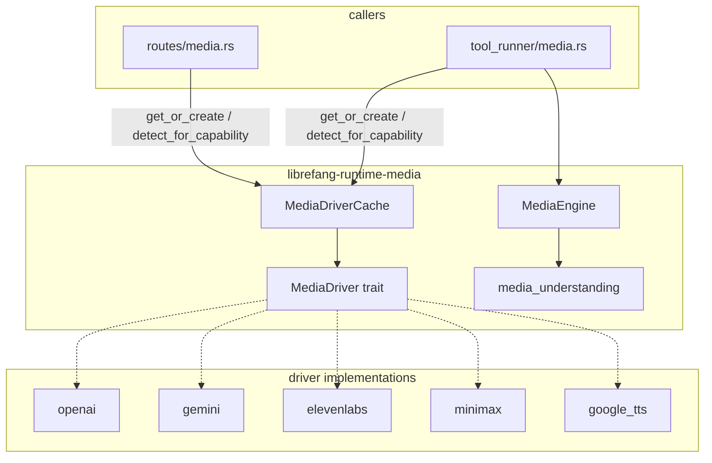

# Runtime Subsystems — librefang-runtime-media-src

# librefang-runtime-media

Provider-agnostic media generation and understanding subsystem. Exposes a uniform `MediaDriver` trait across five backends (OpenAI, Gemini, ElevenLabs, MiniMax, Google Cloud TTS) and a `MediaEngine` for consuming media (image description, audio transcription, video analysis).

## Architecture



Callers in `tool_runner` and the HTTP API layer never touch driver internals directly — they go through `MediaDriverCache` for generation and `MediaEngine` for understanding.

---

## Core Trait — `MediaDriver`

Defined in `lib.rs`. Every provider implements `MediaDriver` with default stubs that return `MediaError::NotSupported`. Drivers only override the methods for modalities they actually support.

| Method | Modality | Returns |
|---|---|---|
| `generate_image` | Image (synchronous) | `MediaImageResult` |
| `synthesize_speech` | TTS (synchronous) | `MediaTtsResult` |
| `submit_video` / `poll_video` / `get_video_result` | Video (async submit → poll) | `MediaVideoSubmitResult`, `MediaTaskStatus`, `MediaVideoResult` |
| `generate_music` | Music (synchronous, slow) | `MediaMusicResult` |

Required trait methods:

- **`capabilities()`** — returns a `Vec<MediaCapability>` advertising which modalities the driver handles.
- **`is_configured()`** — returns `true` when the relevant API key env var is present. Used by `detect_for_capability` to skip unconfigured providers.
- **`provider_name()`** — stable string identifier (e.g. `"openai"`, `"minimax"`).

---

## `MediaDriverCache`

Thread-safe, lazy-initializing cache backed by `DashMap`. Key responsibilities:

### Driver instantiation

`get_or_create(provider, base_url)` returns an `Arc<dyn MediaDriver>`. The cache key is `"{provider}|{url}"`, so the same provider with different base URLs produces separate driver instances.

**Base URL resolution order** (first wins):
1. Explicit `base_url` argument
2. `provider_urls` map entry for the provider (from `[provider_urls]` in config)
3. Alias lookup (`"google"` → `"gemini"`)
4. Driver's hardcoded default

### Auto-detection

`detect_for_capability(capability)` walks the `media_providers` preference list and returns the first driver that is both configured (API key present) and declares the requested capability. Used by tool runners when the caller doesn't specify a provider.

### Hot-reload

- `update_provider_urls(urls)` — replaces the URL map and clears cached drivers so the next access creates fresh instances.
- `clear()` — drops all cached drivers.
- `load_providers_from_registry(providers)` — rebuilds the provider preference list from `ProviderInfo` structs that declare `media_capabilities`. Built-in providers are always appended as fallback.

### Provider registry — `create_media_driver`

Maps provider name strings to concrete driver constructors:

| Name | Implementation |
|---|---|
| `"elevenlabs"` | `ElevenLabsMediaDriver` |
| `"gemini"` / `"google"` | `GeminiMediaDriver` |
| `"minimax"` | `MiniMaxMediaDriver` |
| `"openai"` | `OpenAIMediaDriver` |
| `"google_tts"` | `GoogleTtsMediaDriver` |
| Any other name with a `base_url` | `GenericOpenAICompatMediaDriver` (OpenAI-compatible driver) |
| Unknown, no base URL | `MediaError::InvalidRequest` |

---

## Error Handling — `MediaError`

```rust
pub enum MediaError {
    NotSupported(String),
    MissingKey(String),
    Http(String),
    Api { status: u16, message: String },
    RateLimit(String),
    ContentFiltered(String),
    InvalidRequest(String),
    TaskNotFound(String),
    Other(String),
}
```

All error variants carry human-readable strings. `Api` captures HTTP status codes for upstream failures. `ContentFiltered` distinguishes safety-filter rejections (important for MiniMax codes 1026/1027). Error responses from providers are truncated to 500 bytes via `safe_truncate_str` before being embedded in error variants.

---

## Provider Implementations

### OpenAI (`openai.rs`)

**Capabilities:** Image generation, Text-to-Speech

- **Image:** `POST {base_url}/images/generations` — DALL-E 3, DALL-E 2, gpt-image-1. Returns base64-encoded images. Capped at 10 MB per image.
- **TTS:** `POST {base_url}/audio/speech` — tts-1, tts-1-hd. Streams audio bytes. Capped at 10 MB response.
- **Auth:** `OPENAI_API_KEY` env var, bearer token.
- **Also provides** `GenericOpenAICompatMediaDriver` for user-defined providers with a configured `base_url`. Reads `{PROVIDER_UPPER}_API_KEY`.

### Gemini (`gemini.rs`)

**Capabilities:** Image generation

- **Image:** `POST {base_url}/v1beta/models/{model}:predict?key={api_key}` — Imagen 3 (`imagen-3.0-generate-002`). Returns base64 in `predictions[].bytesBase64Encoded`. Capped at 10 MB per image.
- Detects content filtering via `raiFilteredReason` and returns `MediaError::ContentFiltered`.
- **Auth:** `GEMINI_API_KEY` or `GOOGLE_API_KEY`, passed as query parameter.

### ElevenLabs (`elevenlabs.rs`)

**Capabilities:** Text-to-Speech

- **TTS:** `POST {base_url}/text-to-speech/{voice_id}?output_format={format}` — multilingual_v2, turbo_v2_5. Audio response capped at 25 MB.
- **Voice ID validation:** Enforces exactly 20 ASCII-alphanumeric characters (matching the ElevenLabs OpenAPI spec shape). This closes URL-path-injection vectors. The `VOICE_ID_ERROR_ECHO_MAX_BYTES` constant (64) caps how much of a malformed voice ID is echoed in error messages, preventing a multi-kilobyte malicious input from bloating the error chain.
- **Auth:** `ELEVENLABS_API_KEY`, passed as `xi-api-key` header.

### Google Cloud TTS (`google_tts.rs`)

**Capabilities:** Text-to-Speech

- **TTS:** `POST {base_url}/text:synthesize?key={api_key}` — Standard, WaveNet, Neural2, Studio voices. Audio returned as base64 in `audioContent`. Capped at 25 MB decoded.
- **SSML auto-detection:** `build_input` detects SSML markup and wraps fragments in `<speak>...</speak>` automatically. Uses `is_ssml` to check for unambiguous SSML-only tags (`<prosody>`, `<emphasis>`, `<say-as>`, etc.) while avoiding false positives on HTML tags like `<mark>` or `<sub>`.
- **Audio encoding:** `map_audio_encoding` maps format strings (`"mp3"`, `"opus"`, `"wav"`) to Google Cloud TTS `audioEncoding` values.
- **Auth:** `GOOGLE_API_KEY` or `GOOGLE_CLOUD_API_KEY`.

### MiniMax (`minimax.rs`)

**Capabilities:** All four — Image, TTS, Video, Music

- **Image:** `POST {base_url}/image_generation` — model `image-01`. Supports URL and base64 response formats.
- **TTS:** `POST {base_url}/t2a_v2` — speech-2.8-hd, speech-2.8-turbo. Audio returned as hex-encoded bytes.
- **Video (async):** `POST {base_url}/video_generation` → poll via `GET {base_url}/query/video_generation?task_id=...` → retrieve via `GET {base_url}/files/retrieve?file_id=...`. Hailuo models.
- **Music:** `POST {base_url}/music_generation` — music-2.5, music-2.5+. Audio returned as hex.
- **Error mapping:** `check_base_resp` translates MiniMax status codes to typed errors (1002 → `RateLimit`, 1026/1027 → `ContentFiltered`, 2013 → `InvalidRequest`).
- **Region awareness:** Detects China endpoint (`api.minimaxi.com` with extra "i") and prefers `MINIMAX_CN_API_KEY` accordingly.
- **Auth:** `MINIMAX_API_KEY` or `MINIMAX_CN_API_KEY`, bearer token.

---

## Media Understanding — `media_understanding.rs`

`MediaEngine` handles media *consumption* (as opposed to generation). It is separate from the driver system and dispatches to LLM / STT providers.

### Concurrency

Bounded by `max_concurrency` (clamped 1–8) via a tokio `Semaphore`. `process_attachments` spawns one task per attachment and collects results.

### Image description — `describe_image`

Picks a single vision provider: explicit `image_provider` config → first detected from env vars (Anthropic > OpenAI > Gemini). Returns a placeholder `MediaUnderstanding` — the actual API call integration is stubbed.

### Audio transcription — `transcribe_audio`

This is the most complete path. Flow:

1. **Source reading** — `FilePath` (tokio::fs::read) or `Base64` (decode). URL sources are rejected.
2. **Format detection** — `mime_to_ext` maps MIME types to file extensions. Falls back to the source file extension.
3. **`.oga` transcoding** — Telegram voice notes arrive as `.oga`/`audio/oga` which Whisper rejects. `transcode_oga_to_ogg_opus` pipes through ffmpeg (`-c:a copy`, stdin→stdout, no scratch files). 30-second timeout with explicit child kill and reap. Requires `ffmpeg` on `PATH`.
4. **Provider dispatch** — based on config or auto-detection from env vars:

| Provider | Protocol | Default Model |
|---|---|---|
| `groq` | Whisper multipart | `whisper-large-v3-turbo` |
| `openai` | Whisper multipart | `whisper-1` |
| `minimax` | Whisper multipart | `speech-01-turbo` |
| `fireworks` | Whisper multipart | `whisper-v3-turbo` |
| `together` | Whisper multipart | `whisper-large-v3-turbo` |
| `siliconflow` | Whisper multipart | `FunAudioLLM/SenseVoiceSmall` |
| `gemini` | Multimodal `generateContent` with inline audio | `gemini-2.0-flash` |
| `elevenlabs` | `/v1/speech-to-text` with `xi-api-key` header | `scribe_v1` |

5. **Security** — error messages returned to the agent are sanitized to avoid leaking API keys embedded in URLs (especially Gemini's `?key=` parameter). Full errors go to `tracing::warn` for operator diagnosis only.

### Video description — `describe_video`

Requires `GEMINI_API_KEY` or `GOOGLE_API_KEY`. Currently stubbed — returns a placeholder. Gated by `video_description` config flag.

---

## Utility — `safe_truncate_str`

```rust
pub(crate) fn safe_truncate_str(s: &str, max_bytes: usize) -> &str
```

UTF-8-safe byte truncation. Walks back from `max_bytes` to the nearest char boundary. Used throughout the module to cap error message sizes from upstream API responses (typically 500 bytes) and malicious input echo (64 bytes for voice IDs).

---

## Environment Variables Summary

| Variable | Used By |
|---|---|
| `OPENAI_API_KEY` | OpenAI image + TTS; also vision and audio transcription provider |
| `GEMINI_API_KEY` / `GOOGLE_API_KEY` | Gemini image generation; also vision, audio transcription, video description |
| `ELEVENLABS_API_KEY` | ElevenLabs TTS; also audio transcription provider |
| `GOOGLE_CLOUD_API_KEY` | Google Cloud TTS (fallback for `GOOGLE_API_KEY`) |
| `MINIMAX_API_KEY` | MiniMax (international endpoint) |
| `MINIMAX_CN_API_KEY` | MiniMax (China endpoint, `api.minimaxi.com`) |
| `GROQ_API_KEY` | Audio transcription provider |
| `FIREWORKS_API_KEY` | Audio transcription provider |
| `TOGETHER_API_KEY` | Audio transcription provider |
| `SILICONFLOW_API_KEY` | Audio transcription provider |
| `{PROVIDER_UPPER}_API_KEY` | Generic OpenAI-compatible drivers for user-defined providers |

---

## Capability Matrix

| Provider | Image | TTS | Video | Music |
|---|---|---|---|---|
| OpenAI | ✅ DALL-E | ✅ tts-1/tts-1-hd | — | — |
| Gemini | ✅ Imagen 3 | — | — | — |
| ElevenLabs | — | ✅ multilingual_v2 | — | — |
| Google Cloud TTS | — | ✅ WaveNet/Neural2 | — | — |
| MiniMax | ✅ image-01 | ✅ speech-2.8 | ✅ Hailuo | ✅ music-2.5 |

---

## Adding a New Provider

1. Create a new submodule (e.g. `src/newprovider.rs`) with a struct implementing `MediaDriver`.
2. Override only the modality methods the provider supports; the trait's default impls return `NotSupported`.
3. Register the provider in `create_media_driver` (`lib.rs`) with its name string.
4. Add the name to the `media_providers` default list in `MediaDriverCache::new` and `new_with_urls`.
5. Ensure `is_configured()` checks for the relevant API key env var — this is what `detect_for_capability` uses to decide whether the provider is eligible.