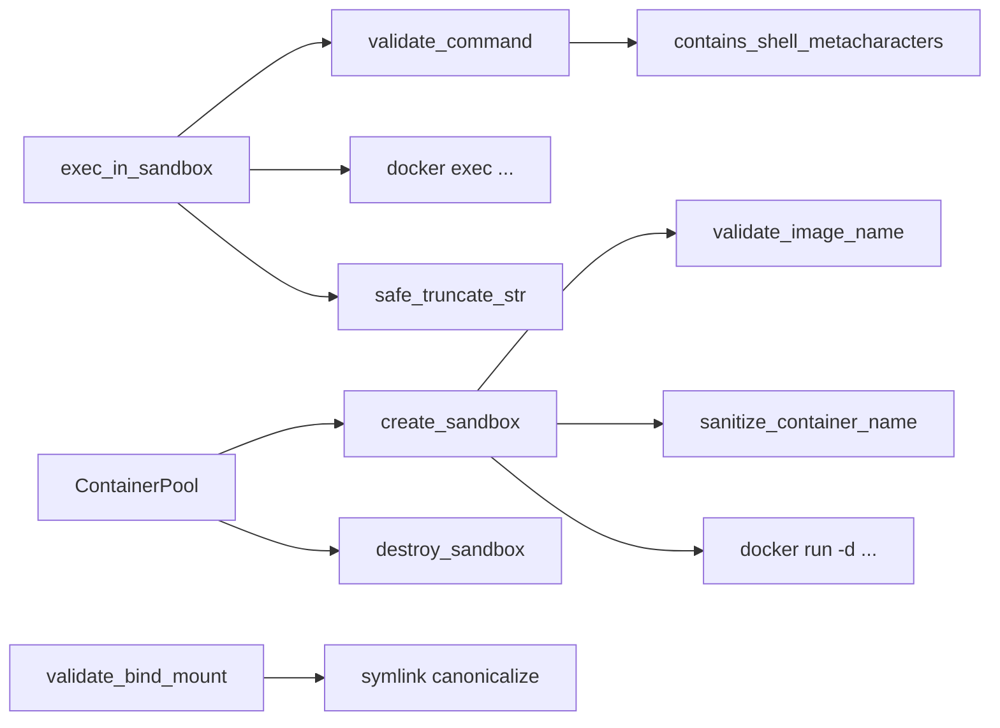

# Runtime Subsystems — librefang-runtime-sandbox-docker-src

# librefang-runtime-sandbox-docker

OS-level isolation for agent code execution via Docker containers. This crate provides secure sandbox creation, command execution, container pooling, and path validation — all built around defense-in-depth against container escape and command injection.

## Architecture



## Core Types

### `SandboxContainer`

Represents a running Docker container tied to an agent. Fields:

- `container_id` — full Docker container ID (from `docker run` stdout)
- `agent_id` — the agent this sandbox belongs to
- `created_at` — UTC timestamp of creation

### `ExecResult`

Returned from every `exec_in_sandbox` call:

- `stdout` / `stderr` — captured output, truncated at 50,000 characters if exceeded
- `exit_code` — process exit code, or `-1` if unavailable

## Sandbox Lifecycle

### `create_sandbox(config, agent_id, workspace) -> Result<SandboxContainer, String>`

Creates and starts a detached container with hardening applied:

1. Validates the image name against a safe-character allowlist
2. Sanitizes the container name to `{prefix}-{truncated_agent_id}` (alphanumeric + dash, max 63 chars)
3. Invokes `docker run` with the following security flags:

| Flag | Default | Purpose |
|---|---|---|
| `--memory` | `512m` | Prevent memory exhaustion |
| `--cpus` | `1.0` | CPU ceiling |
| `--pids-limit` | `100` | Fork-bomb mitigation |
| `--cap-drop ALL` | always | Remove all Linux capabilities |
| `--security-opt no-new-privileges` | always | Prevent privilege escalation |
| `--network` | `none` | No network access by default |
| `--read-only` | enabled | Immutable root filesystem |
| `--tmpfs` | `/tmp:size=64m` | Writable tmpfs where needed |

Capabilities in `config.cap_add` are conditionally restored — each entry is validated as `[A-Za-z0-9_]+` before being passed to `--cap-add`. Invalid entries are logged and skipped.

The agent's workspace directory is mounted **read-only** at the configured `workdir` (default `/workspace`). The container runs `sleep infinity` to stay alive for subsequent exec calls.

### `exec_in_sandbox(container, command, timeout) -> Result<ExecResult, String>`

Executes a command inside a running container via `docker exec ... sh -c <command>`. Before execution:

1. **`validate_command`** rejects empty commands and any containing shell metacharacters (see [Command Validation](#command-validation))
2. A `tokio::time::timeout` wraps the entire operation — a `Duration` exceeded error is returned on timeout
3. Output is truncated at 50,000 characters using char-boundary-safe slicing to avoid UTF-8 panics

### `destroy_sandbox(container) -> Result<(), String>`

Force-stops and removes the container (`docker rm -f`). Failures are logged as warnings but do not propagate as errors — the caller can continue even if the container was already gone.

### `is_docker_available() -> bool`

Probes `docker version --format {{.Server.Version}}`. Returns `true` only if Docker is installed, the daemon is reachable, and responds with a server version.

## Command Validation

`validate_command` delegates to `helpers::contains_shell_metacharacters`, which applies a two-pass analysis:

**First pass — always blocked (including inside quotes):**
- Embedded newlines (`\n`, `\r`)
- Null bytes (`\0`)

**Second pass — blocked outside quoted regions:**

The function calls `strip_quoted_regions` to remove content inside single quotes (`'...'`) and double quotes (`"..."` with backslash escapes). On the remaining unquoted text, it blocks:

| Pattern | Rejection reason |
|---|---|
| `` ` `` | Backtick command substitution |
| `$(` | `$()` command substitution |
| `${` | Variable expansion |
| `;` | Command chaining |
| `\|` | Pipe operator |
| `>`, `<` | I/O redirection |
| `{`, `}` | Brace expansion |
| `&` | Background/ampersand operator |

This means `python script.py` and `ls -la /workspace` are allowed, but `echo $(id)`, `cat /etc/passwd | grep root`, and `echo hello; rm -rf /` are rejected.

## Container Pool

`ContainerPool` enables container reuse across sessions, avoiding the overhead of repeated `docker run` / `docker rm` cycles.

```rust
let pool = ContainerPool::new();

// Return a container to the pool
pool.release(container, config_hash(&config));

// Retrieve a matching container (same config, idle >= cool_secs)
if let Some(container) = pool.acquire(config_hash(&config), 30) {
    // reuse
}

// Reclaim resources periodically
pool.cleanup(idle_timeout_secs: 300, max_age_secs: 3600).await;
```

**How it works:**

- Backed by `DashMap<String, PoolEntry>` for lock-free concurrent access
- `PoolEntry` tracks `config_hash`, `last_used` instant, and `created` instant
- `acquire(config_hash, cool_secs)` scans for an entry matching the hash that has been idle at least `cool_secs` seconds, then removes it from the map
- `release` inserts the container with the current timestamp
- `cleanup` destroys containers that exceed idle timeout or max age, removing them from both Docker and the map

### `config_hash(config) -> u64`

Hashes `image`, `network`, `memory_limit`, and `workdir` into a `u64`. Containers with different configurations will have different hashes and won't be cross-reused from the pool.

## Bind Mount Validation

`validate_bind_mount(path, blocked)` performs multi-layer security checks before any host path is mounted into a container:

**Layer 1 — Structural checks:**
- Path must be absolute (`/...`)
- Path traversal (`..`) components are rejected

**Layer 2 — Default blocked paths:**

These paths are always blocked regardless of configuration:

```
/etc, /proc, /sys, /dev, /var/run/docker.sock, /root, /boot
```

**Layer 3 — User-configured blocked paths:**

The `blocked` parameter accepts additional paths from configuration.

**Layer 4 — Symlink escape detection:**

If the path exists, it is canonicalized via `std::fs::canonicalize` and the resolved path is re-checked against all blocked lists. If the path does not yet exist, the function walks up the ancestor chain to find the nearest existing directory, canonicalizes that, then appends the remaining path components and checks the combined result. This prevents an attacker from pre-creating a symlink at a non-existent path that later resolves into a blocked location.

## Helpers Module

`pub mod helpers` contains self-contained copies of string utilities from `librefang-runtime`. These are duplicated here to avoid a cyclic dependency back into the parent runtime crate.

| Function | Mirrors |
|---|---|
| `safe_truncate_str(s, max_bytes)` | `librefang_runtime::str_utils::safe_truncate_str` |
| `contains_shell_metacharacters(command)` | `librefang_runtime::subprocess_sandbox::contains_shell_metacharacters` |
| `strip_quoted_regions(command)` | (internal helper for the above) |

The parent crate runs a parity test (`crates/librefang-runtime/tests/docker_sandbox_helpers_parity.rs`) that asserts these implementations match the canonical versions byte-for-byte, preventing silent drift if the denylist is updated upstream.

## Default Configuration

The `DockerSandboxConfig` defaults (from `Default`):

| Field | Default |
|---|---|
| `enabled` | `false` |
| `image` | `python:3.12-slim` |
| `container_prefix` | `librefang-sandbox` |
| `workdir` | `/workspace` |
| `network` | `none` |
| `memory_limit` | `512m` |
| `cpu_limit` | `1.0` |
| `timeout_secs` | `60` |
| `read_only_root` | `true` |
| `cap_add` | `[]` |
| `tmpfs` | `["/tmp:size=64m"]` |
| `pids_limit` | `100` |

## Integration Pattern

This crate sits below `librefang-runtime` and is called when the runtime needs to execute untrusted agent code under OS-level isolation. A typical session:

```rust
let container = create_sandbox(&config, "agent-xyz", workspace_path).await?;
let result = exec_in_sandbox(&container, "python solve.py", Duration::from_secs(30)).await?;
// ...inspect result.exit_code, result.stdout, result.stderr...
destroy_sandbox(&container).await?;
```

With pooling enabled, the runtime wraps this with `ContainerPool` acquire/release calls to amortize container startup cost across multiple agent sessions sharing the same configuration.