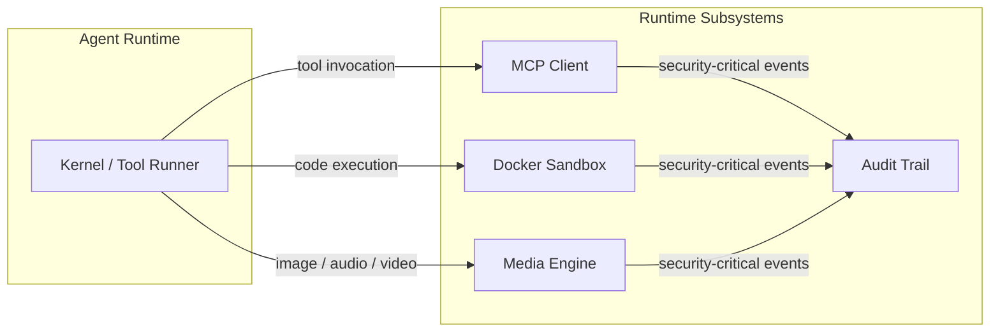

# Runtime Subsystems

# Runtime Subsystems

The runtime subsystems are the operational core of the LibreFang agent daemon. They provide four independent but complementary capabilities that together handle **external tool connectivity**, **media processing**, **secure code execution**, and **tamper-evident auditing**.

## Sub-modules

| Sub-module | Purpose |
|---|---|
| [MCP Client](librefang-runtime-mcp-src.md) | Connects to external MCP servers, discovers tools, scans arguments for tainted data, and invokes tools over stdio/SSE/HTTP transports. All tools are namespaced as `mcp_{server}_{tool}`. |
| [Media Engine](librefang-runtime-media-src.md) | Provider-agnostic media generation (TTS via OpenAI, ElevenLabs, MiniMax, Google Cloud TTS) and understanding (image description, audio transcription, video analysis) behind a uniform `MediaDriver` trait. |
| [Docker Sandbox](librefang-runtime-sandbox-docker-src.md) | OS-level isolation for agent code execution. Manages container creation, command validation, bind-mount sanitization, and container pooling with defense-in-depth against escape and injection. |
| [Audit Trail](librefang-runtime-audit-src.md) | Append-only, Merkle-hash-chained audit log persisted to SQLite. Detects tampering via `verify_integrity` and anchors the chain tip to an external file. |

## Cross-subsystem workflows

**Tool invocation → Audit.** The MCP client and Docker sandbox are the primary producers of security-critical events. When a tool is invoked through MCP or a command is executed in a sandbox, the action is recorded in the audit trail's Merkle chain, ensuring post-incident forensics cannot be silently altered.

**OAuth discovery → SSRF protection.** MCP server authentication (`auth_start`) flows through OAuth metadata discovery (`discover_oauth_metadata`), which resolves and validates the metadata URL against blocked hosts (`is_ssrf_blocked_host_impl`), including IPv6-embedded IPv4 checks. The resulting HTTP client is built with TLS configuration from `librefang-http`.

**Taint scanning → Argument safety.** Before any MCP tool invocation, arguments are walked via `walk_taint` and checked against `is_sensitive_key_name` to prevent secrets from leaking into external tool calls. Scan errors are explicitly non-revealing.

**Media understanding → Provider routing.** The `MediaEngine` routes requests (image description, audio transcription, video analysis) to the appropriate provider backend. Each backend is accessed through a `MediaDriverCache` that manages instantiated drivers and resolves provider aliases via `new_with_urls`.

## Key design principles

- **Defense-in-depth**: Sandboxing uses layered validation (image names, container names, command metacharacter detection, symlink canonicalization). Audit uses both in-database Merkle chains and out-of-band anchor files.
- **Provider agnosticism**: Media backends are interchangeable behind the `MediaDriver` trait, with capabilities queries so callers can fail gracefully when a provider doesn't support a given operation (e.g., Gemini TTS).
- **Namespace isolation**: MCP tools from different servers never collide, and environment variable expansion is gated by an explicit allowlist.